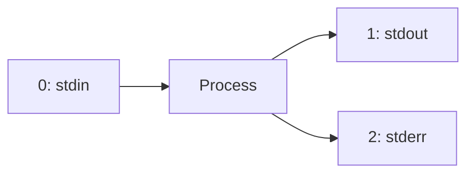

## The Unix Philosophy

> Write programs that do one thing and do it well. Write programs to work together.

Pipes are how you connect small tools into powerful workflows.


---

## Pipes (`|`)

Connect stdout of one command to stdin of the next:

```bash
# Top 10 error sources from a log
cat access.log | grep "ERROR" | awk '{print $4}' | sort | uniq -c | sort -rn | head -10

# Count unique users currently logged in
who | awk '{print $1}' | sort -u | wc -l

# Find largest directories
du -sh */ | sort -rh | head -5
```

### Pipe Behavior

- Each command in a pipe runs as a separate process
- They run **concurrently** (not sequentially)
- Data flows as a stream — no temp files needed
- If any command in the pipe exits, the others receive SIGPIPE

---

## File Descriptors

Every process has three standard streams:

| FD | Name | Default | Purpose |
|----|------|---------|---------|
| 0 | stdin | Keyboard | Input |
| 1 | stdout | Terminal | Normal output |
| 2 | stderr | Terminal | Error messages |



---

## Output Redirection

```bash
# Redirect stdout to file
command > output.txt           # overwrite
command >> output.txt          # append

# Redirect stderr to file
command 2> errors.txt

# Redirect both to same file
command > all.txt 2>&1         # traditional
command &> all.txt             # bash shorthand

# Redirect stdout and stderr to different files
command > output.txt 2> errors.txt

# Discard output
command > /dev/null            # discard stdout
command 2> /dev/null           # discard stderr
command &> /dev/null           # discard everything
```

### Understanding `2>&1`

`2>&1` means "redirect file descriptor 2 (stderr) to wherever file descriptor 1 (stdout) currently points."

**Order matters:**

```bash
# Correct: stderr goes to same file as stdout
command > file.txt 2>&1

# Wrong: stderr goes to terminal (stdout was redirected AFTER)
command 2>&1 > file.txt
```

---

## Input Redirection

```bash
# Read from file
command < input.txt

# Here document — multi-line input
cat <<EOF
Hello, $name!
Today is $(date).
Line 3.
EOF

# Here document — no variable expansion (quoted delimiter)
cat <<'EOF'
This $variable stays literal.
No $(expansion) happens.
EOF

# Here string — single-line input
grep "pattern" <<< "$variable"
wc -w <<< "count these words"
```

### Here Documents in Practice

```bash
# Generate a config file
cat > /etc/myapp.conf <<EOF
host=$DB_HOST
port=$DB_PORT
database=$DB_NAME
EOF

# SQL query
mysql -u root <<EOF
CREATE DATABASE IF NOT EXISTS myapp;
GRANT ALL ON myapp.* TO 'appuser'@'localhost';
EOF
```

---

## Process Substitution

Treat command output as a file — useful when a command expects a filename:

```bash
# Compare two sorted outputs
diff <(sort file1.txt) <(sort file2.txt)

# Compare directory listings
diff <(ls dir1/) <(ls dir2/)

# Feed multiple inputs to paste
paste <(cut -f1 data.txt) <(cut -f3 data.txt)

# Join two sorted files
join <(sort users.txt) <(sort orders.txt)
```

### How It Works

`<(command)` creates a temporary named pipe (`/dev/fd/N`) that the command writes to. The outer command reads from it as if it were a file.

---

## tee — Split Output

Send output to both a file AND the next pipe:

```bash
# Log and display simultaneously
command | tee output.log

# Append mode
command | tee -a output.log

# Multiple destinations
command | tee file1.txt file2.txt

# In a pipeline — inspect intermediate results
cat data.txt | grep "error" | tee /dev/stderr | wc -l
# Shows matching lines on stderr, count on stdout
```

---

## Practical Patterns

### Log Processing Pipeline

```bash
# Real-time log monitoring with filtering
tail -f /var/log/app.log | grep --line-buffered "ERROR" | tee errors.log
```

### Parallel Output Processing

```bash
# Process same input differently
command | tee >(grep "error" > errors.log) >(grep "warn" > warnings.log) > /dev/null
```

### Avoiding Useless `cat`

```bash
# Unnecessary cat (UUOC — Useless Use of Cat)
cat file.txt | grep "pattern"

# Better — grep reads files directly
grep "pattern" file.txt

# Or use redirection
grep "pattern" < file.txt
```

---

## Named Pipes (FIFOs)

Persistent pipes that exist as files:

```bash
# Create
mkfifo /tmp/mypipe

# Writer (blocks until reader connects)
echo "hello" > /tmp/mypipe &

# Reader
cat /tmp/mypipe    # prints "hello"

# Cleanup
rm /tmp/mypipe
```

---

## Key Takeaways

1. **Pipes connect stdout → stdin** — each command runs concurrently
2. **Three FDs:** 0 (stdin), 1 (stdout), 2 (stderr)
3. **`2>&1` order matters** — redirect stdout first, then stderr to it
4. **`&> file`** is shorthand for `> file 2>&1`
5. **Process substitution `<(cmd)`** lets you use command output as a filename
6. **`tee`** splits output to file + pipe simultaneously
7. **Here documents** (`<<EOF`) for multi-line input without temp files
