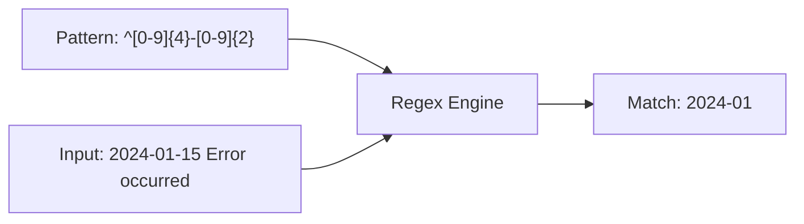

## What Are Regular Expressions?

Regular expressions (regex) are patterns that describe sets of strings. They're a universal skill — the same concepts work in grep, sed, awk, Python, JavaScript, and every text editor.



---

## Basic Syntax

### Literal Characters and Metacharacters

| Pattern | Matches |
|---------|---------|
| `abc` | Literal "abc" |
| `.` | Any single character (except newline) |
| `\` | Escape next character |

### Anchors

| Pattern | Matches |
|---------|---------|
| `^` | Start of line |
| `$` | End of line |
| `\b` | Word boundary (Perl/PCRE) |

```bash
grep "^ERROR" log          # lines starting with ERROR
grep "\.py$" filelist      # lines ending with .py
grep -P "\berror\b" log    # "error" as whole word
```

### Character Classes

| Pattern | Matches |
|---------|---------|
| `[abc]` | Any one of a, b, c |
| `[^abc]` | Any character NOT a, b, c |
| `[a-z]` | Any lowercase letter |
| `[A-Z]` | Any uppercase letter |
| `[0-9]` | Any digit |
| `[a-zA-Z0-9]` | Any alphanumeric |

### POSIX Character Classes

| Class | Equivalent | Matches |
|-------|-----------|---------|
| `[:alpha:]` | `[a-zA-Z]` | Letters |
| `[:digit:]` | `[0-9]` | Digits |
| `[:alnum:]` | `[a-zA-Z0-9]` | Alphanumeric |
| `[:space:]` | `[ \t\n\r\f\v]` | Whitespace |
| `[:upper:]` | `[A-Z]` | Uppercase |
| `[:lower:]` | `[a-z]` | Lowercase |

```bash
grep "[[:digit:]]" file    # lines with at least one digit
grep "[[:space:]]$" file   # lines with trailing whitespace
```

### Quantifiers

| Pattern | Matches |
|---------|---------|
| `*` | Zero or more of preceding |
| `+` | One or more of preceding (ERE) |
| `?` | Zero or one of preceding (ERE) |
| `{n}` | Exactly n times |
| `{n,}` | n or more times |
| `{n,m}` | Between n and m times |

```bash
grep -E "a{3}" file        # "aaa"
grep -E "[0-9]{1,3}" file  # 1-3 digit numbers
grep -E "https?" file      # "http" or "https"
```

### Grouping and Alternation

| Pattern | Meaning |
|---------|---------|
| `(abc)` | Group (capture) |
| `a\|b` | a OR b (BRE) |
| `a\|b` | a OR b (ERE, literal pipe) |

```bash
grep -E "(error|warning|critical)" log
grep -E "^(GET|POST|PUT|DELETE) " access.log
```

---

## BRE vs ERE vs PCRE

| Feature | BRE (Basic) | ERE (Extended) | PCRE (Perl) |
|---------|:-:|:-:|:-:|
| Default tool | `grep`, `sed` | `grep -E`, `awk` | `grep -P` |
| `+`, `?`, `{`, `\|`, `(` | Must escape | Literal | Literal |
| `\d`, `\w`, `\s` | ❌ | ❌ | ✅ |
| Lookahead/behind | ❌ | ❌ | ✅ |
| Non-greedy `*?` | ❌ | ❌ | ✅ |
| Backreferences | `\1` | `\1` | `\1` |

**Recommendation:** Use ERE (`grep -E`, `sed -E`) for most tasks. Use PCRE (`grep -P`) when you need `\d`, `\w`, or lookaheads.

---

## Practical Patterns

### Validation

```bash
# IP address (basic — doesn't validate ranges)
grep -E '^([0-9]{1,3}\.){3}[0-9]{1,3}$'

# Email (simplified)
grep -E '^[a-zA-Z0-9._%+-]+@[a-zA-Z0-9.-]+\.[a-zA-Z]{2,}$'

# ISO date (YYYY-MM-DD)
grep -E '^[0-9]{4}-(0[1-9]|1[0-2])-(0[1-9]|[12][0-9]|3[01])$'

# Semantic version
grep -E '^v?[0-9]+\.[0-9]+\.[0-9]+(-[a-zA-Z0-9.]+)?$'

# UUID
grep -E '^[0-9a-f]{8}-[0-9a-f]{4}-[0-9a-f]{4}-[0-9a-f]{4}-[0-9a-f]{12}$'
```

### Extraction

```bash
# Extract URLs
grep -oE 'https?://[^ >"]+' file

# Extract IP addresses
grep -oP '\d{1,3}\.\d{1,3}\.\d{1,3}\.\d{1,3}' file

# Extract quoted strings
grep -oE '"[^"]*"' file

# Extract key=value pairs
grep -oE '[A-Z_]+=[^ ]+' file
```

### Transformation with sed

```bash
# Reformat date: YYYY-MM-DD → DD/MM/YYYY
sed -E 's/([0-9]{4})-([0-9]{2})-([0-9]{2})/\3\/\2\/\1/g'

# Extract domain from URL
sed -E 's|https?://([^/]+).*|\1|'

# Remove HTML tags
sed -E 's/<[^>]+>//g'

# Normalize whitespace
sed -E 's/[[:space:]]+/ /g; s/^ //; s/ $//'
```

---

## Regex in Bash

### `[[ =~ ]]` — Bash Regex Matching

```bash
if [[ "$input" =~ ^[0-9]+$ ]]; then
    echo "It's a number"
fi

# Capture groups via BASH_REMATCH
if [[ "$date" =~ ^([0-9]{4})-([0-9]{2})-([0-9]{2})$ ]]; then
    year="${BASH_REMATCH[1]}"
    month="${BASH_REMATCH[2]}"
    day="${BASH_REMATCH[3]}"
fi
```

**Important:** Don't quote the regex pattern in `[[ =~ ]]` — quoting makes it a literal string match.

---

## Common Mistakes

| Mistake | Problem | Fix |
|---------|---------|-----|
| `grep ".*"` | Matches everything | Be more specific |
| Forgetting anchors | Partial matches | Use `^...$` for full-line |
| Greedy matching | `<.*>` matches too much | Use `<[^>]*>` or non-greedy `<.*?>` (PCRE) |
| Unescaped dots | `.` matches ANY char | Use `\.` for literal dot |
| Wrong regex flavor | `\d` in grep (no PCRE) | Use `[0-9]` or `grep -P` |

---

## Key Takeaways

1. **Start simple** — anchors (`^$`), character classes (`[0-9]`), quantifiers (`+*?`)
2. **Use ERE** (`grep -E`, `sed -E`) — avoids escaping `+`, `?`, `|`, `()`
3. **`.` matches anything** — escape it (`\.`) when you mean a literal dot
4. **Anchors prevent partial matches** — `^pattern$` for full-line matching
5. **`BASH_REMATCH`** captures groups from `[[ =~ ]]`
6. **Test interactively** — use `grep -E "pattern" <<< "test string"` to verify
7. **Regex is universal** — same concepts in every language and tool
