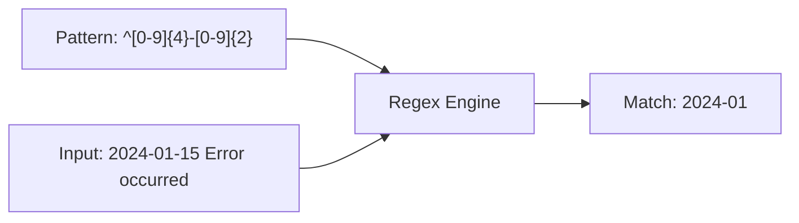

## What Are Regular Expressions?

Regular expressions (regex) are patterns that describe sets of strings. They're a universal skill — the same concepts work in grep, sed, awk, Python, JavaScript, and every text editor.



---

## Basic Syntax

### Literal Characters and Metacharacters

| Pattern | Matches |
|---------|---------|
| `abc` | Literal "abc" |
| `.` | Any single character (except newline) |
| `\` | Escape next character |

### Anchors

| Pattern | Matches |
|---------|---------|
| `^` | Start of line |
| `$` | End of line |
| `\b` | Word boundary (Perl/PCRE) |

```bash
grep "^ERROR" log          # lines starting with ERROR
grep "\.py$" filelist      # lines ending with .py
grep -P "\berror\b" log    # "error" as whole word
```

### Character Classes

| Pattern | Matches |
|---------|---------|
| `[abc]` | Any one of a, b, c |
| `[^abc]` | Any character NOT a, b, c |
| `[a-z]` | Any lowercase letter |
| `[A-Z]` | Any uppercase letter |
| `[0-9]` | Any digit |
| `[a-zA-Z0-9]` | Any alphanumeric |

### POSIX Character Classes

| Class | Equivalent | Matches |
|-------|-----------|---------|
| `[:alpha:]` | `[a-zA-Z]` | Letters |
| `[:digit:]` | `[0-9]` | Digits |
| `[:alnum:]` | `[a-zA-Z0-9]` | Alphanumeric |
| `[:space:]` | `[ \t\n\r\f\v]` | Whitespace |
| `[:upper:]` | `[A-Z]` | Uppercase |
| `[:lower:]` | `[a-z]` | Lowercase |

```bash
grep "[[:digit:]]" file    # lines with at least one digit
grep "[[:space:]]$" file   # lines with trailing whitespace
```

### Quantifiers

| Pattern | Matches |
|---------|---------|
| `*` | Zero or more of preceding |
| `+` | One or more of preceding (ERE) |
| `?` | Zero or one of preceding (ERE) |
| `{n}` | Exactly n times |
| `{n,}` | n or more times |
| `{n,m}` | Between n and m times |

```bash
grep -E "a{3}" file        # "aaa"
grep -E "[0-9]{1,3}" file  # 1-3 digit numbers
grep -E "https?" file      # "http" or "https"
```

### Grouping and Alternation

| Pattern | Meaning |
|---------|---------|
| `(abc)` | Group (capture) |
| `a\|b` | a OR b (BRE) |
| `a\|b` | a OR b (ERE, literal pipe) |

```bash
grep -E "(error|warning|critical)" log
grep -E "^(GET|POST|PUT|DELETE) " access.log
```

---

## BRE vs ERE vs PCRE

| Feature | BRE (Basic) | ERE (Extended) | PCRE (Perl) |
|---------|:-:|:-:|:-:|
| Default tool | `grep`, `sed` | `grep -E`, `awk` | `grep -P` |
| `+`, `?`, `{`, `\|`, `(` | Must escape | Literal | Literal |
| `\d`, `\w`, `\s` | ❌ | ❌ | ✅ |
| Lookahead/behind | ❌ | ❌ | ✅ |
| Non-greedy `*?` | ❌ | ❌ | ✅ |
| Backreferences | `\1` | `\1` | `\1` |

**Recommendation:** Use ERE (`grep -E`, `sed -E`) for most tasks. Use PCRE (`grep -P`) when you need `\d`, `\w`, or lookaheads.

---

## Practical Patterns

### Validation

```bash
# IP address (basic — doesn't validate ranges)
grep -E '^([0-9]{1,3}\.){3}[0-9]{1,3}$'

# Email (simplified)
grep -E '^[a-zA-Z0-9._%+-]+@[a-zA-Z0-9.-]+\.[a-zA-Z]{2,}$'

# ISO date (YYYY-MM-DD)
grep -E '^[0-9]{4}-(0[1-9]|1[0-2])-(0[1-9]|[12][0-9]|3[01])$'

# Semantic version
grep -E '^v?[0-9]+\.[0-9]+\.[0-9]+(-[a-zA-Z0-9.]+)?$'

# UUID
grep -E '^[0-9a-f]{8}-[0-9a-f]{4}-[0-9a-f]{4}-[0-9a-f]{4}-[0-9a-f]{12}$'
```

### Extraction

```bash
# Extract URLs
grep -oE 'https?://[^ >"]+' file

# Extract IP addresses
grep -oP '\d{1,3}\.\d{1,3}\.\d{1,3}\.\d{1,3}' file

# Extract quoted strings
grep -oE '"[^"]*"' file

# Extract key=value pairs
grep -oE '[A-Z_]+=[^ ]+' file
```

### Transformation with sed

```bash
# Reformat date: YYYY-MM-DD → DD/MM/YYYY
sed -E 's/([0-9]{4})-([0-9]{2})-([0-9]{2})/\3\/\2\/\1/g'

# Extract domain from URL
sed -E 's|https?://([^/]+).*|\1|'

# Remove HTML tags
sed -E 's/<[^>]+>//g'

# Normalize whitespace
sed -E 's/[[:space:]]+/ /g; s/^ //; s/ $//'
```

---

## Regex in Bash

### `[[ =~ ]]` — Bash Regex Matching

```bash
if [[ "$input" =~ ^[0-9]+$ ]]; then
    echo "It's a number"
fi

# Capture groups via BASH_REMATCH
if [[ "$date" =~ ^([0-9]{4})-([0-9]{2})-([0-9]{2})$ ]]; then
    year="${BASH_REMATCH[1]}"
    month="${BASH_REMATCH[2]}"
    day="${BASH_REMATCH[3]}"
fi
```

**Important:** Don't quote the regex pattern in `[[ =~ ]]` — quoting makes it a literal string match.

---

## Common Mistakes

| Mistake | Problem | Fix |
|---------|---------|-----|
| `grep ".*"` | Matches everything | Be more specific |
| Forgetting anchors | Partial matches | Use `^...$` for full-line |
| Greedy matching | `<.*>` matches too much | Use `<[^>]*>` or non-greedy `<.*?>` (PCRE) |
| Unescaped dots | `.` matches ANY char | Use `\.` for literal dot |
| Wrong regex flavor | `\d` in grep (no PCRE) | Use `[0-9]` or `grep -P` |

---

## Lookaheads and Lookbehinds

Lookaheads and lookbehinds (collectively "lookarounds") assert that a pattern exists ahead of or behind the current position **without consuming characters**. They are zero-width assertions — they check but do not include the match.

Available in **PCRE only** (`grep -P`, Python `re`, JavaScript `RegExp`, Java `Pattern`).

### Syntax

| Type | Syntax | Meaning |
|------|--------|---------|
| Positive lookahead | `(?=...)` | What follows must match |
| Negative lookahead | `(?!...)` | What follows must NOT match |
| Positive lookbehind | `(?<=...)` | What precedes must match |
| Negative lookbehind | `(?<!...)` | What precedes must NOT match |

### Examples

```bash
# Match "price" only if followed by a number
grep -P 'price(?=\s*\d)' file
# "price 42" ✓  "price tag" ✗

# Match a number NOT followed by "px"
grep -P '\d+(?!px)' file
# "100em" ✓  "100px" ✗ (the "100" part)

# Match a number preceded by "$"
grep -P '(?<=\$)\d+' file
# "$42" → matches "42"  "€42" ✗

# Match a word NOT preceded by "un"
grep -P '(?<!un)happy' file
# "happy" ✓  "unhappy" ✗
```

### Practical Recipes

```bash
# Password validation: 8+ chars, at least one digit, one uppercase, one lowercase
grep -P '^(?=.*[a-z])(?=.*[A-Z])(?=.*\d).{8,}$'

# Extract values from key=value, but only the value (lookbehind)
grep -oP '(?<=API_KEY=)[^\s]+'

# Find "TODO" comments not followed by an assignee
grep -P 'TODO(?!\s*\([A-Za-z]+\))' *.py

# Match a domain, but not "localhost"
grep -P '(?<!local)host\.' config
```

### Lookbehind Limitations

- **Fixed-width only** in most engines (Python, Java, PCRE): `(?<=ab)` works, `(?<=a+)` does not
- JavaScript supports **variable-length lookbehind** since ES2018
- Workaround for variable-length: use `\K` in PCRE to reset the match start

```bash
# \K discards everything matched so far (PCRE alternative to lookbehind)
grep -oP 'price:\s*\K\d+' file
# "price: 42" → matches "42"
```

---

## Catastrophic Backtracking and ReDoS

### The Problem

Regex engines use **backtracking** to try different ways of matching a pattern. Certain patterns cause **exponential backtracking** on non-matching input — the engine tries every possible combination before giving up.

### The Classic Dangerous Pattern

```
(a+)+$
```

Against input `aaaaaaaaaaaaaaaaX`:

- The engine tries matching all `a`s in group 1, fails at `X`
- Backtracks: tries (n-1) `a`s in first group, 1 in second, fails
- Tries (n-2), (1, 1), fails; tries (n-2), (2), fails...
- **2ⁿ combinations** before concluding no match

With 25 `a`s, this can take **seconds**. With 30+, it can hang the process.

### Patterns That Cause Backtracking

The recipe for catastrophic backtracking is **nested quantifiers on overlapping alternatives**:

| Dangerous | Why | Safe Alternative |
|-----------|-----|-----------------|
| `(a+)+` | Nested quantifiers | `a+` |
| `(a\|aa)+` | Overlapping alternatives | `a+` |
| `(.*a){10}` | Greedy `.*` with required char | `([^a]*a){10}` |
| `(\s+\|,)+` | Overlapping with whitespace | `[\s,]+` |
| `(x+x+)+y` | Nested quantifiers | `x{2,}y` |

### ReDoS (Regular Expression Denial of Service)

If user-supplied input is matched against a vulnerable regex, an attacker can craft input that hangs the server:

```python
# VULNERABLE — user input matched against dangerous pattern
import re
pattern = re.compile(r'^(([a-z])+\.)+[A-Z]{2,}$')
# Attacker sends: "aaaaaaaaaaaaaaaaaaaaaaaaaaaaaa!"
# → server hangs
```

**Real-world incidents:** Cloudflare outage (2019), Stack Overflow outage (2016), npm package `slug` vulnerability.

### Prevention

| Strategy | How |
|----------|-----|
| Avoid nested quantifiers | Flatten `(a+)+` to `a+` |
| Use atomic groups | `(?>a+)` — no backtracking into group (PCRE/Java) |
| Use possessive quantifiers | `a++` — same as atomic, shorthand (PCRE/Java) |
| Set timeout | Python: use `regex` library with `timeout`; JS: built-in timeout (Node 20+) |
| Use RE2 | Google's RE2 engine guarantees linear time (no backtracking) — used by Go, Rust |
| Lint your patterns | Tools: `redos-checker`, `safe-regex`, `rxxr2` |
| Avoid user-supplied regex | If you must accept them, use RE2 or sandbox with timeouts |

```python
# SAFE — using atomic group equivalent via possessive quantifier
# Python's re module doesn't support possessive, but the regex library does:
import regex
pattern = regex.compile(r'^([a-z]++\.)+[A-Z]{2,}$')
```

### Testing for Vulnerable Patterns

```bash
# Quick test: time the match against a long non-matching string
time echo "aaaaaaaaaaaaaaaaaaaaaaaaaaaa!" | grep -P '(a+)+$'
# If it takes more than 0.01s, the pattern is vulnerable
```

---

## Regex in Programming Languages

The Bash/grep/sed patterns above transfer directly to programming languages, but each has its own API and quirks.

### Python (`re` module)

```python
import re

# Compile for reuse
pattern = re.compile(r'\d{4}-\d{2}-\d{2}')

# Search (first match)
match = pattern.search("Date: 2024-01-15 and 2024-02-20")
if match:
    print(match.group())     # "2024-01-15"
    print(match.start())     # 6

# Find all
dates = pattern.findall("2024-01-15 and 2024-02-20")
# ["2024-01-15", "2024-02-20"]

# Named groups
m = re.match(r'(?P<year>\d{4})-(?P<month>\d{2})-(?P<day>\d{2})', "2024-01-15")
m.group('year')   # "2024"
m.groupdict()     # {'year': '2024', 'month': '01', 'day': '15'}

# Substitution
re.sub(r'\bfoo\b', 'bar', "foo foobar foo")  # "bar foobar bar"

# Split
re.split(r'[,;\s]+', "a, b; c  d")  # ['a', 'b', 'c', 'd']
```

**Python gotcha:** Use raw strings (`r'...'`) to avoid double-escaping backslashes.

### JavaScript (`RegExp`)

```javascript
// Literal syntax (preferred)
const pattern = /\d{4}-\d{2}-\d{2}/g;

// Constructor (for dynamic patterns)
const dynamic = new RegExp(`user_${userId}`, 'i');

// Test (boolean)
/^\d+$/.test("42");              // true

// Match (array or null)
"2024-01-15".match(/(\d{4})-(\d{2})-(\d{2})/);
// ["2024-01-15", "2024", "01", "15"]

// Named groups (ES2018+)
const m = "2024-01-15".match(/(?<year>\d{4})-(?<month>\d{2})-(?<day>\d{2})/);
m.groups.year;                   // "2024"

// matchAll (ES2020+ — requires /g flag)
for (const m of text.matchAll(/\d+/g)) {
    console.log(m[0], m.index);
}

// Replace
"foo bar foo".replace(/foo/g, "baz");  // "baz bar baz"
"2024-01-15".replace(/(\d{4})-(\d{2})-(\d{2})/, "$3/$2/$1");  // "15/01/2024"
```

**JS gotcha:** The `/g` flag makes the regex stateful — `regex.lastIndex` advances between `exec()` calls. Reuse carefully.

### Java (`Pattern` / `Matcher`)

```java
import java.util.regex.*;

Pattern pattern = Pattern.compile("\\d{4}-\\d{2}-\\d{2}");
Matcher matcher = pattern.matcher("Date: 2024-01-15");

if (matcher.find()) {
    System.out.println(matcher.group());   // "2024-01-15"
    System.out.println(matcher.start());   // 6
}

// Named groups
Pattern dated = Pattern.compile("(?<year>\\d{4})-(?<month>\\d{2})-(?<day>\\d{2})");
Matcher dm = dated.matcher("2024-01-15");
if (dm.matches()) {
    dm.group("year");    // "2024"
}

// Replace
"foo bar foo".replaceAll("\\bfoo\\b", "baz");  // "baz bar baz"

// Split
"a, b; c  d".split("[,;\\s]+");  // ["a", "b", "c", "d"]
```

**Java gotcha:** Backslashes must be double-escaped in strings (`\\d` not `\d`).

### Quick Comparison

| Feature | Python `re` | JavaScript `RegExp` | Java `Pattern` |
|---------|-------------|--------------------|--------------| 
| Literal syntax | No — use `r'...'` | Yes — `/pattern/flags` | No — use `"\\\\..."` |
| Named groups | `(?P<name>...)` | `(?<name>...)` | `(?<name>...)` |
| Lookaheads | ✓ | ✓ | ✓ |
| Lookbehinds | ✓ (fixed-width) | ✓ (variable since ES2018) | ✓ (fixed-width) |
| Possessive quantifiers | `regex` library only | ✗ | ✓ |
| Atomic groups | `regex` library only | ✗ | ✓ (via `(?>...)`) |
| Unicode support | ✓ (`re.UNICODE` default in Python 3) | ✓ (`/u` flag) | ✓ (`Pattern.UNICODE_CHARACTER_CLASS`) |
| Timeout/safety | `regex` library `timeout` param | Node 20+ `--experimental-vm-modules` | Manual via `Thread.interrupt()` |

---

## Key Takeaways

1. **Start simple** — anchors (`^$`), character classes (`[0-9]`), quantifiers (`+*?`)
2. **Use ERE** (`grep -E`, `sed -E`) — avoids escaping `+`, `?`, `|`, `()`
3. **`.` matches anything** — escape it (`\.`) when you mean a literal dot
4. **Anchors prevent partial matches** — `^pattern$` for full-line matching
5. **Lookaheads/lookbehinds** check without consuming — essential for password validation, context-sensitive extraction, and complex replacements
6. **Beware nested quantifiers** — `(a+)+` causes exponential backtracking. Flatten, use atomic groups, or switch to RE2
7. **Never run user-supplied regex** without a timeout or a safe engine (RE2)
8. **`BASH_REMATCH`** captures groups from `[[ =~ ]]`; named groups work in Python, JS, and Java
9. **Test interactively** — use `grep -E "pattern" <<< "test string"` to verify
10. **Regex is universal** — same concepts in every language and tool, only the API and escaping differ
