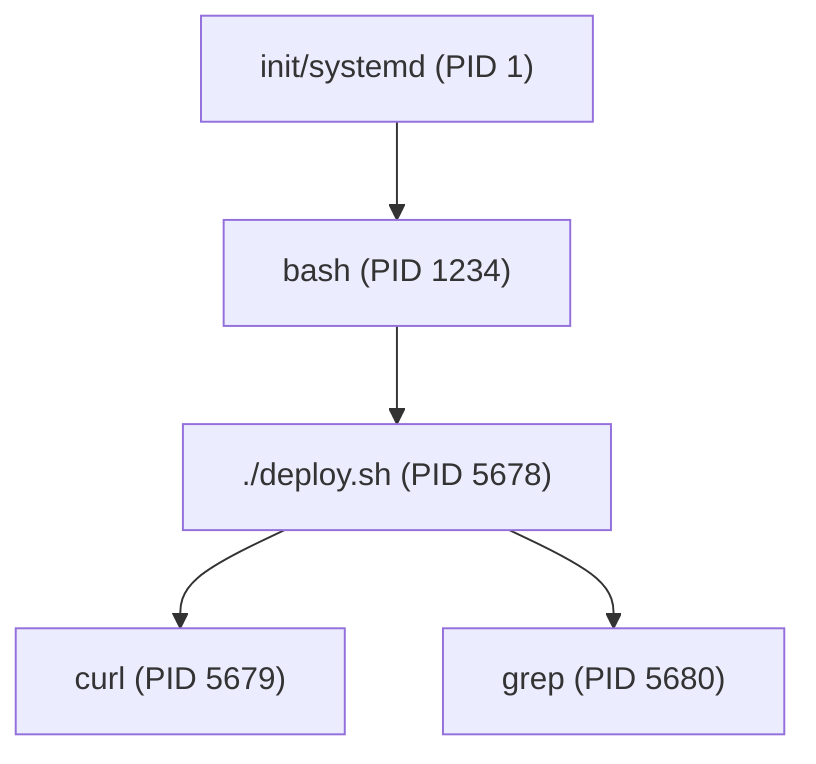

## What is a Process?

A process is a running instance of a program. Every command you run creates a process with its own PID (Process ID), memory space, and file descriptors.



### Process States

| State | Meaning |
|-------|---------|
| Running (R) | Actively executing on CPU |
| Sleeping (S) | Waiting for I/O or event |
| Stopped (T) | Suspended (Ctrl+Z) |
| Zombie (Z) | Finished but parent hasn't collected exit status |

---

## Viewing Processes

```bash
# Current user's processes
ps aux | grep "[m]yapp"

# All processes, full format
ps -ef

# Process tree
pstree -p

# Find PID by name
pgrep -f "python app.py"
pidof nginx

# Real-time monitoring
top                          # built-in
htop                         # better (if installed)
```

### Useful `ps` Patterns

```bash
# Top CPU consumers
ps aux --sort=-%cpu | head -10

# Top memory consumers
ps aux --sort=-%mem | head -10

# Processes by a specific user
ps -u alice

# Show process hierarchy
ps -ejH
```

---

## Background Jobs

```bash
# Run in background
long_command &
echo "PID: $!"              # PID of last background process

# List background jobs
jobs                         # shows job numbers
jobs -l                      # includes PIDs

# Bring to foreground
fg %1                        # job number 1

# Suspend and background
# Press Ctrl+Z (suspends foreground process)
bg %1                        # resume in background

# Detach from terminal
nohup long_command &         # survives terminal close
disown %1                    # detach already-running job
```

### Wait for Background Processes

```bash
# Wait for specific PID
long_task_1 &
pid1=$!
long_task_2 &
pid2=$!

wait $pid1 $pid2
echo "Both tasks complete"

# Wait for all background jobs
wait
```

---

## Signals

Signals are software interrupts sent to processes:

| Signal | Number | Default | Sent By |
|--------|--------|---------|---------|
| SIGHUP | 1 | Terminate | Terminal closed |
| SIGINT | 2 | Terminate | Ctrl+C |
| SIGQUIT | 3 | Core dump | Ctrl+\\ |
| SIGKILL | 9 | Terminate | Cannot be caught |
| SIGTERM | 15 | Terminate | `kill` default |
| SIGSTOP | 19 | Stop | Cannot be caught |
| SIGCONT | 18 | Continue | Resume stopped process |
| SIGUSR1 | 10 | Terminate | User-defined |
| SIGUSR2 | 12 | Terminate | User-defined |

### Sending Signals

```bash
# Default (SIGTERM — graceful shutdown)
kill $PID

# Force kill (SIGKILL — last resort, no cleanup)
kill -9 $PID
kill -KILL $PID

# Reload config (convention)
kill -HUP $PID

# By name
killall nginx
pkill -f "python app.py"

# Signal all processes in a group
kill -TERM -$PGID
```

### Graceful Shutdown Pattern

```bash
# Always try SIGTERM first, then SIGKILL
kill $PID
sleep 5
if kill -0 $PID 2>/dev/null; then
    echo "Process didn't stop, forcing..."
    kill -9 $PID
fi
```

---

## Traps — Catching Signals in Scripts

`trap` lets you run cleanup code when your script receives a signal or exits:

```bash
#!/bin/bash
set -euo pipefail

TMPDIR=$(mktemp -d)
LOCKFILE="/tmp/myapp.lock"

# Cleanup function
cleanup() {
    rm -rf "$TMPDIR"
    rm -f "$LOCKFILE"
    echo "Cleaned up"
}

# Register trap — runs on EXIT (any reason)
trap cleanup EXIT

# Handle Ctrl+C gracefully
trap 'echo "Interrupted!"; exit 1' INT

# Ignore SIGHUP (keep running if terminal closes)
trap '' HUP

# Main logic — cleanup is GUARANTEED
echo "Working in $TMPDIR"
touch "$LOCKFILE"
sleep 100
```

### Trap Signals

| Trap | When It Fires |
|------|--------------|
| `EXIT` | Script exits (any reason — success, error, signal) |
| `INT` | Ctrl+C |
| `TERM` | `kill` (default signal) |
| `ERR` | Any command fails (with `set -e`) |
| `DEBUG` | Before every command (for tracing) |

### Lock File Pattern

```bash
LOCKFILE="/tmp/myapp.lock"

# Acquire lock (atomic — mkdir is atomic on most filesystems)
if ! mkdir "$LOCKFILE" 2>/dev/null; then
    echo "Already running (lock: $LOCKFILE)" >&2
    exit 1
fi
trap 'rmdir "$LOCKFILE"' EXIT

# Script logic here...
```

---

## Parallel Execution

### Simple Parallelism with `&` and `wait`

```bash
# Run 3 tasks in parallel
task_a &
task_b &
task_c &
wait    # wait for all

# With error checking
pids=()
for server in web-01 web-02 web-03; do
    deploy "$server" &
    pids+=($!)
done

# Wait and check each
for pid in "${pids[@]}"; do
    if ! wait "$pid"; then
        echo "Process $pid failed"
    fi
done
```

### GNU Parallel (if available)

```bash
# Process files in parallel (4 at a time)
find . -name "*.csv" | parallel -j4 process_file {}

# Run command on multiple hosts
parallel ssh {} uptime ::: web-01 web-02 web-03
```

---

## Key Takeaways

1. **Always use `trap EXIT`** for cleanup — it fires regardless of how the script ends
2. **SIGTERM first, SIGKILL last** — give processes a chance to clean up
3. **`$!` captures the last background PID** — store it immediately
4. **`wait`** blocks until background processes finish
5. **Lock files prevent concurrent execution** — use `mkdir` for atomicity
6. **`nohup` or `disown`** to survive terminal disconnection
7. **Zombie processes** mean the parent isn't calling `wait` — usually a bug
