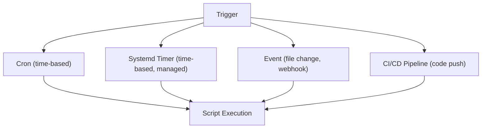

## Scheduled Task Execution

Automation means running scripts without human intervention — on a schedule, in response to events, or as part of a pipeline.



---

## Cron

The traditional Unix scheduler. Runs commands at specified times.

### Crontab Format

```text
┌───────── minute (0-59)
│ ┌─────── hour (0-23)
│ │ ┌───── day of month (1-31)
│ │ │ ┌─── month (1-12)
│ │ │ │ ┌─ day of week (0-7, 0 and 7 = Sunday)
│ │ │ │ │
* * * * * command
```

### Common Schedules

| Schedule | Cron Expression | Meaning |
|----------|----------------|---------|
| Every minute | `* * * * *` | Testing only |
| Every 5 minutes | `*/5 * * * *` | Health checks |
| Hourly | `0 * * * *` | Log rotation |
| Daily at 2 AM | `0 2 * * *` | Backups |
| Weekdays at 9 AM | `0 9 * * 1-5` | Reports |
| Monthly (1st) | `0 0 1 * *` | Cleanup |
| Every Sunday | `0 0 * * 0` | Weekly maintenance |

### Managing Crontab

```bash
crontab -e              # edit your crontab
crontab -l              # list your crontab
crontab -r              # remove your crontab (careful!)
sudo crontab -u alice -e  # edit another user's crontab
```

### Cron Environment

**Critical:** Cron runs with a minimal environment — NOT your interactive shell:

- No `.bashrc` or `.bash_profile` loaded
- Minimal `PATH` (usually just `/usr/bin:/bin`)
- No terminal (no interactive input)
- Working directory is the user's home

```bash
# BAD — relies on user's PATH
*/5 * * * * health-check.sh

# GOOD — absolute paths
*/5 * * * * /opt/scripts/health-check.sh

# GOOD — set PATH in script
*/5 * * * * /opt/scripts/health-check.sh
```

---

## Writing Cron-Safe Scripts

```bash
#!/bin/bash
set -euo pipefail

# 1. Set PATH explicitly
PATH="/usr/local/bin:/usr/bin:/bin"
export PATH

# 2. Redirect output to log file
exec >> /var/log/myapp/backup.log 2>&1

# 3. Timestamp every run
echo "=== $(date '+%Y-%m-%d %H:%M:%S') ==="

# 4. Lock file — prevent overlapping runs
LOCKFILE="/tmp/backup.lock"
if ! mkdir "$LOCKFILE" 2>/dev/null; then
    echo "Already running (lock exists: $LOCKFILE)"
    exit 0
fi
trap 'rmdir "$LOCKFILE"' EXIT

# 5. Actual work
echo "Starting backup..."
/usr/bin/rsync -a /data/ /backup/data/
echo "Backup complete"
```

### Cron Output and Notifications

By default, cron emails output to the user. Control this:

```bash
# Discard all output
0 2 * * * /opt/scripts/backup.sh > /dev/null 2>&1

# Log to file
0 2 * * * /opt/scripts/backup.sh >> /var/log/backup.log 2>&1

# Email only on error
0 2 * * * /opt/scripts/backup.sh > /dev/null
# (stderr still goes to email)

# Set email recipient
MAILTO="ops@example.com"
0 2 * * * /opt/scripts/backup.sh
```

---

## Systemd Timers (Modern Alternative)

Systemd timers offer advantages over cron:

| Feature | Cron | Systemd Timer |
|---------|:---:|:---:|
| Logging | Manual | journalctl |
| Missed runs | Lost | `Persistent=true` |
| Dependencies | None | Full systemd deps |
| Resource limits | None | cgroups |
| Randomized delay | None | `RandomizedDelaySec` |
| Status monitoring | `crontab -l` | `systemctl list-timers` |

### Timer Unit

```ini
# /etc/systemd/system/backup.timer
[Unit]
Description=Daily backup timer

[Timer]
OnCalendar=*-*-* 02:00:00
Persistent=true
RandomizedDelaySec=300

[Install]
WantedBy=timers.target
```

### Service Unit

```ini
# /etc/systemd/system/backup.service
[Unit]
Description=Backup service
After=network-online.target

[Service]
Type=oneshot
ExecStart=/opt/scripts/backup.sh
User=backup
StandardOutput=journal
StandardError=journal
```

### Managing Timers

```bash
# Enable and start
systemctl enable --now backup.timer

# Check status
systemctl list-timers --all
systemctl status backup.timer
systemctl status backup.service

# View logs
journalctl -u backup.service --since today

# Run manually (test)
systemctl start backup.service
```

### OnCalendar Syntax

```text
OnCalendar=hourly
OnCalendar=daily
OnCalendar=weekly
OnCalendar=*-*-* 02:00:00          # daily at 2 AM
OnCalendar=Mon-Fri *-*-* 09:00:00  # weekdays at 9 AM
OnCalendar=*-*-01 00:00:00         # first of month
```

---

## Automation Patterns

### Watchdog (Restart on Failure)

```bash
#!/bin/bash
set -euo pipefail

SERVICE="myapp"
PIDFILE="/var/run/${SERVICE}.pid"

if [[ -f "$PIDFILE" ]] && kill -0 "$(cat "$PIDFILE")" 2>/dev/null; then
    exit 0  # already running
fi

echo "$(date): $SERVICE is down, restarting..." >> /var/log/watchdog.log
/opt/scripts/start-${SERVICE}.sh
```

### Log Rotation

```bash
#!/bin/bash
set -euo pipefail

LOG_DIR="/var/log/myapp"
MAX_AGE=30  # days

find "$LOG_DIR" -name "*.log" -mtime +$MAX_AGE -delete
find "$LOG_DIR" -name "*.log" -size +100M -exec gzip {} \;
```

### Health Check with Alerting

```bash
#!/bin/bash
set -euo pipefail

ENDPOINTS=(
    "http://api.example.com/health"
    "http://web.example.com/health"
)

for url in "${ENDPOINTS[@]}"; do
    if ! curl -sf --max-time 5 "$url" > /dev/null; then
        echo "ALERT: $url is DOWN" | mail -s "Health Check Failed" ops@example.com
    fi
done
```

---

## Key Takeaways

1. **Cron has minimal environment** — always set PATH, use absolute paths
2. **Lock files prevent overlapping** — use `mkdir` for atomic locking
3. **Log everything** — redirect output, add timestamps
4. **Systemd timers > cron** for modern systems (logging, dependencies, missed runs)
5. **`Persistent=true`** catches up on missed runs after downtime
6. **Test cron scripts manually first** — `env -i bash script.sh` simulates cron's environment
7. **Never assume interactive environment** in automated scripts
