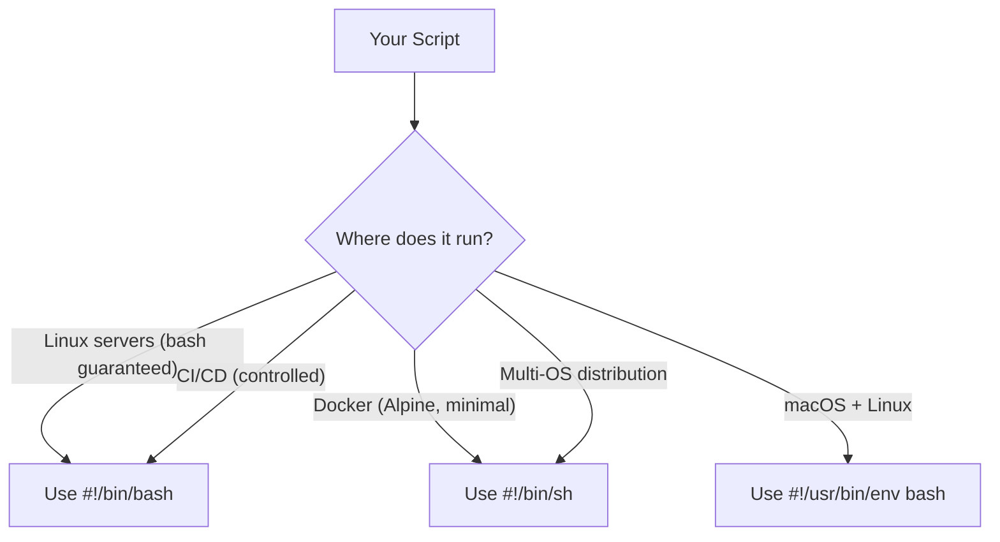

## Why Portability Matters

Not every system has bash. Alpine Docker images use `ash`, BSD systems use `sh`, embedded systems have minimal shells. If your script must run across different environments, you need POSIX compliance.



---

## POSIX vs Bash Features

| Feature | POSIX (`sh`) | Bash |
|---------|:-:|:-:|
| `[[ ]]` extended test | ❌ | ✅ |
| Arrays | ❌ | ✅ |
| `local` keyword | Not guaranteed | ✅ |
| `$(( ))` arithmetic | ✅ | ✅ |
| `$(command)` substitution | ✅ | ✅ |
| `{1..10}` brace expansion | ❌ | ✅ |
| `<<<` here string | ❌ | ✅ |
| Process substitution `<()` | ❌ | ✅ |
| `=~` regex matching | ❌ | ✅ |
| `==` in `[[ ]]` | ❌ | ✅ |
| `source` keyword | ❌ (use `.`) | ✅ |
| `function` keyword | ❌ | ✅ |
| `${var,,}` case change | ❌ | ✅ (bash 4+) |
| `set -o pipefail` | ❌ | ✅ |
| `$RANDOM` | ❌ | ✅ |
| `read -p` (prompt) | ❌ | ✅ |

---

## Writing POSIX-Compliant Scripts

### Test Commands

```bash
# Bash (not portable)
if [[ "$var" == "value" ]]; then ...
if [[ "$var" =~ ^[0-9]+$ ]]; then ...

# POSIX equivalent
if [ "$var" = "value" ]; then ...
# No regex — use case or grep
case "$var" in
    [0-9]*) echo "starts with digit" ;;
esac
```

### String Operations

```bash
# Bash
[[ -z "$var" ]]
[[ "$a" == "$b" ]]

# POSIX
[ -z "$var" ]
[ "$a" = "$b" ]    # single = for equality
```

### Functions

```bash
# Bash
function greet {
    local name="$1"
    echo "Hello, $name"
}

# POSIX
greet() {
    name="$1"    # no guaranteed 'local'
    echo "Hello, $name"
}
```

### Loops Without Brace Expansion

```bash
# Bash
for i in {1..10}; do echo "$i"; done

# POSIX
i=1
while [ "$i" -le 10 ]; do
    echo "$i"
    i=$((i + 1))
done
```

### No Arrays — Alternatives

```bash
# Bash arrays
files=("one.txt" "two.txt" "three.txt")
for f in "${files[@]}"; do echo "$f"; done

# POSIX — use positional parameters
set -- "one.txt" "two.txt" "three.txt"
for f in "$@"; do echo "$f"; done

# POSIX — use newline-separated string
files="one.txt
two.txt
three.txt"
echo "$files" | while IFS= read -r f; do echo "$f"; done
```

### No Process Substitution

```bash
# Bash
diff <(sort file1) <(sort file2)

# POSIX — use temp files
sort file1 > /tmp/sorted1
sort file2 > /tmp/sorted2
diff /tmp/sorted1 /tmp/sorted2
rm /tmp/sorted1 /tmp/sorted2
```

### No Pipefail

```bash
# Bash
set -o pipefail
cmd1 | cmd2

# POSIX — check PIPESTATUS manually (not available)
# Alternative: use intermediate files or check each command
cmd1 > /tmp/intermediate
cmd2 < /tmp/intermediate
```

---

## When to Use POSIX

| Scenario | Use POSIX | Use Bash |
|----------|:-:|:-:|
| Docker (Alpine, scratch) | ✅ | ❌ |
| System init scripts | ✅ | ❌ |
| Embedded/IoT | ✅ | ❌ |
| Cross-platform distribution | ✅ | ❌ |
| Linux servers (you control) | ❌ | ✅ |
| CI/CD pipelines | ❌ | ✅ |
| Developer tooling | ❌ | ✅ |
| Complex scripts (arrays, regex) | ❌ | ✅ |

---

## Portability Checklist

```bash
#!/bin/sh
# POSIX-compliant script checklist:

# ✅ Shebang: #!/bin/sh (not #!/bin/bash)
# ✅ Tests: [ ] not [[ ]]
# ✅ Equality: = not ==
# ✅ No arrays
# ✅ No local (or accept it's not guaranteed)
# ✅ No brace expansion {1..10}
# ✅ No here strings <<<
# ✅ No process substitution <()
# ✅ No pipefail
# ✅ No source (use . instead)
# ✅ No function keyword (use name() { })
# ✅ No [[ =~ ]] regex
# ✅ printf over echo (echo behavior varies!)
```

### The `echo` Problem

`echo` behavior varies across systems:

```bash
# Some systems interpret -n, -e; others print them literally
echo -n "no newline"     # might print: -n no newline

# POSIX-safe alternative
printf "no newline"
printf "%s\n" "$variable"
```

---

## Testing Portability

### ShellCheck

```bash
# Install
brew install shellcheck    # macOS
apt install shellcheck     # Debian/Ubuntu

# Run
shellcheck script.sh
shellcheck --shell=sh script.sh    # check POSIX compliance
```

ShellCheck catches:

- Bashisms in `#!/bin/sh` scripts
- Quoting issues
- Common pitfalls
- Portability warnings

### Test with dash

```bash
# dash is a strict POSIX shell — if it works in dash, it's portable
dash script.sh
```

### Docker Test

```bash
# Test in Alpine (no bash by default)
docker run --rm -v "$PWD:/scripts" alpine sh /scripts/myscript.sh
```

---

## Practical Portable Script

```sh
#!/bin/sh
set -eu

# Portable logging
log() {
    printf '[%s] %s\n' "$(date '+%Y-%m-%d %H:%M:%S')" "$*"
}

die() {
    printf 'ERROR: %s\n' "$*" >&2
    exit 1
}

# Check prerequisites
command -v curl >/dev/null 2>&1 || die "curl is required"

# Parse arguments
URL="${1:-}"
[ -n "$URL" ] || die "Usage: $0 <url>"

# Main logic
log "Fetching $URL"
if curl -sf --max-time 10 "$URL" > /dev/null; then
    log "Success"
else
    die "Failed to reach $URL"
fi
```

---

## Key Takeaways

1. **Use `#!/bin/sh`** only when you need portability — otherwise use bash
2. **`[ ]` not `[[ ]]`**, `=` not `==`, no arrays, no `local`
3. **`printf` over `echo`** for portable output
4. **ShellCheck** catches bashisms in POSIX scripts
5. **Test with `dash`** or Alpine Docker to verify portability
6. **Bash is fine** when you control the environment (servers, CI/CD)
7. **Don't sacrifice readability** for portability you don't need
