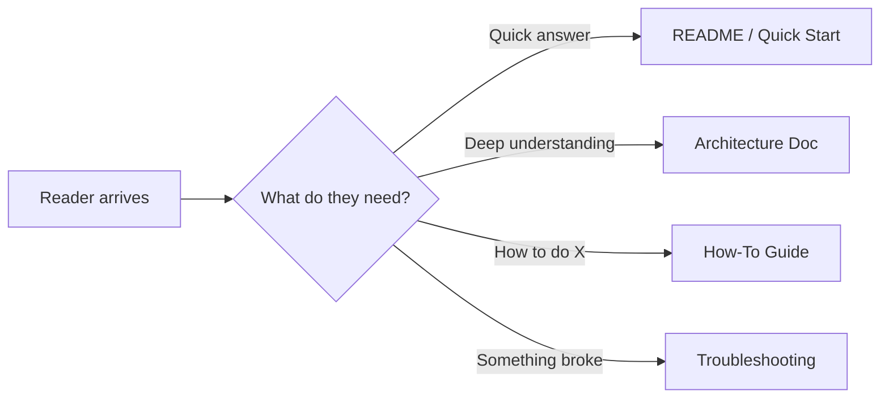
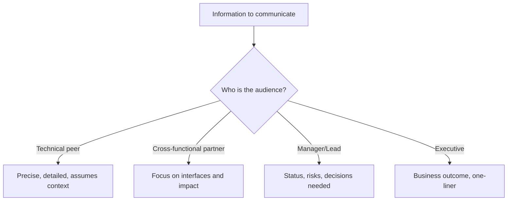

# Communication

The single highest-leverage skill for any engineer. Clear communication reduces bugs, prevents rework, accelerates decisions, and builds trust. Poor communication does the opposite — at scale.

## Written Communication

Most engineering communication is written: Slack messages, emails, pull request descriptions, design documents, tickets, and documentation. Written words persist, get forwarded, and are read without your tone of voice for context.

### The Pyramid Principle

Lead with the conclusion, then provide supporting details. Busy readers need the answer first.

| Approach | Example |
|----------|---------|
| ❌ Bottom-up | "I investigated the timeout issue, looked at logs, checked the database, ran some queries, and eventually found that the connection pool is exhausted because..." |
| ✅ Top-down | "The timeouts are caused by connection pool exhaustion. Here's what I found and my recommended fix..." |

### Pull Request Descriptions

Your PR description is a communication tool, not a formality.

| Element | Purpose | Example |
|---------|---------|---------|
| Summary | What and why (1-2 sentences) | "Adds retry logic to the payment gateway client to handle transient 503 errors" |
| Context | Why now, what triggered this | "We saw 47 failed payments last week due to gateway instability" |
| Approach | How you solved it and alternatives considered | "Exponential backoff with 3 retries. Considered circuit breaker but deemed it overkill for now" |
| Testing | How you verified it works | "Unit tests for retry logic. Manually tested with network interruption" |
| Risks | What could go wrong | "Retries add latency to the payment flow — max 6s additional in worst case" |

### Email and Slack

- **Subject lines are headlines** — make them scannable: "Decision needed: API versioning strategy by Friday"
- **One message, one topic** — don't bury a question inside a status update
- **Use threads** — keep conversations findable
- **Respect async** — don't expect instant replies. Provide full context so the reader can respond without follow-up questions

### Technical Documentation

Good docs answer: What is this? Why does it exist? How do I use it? What are the gotchas?

## Verbal Communication

### Meetings and Presentations

- **State your point first**, then elaborate — same pyramid principle as writing
- **Use silence** — pause after making a point. Let it land.
- **Check understanding** — "Does that make sense?" is weak. Try "What questions do you have?" or "Can you summarise what we agreed?"
- **Adapt your depth** — a 30-second answer is often better than a 5-minute one

### Explaining Technical Concepts

| Audience | Adjust |
|----------|--------|
| Fellow engineers (same domain) | Use precise terminology. Skip basics. Focus on the novel part. |
| Engineers (different domain) | Explain domain-specific terms. Use analogies to their domain. |
| Product/Design | Focus on behaviour and impact. Skip implementation details unless asked. |
| Executives | Lead with business impact. One sentence of how. No jargon. |

### The Curse of Knowledge

Once you understand something deeply, it becomes hard to remember what it was like not to know it. Fight this by:

- Defining acronyms on first use
- Using concrete examples before abstract principles
- Asking "what level of detail is helpful here?" before diving in
- Watching for glazed eyes or polite nodding

## Active Listening

Listening is not waiting for your turn to talk.

| Level | Behaviour | Signals |
|-------|-----------|---------|
| **Downloading** | Hearing words while thinking about your response | Looking away, interrupting, "yeah but..." |
| **Factual** | Listening for data and facts | Noting specifics, asking clarifying questions |
| **Empathic** | Listening for feelings and intent behind words | "It sounds like you're frustrated by..." |
| **Generative** | Listening for what's not being said | "What would you do if there were no constraints?" |

### Practical Techniques

- **Paraphrase** — "So what you're saying is..." (confirms understanding, shows respect)
- **Ask before solving** — "Do you want me to help fix this, or do you just need to vent?"
- **Silence after questions** — count to 5 before filling the gap. Let them think.
- **Take notes** — it forces attention and signals respect

## Audience Awareness

Every communication has an audience. The same information needs different framing depending on who's receiving it.

### Matching Communication to Context

| Context | Optimise for | Avoid |
|---------|-------------|-------|
| Incident response | Speed, clarity, actions | Blame, speculation, jargon |
| Design review | Options, trade-offs, questions | Premature commitment, ego |
| Sprint planning | Scope clarity, risks, estimates | Vagueness, over-commitment |
| 1:1 with manager | Honesty, blockers, growth | Hiding problems, only good news |
| Cross-team request | Context, urgency, what you need from them | Assuming they know your project |

## Technical vs Non-Technical Communication

The ability to translate between technical and business language is a career accelerator.

| Technical framing | Business framing |
|-------------------|------------------|
| "We need to refactor the authentication module" | "Our login system is fragile — one more feature risks breaking it for all users" |
| "The database query is O(n²)" | "Page load will get noticeably slower as we add more customers" |
| "We should add integration tests" | "We can catch bugs before they reach customers, reducing support tickets" |
| "There's technical debt in the payment service" | "Our ability to ship payment features safely is slowing down" |

The pattern: **translate implementation details into impact on users, revenue, or speed.**

## Key Takeaways

- Lead with the conclusion — readers and listeners are busy
- Match depth and vocabulary to your audience
- Written communication is permanent — invest in clarity
- Listening is an active skill that builds trust and surfaces better information
- The ability to translate between technical and business language makes you invaluable
- Every PR, email, and message is practice — treat them as communication reps
