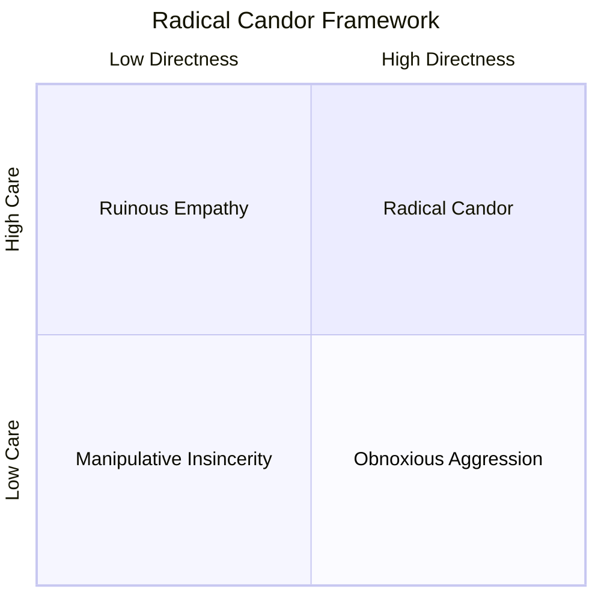
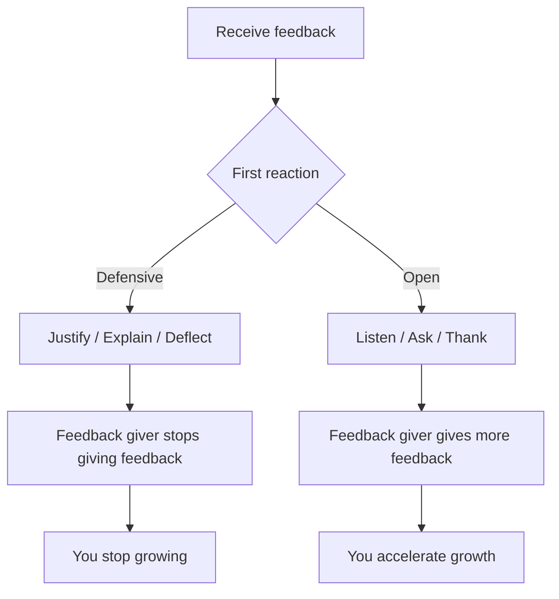

# Giving & Receiving Feedback

Feedback is how teams get better. Without it, bad patterns persist, good work goes unrecognised, and resentment builds silently. Engineers who can give direct, kind feedback — and receive it without defensiveness — create disproportionate value.

## Why Engineers Struggle with Feedback

- **Code feels personal** — criticising someone's code can feel like criticising their intelligence
- **Conflict avoidance** — it's easier to fix the code yourself than have the conversation
- **Lack of frameworks** — "this is bad" is not feedback, it's a verdict
- **Remote work** — text strips tone, making feedback feel harsher

## The SBI Model (Situation-Behavior-Impact)

The most reliable framework for specific, actionable feedback:

| Component | What it does | Example |
|-----------|-------------|---------|
| **Situation** | Anchors the feedback to a specific moment | "In yesterday's design review..." |
| **Behaviour** | Describes observable actions (not intentions) | "...you interrupted Maria three times while she was presenting her proposal..." |
| **Impact** | Explains the effect on you, the team, or outcomes | "...which made it hard to understand her approach, and she seemed to disengage for the rest of the meeting." |

### SBI in Practice

| Scenario | Poor feedback | SBI feedback |
|----------|--------------|--------------|
| Unclear PR descriptions | "Your PRs are always confusing" | "In the last two PRs (links), the descriptions didn't explain why the change was needed. I spent 30 minutes on context that a sentence could have provided." |
| Great incident response | "Good job" | "During Tuesday's outage, you took charge of communication, posted clear updates every 15 minutes, and coordinated the fix. That kept the team calm and leadership informed." |
| Missed deadline | "You're unreliable" | "The API spec was due Monday and arrived Thursday without a heads-up. The frontend team was blocked for three days." |

## Radical Candor

Kim Scott's framework plots feedback on two axes:

| Quadrant | Behaviour | Engineering example |
|----------|-----------|-------------------|
| **Radical Candor** | Care personally + Challenge directly | "I think this architecture will cause scaling problems. Here's why, and here's what I'd suggest instead." |
| **Ruinous Empathy** | Care but don't challenge | Approving a bad design because you don't want to hurt feelings |
| **Obnoxious Aggression** | Challenge without caring | "This code is trash. Did you even test it?" |
| **Manipulative Insincerity** | Neither care nor challenge | "Looks fine to me" (while complaining about it to others) |

### The Goal: Radical Candor

- **Care personally** — show that you're invested in their growth, not just the code
- **Challenge directly** — be honest about problems. Vague politeness helps no one
- The order matters: establish care first, then deliver the challenge

## Code Review Etiquette

Code reviews are the most frequent feedback mechanism in engineering. They set the team's feedback culture.

### As a Reviewer

| Principle | Do | Don't |
|-----------|-----|-------|
| Critique the code, not the person | "This function does too many things" | "You clearly don't understand SRP" |
| Ask questions before making demands | "What was the reason for this approach?" | "Change this to X" |
| Distinguish preferences from issues | "Nit: I'd name this `fetchUser`" vs "Bug: this will NPE on null input" | Treat everything as blocking |
| Offer alternatives | "Consider using a map here for O(1) lookup" | "This is inefficient" (without solution) |
| Acknowledge good work | "Nice refactor — much cleaner than before" | Only comment on problems |

### As an Author

- **Don't take it personally** — the reviewer is improving the code, not attacking you
- **Assume good intent** — "Why did you do X?" is usually curiosity, not accusation
- **Explain your reasoning** — if you disagree, explain why rather than just defending
- **Say thank you** — reviewers invest time in your code

### Labelling Feedback Severity

| Prefix | Meaning | Author action |
|--------|---------|---------------|
| `blocker:` | Must fix before merge | Fix it |
| `suggestion:` | Would improve the code | Consider it, decide |
| `nit:` | Style preference, take it or leave it | Optional |
| `question:` | Seeking understanding | Respond with context |
| `praise:` | This is great | Feel good |

## Receiving Feedback Gracefully

The hardest part of feedback is receiving it without defensiveness. Your reaction to feedback determines whether people will give you feedback again.

### The Defensive Response Ladder

### Practical Steps

1. **Pause** — don't respond immediately. "Thank you, let me think about that."
2. **Separate signal from noise** — even poorly delivered feedback often contains truth
3. **Ask for specifics** — "Can you give me an example?" makes vague feedback actionable
4. **Decide later** — you don't have to agree or disagree in the moment
5. **Follow up** — "I thought about what you said and here's what I changed" builds trust

### When Feedback Feels Wrong

Not all feedback is valid. But even invalid feedback tells you something:

- If multiple people give the same feedback, it's probably valid regardless of how it feels
- If one person gives feedback that contradicts everyone else, consider the source
- If feedback is about perception rather than reality, perception still matters

## Growth Mindset and Feedback

| Fixed Mindset Response | Growth Mindset Response |
|----------------------|------------------------|
| "I'm just not good at public speaking" | "I haven't practiced public speaking enough yet" |
| "That reviewer always picks on me" | "What pattern is this reviewer seeing that I'm missing?" |
| "I failed the system design interview" | "Now I know exactly what to study for next time" |
| "I can't do frontend" | "I haven't invested time in frontend skills yet" |

The word "yet" transforms limitations into opportunities.

## Building a Feedback Culture

If you want more feedback:

- **Ask for it explicitly** — "What's one thing I could do better in code reviews?"
- **Make it safe** — thank people for feedback, especially when it's hard to hear
- **Act on it visibly** — show that feedback leads to change
- **Give it generously** — model the behaviour you want to see
- **Be specific in requests** — "How was my presentation?" is too broad. "Was my explanation of the caching layer clear?" is answerable.

## Key Takeaways

- Use SBI (Situation-Behavior-Impact) to make feedback specific and actionable
- Radical Candor means caring enough to be honest — not cruel, not avoidant
- Code reviews are feedback practice — label severity, critique code not people
- Your reaction to feedback determines whether you'll receive more of it
- "Yet" is the most powerful word for maintaining a growth mindset
- Ask for feedback explicitly and specifically — don't wait for it to arrive
