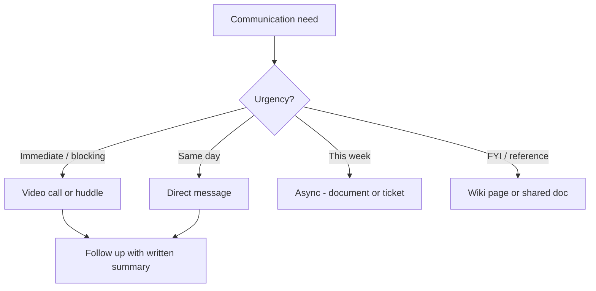
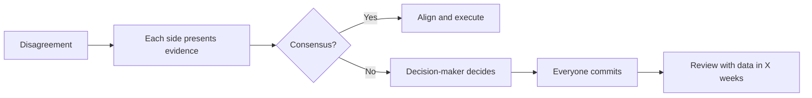

# Collaboration & Teamwork

Software is built by teams, not individuals. The most impactful engineers are not lone geniuses — they are multipliers who make everyone around them more effective. Collaboration is the skill that turns a group of engineers into a team.

## Working in Cross-Functional Teams

Modern product development involves engineers, designers, product managers, QA, data analysts, and sometimes legal, security, or compliance. Each role brings different priorities and vocabulary.

### Understanding Other Roles

| Role | Primary concern | What they need from you |
|------|----------------|------------------------|
| Product Manager | User value, business outcomes, timelines | Honest estimates, trade-off options, early risk signals |
| Designer | User experience, consistency, accessibility | Feasibility input early, not after designs are final |
| QA | Coverage, edge cases, regression | Testable requirements, clear acceptance criteria |
| DevOps/Platform | Reliability, security, operability | Observable code, reasonable resource requirements |
| Data/Analytics | Data quality, tracking, insights | Events and schemas that answer business questions |

### Collaboration Anti-Patterns

| Anti-pattern | Consequence | Better approach |
|-------------|-------------|-----------------|
| "Throw it over the wall" | Misalignment, rework, frustration | Involve downstream teams early |
| "That's not my job" | Gaps in ownership, dropped balls | Clarify boundaries, pick up edge cases |
| "I'll just do it myself" | Bus factor of 1, no knowledge sharing | Pair with someone, document decisions |
| Building in isolation | Integration surprises at the end | Share progress incrementally, demo often |
| Assuming shared context | Misunderstandings compound | State assumptions explicitly |

## Remote Collaboration

Distributed teams face unique challenges: timezone gaps, missing body language, isolation, and communication overhead.

### Making Remote Work Effective



| Principle | In practice |
|-----------|-------------|
| **Default to async** | Write it down. Not everything needs a meeting or a ping. |
| **Over-communicate status** | Post updates before people ask. Silence creates anxiety. |
| **Make work visible** | Use tickets, PRs, and shared docs — not just your local branch. |
| **Respect time zones** | Don't schedule meetings at someone's 7am. Rotate inconvenience. |
| **Document decisions** | If it's not written down, it didn't happen. Especially in video calls. |
| **Build social connection** | Informal chat matters. People collaborate better when they know each other. |

### Writing for Async Teams

When your team is distributed, writing replaces hallway conversations:

- **Be explicit** — state what you need, by when, from whom
- **Provide full context** — the reader can't tap you on the shoulder to ask
- **Use structured formats** — bullet points, tables, headers. Walls of text get skipped.
- **Indicate urgency** — "FYI" vs "Need decision by Thursday" vs "Blocking — help needed now"

## Pair Programming

Pairing is not just two people at one keyboard — it's a collaboration technique with specific modes and benefits.

### Pairing Styles

| Style | How it works | Best for |
|-------|-------------|----------|
| **Driver-Navigator** | One types, one thinks ahead and guides | Complex logic, unfamiliar codebase |
| **Ping-Pong** | Alternate writing test → implementation | TDD, maintaining equal engagement |
| **Strong-Style** | Navigator has all ideas, driver just types | Knowledge transfer to junior |
| **Unstructured** | Loose collaboration, switch roles fluidly | Exploration, debugging |

### When to Pair

- Onboarding — fastest way to transfer context
- Complex problems — two perspectives catch more issues
- High-stakes code — critical paths benefit from real-time review
- Stuck — fresh eyes break deadlocks faster than more solo time

### When NOT to Pair

- Routine tasks that don't benefit from discussion
- When one person needs deep focus time
- When there's a significant skill gap AND no teaching intent
- When both people are tired or frustrated

## Conflict Resolution

Conflict in engineering teams is inevitable and often healthy. Disagreements about architecture, priorities, or approaches drive better decisions — if handled well.

### Types of Conflict

| Type | Example | Healthy resolution |
|------|---------|-------------------|
| **Technical** | "We should use SQL" vs "We should use NoSQL" | Evaluate against requirements, prototype if needed, decide and commit |
| **Process** | "We need more code review" vs "Reviews slow us down" | Discuss goals (quality vs speed), find a balance, measure |
| **Interpersonal** | "You always dismiss my ideas" | Direct conversation using SBI, assume good intent |
| **Priority** | "We should fix tech debt" vs "We should ship features" | Escalate to product/management with data on both sides |

### The Disagree-and-Commit Pattern

When a team can't reach consensus:

1. Everyone presents their position with reasoning
2. A decision-maker (tech lead, architect, product) decides
3. **Everyone commits to the decision**, regardless of personal preference
4. Revisit with data after a defined period if the decision doesn't work

This prevents both endless debates and silent sabotage.



### De-escalation Techniques

- **Assume good intent** — most conflict comes from different context, not malice
- **Name the disagreement** — "It sounds like we disagree about X. Is that right?"
- **Separate people from positions** — attack the idea, not the person
- **Find the shared goal** — you almost certainly agree on the outcome, just not the path
- **Take it offline** — public Slack debates rarely resolve well. Have a direct conversation.

## Building Trust

Trust is the foundation of all collaboration. Without it, people hoard information, avoid conflict, and protect themselves instead of the team.

### The Trust Equation

```
Trust = (Credibility + Reliability + Intimacy) / Self-Orientation
```

| Factor | How to build it |
|--------|----------------|
| **Credibility** | Know your stuff. Admit when you don't. |
| **Reliability** | Do what you say. Meet deadlines. Follow up. |
| **Intimacy** | Share appropriately. Be vulnerable. Remember personal details. |
| **Self-Orientation** (divisor) | Low is good. Focus on the team's success, not just yours. |

### Trust-Building Behaviours

- **Follow through** — small commitments kept build trust faster than grand gestures
- **Admit mistakes** — "I broke the build" builds more trust than hiding it
- **Share credit** — "We built this" instead of "I built this"
- **Be consistent** — behave the same in public and private
- **Help without being asked** — offer support before someone has to request it
- **Be transparent** — share your reasoning, not just your conclusions

### Trust Destroyers

- Taking credit for others' work
- Saying one thing in meetings, another in DMs
- Consistently missing commitments without communication
- Sharing confidential conversations
- Throwing teammates under the bus during incidents

## Key Takeaways

- Cross-functional collaboration requires understanding what other roles care about
- Remote teams need explicit communication — silence breeds assumptions
- Pair programming is a skill with specific modes; use the right one for the context
- Conflict is healthy when it's about ideas; use disagree-and-commit to prevent stalemates
- Trust is built through small, consistent actions — reliability, honesty, and generosity
- The best collaborators make everyone around them more effective
