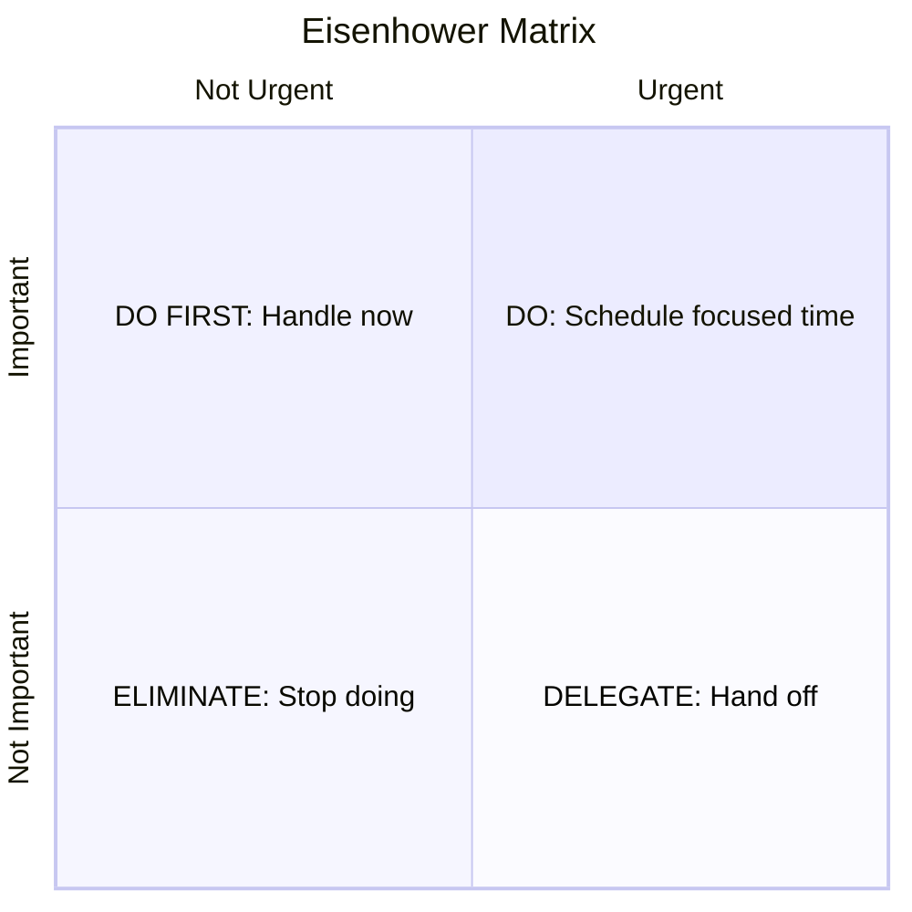
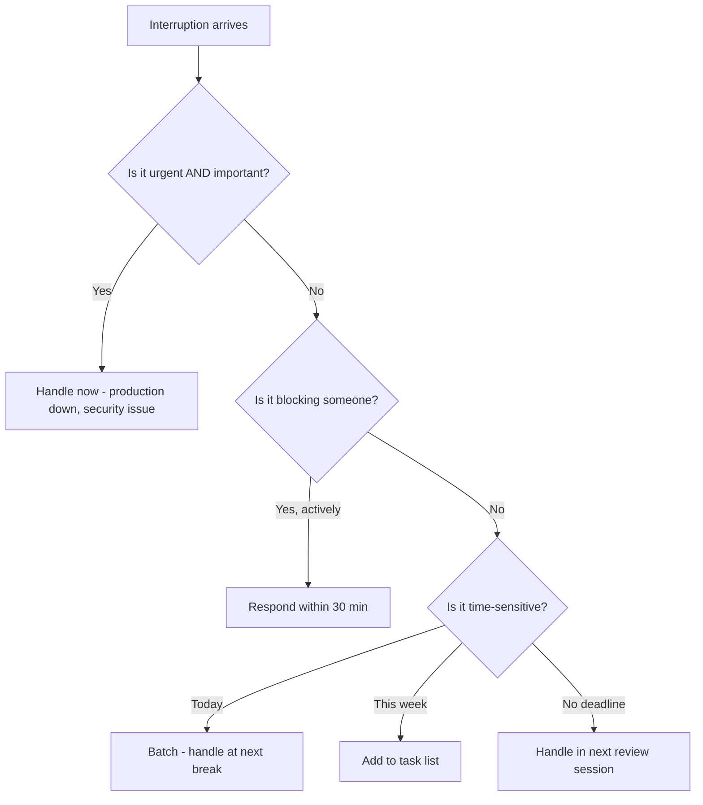

# Time Management

Engineers face a unique time management challenge: their highest-value work requires deep focus, but their environment is full of interruptions — Slack messages, code reviews, meetings, incidents, and "quick questions." Managing time is not about doing more — it's about protecting the space for work that matters.

## Prioritisation Frameworks

### The Eisenhower Matrix

Categorise tasks by urgency and importance to decide what to do, schedule, delegate, or drop.

| Quadrant | Examples in engineering | Action |
|----------|----------------------|--------|
| **Important + Urgent** | Production incident, blocking bug, security vulnerability | Do it now |
| **Important + Not Urgent** | Architecture improvements, documentation, learning, testing | Schedule protected time — this is where growth happens |
| **Not Important + Urgent** | Most Slack pings, routine emails, someone else's meeting | Delegate or batch-process |
| **Not Important + Not Urgent** | Bike-shedding, unnecessary refactors, rabbit holes | Eliminate |

The trap: spending all time in Quadrant 1 (urgent) while Quadrant 2 (important but not urgent) atrophies. Invest in Q2 to reduce future Q1 emergencies.

### MoSCoW for Sprint/Task Prioritisation

| Priority | Definition | Sprint behaviour |
|----------|-----------|-----------------|
| **Must** | Sprint fails without it | Commit to delivering |
| **Should** | Expected but survivable if missed | Plan to deliver, accept risk |
| **Could** | Nice to have | Only if time permits |
| **Won't** | Explicitly out of scope | Helps say no clearly |

### RICE Scoring

For backlog prioritisation at the feature level:

| Factor | Question | Scale |
|--------|----------|-------|
| **Reach** | How many users/systems affected? | Count or estimate |
| **Impact** | How much does it move the needle? | 0.25 (minimal) to 3 (massive) |
| **Confidence** | How sure are we of R and I? | 0-100% |
| **Effort** | How many person-weeks? | Estimate |

Score = (Reach × Impact × Confidence) / Effort

## Deep Work

Cal Newport's concept: cognitively demanding work performed in a state of distraction-free concentration. This is where engineers produce their best output — design, complex debugging, architectural thinking.

### Protecting Deep Work

| Threat | Defence |
|--------|---------|
| Slack notifications | Scheduled DND blocks. Status: "Focused — will respond at 2pm" |
| Meetings fragmenting the day | Batch meetings to one half of the day |
| "Quick questions" | Office hours: "I'm available for questions at 11am and 3pm" |
| Context switching | Group related tasks. Finish before switching. |
| Email/ticketing systems | Check 2-3 times per day, not continuously |

### The Maker's Schedule vs Manager's Schedule

| Maker (engineer) | Manager |
|-----------------|---------|
| Needs 3-4 hour uninterrupted blocks | Works in 30-60 minute slots |
| A single meeting splits the day | Meetings are the work |
| Context-switch cost is high (20+ min to reload) | Context-switch cost is low |
| Most productive with control over schedule | Most productive with access to people |

Communicate your needs: "I need mornings for deep work. I'm available for meetings after 1pm."

## Managing Interruptions

Not all interruptions are equal. Use a triage approach:

### The "Let Me Finish" Technique

When interrupted during deep work:

1. Note where you are (write a TODO comment, jot down your thought)
2. Assess the interruption's urgency
3. If not urgent: "I'll get back to you at [specific time]"
4. Return to work. The note helps you reload context.

## Estimation

Engineers chronically underestimate. Understanding why helps you estimate better.

### Why Estimates Are Wrong

| Bias | Effect | Mitigation |
|------|--------|-----------|
| **Optimism bias** | Assume best case | Multiply by 1.5-2x |
| **Anchoring** | First number sticks | Generate range before committing |
| **Forgetting overhead** | Ignore reviews, testing, deployment | Add 30% for "glue work" |
| **Unknown unknowns** | Can't predict surprises | Add buffer for discovery |
| **Scope creep** | Requirements grow mid-task | Define done before starting |

### Better Estimation Practices

- **Break it down** — estimate small pieces (< 1 day each), then sum
- **Use ranges** — "2-5 days" is more honest than "3 days"
- **Reference past work** — "Last similar task took X" beats gut feeling
- **Separate work from calendar** — 2 days of work ≠ 2 calendar days (meetings, reviews, context switches)
- **Track actuals** — compare estimates to reality. Your calibration improves over time.

## Saying No

Saying yes to everything means saying no to your priorities. Engineers who can't say no accumulate obligations, miss deadlines, and burn out.

### How to Say No Constructively

| Instead of... | Try... |
|--------------|--------|
| "No, I can't" | "I can't take this on this sprint. Could we schedule it for next?" |
| "That's not my job" | "I don't have context on that system. [Person] would be faster." |
| "I'm too busy" | "Here's what I'm working on. Which should I deprioritise to fit this?" |
| "That's a bad idea" | "What problem are we solving? There might be a lighter solution." |

### Making Trade-offs Visible

When asked to add work, surface the trade-off instead of silently absorbing it:

"I can take this on. If I do, [other task] will slip by [X days]. Is that acceptable, or should we reprioritise?"

This puts the decision back on the requestor without you being the bottleneck or the villain.

## Avoiding Burnout

Burnout is not just "being tired." It's chronic exhaustion combined with cynicism and reduced effectiveness. Engineering's culture of overwork makes it especially common.

### Warning Signs

| Signal | What it looks like |
|--------|-------------------|
| **Exhaustion** | Tired after rest. Dreading Monday. Can't focus. |
| **Cynicism** | "Nothing matters." Detachment from work you used to enjoy. |
| **Reduced efficacy** | Taking twice as long. Making careless mistakes. Avoiding hard problems. |

### Prevention Strategies

- **Set boundaries** — define work hours and honour them. Log off at a consistent time.
- **Take breaks** — Pomodoro (25 min work, 5 min break) or similar rhythm
- **Single-task** — multitasking drains energy faster than focused work
- **Say no early** — overcommitment is the #1 path to burnout
- **Invest in recovery** — exercise, sleep, and hobbies are not luxuries
- **Ask for help** — struggling silently accelerates burnout

### The Sustainable Pace Principle

Sprinting is for emergencies. Marathons require a sustainable pace. If you're consistently working overtime, you're not a hero — you're a future liability. The code you write exhausted today creates the bugs you'll debug next month.

## Key Takeaways

- Use the Eisenhower Matrix to focus on important work before it becomes urgent
- Protect deep work blocks — context switching is the enemy of engineering productivity
- Estimate in ranges, break work into small pieces, and track actuals to calibrate
- Saying no is a skill — make trade-offs visible instead of silently absorbing work
- Burnout is preventable with boundaries, realistic commitments, and intentional rest
- Sustainable pace produces better results than chronic overtime
