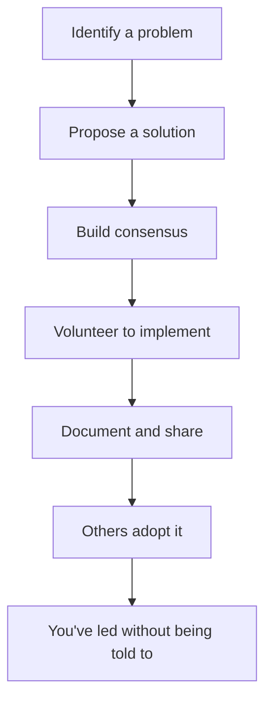
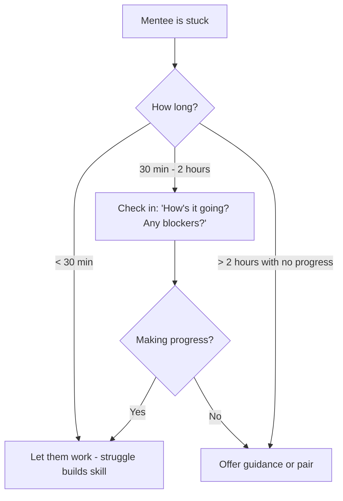
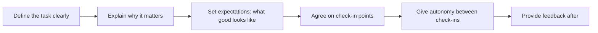

# Leadership

Leadership in engineering is not about a title. It's about influence, direction, and making others more effective. You can lead from any position — as a senior engineer, a tech lead, or even a mid-level developer who steps up during a crisis.

## Technical Leadership Without Authority

Most engineering leadership happens without direct reports. You influence through expertise, communication, and consistent behaviour — not by telling people what to do.

### What Technical Leaders Do

| Activity | Impact |
|----------|--------|
| Set technical direction | Team builds coherent systems instead of patchwork |
| Define standards and patterns | New code is consistent; onboarding is faster |
| Make decisions (and document them) | Team moves forward instead of debating endlessly |
| Remove blockers | Others can focus on their work |
| Raise the quality bar | Through reviews, pairing, and example |
| Create safety for experimentation | Innovation happens; failure is learning |

### How to Lead Without Authority

Practical examples:
- Write the RFC for a recurring architectural problem
- Create the PR template the team didn't know it needed
- Set up the monitoring dashboard that catches issues before users report them
- Document the tribal knowledge that only exists in one person's head

## Mentoring Juniors

Mentoring is the highest-leverage leadership activity. One hour of good mentoring can save a junior engineer days of struggle and months of learning the hard way.

### Effective Mentoring Behaviours

| Do | Don't |
|----|-------|
| Ask questions that guide them to the answer | Give the answer immediately |
| Share your thought process, not just conclusions | Say "just do X" without explaining why |
| Normalise struggle and mistakes | Make them feel stupid for not knowing |
| Give stretch assignments with support | Either bore them or overwhelm them |
| Check in regularly (don't wait for them to ask) | Assume silence means everything is fine |
| Celebrate their progress | Only point out what's wrong |

### The Mentor's Toolkit

| Technique | When to use |
|-----------|------------|
| **Rubber ducking** | They explain the problem to you; often solve it themselves |
| **Scaffolded questions** | "What have you tried? What do you think the problem is? What would happen if...?" |
| **Pairing** | For complex or unfamiliar tasks — teach by doing together |
| **Code walkthroughs** | Show them how you approach a problem (think aloud) |
| **Directed reading** | Point to specific resources rather than "go learn X" |
| **Retrospective 1:1s** | "What did you learn from that? What would you do differently?" |

### Knowing When to Help vs Let Them Struggle

## Leading by Example

People follow what you do, not what you say. If you want a team culture of quality, ownership, and openness, you have to model it consistently.

### What "Leading by Example" Looks Like

| Value | The behaviour |
|-------|--------------|
| Quality | Your PRs have thorough descriptions, tests, and clean code |
| Ownership | You don't say "not my problem" — you escalate or fix it |
| Transparency | You share bad news early, admit mistakes, explain reasoning |
| Growth mindset | You ask for feedback publicly, share what you learned |
| Respect for time | You show up prepared, end meetings on time, honour async |
| Inclusivity | You credit others, make space for quiet voices, assume good intent |

The gap between what you espouse and what you practice is noticed. Always.

## Decision-Making Frameworks

Technical leaders make many decisions daily. Having frameworks prevents both analysis paralysis and reckless speed.

### DACI Framework

| Role | Responsibility | Example (choosing a database) |
|------|---------------|-------------------------------|
| **Driver** | Drives the process, gathers input, proposes | Senior engineer |
| **Approver** | Makes the final call | Tech lead or architect |
| **Contributors** | Provide input, expertise, constraints | Team members, DBA, ops |
| **Informed** | Told after decision is made | Broader team, product |

### Decision Sizing

| Decision type | Approach | Time investment |
|--------------|----------|----------------|
| **Reversible, low impact** | Just decide. Don't overthink. | Minutes |
| **Reversible, high impact** | Decide quickly, monitor, be ready to reverse | Hours |
| **Irreversible, low impact** | Decide, document reasoning | A day |
| **Irreversible, high impact** | RFC, gather input, sleep on it, decide | Days to a week |

### One-Way vs Two-Way Doors (Amazon model)

- **Two-way door** — easily reversible. Walk through it quickly, turn around if wrong. (Library choice, API design iteration, feature flag experiment)
- **One-way door** — hard to reverse. Take time, gather data, get input. (Database migration, public API contract, architectural paradigm shift)

Most decisions are two-way doors that teams mistakenly treat as one-way.

## Delegation

Delegation is not dumping work — it's investing in others while freeing yourself for higher-leverage activities.

### What to Delegate

| Delegate | Keep |
|----------|------|
| Tasks others can learn from | Decisions only you have context for |
| Routine work you've mastered | High-stakes work requiring your specific expertise |
| Work that develops someone else | Confidential or sensitive matters |
| Tasks where "good enough" is fine | Work where your specific quality bar matters |

### How to Delegate Effectively

### Delegation Pitfalls

| Pitfall | Result | Solution |
|---------|--------|----------|
| Delegating without context | They guess wrong, rework needed | Explain the why and constraints |
| Micromanaging after delegating | They disengage, you save no time | Trust the check-in schedule |
| Only delegating grunt work | They don't grow, resent it | Include stretch assignments |
| Delegating and disappearing | They get stuck, feel abandoned | Be available at agreed checkpoints |
| Redoing their work silently | They never improve | Give feedback instead |

## The Staff+ Leadership Shift

As engineers grow past senior, the work shifts from writing code to multiplying others:

| IC Level | Primary leverage |
|----------|----------------|
| Mid | Personal output |
| Senior | Personal output + code quality influence |
| Staff | Team output + technical direction |
| Principal | Org output + strategic technical decisions |

The progression is not about writing more code — it's about creating more impact through others.

## Key Takeaways

- Leadership is influence, not authority — you can lead from any level
- Mentoring is high-leverage: invest an hour, save someone days
- Lead by example — the gap between words and actions is always noticed
- Size decisions appropriately — most are two-way doors that don't need an RFC
- Delegate with context and check-ins, not with micromanagement or abandonment
- As you grow, your leverage shifts from personal output to multiplying others
