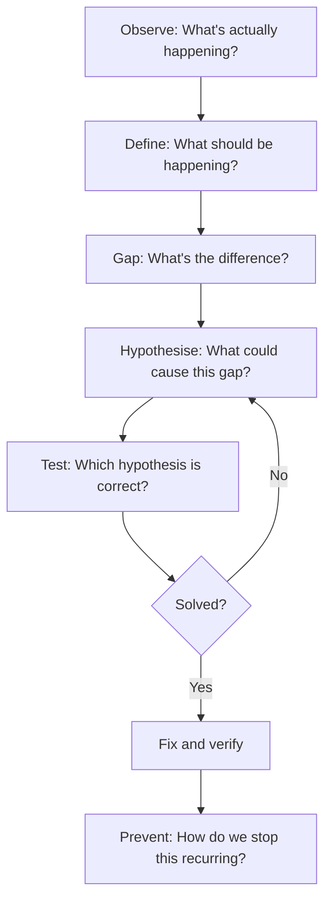
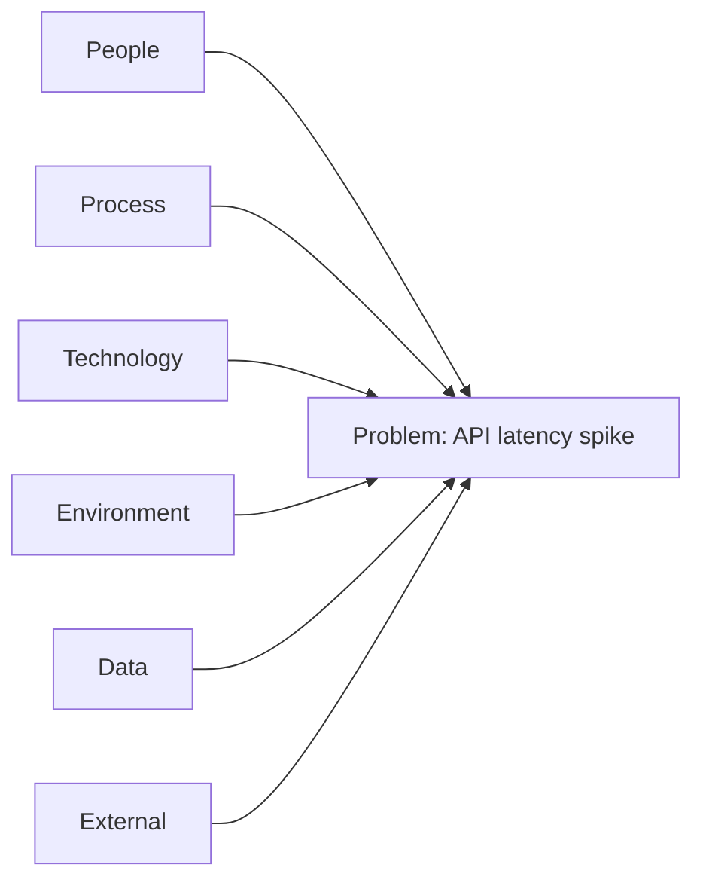
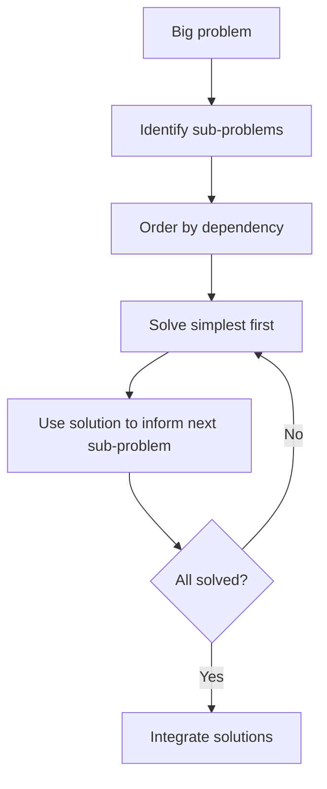

# Problem Solving

Engineering is problem solving. But the hardest problems are rarely solved by staring at code harder — they require structured thinking, systematic investigation, and the discipline to resist jumping to conclusions.

## Structured Thinking

Before solving a problem, make sure you understand it. Most debugging time is wasted solving the wrong problem.

### The Problem-Solving Loop

### Common Thinking Traps

| Trap | Description | Defence |
|------|-------------|---------|
| **Jumping to solutions** | Fixing before understanding | Force yourself to describe the problem in words first |
| **Confirmation bias** | Only looking for evidence that supports your theory | Actively try to disprove your hypothesis |
| **Anchoring** | Fixating on the first clue | Generate multiple hypotheses before investigating |
| **Availability bias** | "Last time it was X, so it's probably X again" | Check the obvious, but don't stop there |
| **Sunk cost** | "I've spent 3 hours on this approach, I can't switch" | Time spent is gone. Switch if the evidence says to. |

## Root Cause Analysis

Surface-level fixes create recurring problems. Root cause analysis digs deeper to find and address the underlying cause.

### The 5 Whys

Start with the problem and ask "why" until you reach a systemic cause (typically 3-5 levels deep).

| Level | Question | Answer |
|-------|----------|--------|
| Problem | Why did the deployment fail? | The database migration timed out |
| Why 1 | Why did it time out? | The migration locked a large table for 10 minutes |
| Why 2 | Why did it lock the table? | The ALTER TABLE statement requires a full table lock |
| Why 3 | Why wasn't this caught before production? | We don't test migrations against production-sized data |
| Why 4 | Why don't we? | No staging environment with realistic data volume |
| **Root cause** | Missing infrastructure for realistic migration testing | |

**Fix the root cause:** Create a staging environment with production-scale data, not just a bigger timeout.

### Rules for 5 Whys

- Stop when you reach something you can control or change
- Avoid blaming people — look for process and system failures
- Multiple branches are OK — a problem can have multiple contributing causes
- Verify each "why" with evidence, not assumption

### Fishbone Diagram (Ishikawa)

For complex problems with multiple potential cause categories, a fishbone diagram organises thinking:

For each category, brainstorm specific potential causes:

| Category | Potential causes (API latency example) |
|----------|---------------------------------------|
| **People** | New team member deployed untested code; on-call missed alert |
| **Process** | No load testing in CI; no review for query changes |
| **Technology** | Database connection pool exhausted; no caching layer |
| **Environment** | Spike in traffic from marketing campaign; cloud provider degradation |
| **Data** | Table grew beyond expected size; missing index on new query |
| **External** | Third-party API slow; DNS resolution delay |

The fishbone prevents tunnel vision by forcing you to consider causes across all categories before diving into investigation.

## Decomposition

Large, ambiguous problems paralyse. The solution is to break them into smaller, solvable pieces.

### Decomposition Strategy

### Practical Decomposition Example

**Problem:** "Build a recommendation engine"

| Sub-problem | Approach |
|-------------|----------|
| What data do we have? | Audit existing data sources |
| What recommendations do users need? | Interview product, study user behaviour |
| What's the simplest useful version? | Rule-based "popular items" as baseline |
| How do we measure success? | Define metrics (CTR, engagement) before building |
| What infrastructure do we need? | Evaluate build vs buy |
| How do we iterate? | A/B testing framework |

Each sub-problem is manageable. The original problem was not.

### Vertical vs Horizontal Slicing

| Approach | Description | When to use |
|----------|-------------|-------------|
| **Vertical slice** | Build one thin feature end-to-end | When you need to validate the full flow |
| **Horizontal slice** | Build one layer completely | When layers are independent and well-defined |

For ambiguous problems, vertical slicing is usually better — it delivers value early and reveals unknowns.

## First Principles Thinking

Instead of reasoning by analogy ("others did X, so we should too"), first principles thinking breaks a problem down to its fundamental truths and builds up from there.

### The Process

1. **Identify assumptions** — what are we taking for granted?
2. **Break down to fundamentals** — what do we know for certain?
3. **Rebuild from there** — what solutions emerge from fundamentals alone?

### Engineering Example

**Conventional thinking:** "We need a message queue because microservices need message queues."

**First principles thinking:**
- What problem are we actually solving? (Decoupling producer from consumer in time)
- What are the actual requirements? (At-least-once delivery, ordering within a partition, 1000 msgs/sec)
- What solutions satisfy these fundamentals? (Could be SQS, Kafka, a database table with polling, or even S3 events)
- Which is simplest for our scale? (Maybe SQS is sufficient for 1000 msgs/sec — no need for Kafka's complexity)

### When to Use First Principles

| Situation | Why it helps |
|-----------|-------------|
| Choosing technology | Prevents cargo-culting what bigger companies use |
| Challenging "we've always done it this way" | Surfaces outdated assumptions |
| Novel problems with no precedent | No analogy to fall back on |
| Optimising costs | Question whether expensive solutions are necessary |

## Rubber Duck Debugging

The act of explaining a problem — to a rubber duck, a colleague, or even just writing it down — often reveals the solution. This works because explanation forces structured thinking.

### Why It Works

1. **Forces sequencing** — you have to explain step by step, which reveals gaps
2. **Surfaces assumptions** — things you "know" but haven't verified get exposed
3. **Changes perspective** — explaining to someone else forces you out of your mental loop
4. **Slows you down** — articulation is slower than thought, giving time for insight

### How to Rubber Duck Effectively

| Step | Action |
|------|--------|
| 1 | State the problem: "I expected X but got Y" |
| 2 | Explain what you've already tried |
| 3 | Describe your current hypothesis |
| 4 | Walk through the logic step by step |
| 5 | Stop when you say "wait..." |

### The Written Variant

Before asking for help, write a detailed question (as if posting to a forum). Include:
- What you expected
- What actually happened
- What you've tried
- Your current theory

Half the time, writing this out reveals the answer. The other half, you have a perfectly formed question ready to send.

## Combining Techniques

Real problems often need multiple approaches:

| Phase | Technique | Purpose |
|-------|-----------|---------|
| Understanding | Decomposition | Break the big problem into parts |
| Investigating | 5 Whys / Fishbone | Dig to root cause |
| Generating solutions | First Principles | Challenge assumptions, find novel approaches |
| Validating | Hypothesis testing | Prove or disprove before committing |
| Communicating | Rubber Duck | Clarify thinking, prepare to explain to others |

## Key Takeaways

- Define the problem before solving it — most wasted time is solving the wrong problem
- 5 Whys reaches root causes; surface fixes create recurring problems
- Fishbone diagrams prevent tunnel vision by forcing exploration of all cause categories
- Decompose big problems into small, solvable pieces — then tackle the simplest first
- First principles thinking prevents cargo-culting and reveals simpler solutions
- Rubber duck debugging works because explanation forces structured thinking
- Write the question fully before asking — you'll often answer it yourself
