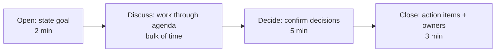
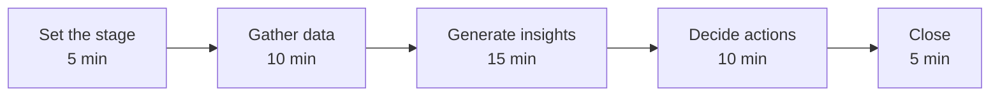

# Meetings

Meetings are the most expensive activity in engineering organisations. A one-hour meeting with six engineers costs six hours of engineering time plus the context-switch cost on either side. Use them wisely — they're a powerful tool when needed and a destructive waste when not.

## When NOT to Have a Meeting

Before scheduling a meeting, ask: "Could this be an async message, document, or decision?"

| Situation | Meeting needed? | Alternative |
|-----------|----------------|-------------|
| Sharing a status update | No | Written update in Slack/ticket |
| Announcing a decision already made | No | Email or wiki post |
| Gathering input from 2 people | Probably not | Async doc with comments |
| Brainstorming with 3+ people | Maybe | Try async first; meet if it stalls |
| Complex decision with multiple stakeholders | Yes | But only with preparation |
| Resolving an active disagreement | Yes | Async debates escalate and misread tone |
| Building relationships / onboarding | Yes | Some things need real-time connection |
| Incident response coordination | Yes | Speed matters; async is too slow |

### The "No Meeting" Test

If you can't fill in ALL of these, cancel the meeting:

1. **Goal** — what will be different after this meeting?
2. **Attendees** — who is essential (not just "nice to have")?
3. **Preparation** — what should people read/do beforehand?
4. **Output** — what artifact will result (decision, action items, document)?

## Running Effective Meetings

### Before the Meeting

| Action | Why |
|--------|-----|
| Write an agenda with time allocations | Prevents drift, sets expectations |
| Share pre-reading 24+ hours ahead | Informed participants make faster decisions |
| Identify the decision-maker | Avoids "who decides?" confusion in the room |
| Invite only essential people | Others can read the notes |
| Set the right duration (start short) | 25 or 50 minutes, not 30/60. Leaves buffer. |

### During the Meeting

| Principle | Implementation |
|-----------|---------------|
| Start on time | Don't wait for latecomers — they'll learn |
| State the goal upfront | "By the end of this meeting, we need to decide X" |
| Park tangents | "That's important but separate — let's note it and stay on topic" |
| Time-box discussions | "We have 10 minutes on this. If we can't resolve, we'll take it offline." |
| Capture decisions in real-time | Shared doc, everyone can see what's being recorded |
| End with actions | Every action has an owner and a deadline |
| End on time (or early) | Respect people's next commitment |

### After the Meeting

- Post written summary within 1 hour (decisions, actions, owners, deadlines)
- Share with attendees AND relevant people who weren't there
- Follow up on action items in the next meeting or async check-in

## Facilitation Techniques

Facilitation is the skill of running a meeting so everyone contributes and the group reaches a useful outcome. It's separate from participating — the facilitator manages process, not content.

### Making Space for Quiet Voices

| Technique | How it works |
|-----------|-------------|
| **Round-robin** | Go around the "table" — everyone speaks in turn | 
| **Silent writing** | Give 2 minutes to write thoughts before discussion | 
| **Direct invitation** | "Alex, you've worked on this before. What's your take?" |
| **Anonymous input** | Collect ideas via sticky notes or shared doc before revealing |
| **Breakout pairs** | Split into 2-person groups, then share back. Less intimidating. |

### Managing Dominant Speakers

- "Thank you, [Name]. Let's hear from others on this."
- "I want to make sure we get all perspectives. Who hasn't spoken yet?"
- "Let's use a round-robin for this question."
- Private conversation after: "Your input is valuable, but others are being squeezed out. Can you hold back and let others go first?"

### Managing Conflict in Meetings

| Escalation level | Response |
|-----------------|----------|
| Healthy debate (ideas clashing) | Let it run — this is productive |
| Getting personal or heated | "Let's focus on the trade-offs, not positions" |
| Circular (same arguments repeating) | "We seem stuck. Let's capture both options and take this offline with data." |
| Aggressive or disrespectful | "Let's take a break. [Name], can I chat with you privately?" |

## Decision-Making in Groups

Groups default to discussion without decision. Use explicit decision-making processes.

### Decision Methods

| Method | When to use | Example |
|--------|-------------|---------|
| **Consensus** | Small group, low stakes, time available | Team norms, retro actions |
| **Consent** | "Can everyone live with this?" (not "does everyone love it?") | Process changes, tool choices |
| **Advice process** | One person decides after consulting affected parties | Technical decisions, architecture |
| **Authority** | Decision-maker decides (with or without input) | Urgent decisions, tiebreakers |
| **Vote** | Equal stakeholders, clear options, democratic culture | Choosing between equivalent options |

### RACI for Meeting Decisions

Before a discussion that will end in a decision, clarify:

| Role | Question | In the meeting |
|------|----------|----------------|
| **Responsible** | Who does the work? | May or may not attend |
| **Accountable** | Who decides? | Must attend |
| **Consulted** | Whose input is needed? | Attend or provide input async |
| **Informed** | Who needs to know? | Read the notes after |

## Stand-ups

Daily stand-ups are the most common — and most commonly dysfunctional — engineering meeting.

### Stand-up Done Right

| Principle | Do | Don't |
|-----------|-----|-------|
| Short | 15 minutes max for 5-8 people | 45-minute status reports |
| Focused | "What's blocking progress?" | Detailed technical discussions |
| For the team | Coordinate and surface blockers | Report to a manager |
| Action-oriented | "I need help with X" | "Yesterday I did X, today I'll do Y" (rote) |

### Stand-up Alternatives

| Format | How it works | When it's better |
|--------|-------------|-----------------|
| **Async stand-up** | Bot collects updates in Slack | Distributed teams, timezone gaps |
| **Walking the board** | Walk through tickets on the board, discuss blockers per card | Focuses on work, not people |
| **Exception-based** | Only speak if blocked or need help | Experienced teams who don't need daily coordination |

## Retrospectives

Retros are how teams improve their process. Without them, the same problems repeat indefinitely.

### Retro Structure

### Common Retro Formats

| Format | Categories | Good for |
|--------|-----------|----------|
| **Start/Stop/Continue** | What to start, stop, and keep doing | Simple, quick |
| **Mad/Sad/Glad** | Emotional responses to the sprint | Surfacing feelings, not just facts |
| **4Ls** | Liked, Learned, Lacked, Longed for | Balanced positive and negative |
| **Sailboat** | Wind (helps), Anchor (slows), Rocks (risks), Island (goal) | Visual, metaphor-based |

### Retro Anti-Patterns

| Problem | Symptom | Fix |
|---------|---------|-----|
| Actions never happen | Same items every retro | Assign owners + deadlines. Review at next retro. |
| Same 2 people talk | Others disengage | Use silent writing + round-robin |
| Blame game | "You did X" | Facilitator enforces "process not people" |
| Too abstract | "Improve communication" | Force specifics: "How? When? Measured how?" |
| Skipping retros | "We don't have time" | This is a process smell. You especially need a retro. |

## Meeting Hygiene Checklist

Before every meeting you schedule:

- [ ] Is a meeting the best format for this? (or could it be async)
- [ ] Is the goal clear and specific?
- [ ] Are only essential people invited?
- [ ] Is pre-reading shared in advance?
- [ ] Is the agenda time-boxed?
- [ ] Is the decision-maker identified?
- [ ] Is someone assigned to capture notes and actions?

## Key Takeaways

- The best meeting is often no meeting — async first, synchronous when needed
- Every meeting needs a goal, an agenda, and a note-taker
- Facilitation is a distinct skill from participation — learn both
- Use explicit decision methods; groups default to discussion without resolution
- Stand-ups should surface blockers, not recite status
- Retros only work if actions have owners, deadlines, and follow-up
- End every meeting with: who does what by when
