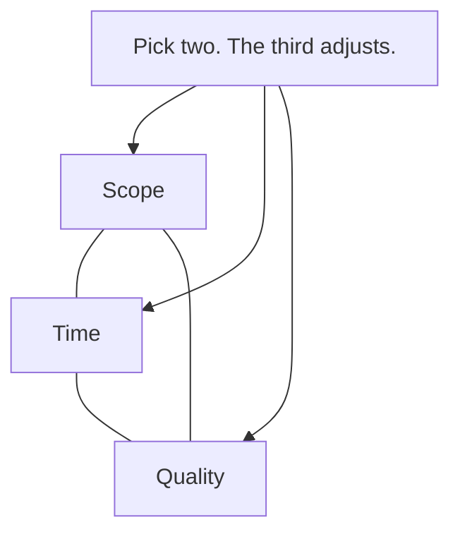
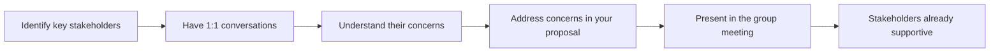

# Negotiation & Influence

Engineers negotiate constantly — deadlines, scope, technical decisions, resource allocation, team priorities, and their own compensation. The engineers who can influence outcomes without relying on authority are the ones who shape what gets built and how.

## Negotiating Deadlines and Scope

Every project exists in the tension between scope, time, and quality. When someone asks for more than is possible, negotiation determines which variable gives.

### The Iron Triangle

When asked for an unrealistic deadline, don't say "that's impossible." Instead, make the trade-off explicit:

| Request | Response |
|---------|----------|
| "We need this by Friday" | "I can deliver X by Friday. The full scope needs two more weeks. Which do you prefer?" |
| "Add this feature to the sprint" | "Sure — which of these current items should we drop or defer?" |
| "Can't you just work overtime?" | "I can crunch for a few days, but the quality will drop. Here's what that means for bugs next month." |
| "We need all of it, no compromises" | "Then we need more time or more people. Here's the realistic timeline with current capacity." |

### The BATNA Principle

BATNA = Best Alternative to a Negotiated Agreement. Know your fallback before entering any negotiation.

| Scenario | Your BATNA |
|----------|-----------|
| Deadline negotiation | "If we can't agree on scope reduction, I'll escalate the resource constraint to [director]" |
| Salary negotiation | Another offer, or willingness to stay at current role |
| Technology choice disagreement | A proof of concept that demonstrates your position |
| Cross-team dependency | Building a workaround if they can't deliver |

Having a BATNA gives you confidence and prevents desperate concessions.

## Influencing Without Authority

Most engineers don't have organisational power. Influence comes from credibility, relationships, and communication — not titles.

### Sources of Influence

| Source | How to build it | Example |
|--------|----------------|---------|
| **Expertise** | Be genuinely good at something; share knowledge | Become the go-to for database performance |
| **Track record** | Deliver consistently; follow through | People trust your estimates because you've been reliable |
| **Relationships** | Invest time in people before you need things from them | Regular 1:1 coffee chats with cross-team leads |
| **Communication** | Make complex things simple; write clearly | Your RFCs are the ones people actually read |
| **Generosity** | Help others without keeping score | Review PRs promptly, share context freely |
| **Courage** | Say the hard thing in the room | Name the elephant everyone is avoiding |

### Influence Tactics

| Tactic | When to use | How |
|--------|------------|-----|
| **Social proof** | Proposing a practice change | "Teams X and Y adopted this with good results..." |
| **Data** | Challenging a decision | "Here are the metrics showing the problem..." |
| **Pre-alignment** | Before a big meeting | Talk to key stakeholders individually first |
| **Pilot/prototype** | When words aren't convincing | "Let me show you a small proof of concept" |
| **Framing** | Presenting options | Frame your preferred option as the default or lowest-risk path |
| **Coalition** | Pushing an initiative | Get two or three respected people on board first |

### The Pre-Alignment Pattern

Never walk into a decision meeting cold. The meeting should confirm alignment, not create it.

## Stakeholder Management

Stakeholders are anyone who can influence or is affected by your work: product managers, designers, other teams, leadership, and sometimes customers.

### Stakeholder Mapping

| Stakeholder type | What they care about | How to engage |
|-----------------|---------------------|---------------|
| **High power, high interest** | Want details and input | Collaborate closely, regular updates |
| **High power, low interest** | Want outcomes, not details | Brief updates, flag only risks |
| **Low power, high interest** | Want to be informed | Regular comms, include in reviews |
| **Low power, low interest** | Minimal engagement | Inform only on major milestones |

### Managing Up

Your manager is a stakeholder too. Managing up means making their job easier:

| Do | Why |
|----|-----|
| Bring problems with proposed solutions | Shows initiative, reduces their cognitive load |
| Give early warning on risks | Surprises damage trust; early alerts build it |
| Summarise decisions and progress proactively | They shouldn't have to ask for status |
| Ask what their priorities are | Alignment prevents wasted work |
| Make their goals your context | Understand what pressure they're under |

## Saying No Constructively

"No" is a complete sentence — but at work, a constructive no preserves relationships while protecting your capacity.

### The Constructive No Framework

| Step | What you say |
|------|-------------|
| 1. Acknowledge | "I understand this is important to you / the business" |
| 2. Explain | "Here's what I'm committed to and why I can't add this" |
| 3. Offer alternatives | "Here's what I can do instead / who else might help / when I could pick this up" |
| 4. Be firm | Don't backtrack if they push. Repeat your constraints calmly. |

### Common "No" Scenarios for Engineers

| Request | Constructive no |
|---------|----------------|
| "Can you join this new committee?" | "I'm at capacity with [project]. I can contribute async or recommend someone who'd benefit from the exposure." |
| "Can you help with this unrelated bug?" | "I don't have context on that system. [Name] would be faster. Happy to pair with them if they get stuck." |
| "We need this yesterday" | "I can't do it well by then. I can deliver [subset] by that date, or the full thing by [realistic date]." |
| "Can you mentor three juniors?" | "I can mentor one effectively. For the others, let's find mentors who have capacity." |

## Building Allies

Influence is not a solo activity. Having allies — people who support your ideas and amplify your voice — makes everything easier.

### How to Build Alliances

| Strategy | Action |
|----------|--------|
| **Reciprocity** | Help people first. Support their proposals. They'll support yours. |
| **Shared interests** | Find people who benefit from the same changes you want |
| **Regular connection** | Coffee chats, Slack conversations, joint working sessions |
| **Public credit** | Name allies when their help contributed to a success |
| **Consistent values** | People align with those whose values they trust |

### The Alliance Mindset

- Think "we" not "I" — frame proposals as shared wins
- Understand others' goals — what do they need? How does your proposal help them?
- Share information generously — hoarding creates competition, sharing creates allies
- Support others publicly — especially in meetings where decisions are made
- Follow through on commitments — one broken promise undoes ten favours

## Negotiation Principles Summary

| Principle | Application |
|-----------|------------|
| **Separate people from problems** | Attack the issue, not the person |
| **Focus on interests, not positions** | "What do you actually need?" vs "what are you asking for?" |
| **Generate options before deciding** | Brainstorm multiple solutions before evaluating |
| **Use objective criteria** | Data, benchmarks, industry standards — not opinions |
| **Know your BATNA** | Never negotiate without a fallback |
| **Make the first offer** | Anchoring effect works in your favour |
| **Silence is a tool** | After making a point, stop talking. Let them respond. |

## Key Takeaways

- Make trade-offs explicit — scope, time, and quality can't all be fixed
- Influence comes from credibility, relationships, and communication — not titles
- Pre-align stakeholders before decision meetings; meetings should confirm, not create consensus
- Say no constructively: acknowledge, explain, offer alternatives
- Build allies by helping others first and framing proposals as shared wins
- Know your BATNA before any negotiation — it prevents desperate concessions
- Silence after your point is a power move. Use it.
