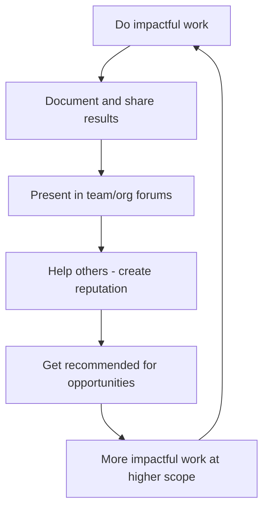
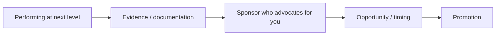

# Career Growth

Your career doesn't happen to you — you shape it through deliberate choices about what to work on, who to work with, and how visible your contributions are. Technical skills get you in the door; career management determines which doors open next.

## Self-Advocacy

If you don't advocate for yourself, no one else will — at least not consistently. Self-advocacy is not arrogance; it's ensuring your work and aspirations are known by the people who can influence your path.

### Why Engineers Under-Advocate

| Belief | Reality |
|--------|---------|
| "Good work speaks for itself" | Good work that nobody sees gets no recognition |
| "Self-promotion is distasteful" | Sharing impact is informing, not bragging |
| "My manager knows what I do" | They manage 5-10 people and have their own priorities |
| "I'll be promoted when I'm ready" | Promotions go to people who demonstrate readiness AND are visible |

### Self-Advocacy in Practice

| Context | What to do |
|---------|-----------|
| **1:1s with manager** | Share wins, articulate impact, state goals explicitly |
| **Performance reviews** | Document impact with specifics: "Reduced deploy time by 40%, saving 3 hours/week per engineer" |
| **Team meetings** | Briefly mention your work's outcomes (not just activities) |
| **Cross-team projects** | Send a summary to stakeholders when complete |
| **Stretch assignments** | Volunteer for visible, high-impact work |

### The Impact Statement Formula

Instead of describing activities, describe impact:

| Activity (weak) | Impact (strong) |
|----------------|-----------------|
| "I refactored the auth module" | "I refactored the auth module, reducing login failures by 60% and eliminating the #1 support ticket category" |
| "I mentored two juniors" | "I mentored two juniors, both of whom are now independently owning features and reducing review cycles" |
| "I set up monitoring" | "I set up monitoring that caught 3 incidents before they impacted users, saving an estimated 2 hours of downtime" |

## Visibility

Visibility is doing good work AND ensuring the right people know about it. It's not optional — it's how opportunities and promotions happen.

### Building Visibility

| Strategy | Examples |
|----------|---------|
| **Write things down** | RFCs, post-mortems, blog posts, ADRs |
| **Present** | Lunch-and-learn, team demo, tech talk at all-hands |
| **Teach** | Internal workshops, onboarding improvements, documentation |
| **Solve visible problems** | Volunteer for cross-team issues, incident response |
| **Share broadly** | Post results in wider channels, not just your team's |

### The "Brag Document"

Maintain a running document of your accomplishments:

- Update weekly (5 minutes)
- Include: what you did, what impact it had, who was involved
- Use it for performance reviews, promotion packets, and interview prep
- Format: date, project, action, outcome, evidence (links, metrics)

Nobody remembers what they did 6 months ago. Your brag doc does.

## Building a Personal Brand

Your personal brand is what people say about you when you're not in the room. In engineering, it's built through consistent expertise and generosity.

### Brand Components

| Component | Question | How to develop |
|-----------|----------|---------------|
| **Expertise** | "What is [Name] known for?" | Go deep in 1-2 areas. Share knowledge publicly. |
| **Reliability** | "Can I count on [Name]?" | Deliver on commitments. Communicate early on risks. |
| **Helpfulness** | "Does [Name] make others better?" | Mentor, review generously, answer questions |
| **Communication** | "Can [Name] explain complex things clearly?" | Write, present, document |
| **Judgement** | "Can I trust [Name]'s opinion?" | Make well-reasoned recommendations. Admit uncertainty. |

### Where Your Brand Lives

- Your code reviews (tone, thoroughness, helpfulness)
- Your Slack presence (helpful? clear? approachable?)
- Your documentation (does it exist? is it good?)
- Your incident response (calm? effective? communicative?)
- Your presentations (clear? valuable? memorable?)
- Your reputation with other teams (reliable? collaborative?)

## Navigating Promotions

Promotions are not rewards for past work — they are recognition that you're already operating at the next level. Understanding this changes how you pursue them.

### The Promotion Equation

All four elements must be present.

### Promotion Strategies

| Strategy | How |
|----------|-----|
| **Understand the rubric** | Read your company's levelling framework. Know exactly what's expected. |
| **Identify gaps** | Compare your current work to next-level expectations. Focus on gaps. |
| **Get explicit feedback** | Ask your manager: "What would I need to demonstrate for promotion?" |
| **Find a sponsor** | A sponsor is a senior leader who advocates for you in rooms you're not in |
| **Document everything** | Promotion packets need evidence — start collecting now |
| **Seek scope** | Promotions come from demonstrating impact at a larger scope |

### Sponsor vs Mentor

| Mentor | Sponsor |
|--------|---------|
| Gives you advice | Gives you opportunities |
| Talks to you | Talks about you (to others) |
| Shares their experience | Shares their political capital |
| You choose them | They choose you (earned through trust) |

You need both. Mentors are accessible; sponsors are earned through demonstrated competence and reliability.

## Interviewing (Both Sides)

### As a Candidate

| Phase | Key skill |
|-------|----------|
| **Before** | Research the company/team. Prepare stories using STAR (Situation, Task, Action, Result). |
| **Behavioural** | Be specific. "I" not "we." State the impact. |
| **Technical** | Think aloud. Ask clarifying questions. It's about process, not just answer. |
| **System design** | Drive the conversation. State assumptions. Discuss trade-offs. |
| **Questions for them** | Ask about team dynamics, challenges, decision-making. Avoid questions with obvious Google answers. |

### As an Interviewer

| Principle | Why |
|-----------|-----|
| Be prepared (read CV, plan questions) | Respect their time; ask relevant things |
| Create psychological safety | Nervous candidates perform below their ability |
| Assess signal, not performance | Introverts and non-native speakers may interview differently than they work |
| Use structured evaluation | Same rubric for every candidate prevents bias |
| Give them time to think | Silence ≠ incompetence |
| Sell the role too | Great candidates have options; they're evaluating you |

## Networking

Networking is not collecting LinkedIn connections. It's building genuine relationships with people in your field — relationships that create opportunities, knowledge, and support over years.

### Genuine Networking for Engineers

| Method | How it works |
|--------|-------------|
| **Help first** | Answer questions, share resources, make introductions |
| **Internal communities** | Join guilds, working groups, cross-team initiatives |
| **External communities** | Meetups, conferences, open source, Slack communities |
| **Writing** | Blog posts and articles attract people with similar interests |
| **1:1 conversations** | Coffee chats with people you respect (internal or external) |

### Networking Anti-Patterns

| Anti-pattern | Better approach |
|-------------|-----------------|
| Only reaching out when you need something | Maintain connections when you don't need anything |
| Collecting contacts without depth | Fewer, deeper relationships > many shallow ones |
| Only networking within your company | External network provides perspective and opportunities |
| Only networking with senior people | Peers today are leaders tomorrow |
| Transactional mindset | Generosity mindset — help without expectation |

## Career Path: IC vs Management

| Factor | Individual Contributor | Management |
|--------|----------------------|------------|
| **Impact through** | Technical excellence, architecture, mentoring | People development, strategy, process |
| **Daily work** | Design, code, review, investigate | 1:1s, planning, hiring, shielding team |
| **Success metric** | Technical outcomes, system quality | Team health, delivery, retention |
| **Energy from** | Solving hard problems | Helping people grow |
| **Risk** | Narrowing expertise, isolation | Losing technical skills, meeting overload |

Neither path is "better." Choose based on what energises you, not what seems more prestigious.

## Key Takeaways

- Self-advocacy is informing, not bragging — make your impact visible to those who matter
- Maintain a brag document; update it weekly. You'll thank yourself at review time.
- Promotions require four things: next-level performance, evidence, a sponsor, and timing
- Sponsors are earned through demonstrated competence — they advocate for you in rooms you're not in
- Build genuine relationships before you need anything — networking is long-term investment
- Choose IC vs management based on what energises you, not status
