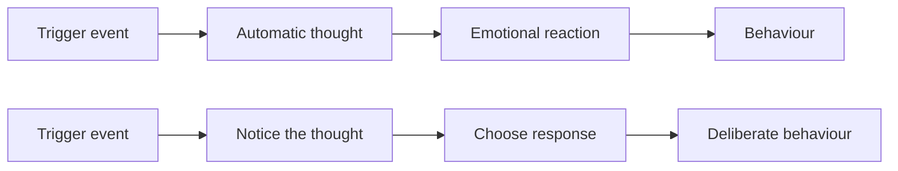
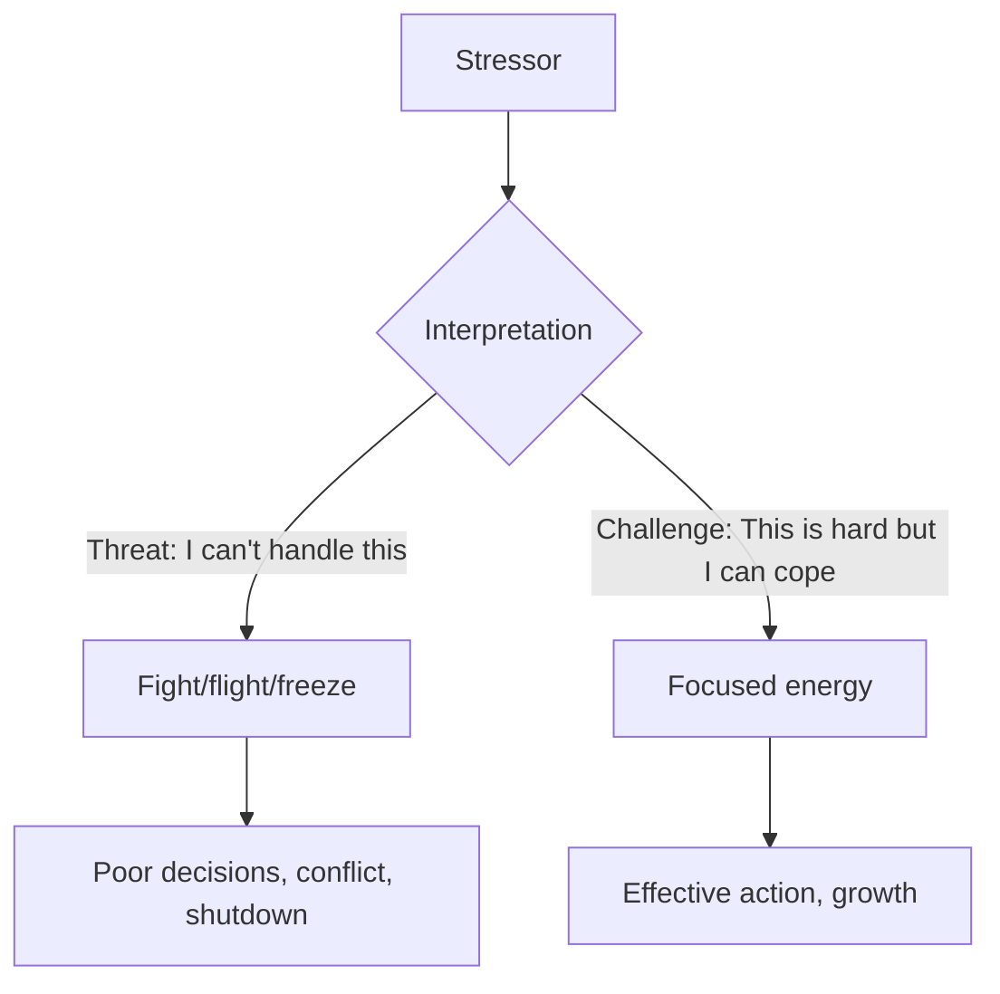
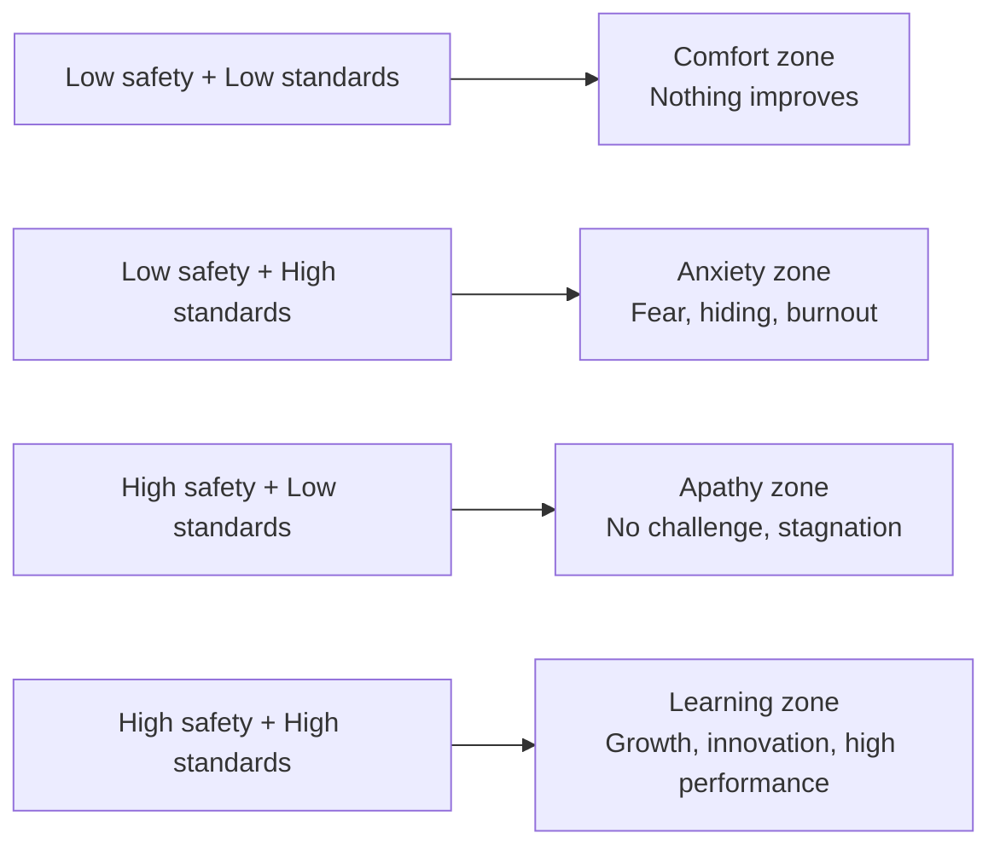

# Emotional Intelligence

Emotional intelligence (EQ) is the ability to recognise, understand, and manage your own emotions — and to recognise, understand, and influence the emotions of others. In engineering, where logic is prized and feelings are often dismissed, EQ is a quietly decisive advantage.

Engineers with high EQ navigate conflicts better, build stronger teams, handle pressure without cracking, and create environments where others do their best work.

## Self-Awareness

Self-awareness is the foundation of all emotional intelligence. You cannot manage what you don't notice.

### What Self-Awareness Looks Like

| Low self-awareness | High self-awareness |
|-------------------|-------------------|
| Snaps at people without realising it | Notices frustration rising and takes a breath |
| Dominates discussions unintentionally | Recognises when they're talking too much |
| Doesn't understand why people react negatively | Sees how their behaviour impacts others |
| Attributes problems entirely to external factors | Recognises their own contribution to problems |
| Surprised by feedback | Feedback confirms what they already suspected |

### Building Self-Awareness

| Practice | How |
|----------|-----|
| **Name your emotions** | "I'm frustrated" is more useful than acting frustrated without knowing why |
| **Notice triggers** | What situations consistently provoke strong reactions? |
| **Seek feedback** | Ask trusted colleagues: "How did I come across in that meeting?" |
| **Reflect after interactions** | "What went well? What would I do differently?" |
| **Notice body signals** | Tight chest, clenched jaw, shallow breathing — these are data |

### The Trigger Pattern

The gap between stimulus and response is where self-awareness lives. Widening that gap is the practice.

### Common Engineer Triggers

| Trigger | Typical automatic thought | More useful reframe |
|---------|--------------------------|-------------------|
| Someone criticises your code | "They think I'm incompetent" | "They're trying to improve the code" |
| A meeting interrupts your flow | "This is a waste of time" | "What's the minimum I need to contribute here?" |
| Your proposal is rejected | "Nobody listens to me" | "What data would make this more convincing?" |
| A junior asks a basic question | "I already explained this" | "They're still learning. How can I explain better?" |
| Tight deadline with unclear requirements | "This is impossible" | "What's the smallest useful thing I can deliver?" |

## Empathy

Empathy is understanding what someone else is feeling and why — even when you don't share those feelings. It's not about being soft; it's about being accurate.

### Three Types of Empathy

| Type | Definition | Engineering application |
|------|-----------|----------------------|
| **Cognitive** | Understanding someone's perspective intellectually | Understanding why product wants that feature |
| **Emotional** | Feeling what someone else feels | Sensing a teammate's frustration during a difficult sprint |
| **Compassionate** | Understanding + feeling + being moved to help | Offering to take a task from someone who's overwhelmed |

### Empathy in Engineering Contexts

| Situation | Empathic response |
|-----------|------------------|
| Junior engineer makes a mistake in prod | "I remember my first production incident. Let's fix it together and do a blameless retro." |
| Teammate is quiet in meetings | Instead of ignoring: "I noticed you've been quiet. Everything OK? No pressure — just checking in." |
| Product manager pushes unrealistic deadline | Instead of dismissing: "I can see you're under pressure. Let's find a scope that works for both of us." |
| Someone's pull request is messy | Before assuming laziness: consider they might be overwhelmed, understaffed, or unclear on expectations |

### Empathy is Not

- Agreement (you can understand without agreeing)
- Permissiveness (empathy + accountability coexist)
- Weakness (it's actually harder than being dismissive)
- Losing yourself (maintain your own boundaries)

## Managing Stress

Engineering has structural stressors: incidents, deadlines, complexity, on-call, rapid change, and the constant pressure to learn. Managing stress is a professional skill, not a personal failing.

### Stress Response Patterns

The same stressor can produce either response. The difference is your interpretation and preparation.

### Practical Stress Management

| Strategy | When to use | How |
|----------|------------|-----|
| **Physiological reset** | Acute stress (incident, confrontation) | Box breathing: 4 in, 4 hold, 4 out, 4 hold |
| **Time perspective** | Catastrophising | "Will this matter in a week? A month? A year?" |
| **Action list** | Overwhelm | Write every task down. Pick one. Start. |
| **Boundaries** | Chronic overload | Define work hours. Log off. Disable notifications. |
| **Social support** | Isolation, burnout | Talk to someone. "I'm struggling" is strength, not weakness. |
| **Physical basics** | Always | Sleep, exercise, nutrition. Non-negotiable foundation. |

### On-Call Stress

| Stressor | Mitigation |
|----------|-----------|
| Fear of being paged | Clear runbooks reduce uncertainty |
| Interrupted sleep | Rotate fairly. Compensate with time off. |
| Pressure to resolve quickly | Escalation paths exist for a reason — use them |
| Isolation during incidents | Incident process with clear roles. You're not alone. |

## Dealing with Difficult People

"Difficult people" are usually people with unmet needs, different communication styles, or unresolved frustrations — not villains. Understanding this makes interactions more productive.

### Common Difficult Behaviours and Responses

| Behaviour | What might be underneath | Effective response |
|-----------|------------------------|-------------------|
| **Always negative** | Unheard concerns, burnout, lack of agency | "What would need to change for you to feel better about this?" |
| **Dominating** | Insecurity, need for control, enthusiasm | Set structure (round-robin). Acknowledge then redirect. |
| **Passive-aggressive** | Conflict avoidance, unresolved frustration | Name it directly: "I sense tension. Can we talk about it?" |
| **Dismissive** | Overwhelmed, status-guarding, different priorities | Find their interest: "How does this affect your team?" |
| **Credit-taking** | Insecurity, political behaviour | Document your contributions. Share credit proactively. |

### Principles for Difficult Interactions

- **Assume good intent first** — until proven otherwise
- **Address behaviour, not character** — "That comment felt dismissive" not "You're dismissive"
- **Set boundaries** — you don't have to tolerate bad behaviour to be professional
- **Choose your battles** — not every slight needs a response
- **Escalate when needed** — if behaviour is consistently harmful, involve your manager or HR

## Imposter Syndrome

Imposter syndrome is the feeling that you're faking it and will be "found out" — despite objective evidence of competence. It's extremely common in engineering, where the knowledge space is infinite and comparison is easy.

### Recognising Imposter Syndrome

| Thought | Reframe |
|---------|---------|
| "I only got this job because they were desperate" | "They had many candidates. They chose me for reasons." |
| "Everyone else seems to know what they're doing" | "They feel this way too. You're seeing their confidence, not their doubts." |
| "I'll be exposed when they see my code" | "Every engineer writes imperfect code. That's why we review." |
| "I should know this by now" | "The field is enormous. Not knowing something is normal, not a character flaw." |
| "I don't deserve to be at this level" | "I was promoted based on demonstrated work. The evidence exists." |

### Managing Imposter Syndrome

- **Keep evidence** — your brag document counters "I haven't accomplished anything"
- **Normalise not knowing** — senior engineers say "I don't know" constantly
- **Compare fairly** — don't compare your insides to someone else's outsides
- **Remember: discomfort ≠ incompetence** — feeling stretched means you're growing
- **Talk about it** — imposter syndrome thrives in silence. Most people relate.

## Psychological Safety

Psychological safety is the belief that you won't be punished or humiliated for speaking up with ideas, questions, concerns, or mistakes. It's the #1 predictor of high-performing teams (Google's Project Aristotle).

### What Psychological Safety Looks Like

| Safe environment | Unsafe environment |
|-----------------|-------------------|
| People ask "stupid" questions freely | People stay silent rather than risk looking dumb |
| Mistakes are discussed openly for learning | Mistakes are hidden or blamed on individuals |
| Disagreement is expressed directly | People agree in meetings, disagree in private |
| "I don't know" is normal | Everyone pretends to understand |
| Risk-taking is encouraged | Only safe, proven approaches are acceptable |

### Building Psychological Safety (as anyone, not just a manager)

| Action | Impact |
|--------|--------|
| Admit your own mistakes openly | Models vulnerability, gives permission to others |
| Ask questions in meetings | Shows that not knowing is acceptable |
| Respond to mistakes with curiosity, not blame | "What can we learn?" not "Whose fault is this?" |
| Thank people for raising concerns | Reinforces that speaking up is valued |
| Share unfinished thinking | "This isn't fully formed, but..." lowers the bar for participation |
| Call out blame when you see it | "Let's focus on the system, not the person" |

### The Relationship Between Safety and Performance

The goal is high safety AND high standards — not safety at the expense of quality.

## Key Takeaways

- Self-awareness is the foundation — you can't manage emotions you don't notice
- Empathy is not softness; it's accuracy about what others are experiencing
- Stress management is a professional skill — build systems for it before you need them
- "Difficult people" usually have unmet needs — understanding them changes the interaction
- Imposter syndrome is normal in engineering — keep evidence, talk about it, normalise not knowing
- Psychological safety is the #1 predictor of team performance — you can build it from any position
- The goal: high safety AND high standards. Not one at the expense of the other.
