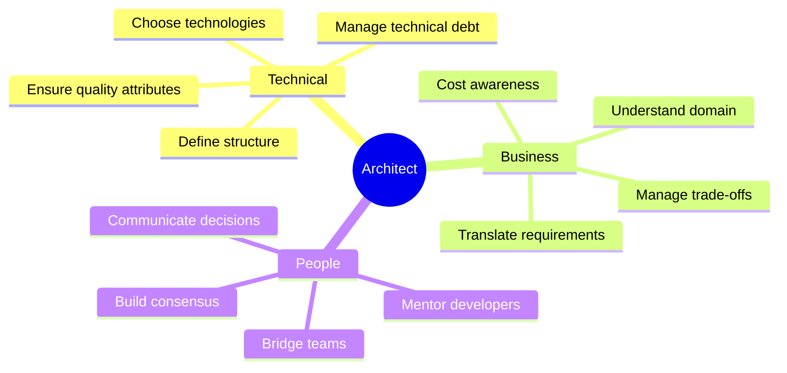
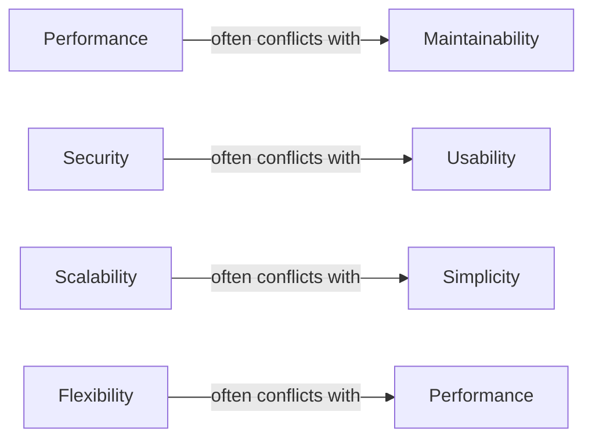
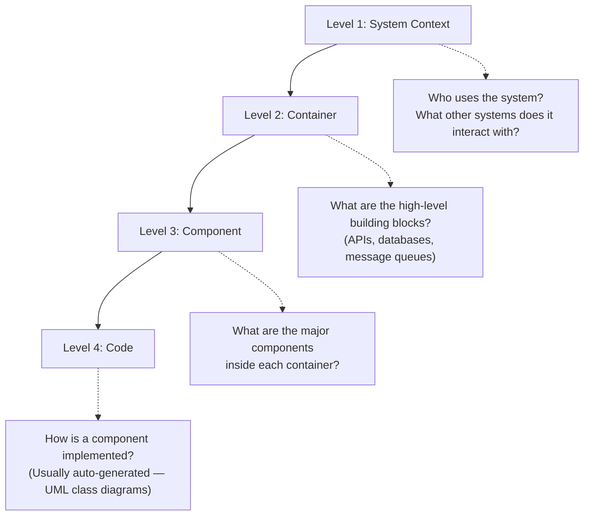
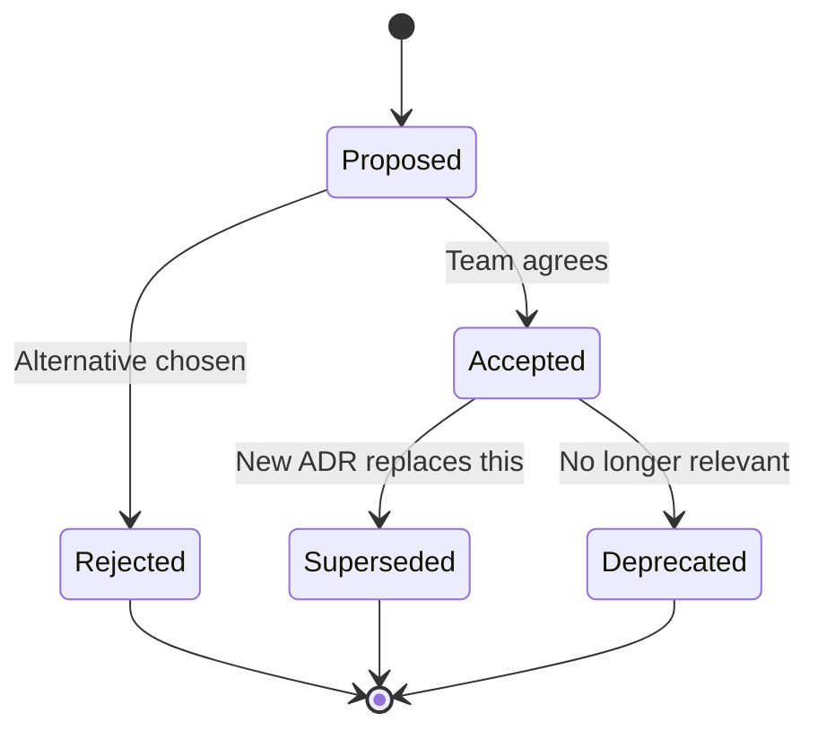

# Architecture Fundamentals

Software architecture is the set of significant decisions about the organization of a software system — the selection of structural elements and their interfaces, their behavior as specified in collaborations, and the composition of these elements into progressively larger subsystems.

## What Is Software Architecture?

Architecture is not about the code. It's about the **decisions that are costly to change**. These decisions shape the system's ability to meet both functional requirements and quality attributes.

> "Architecture is about the important stuff. Whatever that is." — Ralph Johnson

| Aspect | Description | Example |
|--------|-------------|---------|
| Structure | How components are organized | Microservices vs monolith |
| Communication | How components interact | Synchronous REST vs async messaging |
| Characteristics | Quality attributes the system exhibits | Scalability, fault tolerance |
| Decisions | Choices that constrain the design | "We use event sourcing for audit" |
| Principles | Guidelines that inform decisions | "Prefer async over sync between services" |

## The Architect's Role

The software architect operates at the intersection of technology, business, and people.



### Key Responsibilities

| Responsibility | Description |
|----------------|-------------|
| Make architecture decisions | Define rules and guidelines for development teams |
| Continually analyze the architecture | Assess viability, identify risks, recommend improvements |
| Keep current with trends | Understand emerging patterns without chasing hype |
| Ensure compliance | Verify teams follow architectural decisions |
| Build diverse experience | Breadth of knowledge across technologies and domains |
| Have business domain knowledge | Understand the problem space, not just the solution space |
| Navigate politics | Negotiate, influence, and build consensus across teams |
| Mentor and coach | Raise the technical level of the entire team |

### Architect vs Senior Developer

```
Senior Developer          Architect
─────────────────         ──────────────────
Depth of knowledge        Breadth of knowledge
Code-level decisions      System-level decisions
"How to build it"         "What to build and why"
Sprint timescale          Quarterly/yearly timescale
One team                  Multiple teams
Technical excellence      Technical + business alignment
```

## Quality Attributes

Quality attributes (also called "-ilities") define **how** a system does what it does, not **what** it does. They are the primary concern of the architect.

### Core Quality Attributes

| Attribute | Definition | Measured By |
|-----------|------------|-------------|
| **Scalability** | Ability to handle increased load | Requests/sec, concurrent users, data volume |
| **Maintainability** | Ease of modification and extension | Time to implement changes, defect rate |
| **Testability** | Ease of verifying correctness | Test coverage achievable, test execution time |
| **Deployability** | Ease of releasing to production | Deployment frequency, lead time, rollback time |
| **Reliability** | Ability to function under stated conditions | MTBF, error rates, SLA compliance |
| **Performance** | Responsiveness and throughput | Latency (p50, p95, p99), throughput |
| **Security** | Protection against threats | Vulnerability count, time to patch |
| **Observability** | Ability to understand internal state | Time to detect, time to diagnose |

### Quality Attribute Scenarios

Each quality attribute should be specified as a measurable scenario:

```
Source:      1000 concurrent users
Stimulus:    Submit search queries
Artifact:    Search service
Environment: Normal production load
Response:    Return results
Measure:     95th percentile latency < 200ms
```

### Trade-offs Are Inevitable

No system can optimize all quality attributes simultaneously. Architecture is the art of making informed trade-offs:



**Example trade-off matrix:**

| Decision | Favors | Sacrifices |
|----------|--------|------------|
| Microservices | Scalability, Deployability | Simplicity, Performance (network hops) |
| Caching layer | Performance | Consistency, Complexity |
| Event sourcing | Auditability, Flexibility | Simplicity, Query performance |
| Synchronous calls | Simplicity, Consistency | Scalability, Fault tolerance |

## Architecture vs Design

Architecture and design exist on a spectrum, not as separate activities:

| Aspect | Architecture | Design |
|--------|-------------|--------|
| Scope | System-wide, cross-cutting | Component or module level |
| Impact of change | High cost, ripple effects | Low cost, localized |
| Decisions | Strategic (hard to reverse) | Tactical (easy to reverse) |
| Stakeholders | Business + technical | Primarily technical |
| Timescale | Months to years | Days to weeks |
| Examples | Service boundaries, data stores, protocols | Class hierarchies, algorithms, data structures |

### The Spectrum

```
← Strategic (Architecture)                    Tactical (Design) →

Service topology  |  API contracts  |  Module structure  |  Class design  |  Variable names
Database choice   |  Auth model     |  Package layout    |  Algorithms    |  Code formatting
```

**Rule of thumb:** If reversing the decision requires significant rework across multiple teams or services, it's an architectural decision.

## Documentation: The C4 Model

The C4 model provides four levels of abstraction for documenting software architecture:



### Level 1 — System Context

Shows your system as a box in the center, surrounded by its users and other systems it interacts with.

**Audience:** Everyone — technical and non-technical stakeholders.

### Level 2 — Container

Zooms into your system to show the high-level technical building blocks (web apps, APIs, databases, message brokers, file systems).

**Audience:** Technical people — developers, architects, DevOps.

### Level 3 — Component

Zooms into a single container to show the major structural building blocks and their interactions.

**Audience:** Developers working on that container.

### Level 4 — Code

Zooms into a component to show how it's implemented (classes, interfaces). Usually auto-generated from code — rarely drawn manually.

**Audience:** Developers implementing the component.

## Architecture Decision Records (ADRs)

ADRs capture the **why** behind architectural decisions. They are lightweight documents that prevent knowledge loss and support future decision-making.

### ADR Structure

```markdown
# ADR-001: Use PostgreSQL for the booking database

## Status
Accepted

## Context
We need a database for the booking service that supports complex queries,
ACID transactions, and handles ~10,000 writes/minute at peak.

## Decision
We will use PostgreSQL 15 with read replicas for query scaling.

## Consequences
### Positive
- Mature ecosystem, excellent tooling
- Strong consistency guarantees
- Team has existing expertise

### Negative
- Horizontal write scaling limited (would need sharding later)
- Operational overhead vs managed NoSQL

### Risks
- If write volume exceeds 50,000/min, we'll need to revisit
```

### When to Write an ADR

| Write an ADR | Don't need an ADR |
|--------------|-------------------|
| Choosing a database technology | Choosing a variable name |
| Selecting sync vs async communication | Refactoring a function |
| Introducing a new language/framework | Adding a utility library |
| Defining service boundaries | Internal class structure |
| Choosing authentication strategy | Choosing a specific HTTP client |

### ADR Lifecycle



## Architectural Thinking

### First Law of Software Architecture

> "Everything in software architecture is a trade-off."

If you think you've found something that isn't a trade-off, you haven't identified the trade-off yet.

### Second Law of Software Architecture

> "Why is more important than how."

Understanding **why** a decision was made is more valuable than knowing **what** was decided. Context changes; the reasoning helps future architects evaluate whether the decision still holds.

### Thinking Techniques

1. **Consider the "-ilities"** — For every decision, explicitly list which quality attributes you're optimizing for and which you're sacrificing.

2. **Identify assumptions** — Write down what you're assuming. "We assume traffic will grow 10x in 2 years." If the assumption is wrong, the decision may need revisiting.

3. **Think in reversibility** — Prefer decisions that are easy to reverse. If you must make an irreversible decision, invest more time in analysis.

4. **Avoid premature optimization** — Don't solve problems you don't have yet. Design for today's known requirements with extension points for tomorrow's possibilities.

## Key Takeaways

- Architecture is about the **significant decisions** that are costly to change — structure, communication patterns, quality attributes, and principles
- The architect's role spans **technology, business, and people** — it's not just a senior developer with a different title
- Quality attributes are the **primary concern** of architecture — they define how a system behaves, not what it does
- **Trade-offs are inevitable** — every architectural choice optimizes some attributes at the expense of others
- The **C4 model** provides four levels of abstraction for communicating architecture to different audiences
- **ADRs** capture the why behind decisions, preventing knowledge loss and supporting future reasoning
- Architecture and design exist on a **spectrum** — the key distinction is the cost and blast radius of change
