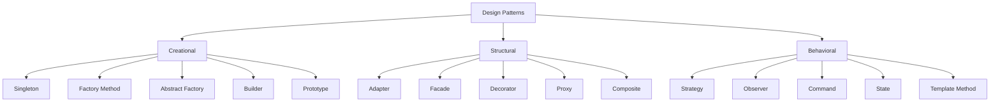

# Design Patterns

Design patterns are reusable solutions to common problems in software design. They are not ready-made code — they are templates for solving problems that occur repeatedly in different contexts. Understanding when (and when not) to apply them is a core architectural skill.

## Pattern Categories



| Category | Purpose | Key Question |
|----------|---------|--------------|
| **Creational** | Object creation mechanisms | *How should objects be created?* |
| **Structural** | Object composition and relationships | *How should objects be composed?* |
| **Behavioral** | Object communication and responsibility | *How should objects communicate?* |

## Creational Patterns

### Singleton

Ensures a class has only one instance and provides a global access point.

```python
class DatabaseConnection:
    _instance = None
    
    def __new__(cls):
        if cls._instance is None:
            cls._instance = super().__new__(cls)
            cls._instance._connection = cls._create_connection()
        return cls._instance
    
    @staticmethod
    def _create_connection():
        return connect(host="db.example.com", port=5432)
```

| When to Use | When to Avoid |
|-------------|---------------|
| Shared resource (DB connection pool) | When testability matters (hard to mock) |
| Configuration objects | When multiple instances might be needed later |
| Logging infrastructure | In multithreaded contexts without careful locking |

**Modern alternative:** Dependency injection with a container managing lifecycle (singleton scope).

### Factory Method

Defines an interface for creating objects, letting subclasses decide which class to instantiate.

```python
from abc import ABC, abstractmethod

class NotificationFactory(ABC):
    @abstractmethod
    def create_notification(self, recipient: str, message: str) -> Notification:
        pass

class EmailNotificationFactory(NotificationFactory):
    def create_notification(self, recipient: str, message: str) -> Notification:
        return EmailNotification(recipient, message)

class SMSNotificationFactory(NotificationFactory):
    def create_notification(self, recipient: str, message: str) -> Notification:
        return SMSNotification(recipient, message)

# Usage — client code doesn't know the concrete type
def send_alert(factory: NotificationFactory, recipient: str, message: str):
    notification = factory.create_notification(recipient, message)
    notification.send()
```

| When to Use | When to Avoid |
|-------------|---------------|
| Object type determined at runtime | Only one type will ever exist |
| Adding new types should not change client code | Simple construction with no variation |
| Framework code that creates user-defined types | Over-engineering simple scenarios |

### Builder

Separates construction of complex objects from their representation, allowing the same construction process to create different representations.

```python
class QueryBuilder:
    def __init__(self):
        self._table = None
        self._conditions = []
        self._order_by = None
        self._limit = None
    
    def from_table(self, table: str) -> "QueryBuilder":
        self._table = table
        return self
    
    def where(self, condition: str) -> "QueryBuilder":
        self._conditions.append(condition)
        return self
    
    def order_by(self, field: str, direction: str = "ASC") -> "QueryBuilder":
        self._order_by = f"{field} {direction}"
        return self
    
    def limit(self, n: int) -> "QueryBuilder":
        self._limit = n
        return self
    
    def build(self) -> str:
        query = f"SELECT * FROM {self._table}"
        if self._conditions:
            query += " WHERE " + " AND ".join(self._conditions)
        if self._order_by:
            query += f" ORDER BY {self._order_by}"
        if self._limit:
            query += f" LIMIT {self._limit}"
        return query

# Usage — readable, flexible construction
query = (
    QueryBuilder()
    .from_table("bookings")
    .where("status = 'active'")
    .where("created_at > '2024-01-01'")
    .order_by("created_at", "DESC")
    .limit(50)
    .build()
)
```

| When to Use | When to Avoid |
|-------------|---------------|
| Objects with many optional parameters | Simple objects (< 4 parameters) |
| Immutable objects with complex construction | Objects that are always built the same way |
| Readable DSL-like construction | When a constructor suffices |

## Structural Patterns

### Adapter

Converts the interface of a class into another interface that clients expect. Allows incompatible interfaces to work together.

```python
# Third-party payment gateway with its own interface
class StripeGateway:
    def create_charge(self, amount_cents: int, currency: str, token: str) -> dict:
        return {"id": "ch_123", "status": "succeeded"}

# Our domain interface
class PaymentProcessor(ABC):
    @abstractmethod
    def process_payment(self, amount: float, currency: str, payment_method: str) -> PaymentResult:
        pass

# Adapter bridges the gap
class StripeAdapter(PaymentProcessor):
    def __init__(self, gateway: StripeGateway):
        self._gateway = gateway
    
    def process_payment(self, amount: float, currency: str, payment_method: str) -> PaymentResult:
        amount_cents = int(amount * 100)
        result = self._gateway.create_charge(amount_cents, currency, payment_method)
        return PaymentResult(
            transaction_id=result["id"],
            success=result["status"] == "succeeded"
        )
```

| When to Use | When to Avoid |
|-------------|---------------|
| Integrating third-party libraries | When you control both interfaces |
| Legacy system integration | When a simple rename suffices |
| Isolating external dependencies | Over-abstracting stable interfaces |

### Facade

Provides a simplified interface to a complex subsystem.

```python
class OrderFacade:
    """Simplifies the complex order placement process."""
    
    def __init__(self, inventory: InventoryService, payment: PaymentService,
                 shipping: ShippingService, notification: NotificationService):
        self._inventory = inventory
        self._payment = payment
        self._shipping = shipping
        self._notification = notification
    
    def place_order(self, order: Order) -> OrderResult:
        # Complex orchestration hidden behind simple interface
        self._inventory.reserve(order.items)
        payment_result = self._payment.charge(order.total, order.payment_method)
        shipment = self._shipping.create_shipment(order.address, order.items)
        self._notification.send_confirmation(order.customer, shipment.tracking_id)
        return OrderResult(success=True, tracking_id=shipment.tracking_id)
```

| When to Use | When to Avoid |
|-------------|---------------|
| Simplifying complex subsystems | When clients need fine-grained control |
| Providing entry points for layers | Creating a "god class" that does too much |
| Decoupling clients from subsystem internals | Hiding important complexity that clients should understand |

### Decorator

Attaches additional responsibilities to an object dynamically, providing a flexible alternative to subclassing.

```python
class LoggingHttpClient(HttpClient):
    """Adds logging to any HTTP client without modifying it."""
    
    def __init__(self, client: HttpClient, logger: Logger):
        self._client = client
        self._logger = logger
    
    def get(self, url: str) -> Response:
        self._logger.info(f"GET {url}")
        start = time.time()
        response = self._client.get(url)
        duration = time.time() - start
        self._logger.info(f"Response {response.status} in {duration:.2f}s")
        return response

class RetryHttpClient(HttpClient):
    """Adds retry logic to any HTTP client."""
    
    def __init__(self, client: HttpClient, max_retries: int = 3):
        self._client = client
        self._max_retries = max_retries
    
    def get(self, url: str) -> Response:
        for attempt in range(self._max_retries + 1):
            try:
                return self._client.get(url)
            except TransientError:
                if attempt == self._max_retries:
                    raise

# Compose behaviors — order matters
client = LoggingHttpClient(
    RetryHttpClient(
        BasicHttpClient()
    ),
    logger
)
```

| When to Use | When to Avoid |
|-------------|---------------|
| Adding cross-cutting concerns (logging, caching, auth) | When subclassing is simpler and sufficient |
| Composable, mix-and-match behaviors | Too many layers make debugging hard |
| Open/closed principle — extend without modifying | When the interface is unstable |

### Proxy

Provides a surrogate or placeholder for another object to control access to it.

```python
class CachedUserRepository(UserRepository):
    """Caching proxy — avoids repeated database calls."""
    
    def __init__(self, repository: UserRepository, cache: Cache):
        self._repository = repository
        self._cache = cache
    
    def find_by_id(self, user_id: str) -> User:
        cached = self._cache.get(f"user:{user_id}")
        if cached:
            return cached
        user = self._repository.find_by_id(user_id)
        self._cache.set(f"user:{user_id}", user, ttl=300)
        return user
```

**Types of proxies:** Virtual (lazy loading), Protection (access control), Remote (network), Caching (performance).

## Behavioral Patterns

### Strategy

Defines a family of algorithms, encapsulates each one, and makes them interchangeable.

```python
class PricingStrategy(ABC):
    @abstractmethod
    def calculate(self, base_price: float, quantity: int) -> float:
        pass

class StandardPricing(PricingStrategy):
    def calculate(self, base_price: float, quantity: int) -> float:
        return base_price * quantity

class BulkPricing(PricingStrategy):
    def calculate(self, base_price: float, quantity: int) -> float:
        discount = 0.1 if quantity >= 10 else 0.05 if quantity >= 5 else 0.0
        return base_price * quantity * (1 - discount)

class SeasonalPricing(PricingStrategy):
    def __init__(self, multiplier: float):
        self._multiplier = multiplier
    
    def calculate(self, base_price: float, quantity: int) -> float:
        return base_price * quantity * self._multiplier

# Usage — algorithm selected at runtime
class OrderService:
    def __init__(self, pricing: PricingStrategy):
        self._pricing = pricing
    
    def total(self, base_price: float, quantity: int) -> float:
        return self._pricing.calculate(base_price, quantity)
```

### Observer

Defines a one-to-many dependency so that when one object changes state, all its dependents are notified.

```python
class EventBus:
    def __init__(self):
        self._subscribers: dict[str, list[Callable]] = {}
    
    def subscribe(self, event_type: str, handler: Callable) -> None:
        self._subscribers.setdefault(event_type, []).append(handler)
    
    def publish(self, event_type: str, data: dict) -> None:
        for handler in self._subscribers.get(event_type, []):
            handler(data)

# Usage — loose coupling between components
bus = EventBus()
bus.subscribe("order.placed", send_confirmation_email)
bus.subscribe("order.placed", update_inventory)
bus.subscribe("order.placed", notify_warehouse)

bus.publish("order.placed", {"order_id": "ORD-123", "items": [...]})
```

### Command

Encapsulates a request as an object, allowing parameterization, queuing, logging, and undo operations.

```python
class Command(ABC):
    @abstractmethod
    def execute(self) -> None:
        pass
    
    @abstractmethod
    def undo(self) -> None:
        pass

class AddItemCommand(Command):
    def __init__(self, cart: ShoppingCart, item: Item):
        self._cart = cart
        self._item = item
    
    def execute(self) -> None:
        self._cart.add(self._item)
    
    def undo(self) -> None:
        self._cart.remove(self._item)

class CommandHistory:
    def __init__(self):
        self._history: list[Command] = []
    
    def execute(self, command: Command) -> None:
        command.execute()
        self._history.append(command)
    
    def undo_last(self) -> None:
        if self._history:
            command = self._history.pop()
            command.undo()
```

### State

Allows an object to alter its behavior when its internal state changes. The object appears to change its class.

```python
class OrderState(ABC):
    @abstractmethod
    def cancel(self, order: "Order") -> None:
        pass
    
    @abstractmethod
    def ship(self, order: "Order") -> None:
        pass

class PendingState(OrderState):
    def cancel(self, order: "Order") -> None:
        order.refund()
        order._state = CancelledState()
    
    def ship(self, order: "Order") -> None:
        order._state = ShippedState()

class ShippedState(OrderState):
    def cancel(self, order: "Order") -> None:
        raise InvalidOperationError("Cannot cancel a shipped order")
    
    def ship(self, order: "Order") -> None:
        raise InvalidOperationError("Order already shipped")

class Order:
    def __init__(self):
        self._state: OrderState = PendingState()
    
    def cancel(self) -> None:
        self._state.cancel(self)
    
    def ship(self) -> None:
        self._state.ship(self)
```

## When to Use Each Pattern

| Pattern | Use When | Signal You Need It |
|---------|----------|-------------------|
| Singleton | Exactly one instance required system-wide | Global state accessed from many places |
| Factory | Object type varies based on context | `if/elif` chains creating different types |
| Builder | Complex object with many optional parts | Constructors with 5+ parameters |
| Adapter | Integrating incompatible interfaces | Wrapping third-party code |
| Facade | Simplifying complex subsystem access | Clients duplicating multi-step workflows |
| Decorator | Adding optional behaviors dynamically | Combinatorial explosion of subclasses |
| Proxy | Controlling access (cache, auth, lazy load) | Need to intercept without changing the real object |
| Strategy | Algorithm varies independently from clients | Switch statements selecting behavior |
| Observer | Many objects react to state changes | Tight coupling between event source and handlers |
| Command | Need undo, queue, or log operations | Operations that must be stored or replayed |
| State | Behavior changes based on object state | Large switch/if blocks on a status field |

## Anti-Patterns

Patterns applied incorrectly become anti-patterns:

| Anti-Pattern | Problem | Better Approach |
|--------------|---------|-----------------|
| **Singleton overuse** | Global mutable state, untestable | Dependency injection |
| **Pattern soup** | Every class uses a pattern whether needed or not | YAGNI — apply only when complexity demands it |
| **God object** | One class that knows/does everything | Single Responsibility — split by concern |
| **Golden hammer** | Using one pattern for every problem | Choose based on specific context |
| **Premature abstraction** | Abstracting before seeing variation | Wait for the third occurrence (Rule of Three) |
| **Speculative generality** | Building for requirements that don't exist | Solve today's problem; refactor tomorrow |

### The Rule of Three

> Don't introduce a pattern or abstraction until you've seen the same problem at least three times.

```
1st occurrence → Just write it directly
2nd occurrence → Note the duplication, accept it
3rd occurrence → Now extract a pattern/abstraction
```

## Key Takeaways

- Design patterns are **proven solutions**, not prescriptions — understand the problem before reaching for a pattern
- **Creational patterns** manage object creation complexity and decouple clients from concrete classes
- **Structural patterns** compose objects into larger structures while keeping the composition flexible
- **Behavioral patterns** define clear communication protocols between objects and distribute responsibility
- The **Strategy pattern** eliminates conditional logic by encapsulating algorithms behind a common interface
- **Decorator** enables composable cross-cutting concerns without subclass explosion
- Anti-patterns arise from **over-application** — patterns should reduce complexity, not add it
- Apply the **Rule of Three** — don't abstract until you've seen the same problem three times
