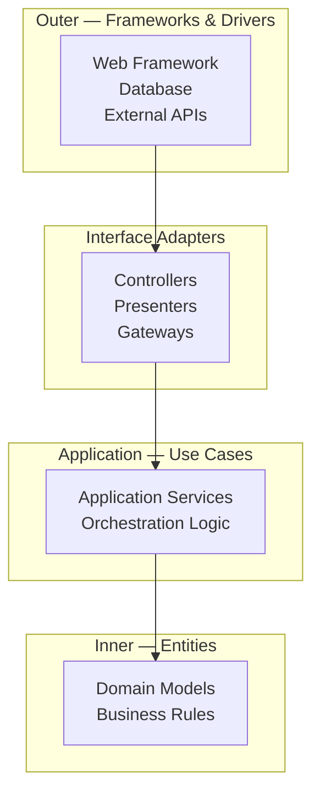
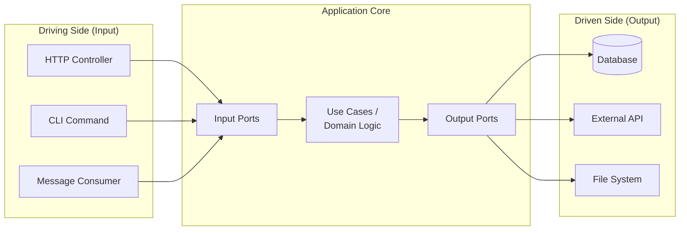
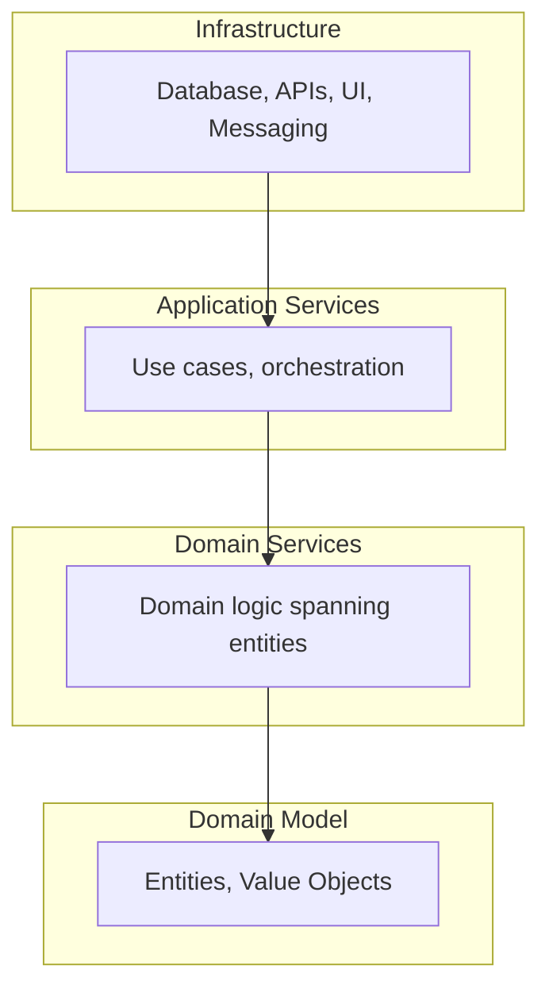

# Clean Architecture

Clean Architecture, introduced by Robert C. Martin, organizes code so that **business rules are independent of frameworks, databases, and delivery mechanisms**. The core idea is simple: dependencies point inward, and the inner layers know nothing about the outer layers.

## The Dependency Rule

> Source code dependencies must point only inward, toward higher-level policies.

Nothing in an inner circle can know anything about something in an outer circle. The name of something declared in an outer circle must not be mentioned by code in an inner circle — functions, classes, variables, or any named software entity.



**Dependencies flow inward.** The innermost circle is the most stable and abstract. The outermost circle is the most volatile and concrete.

## The Four Layers

### Layer 1: Entities (Domain)

The innermost layer contains enterprise-wide business rules. These are the most general and highest-level rules. They are least likely to change when something external changes.

```python
# entities/booking.py — Pure domain logic, no imports from outer layers

from dataclasses import dataclass
from datetime import date
from enum import Enum

class BookingStatus(Enum):
    PENDING = "pending"
    CONFIRMED = "confirmed"
    CANCELLED = "cancelled"

@dataclass
class Booking:
    id: str
    guest_name: str
    check_in: date
    check_out: date
    status: BookingStatus = BookingStatus.PENDING
    
    def confirm(self) -> None:
        if self.status != BookingStatus.PENDING:
            raise DomainError(f"Cannot confirm booking in {self.status} state")
        self.status = BookingStatus.CONFIRMED
    
    def cancel(self) -> None:
        if self.status == BookingStatus.CANCELLED:
            raise DomainError("Booking already cancelled")
        self.status = BookingStatus.CANCELLED
    
    @property
    def nights(self) -> int:
        return (self.check_out - self.check_in).days
    
    def overlaps(self, other: "Booking") -> bool:
        return self.check_in < other.check_out and other.check_in < self.check_out
```

**Rules for Entities:**
- No framework imports (no Flask, Django, SQLAlchemy, etc.)
- No infrastructure concerns (no database, no HTTP, no file I/O)
- Pure business logic and domain rules
- Tested with simple unit tests — no mocking required

### Layer 2: Use Cases (Application)

Contains application-specific business rules. Orchestrates the flow of data to and from entities, directing them to use their enterprise-wide business rules.

```python
# use_cases/create_booking.py

from dataclasses import dataclass
from entities.booking import Booking, BookingStatus
from use_cases.ports import BookingRepository, PaymentGateway, NotificationService

@dataclass
class CreateBookingRequest:
    guest_name: str
    check_in: str
    check_out: str
    payment_token: str

@dataclass
class CreateBookingResponse:
    booking_id: str
    status: str
    total_nights: int

class CreateBookingUseCase:
    def __init__(
        self,
        bookings: BookingRepository,
        payments: PaymentGateway,
        notifications: NotificationService,
    ):
        self._bookings = bookings
        self._payments = payments
        self._notifications = notifications
    
    def execute(self, request: CreateBookingRequest) -> CreateBookingResponse:
        # Create domain entity
        booking = Booking(
            id=generate_id(),
            guest_name=request.guest_name,
            check_in=parse_date(request.check_in),
            check_out=parse_date(request.check_out),
        )
        
        # Check availability (domain rule)
        existing = self._bookings.find_overlapping(booking.check_in, booking.check_out)
        if existing:
            raise BookingConflictError("Dates unavailable")
        
        # Process payment (through port)
        self._payments.charge(request.payment_token, booking.nights * RATE_PER_NIGHT)
        
        # Confirm and persist
        booking.confirm()
        self._bookings.save(booking)
        
        # Notify (fire and forget)
        self._notifications.send_confirmation(booking)
        
        return CreateBookingResponse(
            booking_id=booking.id,
            status=booking.status.value,
            total_nights=booking.nights,
        )
```

**Rules for Use Cases:**
- Depend only on Entities and port interfaces (defined in this layer)
- No knowledge of HTTP, databases, or specific frameworks
- One use case per business operation (Single Responsibility)
- Orchestrate — don't implement infrastructure logic

### Layer 3: Interface Adapters

Converts data from the format most convenient for use cases and entities to the format required by external agencies (web, database, etc.).

```python
# adapters/web/booking_controller.py

from flask import request, jsonify
from use_cases.create_booking import CreateBookingUseCase, CreateBookingRequest

class BookingController:
    def __init__(self, create_booking: CreateBookingUseCase):
        self._create_booking = create_booking
    
    def create(self):
        """HTTP adapter — converts HTTP request to use case input."""
        data = request.get_json()
        
        use_case_request = CreateBookingRequest(
            guest_name=data["guest_name"],
            check_in=data["check_in"],
            check_out=data["check_out"],
            payment_token=data["payment_token"],
        )
        
        result = self._create_booking.execute(use_case_request)
        
        return jsonify({
            "id": result.booking_id,
            "status": result.status,
            "nights": result.total_nights,
        }), 201
```

```python
# adapters/persistence/sql_booking_repository.py

from entities.booking import Booking
from use_cases.ports import BookingRepository

class SqlBookingRepository(BookingRepository):
    """Database adapter — converts between domain entities and SQL."""
    
    def __init__(self, session: Session):
        self._session = session
    
    def save(self, booking: Booking) -> None:
        record = BookingRecord(
            id=booking.id,
            guest_name=booking.guest_name,
            check_in=booking.check_in,
            check_out=booking.check_out,
            status=booking.status.value,
        )
        self._session.add(record)
        self._session.commit()
    
    def find_overlapping(self, check_in: date, check_out: date) -> list[Booking]:
        records = self._session.query(BookingRecord).filter(
            BookingRecord.check_in < check_out,
            BookingRecord.check_out > check_in,
        ).all()
        return [self._to_entity(r) for r in records]
```

### Layer 4: Frameworks & Drivers

The outermost layer — frameworks, tools, and drivers. This is where all the details go: the web framework, the database, the message queue client.

```python
# frameworks/flask_app.py — Wiring everything together

from flask import Flask
from adapters.web.booking_controller import BookingController
from adapters.persistence.sql_booking_repository import SqlBookingRepository
from adapters.payment.stripe_payment_gateway import StripePaymentGateway
from adapters.notification.email_notification_service import EmailNotificationService
from use_cases.create_booking import CreateBookingUseCase

def create_app() -> Flask:
    app = Flask(__name__)
    
    # Compose the dependency graph
    repository = SqlBookingRepository(db.session)
    payments = StripePaymentGateway(api_key=config.STRIPE_KEY)
    notifications = EmailNotificationService(smtp_config=config.SMTP)
    
    create_booking_uc = CreateBookingUseCase(repository, payments, notifications)
    booking_controller = BookingController(create_booking_uc)
    
    # Register routes
    app.add_url_rule("/bookings", view_func=booking_controller.create, methods=["POST"])
    
    return app
```

## Ports and Adapters (Hexagonal Architecture)

Hexagonal architecture (Alistair Cockburn, 2005) is the precursor to Clean Architecture. The core idea: the application communicates with the outside world through **ports** (interfaces) and **adapters** (implementations).



### Ports

Ports are **interfaces defined by the application core**. They state what the application needs without specifying how.

```python
# ports.py — Defined in the use case layer

from abc import ABC, abstractmethod

class BookingRepository(ABC):
    """Output port — the application needs to persist bookings."""
    
    @abstractmethod
    def save(self, booking: Booking) -> None:
        pass
    
    @abstractmethod
    def find_by_id(self, booking_id: str) -> Booking | None:
        pass

class PaymentGateway(ABC):
    """Output port — the application needs to process payments."""
    
    @abstractmethod
    def charge(self, token: str, amount: float) -> PaymentResult:
        pass
```

### Adapters

Adapters are **concrete implementations** of ports. They live in the outer layer and handle the technical details.

| Port | Adapter Examples |
|------|-----------------|
| `BookingRepository` | `SqlBookingRepository`, `DynamoBookingRepository`, `InMemoryBookingRepository` |
| `PaymentGateway` | `StripePaymentGateway`, `PayPalPaymentGateway`, `MockPaymentGateway` |
| `NotificationService` | `EmailNotificationService`, `SmsNotificationService`, `NoOpNotificationService` |

### Testing Advantage

The hexagonal architecture makes testing straightforward:

```python
# Unit test — no database, no network, no framework
def test_create_booking_confirms_and_persists():
    repo = InMemoryBookingRepository()
    payments = FakePaymentGateway(always_succeeds=True)
    notifications = SpyNotificationService()
    
    use_case = CreateBookingUseCase(repo, payments, notifications)
    
    result = use_case.execute(CreateBookingRequest(
        guest_name="Alice",
        check_in="2024-06-01",
        check_out="2024-06-05",
        payment_token="tok_test",
    ))
    
    assert result.status == "confirmed"
    assert result.total_nights == 4
    assert len(repo.all()) == 1
    assert notifications.sent_count == 1
```

## Onion Architecture

Onion Architecture (Jeffrey Palermo, 2008) is another concentric-layer model. The key difference from layered architecture: **all dependencies point toward the center**.



| Layer | Responsibility | Dependencies |
|-------|---------------|--------------|
| Domain Model | Business entities and rules | None |
| Domain Services | Logic that spans multiple entities | Domain Model |
| Application Services | Orchestration, use case coordination | Domain Services + Model |
| Infrastructure | Technical concerns (DB, HTTP, messaging) | All inner layers |

## Dependency Inversion in Practice

The Dependency Inversion Principle (DIP) is the mechanism that makes all these architectures work:

> A. High-level modules should not depend on low-level modules. Both should depend on abstractions.
> B. Abstractions should not depend on details. Details should depend on abstractions.

### Without DIP (traditional layering)

```
Controller → Service → Repository → Database
```

The service directly depends on the concrete repository. Changing databases requires changing the service.

### With DIP (clean architecture)

```
Controller → Service → [Repository Interface] ← Concrete Repository → Database
```

The service depends on an abstraction (interface). The concrete repository implements that interface. The arrows of dependency are **inverted** at the boundary.

```python
# The use case defines what it needs (abstraction)
class OrderService:
    def __init__(self, repo: OrderRepository):  # Depends on interface
        self._repo = repo

# The infrastructure provides it (detail)
class PostgresOrderRepository(OrderRepository):  # Implements interface
    def save(self, order: Order) -> None:
        # SQL details here
        pass
```

## Project Structure

A clean architecture project in Python:

```
src/
├── domain/                  # Entities layer
│   ├── booking.py          # Domain entities
│   ├── errors.py           # Domain exceptions
│   └── value_objects.py    # Value objects (Money, DateRange, etc.)
├── application/            # Use cases layer
│   ├── ports.py            # Port interfaces (abstract classes)
│   ├── create_booking.py   # Use case
│   ├── cancel_booking.py   # Use case
│   └── dto.py              # Request/Response data structures
├── adapters/               # Interface adapters layer
│   ├── web/
│   │   └── booking_controller.py
│   ├── persistence/
│   │   └── sql_booking_repository.py
│   ├── payment/
│   │   └── stripe_gateway.py
│   └── notification/
│       └── email_service.py
└── frameworks/             # Frameworks & drivers
    ├── flask_app.py        # App factory + wiring
    ├── config.py           # Environment config
    └── database.py         # DB engine setup
```

## Common Mistakes

| Mistake | Problem | Correction |
|---------|---------|------------|
| Entities import from adapters | Dependency rule violated | Move logic to entity; use ports |
| Use cases know about HTTP | Coupled to delivery mechanism | Pass DTOs, not request objects |
| Repository returns ORM models | Domain polluted with DB concerns | Map to domain entities in adapter |
| Too many layers for simple apps | Over-engineering | Start simple; layer when complexity demands |
| Shared domain models across services | Coupling between bounded contexts | Each service owns its domain model |

## Key Takeaways

- The **Dependency Rule** is the core principle: dependencies always point inward, from volatile details toward stable policies
- **Entities** contain enterprise business rules and have zero knowledge of the outside world
- **Use Cases** orchestrate application-specific business rules through port interfaces
- **Ports** are interfaces defined by the application core; **Adapters** are concrete implementations in the outer layer
- Clean Architecture makes the system **testable without frameworks** — test business logic with simple unit tests using fakes
- **Dependency Inversion** is the mechanism that enables the rule: high-level policy depends on abstractions, not concrete details
- Don't over-apply — a CRUD app with 3 endpoints doesn't need 4 layers. Match architecture complexity to problem complexity
