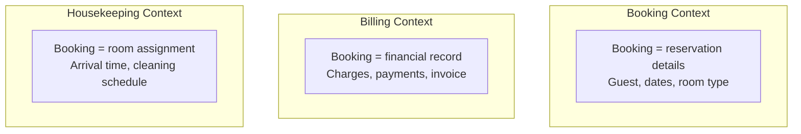
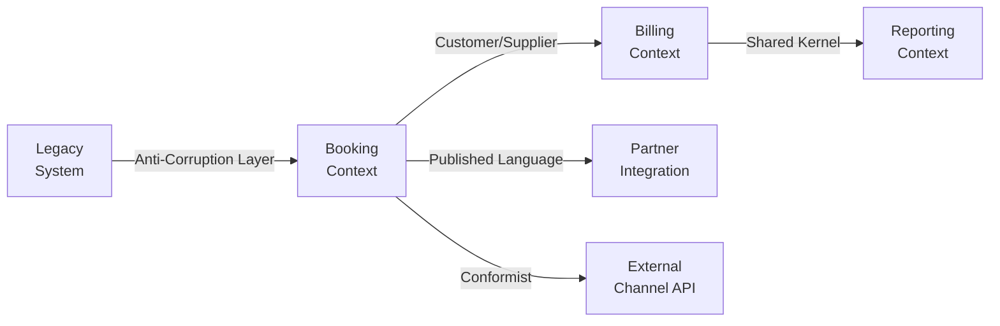
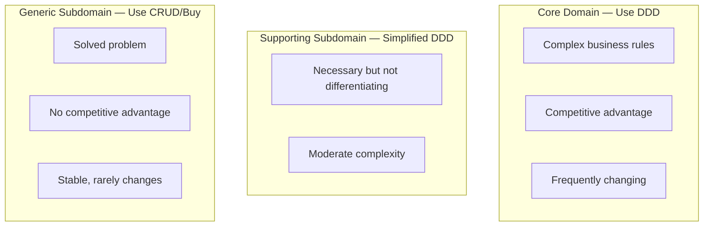
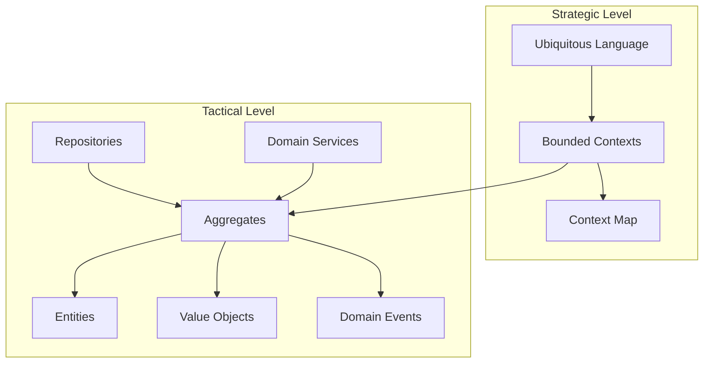

# Domain-Driven Design

Domain-Driven Design (DDD) is an approach to software development that centers the design on the core business domain. It provides strategic patterns for organizing large systems and tactical patterns for modeling complex business logic.

## Strategic DDD

Strategic DDD addresses the **big picture** — how to decompose a large system into manageable parts that can evolve independently.

### Ubiquitous Language

The most fundamental concept in DDD: a shared language between developers and domain experts that is used consistently in code, conversations, and documentation.

| Aspect | Good (Ubiquitous Language) | Bad (Technical Jargon) |
|--------|---------------------------|----------------------|
| Class name | `Booking` | `ReservationEntity` |
| Method | `booking.confirm()` | `booking.setStatusCode(2)` |
| Variable | `available_rooms` | `room_dto_list` |
| Event | `BookingConfirmed` | `StatusChangeEvent` |
| Conversation | "When a guest confirms a booking..." | "When the entity transitions to state 2..." |

**Rules:**
- The language is defined per bounded context (not globally)
- If domain experts don't use a term, neither should the code
- If the code uses a term differently from domain experts, one of them is wrong
- Evolve the language as understanding deepens

### Bounded Contexts

A bounded context is a **linguistic boundary** — within it, every term has exactly one meaning. Different bounded contexts may use the same word to mean different things.



**"Booking"** means something different in each context. Each context has its own model, its own code, its own database (ideally), and its own team.

### Context Mapping

Context mapping describes the **relationships between bounded contexts** — how they communicate and influence each other.



| Relationship | Description | When to Use |
|-------------|-------------|-------------|
| **Shared Kernel** | Two contexts share a subset of the model | Small, closely collaborating teams |
| **Customer/Supplier** | Upstream serves downstream's needs | Downstream can influence upstream's priorities |
| **Conformist** | Downstream conforms to upstream's model | No influence over upstream (external API) |
| **Anti-Corruption Layer** | Translation layer protects from external models | Integrating legacy or poorly designed systems |
| **Published Language** | Shared interchange format (events, schemas) | Multiple consumers of the same data |
| **Separate Ways** | No integration — contexts are independent | No shared data or workflows |
| **Open Host Service** | Well-defined API serving multiple consumers | One upstream, many downstreams |

### Identifying Bounded Contexts

Signals that two things belong in **different** contexts:

- Different teams own them
- The same word means different things
- They change for different reasons
- They have different lifecycles (one is stable, one changes weekly)
- They have different scalability requirements

## Tactical DDD

Tactical DDD provides **building blocks** for modeling complex domain logic within a bounded context.

### Entities

Objects with a unique identity that persists through time. Two entities are equal if their identities match, regardless of attribute values.

```python
class Guest:
    """Entity — identified by guest_id, not by name or email."""
    
    def __init__(self, guest_id: str, name: str, email: str):
        self._id = guest_id
        self._name = name
        self._email = email
        self._loyalty_points = 0
    
    @property
    def id(self) -> str:
        return self._id
    
    def earn_points(self, nights: int) -> None:
        self._loyalty_points += nights * 10
    
    def redeem_points(self, points: int) -> None:
        if points > self._loyalty_points:
            raise InsufficientPointsError(self._loyalty_points, points)
        self._loyalty_points -= points
    
    def __eq__(self, other: object) -> bool:
        if not isinstance(other, Guest):
            return False
        return self._id == other._id
    
    def __hash__(self) -> int:
        return hash(self._id)
```

### Value Objects

Objects defined entirely by their attributes. Two value objects with the same attributes are interchangeable. They are immutable.

```python
from dataclasses import dataclass
from datetime import date

@dataclass(frozen=True)
class DateRange:
    """Value object — defined by its values, not an identity."""
    
    start: date
    end: date
    
    def __post_init__(self):
        if self.start >= self.end:
            raise ValueError("Start must be before end")
    
    @property
    def nights(self) -> int:
        return (self.end - self.start).days
    
    def overlaps(self, other: "DateRange") -> bool:
        return self.start < other.end and other.start < self.end
    
    def contains(self, d: date) -> bool:
        return self.start <= d < self.end

@dataclass(frozen=True)
class Money:
    """Value object — always carry currency with amount."""
    
    amount: float
    currency: str
    
    def __post_init__(self):
        if self.amount < 0:
            raise ValueError("Amount cannot be negative")
    
    def add(self, other: "Money") -> "Money":
        if self.currency != other.currency:
            raise CurrencyMismatchError(self.currency, other.currency)
        return Money(self.amount + other.amount, self.currency)
    
    def multiply(self, factor: float) -> "Money":
        return Money(round(self.amount * factor, 2), self.currency)
```

**Entity vs Value Object decision:**

| Question | Entity | Value Object |
|----------|--------|--------------|
| Does identity matter? | Yes — "this specific guest" | No — "$50 USD is $50 USD" |
| Can two with same attributes coexist? | Yes — two John Smiths are different | No — two $50 are interchangeable |
| Does it change over time? | Yes — guest earns points | No — immutable (create new instead) |
| How do you compare? | By ID | By all attributes |

### Aggregates

A cluster of entities and value objects treated as a single unit for data changes. The **aggregate root** is the entry point — all external access goes through it.

```python
class Booking:
    """Aggregate root — enforces invariants for the entire aggregate."""
    
    def __init__(self, booking_id: str, guest: Guest, room: Room, dates: DateRange):
        self._id = booking_id
        self._guest = guest
        self._room = room
        self._dates = dates
        self._line_items: list[LineItem] = []
        self._status = BookingStatus.PENDING
        self._events: list[DomainEvent] = []
    
    def add_service(self, service: str, price: Money) -> None:
        """Business rule: cannot add services to cancelled bookings."""
        if self._status == BookingStatus.CANCELLED:
            raise DomainError("Cannot add services to cancelled booking")
        self._line_items.append(LineItem(service, price))
    
    def confirm(self) -> None:
        """Business rule: only pending bookings can be confirmed."""
        if self._status != BookingStatus.PENDING:
            raise DomainError(f"Cannot confirm from {self._status}")
        self._status = BookingStatus.CONFIRMED
        self._events.append(BookingConfirmed(self._id, self._guest.id))
    
    @property
    def total(self) -> Money:
        """Invariant: total always reflects current line items."""
        base = self._room.rate.multiply(self._dates.nights)
        for item in self._line_items:
            base = base.add(item.price)
        return base
    
    def pull_events(self) -> list[DomainEvent]:
        events = self._events.copy()
        self._events.clear()
        return events
```

**Aggregate design rules:**
1. Reference other aggregates by ID, not by object reference
2. One transaction = one aggregate. Don't modify multiple aggregates in one transaction.
3. Keep aggregates small — large aggregates cause contention
4. Enforce invariants within the aggregate boundary

### Repositories

Provide collection-like access to aggregates. They abstract persistence — the domain doesn't know if it's SQL, NoSQL, or in-memory.

```python
class BookingRepository(ABC):
    """Repository interface — defined in the domain layer."""
    
    @abstractmethod
    def find_by_id(self, booking_id: str) -> Booking | None:
        pass
    
    @abstractmethod
    def save(self, booking: Booking) -> None:
        pass
    
    @abstractmethod
    def find_by_guest(self, guest_id: str) -> list[Booking]:
        pass
    
    @abstractmethod
    def find_overlapping(self, room_id: str, dates: DateRange) -> list[Booking]:
        pass
```

**Rules:**
- One repository per aggregate root (not per entity)
- Repository interface lives in the domain; implementation lives in infrastructure
- Return domain objects, not database rows or DTOs

### Domain Events

Something that happened in the domain that other parts of the system care about. Past tense — it already happened.

```python
@dataclass(frozen=True)
class BookingConfirmed:
    booking_id: str
    guest_id: str
    occurred_at: datetime = field(default_factory=datetime.utcnow)

@dataclass(frozen=True)
class PaymentReceived:
    booking_id: str
    amount: float
    currency: str
    occurred_at: datetime = field(default_factory=datetime.utcnow)
```

Domain events enable:
- Loose coupling between bounded contexts
- Eventual consistency across aggregates
- Audit trails and event sourcing
- Triggering side effects without polluting domain logic

## DDD vs CRUD

Not every part of a system needs DDD. Use DDD where the domain is complex; use simple CRUD where it's not.



| Factor | Use DDD | Use CRUD |
|--------|---------|----------|
| Business rules | Complex, many edge cases | Simple validation only |
| Domain experts | Available and engaged | No domain experts needed |
| Change frequency | High — evolving domain | Low — stable requirements |
| Competitive advantage | Core differentiator | Commodity functionality |
| Team size | Large enough to justify overhead | Small team, fast delivery needed |
| Examples | Pricing engine, booking orchestration | User preferences, notification settings |

### The Cost of DDD

DDD introduces overhead. It's worth it when complexity is high, but counterproductive for simple problems:

| Cost | Justification |
|------|---------------|
| More classes and files | Separation of concerns aids long-term maintenance |
| Learning curve | Team understands the domain deeply |
| Modeling time upfront | Prevents expensive rework later |
| Ceremony (events, value objects) | Explicit > implicit for complex rules |

## Putting It Together



## Key Takeaways

- **Ubiquitous Language** is the foundation — code must speak the same language as domain experts, within each bounded context
- **Bounded Contexts** are linguistic and ownership boundaries — the same word can mean different things in different contexts
- **Context Mapping** defines relationships between contexts: who conforms to whom, where translation is needed, and what's shared
- **Entities** have identity; **Value Objects** are defined by their attributes and are immutable
- **Aggregates** are consistency boundaries — enforce invariants within, reference other aggregates by ID only
- **Repositories** provide collection-like access to aggregates; the interface is domain, the implementation is infrastructure
- **Domain Events** capture what happened in the domain, enabling loose coupling and eventual consistency
- **DDD is not for everything** — apply it to core domains with complex rules; use simple CRUD for generic subdomains
