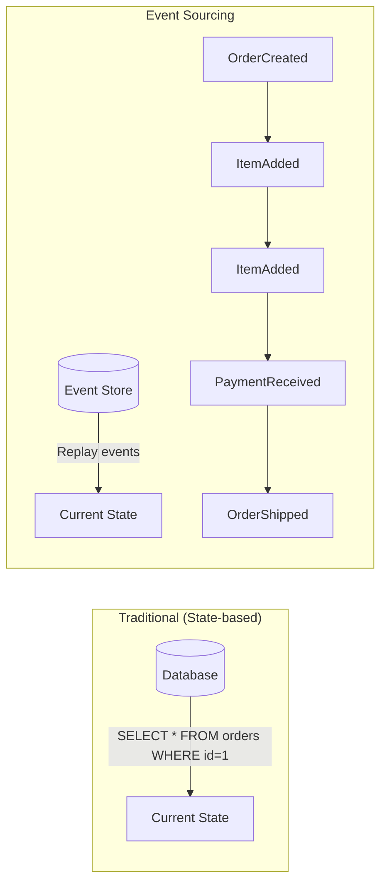
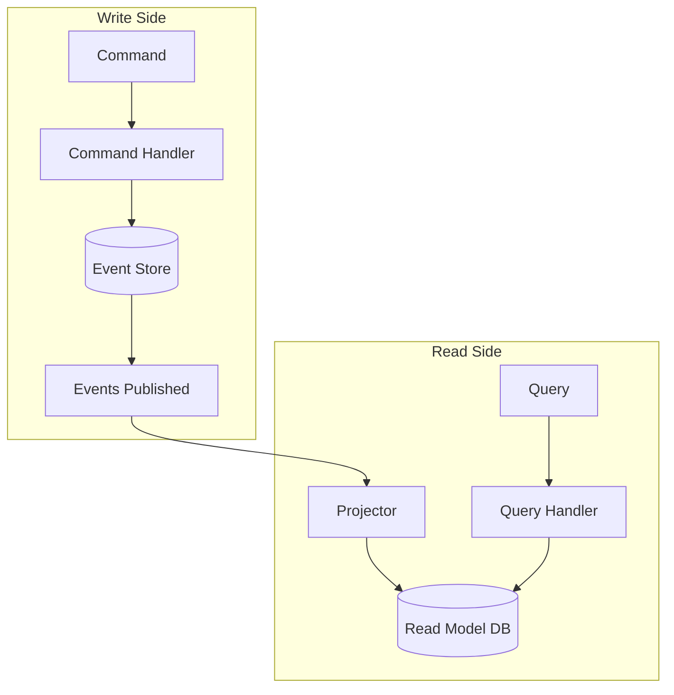
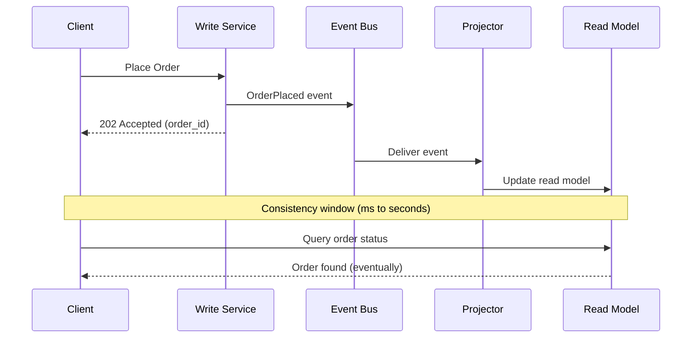
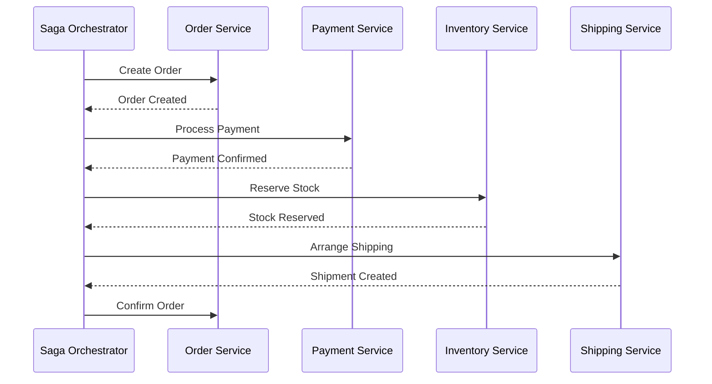
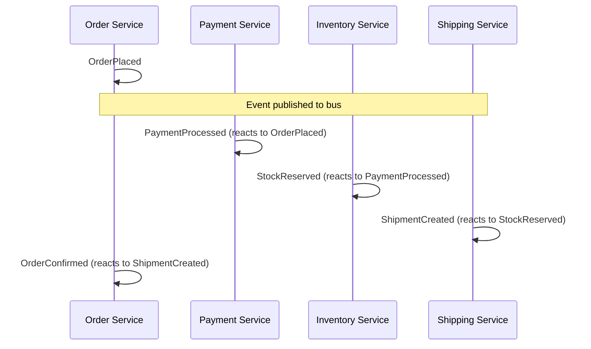

# Event-Driven Architecture

Event-Driven Architecture (EDA) is a paradigm where the production, detection, consumption, and reaction to events drives the system's behavior. Instead of direct calls between services, components communicate through events — facts about things that happened.

## Event Types

Not all events are equal. Understanding the type helps you choose the right infrastructure and guarantees.

| Type | Purpose | Content | Example |
|------|---------|---------|---------|
| **Domain Event** | Records what happened in the domain | Full state at time of event | `BookingConfirmed { booking_id, guest, dates, total }` |
| **Integration Event** | Communicates across bounded contexts | Minimal data + references | `BookingConfirmed { booking_id, guest_id }` |
| **Notification Event** | Signals something happened (no data) | Event type + aggregate ID only | `BookingConfirmed { booking_id }` |

### Domain Events

Rich events used within a bounded context. They contain enough information for any handler within the same context to act.

```python
@dataclass(frozen=True)
class OrderPlaced:
    order_id: str
    customer_id: str
    items: list[OrderItem]
    total: Money
    shipping_address: Address
    placed_at: datetime
```

### Integration Events

Lean events published to other bounded contexts. They carry minimal data — consumers call back for details if needed.

```python
@dataclass(frozen=True)
class OrderPlacedIntegration:
    order_id: str
    customer_id: str
    total_amount: float
    total_currency: str
    placed_at: str  # ISO 8601 — no internal types cross boundaries
```

### Notification Events

The thinnest events — just "something happened." Consumer must query for details.

```python
@dataclass(frozen=True)
class OrderPlacedNotification:
    order_id: str
    occurred_at: str
```

**Trade-off:** Richer events reduce coupling (consumers don't need to call back) but increase the event's surface area (harder to evolve).

## Event Sourcing

Instead of storing the **current state** of an entity, store the **sequence of events** that led to that state. The current state is derived by replaying events.



### Implementation

```python
class Order:
    """Event-sourced aggregate."""
    
    def __init__(self):
        self._id = None
        self._status = None
        self._items = []
        self._total = Money(0, "EUR")
        self._uncommitted_events = []
    
    # --- Command methods (produce events) ---
    
    def create(self, order_id: str, customer_id: str) -> None:
        self._apply(OrderCreated(order_id=order_id, customer_id=customer_id))
    
    def add_item(self, item: OrderItem) -> None:
        if self._status != "pending":
            raise DomainError("Cannot add items to a non-pending order")
        self._apply(ItemAdded(order_id=self._id, item=item))
    
    def confirm(self) -> None:
        if not self._items:
            raise DomainError("Cannot confirm an empty order")
        self._apply(OrderConfirmed(order_id=self._id, total=self._total))
    
    # --- Event handlers (apply state changes) ---
    
    def _on_order_created(self, event: OrderCreated) -> None:
        self._id = event.order_id
        self._status = "pending"
    
    def _on_item_added(self, event: ItemAdded) -> None:
        self._items.append(event.item)
        self._total = self._total.add(event.item.price)
    
    def _on_order_confirmed(self, event: OrderConfirmed) -> None:
        self._status = "confirmed"
    
    # --- Infrastructure support ---
    
    def _apply(self, event) -> None:
        """Apply event to state and track for persistence."""
        handler = getattr(self, f"_on_{snake_case(type(event).__name__)}")
        handler(event)
        self._uncommitted_events.append(event)
    
    @classmethod
    def from_events(cls, events: list) -> "Order":
        """Reconstitute from event history."""
        order = cls()
        for event in events:
            handler = getattr(order, f"_on_{snake_case(type(event).__name__)}")
            handler(event)
        return order
```

### Benefits and Costs

| Benefit | Cost |
|---------|------|
| Complete audit trail | Increased storage requirements |
| Temporal queries ("state at time T") | Complexity in event versioning |
| Debug by replaying events | Learning curve for teams |
| Natural fit for event-driven systems | Read model needs separate projection |
| Easy to add new projections | Eventual consistency challenges |

## CQRS — Command Query Responsibility Segregation

CQRS separates the **write model** (commands that change state) from the **read model** (queries that return data). Each side can be optimized independently.



### Write Side (Commands)

Commands express **intent to change state**. They are validated, then either accepted (producing events) or rejected.

```python
@dataclass
class PlaceOrderCommand:
    customer_id: str
    items: list[dict]
    shipping_address: dict

class PlaceOrderHandler:
    def __init__(self, event_store: EventStore):
        self._store = event_store
    
    def handle(self, command: PlaceOrderCommand) -> str:
        order = Order()
        order.create(generate_id(), command.customer_id)
        for item in command.items:
            order.add_item(OrderItem(**item))
        order.confirm()
        
        self._store.append(order.id, order.uncommitted_events)
        return order.id
```

### Read Side (Queries)

Queries return data from denormalized read models optimized for specific views.

```python
class OrderSummaryProjector:
    """Listens to events and builds a read-optimized view."""
    
    def __init__(self, read_db: ReadDatabase):
        self._db = read_db
    
    def on_order_confirmed(self, event: OrderConfirmed) -> None:
        self._db.upsert("order_summaries", {
            "order_id": event.order_id,
            "status": "confirmed",
            "total": event.total.amount,
            "currency": event.total.currency,
            "confirmed_at": event.occurred_at,
        })
    
    def on_order_shipped(self, event: OrderShipped) -> None:
        self._db.update("order_summaries", event.order_id, {
            "status": "shipped",
            "tracking_number": event.tracking_number,
            "shipped_at": event.occurred_at,
        })
```

### When CQRS Makes Sense

| Good Fit | Poor Fit |
|----------|----------|
| Read and write patterns differ significantly | Simple CRUD with equal read/write |
| High read volume, low write volume | Low traffic overall |
| Complex queries across aggregates | Single aggregate queries |
| Multiple read model representations needed | One representation suffices |
| Event sourcing already in use | State-based persistence is fine |

## Eventual Consistency

In event-driven systems, different parts of the system become consistent **eventually**, not immediately. After a write, read models may lag.



### Handling Eventual Consistency in UIs

| Strategy | How It Works |
|----------|-------------|
| **Optimistic UI** | Update the UI immediately, reconcile when event arrives |
| **Polling** | Client polls until the read model catches up |
| **Correlation ID** | Track the command → wait for the projected event |
| **Causal consistency** | Read-your-writes guarantee (version token) |

## Event Store

The event store is the **source of truth** in an event-sourced system. It stores events in append-only streams.

```python
class EventStore(ABC):
    @abstractmethod
    def append(self, stream_id: str, events: list[Event], expected_version: int) -> None:
        """Append events. Fail if stream version doesn't match (optimistic concurrency)."""
        pass
    
    @abstractmethod
    def read_stream(self, stream_id: str) -> list[Event]:
        """Read all events for an aggregate."""
        pass
    
    @abstractmethod
    def read_all(self, from_position: int = 0) -> Iterator[Event]:
        """Read all events across all streams (for projections)."""
        pass
```

### Optimistic Concurrency

```python
# Prevents lost updates in concurrent scenarios
def handle_command(store: EventStore, order_id: str, command: Command):
    events = store.read_stream(order_id)
    order = Order.from_events(events)
    current_version = len(events)
    
    order.process(command)  # May produce new events
    
    # Will fail with ConcurrencyError if another write happened
    store.append(order_id, order.uncommitted_events, expected_version=current_version)
```

## Projections / Read Models

Projections transform event streams into read-optimized views. Each projection answers a specific query need.

| Projection | Subscribes To | Produces |
|-----------|---------------|----------|
| Order Summary | OrderPlaced, OrderConfirmed, OrderShipped | Flat table for dashboard |
| Customer Orders | OrderPlaced, OrderConfirmed | Per-customer order list |
| Revenue Report | OrderConfirmed | Daily/monthly revenue aggregates |
| Inventory | ItemAdded, ItemRemoved, OrderConfirmed | Current stock levels |

**Key property:** Projections are **disposable**. If a projection is wrong, drop it and rebuild from the event store.

## Saga vs Choreography

When a business process spans multiple bounded contexts, you need coordination. Two approaches:

### Orchestration (Saga)

A central coordinator manages the process, sending commands to each participant.



### Choreography

No central coordinator — each service reacts to events and publishes its own.



### Comparison

| Aspect | Orchestration (Saga) | Choreography |
|--------|---------------------|--------------|
| Control | Centralized — one coordinator | Distributed — no single owner |
| Coupling | Services coupled to orchestrator | Services coupled to event schema |
| Visibility | Easy to see the full process | Hard to trace; must read all handlers |
| Complexity | Orchestrator can become complex | Emergent behavior hard to reason about |
| Failure handling | Explicit compensation logic | Each service handles its own failures |
| Adding steps | Modify the orchestrator | Add a new subscriber (no existing changes) |
| Best for | Complex, multi-step processes | Simple, linear flows with few steps |

### Compensation (Saga Pattern)

When a step fails, previous steps must be undone:

```python
class BookingProcessSaga:
    def execute(self, command: BookTripCommand):
        try:
            flight = self._flight_service.reserve(command.flight_id)
            hotel = self._hotel_service.reserve(command.hotel_id, command.dates)
            payment = self._payment_service.charge(command.payment_method, total)
        except PaymentFailedError:
            # Compensate in reverse order
            self._hotel_service.cancel_reservation(hotel.id)
            self._flight_service.cancel_reservation(flight.id)
            raise BookingFailedError("Payment failed")
        except HotelUnavailableError:
            self._flight_service.cancel_reservation(flight.id)
            raise BookingFailedError("Hotel unavailable")
```

## Key Takeaways

- **Event types** serve different purposes: domain events are rich (within a context), integration events are lean (across contexts), notification events are minimal (signal only)
- **Event sourcing** stores the full history of changes as immutable events; current state is derived by replaying them
- **CQRS** separates write models (optimized for business rules) from read models (optimized for queries), allowing each to scale independently
- **Eventual consistency** is the trade-off for decoupling — design UIs and workflows that tolerate a consistency window
- The **event store** is append-only with optimistic concurrency; it is the single source of truth
- **Projections** are disposable, rebuildable read models — one event stream can power many different views
- **Orchestration** (saga) gives visibility and control; **choreography** gives loose coupling and extensibility — choose based on process complexity
- **Compensation** handles failures in distributed processes by undoing previously successful steps in reverse order
