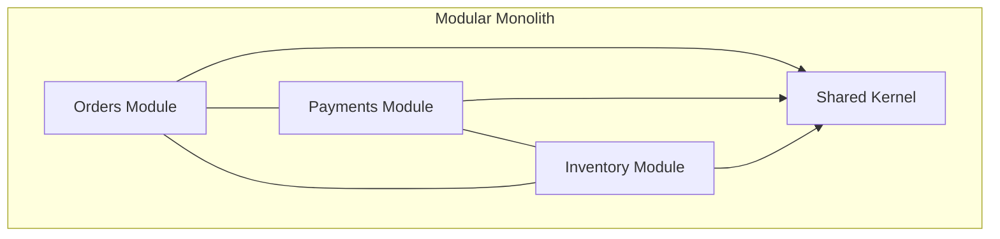
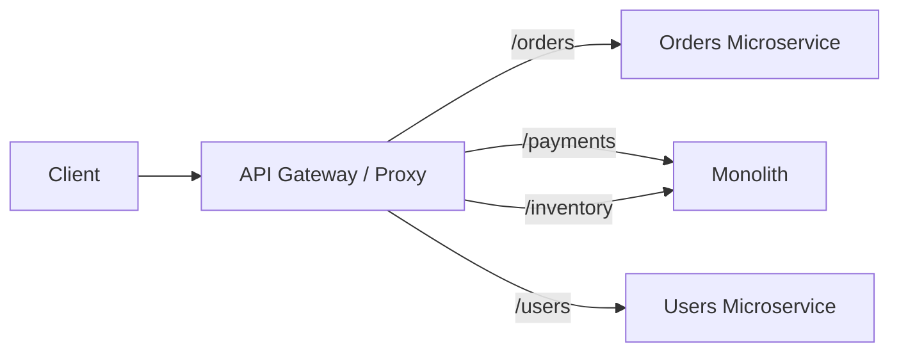
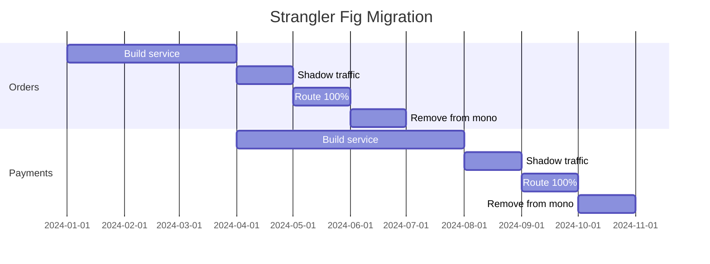
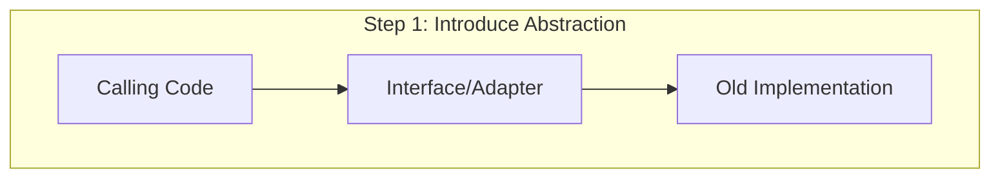
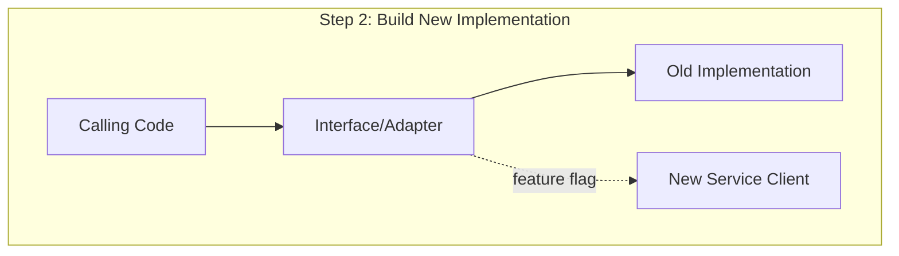
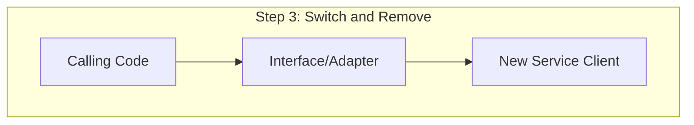
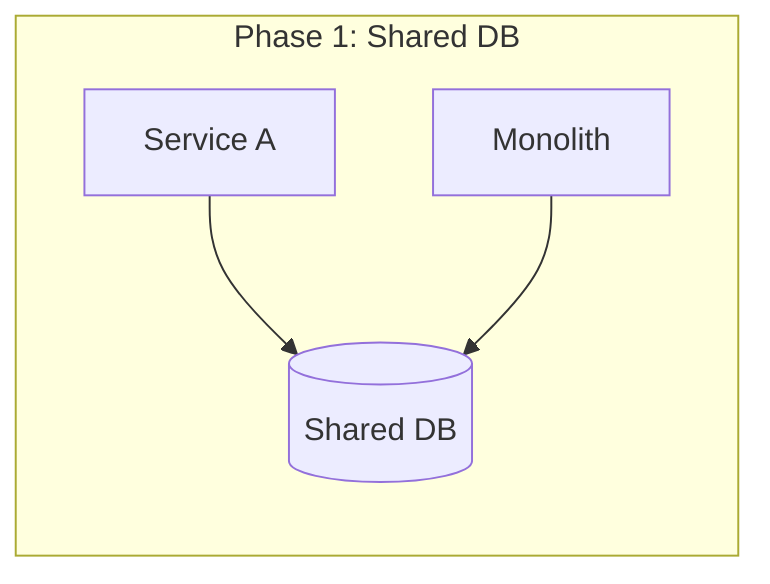
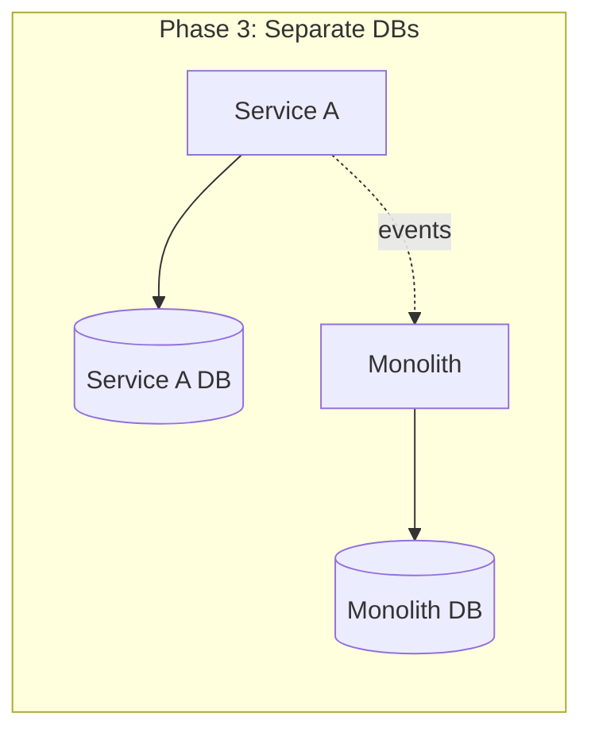
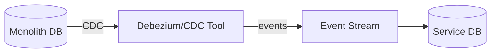
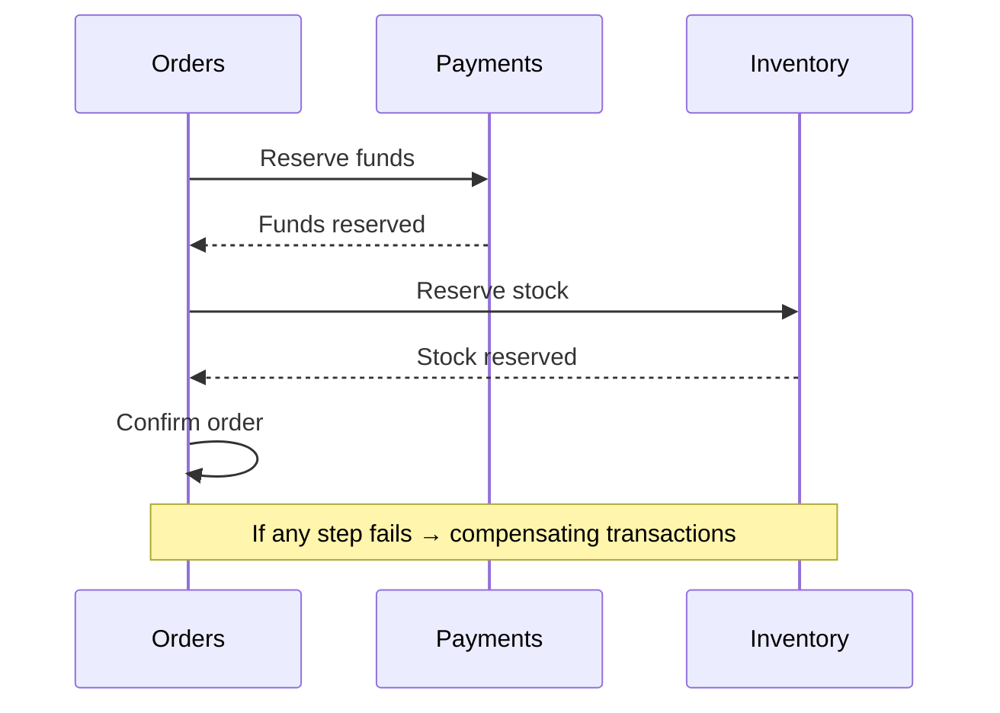

# Monolith to Microservices

Migrating from a monolith to microservices is one of the most impactful — and risky — architectural transitions a team can undertake. Success requires a deliberate, incremental strategy rather than a big-bang rewrite.

---

## Why Migrate?

| Driver | Monolith Pain | Microservices Solution |
|--------|--------------|----------------------|
| Deployment speed | Entire app redeployed for any change | Deploy services independently |
| Team scaling | Merge conflicts, coordination overhead | Teams own independent services |
| Technology lock-in | One stack for everything | Polyglot — best tool per service |
| Fault isolation | One bug crashes everything | Failures contained per service |
| Scalability | Scale entire app for one hot path | Scale individual services |

### When NOT to Migrate

- Small team (< 10 engineers)
- Well-understood domain with stable requirements
- No deployment bottleneck
- You cannot invest in platform infrastructure (CI/CD, observability, service mesh)

---

## The Modular Monolith — First Step

Before extracting services, **modularize within the monolith**:



### Characteristics

| Property | Traditional Monolith | Modular Monolith |
|----------|---------------------|-----------------|
| Module boundaries | Unclear, spaghetti | Explicit interfaces |
| Data access | Any code accesses any table | Each module owns its tables |
| Dependencies | Circular, implicit | Declared, enforced |
| Deployment | Single unit | Single unit (but extractable) |

### How to Modularize

1. Identify bounded contexts (DDD)
2. Establish module boundaries with explicit public APIs
3. Prohibit cross-module database access (use module APIs)
4. Enforce boundaries with linting/architecture tests (ArchUnit, deptry)

---

## Strangler Fig Pattern

Incrementally replace monolith functionality by routing traffic to new services:



### Steps

1. **Intercept** — Place a proxy/gateway in front of the monolith
2. **Implement** — Build the new service for one capability
3. **Route** — Redirect traffic for that capability to the new service
4. **Retire** — Remove the old code from the monolith once validated

### Migration Timeline



---

## Branch by Abstraction

When you cannot route traffic externally (shared library, internal module), use an abstraction layer:







### Process

1. Create an abstraction (interface) around the code to replace
2. Refactor consumers to use the abstraction
3. Build new implementation behind the abstraction
4. Use feature flags to gradually shift traffic
5. Remove old implementation once new one is validated

---

## Database Decomposition

The hardest part of service extraction is **splitting the database**.

### Strategies

| Strategy | Approach | Risk |
|----------|----------|------|
| **Shared database** (temporary) | Services share tables during migration | Coupling, schema changes break both |
| **Database view** | Service reads from a view over monolith DB | Read-only, limited evolution |
| **Data sync** | Replicate data via CDC/events | Eventual consistency |
| **Database per service** | Each service owns its data | Requires data migration |

### Decomposition Phases





### Handling Cross-Service Queries

| Pattern | Use When |
|---------|----------|
| API composition | Simple joins across 2-3 services |
| CQRS read model | Complex queries spanning many services |
| Event-driven materialized view | Real-time aggregation needed |
| Data lake / warehouse | Analytics, reporting |

---

## Data Synchronization

### Change Data Capture (CDC)



### Dual-Write Problem

Never write to two systems in the same operation — one may fail:

```
# BAD: dual write
save_to_database(order)
publish_event(order_created)  # what if this fails?

# GOOD: Outbox pattern
save_to_database(order)
save_to_outbox_table(order_created_event)  # same transaction
# Background process publishes from outbox
```

### Saga Pattern for Distributed Transactions



---

## Migration Strategies Summary

| Strategy | Best For | Complexity |
|----------|----------|------------|
| Strangler fig | User-facing features with clear routing | Medium |
| Branch by abstraction | Internal modules, shared libraries | Medium |
| Parallel run | Critical paths needing validation | High |
| Bubble context (DDD) | New features that don't fit the monolith | Low |
| Database-first split | Tightly coupled data domains | High |

### Recommended Order

1. **Modularize** the monolith (enforce boundaries)
2. **Extract the easiest** service first (build platform capabilities)
3. **Extract the most painful** service next (highest deployment friction)
4. **Repeat** — each extraction teaches you and improves tooling
5. **Accept the residual** — some monolith code may never be worth extracting

---

## Anti-Patterns

| Anti-Pattern | Problem | Alternative |
|--------------|---------|-------------|
| Big-bang rewrite | High risk, no value until complete | Incremental strangler fig |
| Distributed monolith | Services coupled by shared DB/sync calls | Async events, own data |
| Nano-services | Too many tiny services, operational overhead | Right-size boundaries |
| Shared libraries for business logic | Coupling through shared code | Duplicate simple logic |
| Skipping the modular monolith | Extract without understanding boundaries | Modularize first |

---

## Key Takeaways

1. **Start with a modular monolith** — enforce boundaries before extracting services.
2. The **strangler fig pattern** is the safest migration strategy — incremental, reversible, proven.
3. **Database decomposition** is the hardest part — plan for it explicitly with CDC or outbox patterns.
4. Never do a **big-bang rewrite** — it almost always fails.
5. Accept **eventual consistency** — synchronous cross-service calls create distributed monoliths.
6. Each extraction should deliver **independent value** — don't extract for the sake of microservices.
7. Build **platform capabilities** (CI/CD, observability, service mesh) before or alongside extraction.
