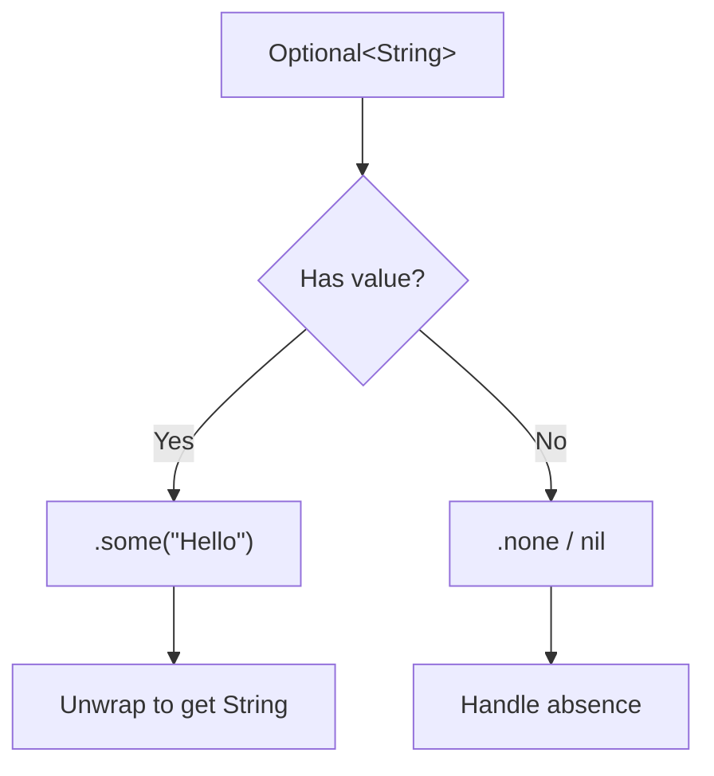

# Swift Fundamentals

Swift is a compiled, statically-typed language designed for safety and performance. It eliminates entire categories of bugs through its type system, particularly its handling of nil values through optionals.

## Variables and Constants

Swift distinguishes between mutable and immutable bindings at the declaration site:

```swift
let maximumAttempts = 3      // Constant — cannot be reassigned
var currentAttempt = 0       // Variable — can be reassigned

currentAttempt += 1          // OK
// maximumAttempts = 5       // Compile error: cannot assign to 'let' constant
```

Prefer `let` over `var` whenever possible. The compiler enforces immutability, making code easier to reason about and safer in concurrent contexts.

### Type Annotations

Swift uses type inference aggressively, but you can provide explicit annotations:

```swift
let name: String = "Swift"
let version: Double = 5.9
let isStable: Bool = true
let year: Int = 2024
```

When the type cannot be inferred (e.g., an empty collection or a numeric literal that could be `Int` or `Double`), annotations are required:

```swift
let emptyScores: [Int] = []
let temperature: Double = 72  // Without annotation, this would be Int
```

## Fundamental Types

| Type | Description | Example | Size |
|------|-------------|---------|------|
| `Int` | Signed integer (platform word size) | `42`, `-7` | 64-bit on modern platforms |
| `UInt` | Unsigned integer | `0`, `255` | 64-bit on modern platforms |
| `Double` | 64-bit floating point | `3.14159` | 64-bit |
| `Float` | 32-bit floating point | `2.71` | 32-bit |
| `Bool` | Boolean | `true`, `false` | 1 byte |
| `String` | Unicode text | `"Hello"` | Variable |
| `Character` | Single Unicode grapheme cluster | `"A"`, `"🇪🇸"` | Variable |

### Numeric Literals

```swift
let decimal = 1_000_000        // Underscores for readability
let binary = 0b1010            // Binary literal (10)
let octal = 0o17               // Octal literal (15)
let hex = 0xFF                 // Hexadecimal literal (255)
let scientific = 1.5e3         // 1500.0
```

### Strings and String Interpolation

Strings in Swift are value types with full Unicode support:

```swift
let language = "Swift"
let version = 5.9
let message = "Welcome to \(language) \(version)!"  // String interpolation

// Multi-line strings
let json = """
    {
        "name": "\(language)",
        "version": \(version)
    }
    """

// String operations
let greeting = "Hello, " + "World"
let count = greeting.count           // 12 (character count, not byte count)
let upper = greeting.uppercased()    // "HELLO, WORLD"
let hasHello = greeting.hasPrefix("Hello")  // true
```

Interpolation can include arbitrary expressions:

```swift
let items = 5
let cost = 3.99
let total = "Total: $\(Double(items) * cost)"  // "Total: $19.95"
```

## Optionals

Optionals are Swift's mechanism for representing the absence of a value. Every type `T` has a corresponding optional type `T?` (syntactic sugar for `Optional<T>`):

```swift
var middleName: String? = nil   // May or may not contain a String
var age: Int? = 25              // Currently contains 25

middleName = "Alexander"        // Now contains a value
age = nil                       // Now empty
```



### Unwrapping Optionals

```swift
let possibleNumber: String? = "42"

// 1. Optional binding (if let) — safest approach
if let number = possibleNumber {
    print("Got: \(number)")  // number is String here, not String?
}

// 2. Guard let — early exit pattern
func process(input: String?) {
    guard let value = input else {
        print("No input provided")
        return
    }
    // value is non-optional String from here onward
    print("Processing: \(value)")
}

// 3. Nil coalescing — provide a default
let displayName = middleName ?? "Unknown"

// 4. Optional chaining — propagate nil
let nameLength = middleName?.count  // Int? — nil if middleName is nil

// 5. Force unwrap — crashes if nil (avoid in production)
let definitelyAString = possibleNumber!  // Only when you're certain
```

### Implicitly Unwrapped Optionals

Used when a value is guaranteed to exist after initialization but cannot be set during init:

```swift
class ViewController {
    var label: UILabel!  // Set in viewDidLoad, nil before that
}
```

## Control Flow

### Conditional Statements

```swift
let temperature = 72

if temperature > 80 {
    print("Hot")
} else if temperature > 60 {
    print("Pleasant")
} else {
    print("Cold")
}

// Ternary operator
let description = temperature > 70 ? "warm" : "cool"
```

### Switch Statements

Swift's `switch` is exhaustive and does not fall through by default:

```swift
let statusCode = 404

switch statusCode {
case 200:
    print("OK")
case 301, 302:
    print("Redirect")
case 400..<500:
    print("Client error")
case 500..<600:
    print("Server error")
default:
    print("Unknown")
}

// Pattern matching with where clauses
let point = (3, -2)
switch point {
case let (x, y) where x == y:
    print("On the line x = y")
case let (x, y) where x == -y:
    print("On the line x = -y")
case let (x, y):
    print("Arbitrary point (\(x), \(y))")
}
```

### Loops

```swift
// For-in loops
for i in 1...5 {          // Closed range: 1, 2, 3, 4, 5
    print(i)
}

for i in 0..<5 {          // Half-open range: 0, 1, 2, 3, 4
    print(i)
}

for _ in 1...3 {          // When you don't need the value
    print("Repeat")
}

// While loops
var countdown = 5
while countdown > 0 {
    print(countdown)
    countdown -= 1
}

// Repeat-while (do-while equivalent)
repeat {
    print("At least once")
} while false
```

### Control Transfer

```swift
// break — exit the current loop
// continue — skip to next iteration
// return — exit the function
// fallthrough — explicitly fall through in switch (rare)

for i in 1...100 {
    if i % 2 == 0 { continue }  // Skip even numbers
    if i > 10 { break }          // Stop after 10
    print(i)                      // Prints 1, 3, 5, 7, 9
}
```

## Type Safety and Type Inference

Swift never performs implicit type conversion:

```swift
let intValue: Int = 42
let doubleValue: Double = 3.14

// let sum = intValue + doubleValue  // Compile error!
let sum = Double(intValue) + doubleValue  // Explicit conversion required
```

This prevents subtle bugs from lossy conversions that other languages silently permit.

## Tuples

Tuples group multiple values into a single compound value:

```swift
let httpStatus = (statusCode: 200, description: "OK")
print(httpStatus.statusCode)   // 200
print(httpStatus.description)  // "OK"

// Decomposition
let (code, message) = httpStatus
print(code)     // 200

// Ignoring values
let (justCode, _) = httpStatus
```

## Key Takeaways

- Use `let` by default; only use `var` when mutation is genuinely needed
- Swift's type system catches errors at compile time — embrace it rather than fighting it
- Optionals make nil-safety explicit; never force-unwrap without certainty
- String interpolation with `\()` is preferred over concatenation
- Switch statements must be exhaustive and support powerful pattern matching
- Numeric conversions are always explicit — no silent truncation or precision loss
- Tuples are useful for lightweight grouping but prefer named types for public APIs
