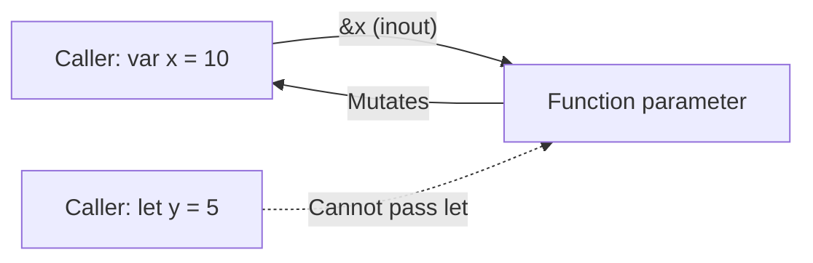
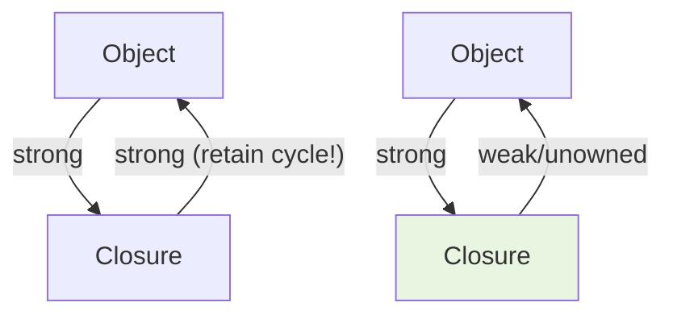

# Functions and Closures

Functions are first-class citizens in Swift — they can be assigned to variables, passed as arguments, and returned from other functions. Closures are self-contained blocks of functionality that capture their surrounding context.

## Function Syntax

A Swift function has a name, parameter list, and return type:

```swift
func greet(person: String) -> String {
    return "Hello, \(person)!"
}

let message = greet(person: "Alice")  // "Hello, Alice!"
```

Functions with no return value implicitly return `Void` (a type alias for `()`):

```swift
func logMessage(_ message: String) {
    print("[LOG] \(message)")
}
```

### Single-Expression Functions

When the body is a single expression, the `return` keyword is implicit:

```swift
func square(_ n: Int) -> Int { n * n }

func isEven(_ n: Int) -> Bool { n % 2 == 0 }
```

## Parameters

### Argument Labels and Parameter Names

Swift distinguishes between the external argument label (used at the call site) and the internal parameter name (used inside the function):

```swift
func move(from source: String, to destination: String) {
    print("Moving from \(source) to \(destination)")
}

move(from: "Berlin", to: "Munich")  // Reads like English
```

Use `_` to suppress the external label:

```swift
func print(_ items: Any...) { /* ... */ }
print("no label needed")
```

### Default Parameter Values

```swift
func connect(host: String, port: Int = 443, timeout: Double = 30.0) {
    print("Connecting to \(host):\(port) with \(timeout)s timeout")
}

connect(host: "api.example.com")                    // Uses defaults
connect(host: "api.example.com", port: 8080)        // Override port
connect(host: "api.example.com", timeout: 5.0)      // Override timeout
```

### Variadic Parameters

A function can accept zero or more values of a specified type:

```swift
func average(_ numbers: Double...) -> Double {
    guard !numbers.isEmpty else { return 0 }
    return numbers.reduce(0, +) / Double(numbers.count)
}

let avg = average(10, 20, 30, 40)  // 25.0
```

### In-Out Parameters

By default, function parameters are constants. Use `inout` to allow mutation of the caller's value:

```swift
func swapValues(_ a: inout Int, _ b: inout Int) {
    let temp = a
    a = b
    b = temp
}

var x = 10, y = 20
swapValues(&x, &y)  // x = 20, y = 10 (& required at call site)
```



## Return Types

### Multiple Return Values with Tuples

```swift
func minMax(in array: [Int]) -> (min: Int, max: Int)? {
    guard let first = array.first else { return nil }
    var min = first, max = first
    for value in array.dropFirst() {
        if value < min { min = value }
        if value > max { max = value }
    }
    return (min, max)
}

if let result = minMax(in: [3, 1, 4, 1, 5]) {
    print("Min: \(result.min), Max: \(result.max)")
}
```

### Functions That Never Return

Use `Never` for functions that always throw or terminate:

```swift
func fatalError(_ message: String) -> Never {
    print("FATAL: \(message)")
    abort()
}
```

## Function Types

Functions have types described by their parameter types and return type:

```swift
let operation: (Int, Int) -> Int = { $0 + $1 }

func apply(_ f: (Int, Int) -> Int, to a: Int, and b: Int) -> Int {
    f(a, b)
}

let result = apply(+, to: 5, and: 3)  // 8 — operators are functions too
```

### Returning Functions

```swift
func makeMultiplier(factor: Int) -> (Int) -> Int {
    return { number in number * factor }
}

let triple = makeMultiplier(factor: 3)
triple(7)  // 21
```

## Closures

Closures are unnamed functions that capture values from their surrounding scope. They are the same concept as lambdas or anonymous functions in other languages.

### Closure Syntax

Full form:

```swift
let sorted = names.sorted(by: { (s1: String, s2: String) -> Bool in
    return s1 < s2
})
```

Progressive simplification (Swift can infer everything):

```swift
// Inferred types
names.sorted(by: { s1, s2 in return s1 < s2 })

// Implicit return (single expression)
names.sorted(by: { s1, s2 in s1 < s2 })

// Shorthand argument names
names.sorted(by: { $0 < $1 })

// Operator function
names.sorted(by: <)
```

### Trailing Closure Syntax

When a closure is the last argument, it can be written after the parentheses:

```swift
// Standard call
UIView.animate(withDuration: 0.3, animations: {
    view.alpha = 0
})

// Trailing closure
UIView.animate(withDuration: 0.3) {
    view.alpha = 0
}

// Multiple trailing closures (Swift 5.3+)
UIView.animate(withDuration: 0.3) {
    view.alpha = 0
} completion: { finished in
    view.removeFromSuperview()
}
```

### Capture Lists

Closures capture references to variables by default. Use capture lists to control this:

```swift
var counter = 0

let increment = { [counter] in  // Captures current VALUE of counter
    print(counter)  // Always prints 0
}

counter = 10
increment()  // Prints 0, not 10
```

#### Avoiding Retain Cycles

In class-based contexts, closures capturing `self` can create retain cycles:

```swift
class NetworkManager {
    var onComplete: (() -> Void)?

    func fetch() {
        // WRONG: strong reference cycle
        onComplete = {
            self.handleResult()  // self holds onComplete, onComplete holds self
        }

        // CORRECT: weak capture breaks the cycle
        onComplete = { [weak self] in
            self?.handleResult()  // self is now Optional
        }

        // Alternative: unowned (use only when lifetime is guaranteed)
        onComplete = { [unowned self] in
            self.handleResult()  // Crashes if self is deallocated
        }
    }

    func handleResult() { /* ... */ }
}
```



### Escaping Closures

A closure is **escaping** when it outlives the function that receives it (stored for later execution):

```swift
class EventBus {
    private var handlers: [() -> Void] = []

    // @escaping required — closure stored beyond function return
    func on(event: String, handler: @escaping () -> Void) {
        handlers.append(handler)
    }
}

// Non-escaping by default — executes before function returns
func withLock(_ lock: NSLock, body: () -> Void) {
    lock.lock()
    body()       // Executed immediately
    lock.unlock()
}
```

| Characteristic | Non-Escaping (default) | Escaping (`@escaping`) |
|---|---|---|
| Lifetime | Within function scope | Beyond function return |
| `self` capture | Implicit | Must be explicit |
| Performance | Optimized (stack allocated) | Heap allocated |
| Use case | Immediate execution | Callbacks, stored closures |

### Autoclosures

`@autoclosure` wraps an expression in a closure automatically, deferring evaluation:

```swift
func assert(_ condition: @autoclosure () -> Bool, _ message: String) {
    guard condition() else {  // Only evaluated when needed
        print("Assertion failed: \(message)")
        return
    }
}

assert(2 + 2 == 4, "Math is broken")  // No need for { } at call site
```

## Higher-Order Functions

Swift's standard library provides powerful functional operations:

```swift
let numbers = [1, 2, 3, 4, 5, 6, 7, 8, 9, 10]

let evens = numbers.filter { $0 % 2 == 0 }          // [2, 4, 6, 8, 10]
let doubled = numbers.map { $0 * 2 }                 // [2, 4, 6, ..., 20]
let sum = numbers.reduce(0, +)                        // 55
let strings = numbers.map { String($0) }              // ["1", "2", ..., "10"]
let first = numbers.first { $0 > 5 }                 // Optional(6)

// Chaining
let result = numbers
    .filter { $0 % 2 == 0 }
    .map { $0 * $0 }
    .reduce(0, +)  // Sum of squares of even numbers: 220
```

## Key Takeaways

- Argument labels create expressive call sites — design them to read like sentences
- Default parameters reduce the need for function overloads
- `inout` parameters must be marked with `&` at the call site, making mutation visible
- Closures can be progressively simplified — use the shortest form that remains clear
- Capture lists (`[weak self]`, `[counter]`) prevent retain cycles and control value semantics
- Escaping closures require `@escaping` and explicit `self` — the compiler enforces this
- Higher-order functions (`map`, `filter`, `reduce`) replace most imperative loops
