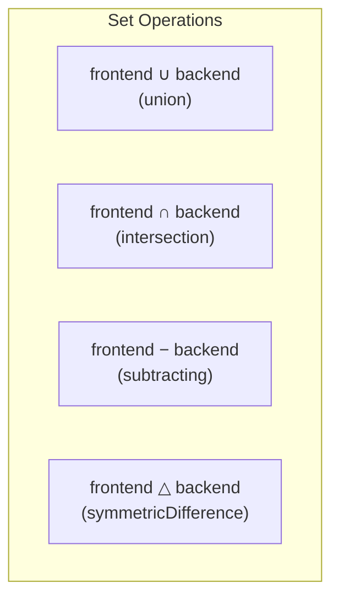

# Collections and Enumerations

Swift provides three primary collection types — Array, Set, and Dictionary — alongside enumerations that are far more powerful than their counterparts in most languages.

## Arrays

Arrays are ordered collections of values of the same type:

```swift
// Type-inferred creation
var temperatures = [72.0, 68.5, 74.2, 69.8]

// Explicit type annotation
var names: [String] = []

// Array with repeated values
let zeros = Array(repeating: 0, count: 5)  // [0, 0, 0, 0, 0]
```

### Array Operations

```swift
var fruits = ["Apple", "Banana", "Cherry"]

// Access
let first = fruits[0]           // "Apple"
let last = fruits.last          // Optional("Cherry")

// Modification
fruits.append("Date")           // Add to end
fruits.insert("Avocado", at: 1) // Insert at index
fruits.remove(at: 0)            // Remove at index
fruits.removeLast()             // Remove last element

// Querying
let count = fruits.count        // Number of elements
let empty = fruits.isEmpty      // false
let hasCherry = fruits.contains("Cherry")  // true

// Transformation
let uppercased = fruits.map { $0.uppercased() }
let short = fruits.filter { $0.count < 6 }
let sorted = fruits.sorted()    // New sorted array (non-mutating)
fruits.sort()                    // In-place sort (mutating)
```

### Array Slicing

```swift
let numbers = [0, 1, 2, 3, 4, 5, 6, 7, 8, 9]

let firstThree = numbers[0..<3]      // [0, 1, 2] — ArraySlice
let lastThree = numbers.suffix(3)     // [7, 8, 9]
let middle = numbers[3...6]           // [3, 4, 5, 6]

// Convert slice back to Array
let sliceArray = Array(numbers[2..<5])  // [2, 3, 4]
```

## Sets

Sets are unordered collections of unique values. They provide O(1) lookup and support mathematical set operations:

```swift
var languages: Set<String> = ["Swift", "Python", "Rust"]
languages.insert("Go")
languages.insert("Swift")  // No effect — already present

let contains = languages.contains("Rust")  // true — O(1) lookup
```

### Set Operations

```swift
let frontend: Set = ["JavaScript", "TypeScript", "Swift"]
let backend: Set = ["Python", "Go", "Rust", "Swift"]

let all = frontend.union(backend)              // All languages
let shared = frontend.intersection(backend)     // {"Swift"}
let onlyFrontend = frontend.subtracting(backend)  // {"JavaScript", "TypeScript"}
let exclusive = frontend.symmetricDifference(backend)  // All except "Swift"
```



| Operation | Method | Result |
|-----------|--------|--------|
| Union | `a.union(b)` | All elements from both sets |
| Intersection | `a.intersection(b)` | Elements in both sets |
| Subtraction | `a.subtracting(b)` | Elements in `a` but not in `b` |
| Symmetric Difference | `a.symmetricDifference(b)` | Elements in either but not both |

## Dictionaries

Dictionaries store key-value pairs with O(1) average lookup:

```swift
var statusCodes: [Int: String] = [
    200: "OK",
    404: "Not Found",
    500: "Internal Server Error"
]

// Access (always returns Optional)
let message = statusCodes[200]     // Optional("OK")
let missing = statusCodes[999]     // nil

// Default value for missing keys
let desc = statusCodes[418, default: "Unknown"]  // "Unknown"

// Modification
statusCodes[201] = "Created"       // Add new pair
statusCodes[404] = "Missing"       // Update existing
statusCodes[500] = nil             // Remove key

// Iteration
for (code, description) in statusCodes {
    print("\(code): \(description)")
}

// Transform values
let uppercased = statusCodes.mapValues { $0.uppercased() }
```

### Grouping and Counting

```swift
let words = ["apple", "banana", "avocado", "blueberry", "cherry"]

// Group by first character
let grouped = Dictionary(grouping: words) { $0.first! }
// ["a": ["apple", "avocado"], "b": ["banana", "blueberry"], "c": ["cherry"]]

// Count occurrences
let text = "hello world"
let charCounts = Dictionary(text.map { ($0, 1) }, uniquingKeysWith: +)
// ["h": 1, "e": 1, "l": 3, "o": 2, " ": 1, "w": 1, "r": 1, "d": 1]
```

## Collection Comparison

| Feature | Array | Set | Dictionary |
|---------|-------|-----|------------|
| Ordered | ✅ | ❌ | ❌ |
| Duplicates allowed | ✅ | ❌ | Keys: ❌, Values: ✅ |
| Access by index | ✅ O(1) | ❌ | ❌ |
| Access by key | ❌ | ❌ | ✅ O(1) |
| Contains check | O(n) | O(1) | O(1) for keys |
| Use when | Order matters | Uniqueness matters | Key-value mapping |

## Enumerations

Swift enumerations are algebraic data types — they can carry associated values, conform to protocols, have methods, and be generic.

### Basic Enumerations

```swift
enum Direction {
    case north, south, east, west
}

var heading = Direction.north
heading = .east  // Type is already known
```

### Raw Values

Enumerations can store a pre-populated raw value:

```swift
enum Planet: Int {
    case mercury = 1, venus, earth, mars  // Auto-increments: 2, 3, 4
}

enum HTTPMethod: String {
    case get = "GET"
    case post = "POST"
    case put = "PUT"
    case delete = "DELETE"
}

// Convert between raw value and enum
let earth = Planet(rawValue: 3)         // Optional(Planet.earth)
let method = HTTPMethod(rawValue: "POST")  // Optional(HTTPMethod.post)
let raw = HTTPMethod.get.rawValue       // "GET"
```

### Associated Values

The defining feature of Swift enums — each case can carry different associated data:

```swift
enum NetworkResult {
    case success(data: Data, statusCode: Int)
    case failure(error: Error, retryAfter: TimeInterval?)
    case loading(progress: Double)
}

let result = NetworkResult.success(data: someData, statusCode: 200)
```

### Pattern Matching with Switch

```swift
func handle(_ result: NetworkResult) {
    switch result {
    case .success(let data, let statusCode) where statusCode == 200:
        process(data)
    case .success(_, let statusCode):
        print("Unexpected success code: \(statusCode)")
    case .failure(let error, let retry) where retry != nil:
        scheduleRetry(after: retry!, for: error)
    case .failure(let error, _):
        showError(error)
    case .loading(let progress) where progress > 0.9:
        showAlmostDone()
    case .loading(let progress):
        updateProgressBar(progress)
    }
}
```

### If-Case and Guard-Case

For matching a single case without a full `switch`:

```swift
if case .success(let data, 200) = result {
    process(data)
}

guard case .loading(let progress) = currentState else {
    return
}
print("Loading: \(Int(progress * 100))%")
```

### CaseIterable

Automatically generates a collection of all cases (only for enums without associated values):

```swift
enum Season: CaseIterable {
    case spring, summer, autumn, winter
}

for season in Season.allCases {
    print(season)  // spring, summer, autumn, winter
}

let count = Season.allCases.count  // 4
```

### Enums with Methods and Properties

```swift
enum Suit: String, CaseIterable {
    case hearts = "♥️"
    case diamonds = "♦️"
    case clubs = "♣️"
    case spades = "♠️"

    var color: String {
        switch self {
        case .hearts, .diamonds: return "Red"
        case .clubs, .spades: return "Black"
        }
    }

    var isRed: Bool { color == "Red" }
}

let suit = Suit.hearts
print(suit.rawValue)  // "♥️"
print(suit.color)     // "Red"
```

### Recursive Enumerations

Use `indirect` for enums that reference themselves:

```swift
indirect enum ArithmeticExpression {
    case number(Int)
    case addition(ArithmeticExpression, ArithmeticExpression)
    case multiplication(ArithmeticExpression, ArithmeticExpression)
}

func evaluate(_ expr: ArithmeticExpression) -> Int {
    switch expr {
    case .number(let value):
        return value
    case .addition(let left, let right):
        return evaluate(left) + evaluate(right)
    case .multiplication(let left, let right):
        return evaluate(left) * evaluate(right)
    }
}

// (5 + 3) * 2
let expression = ArithmeticExpression.multiplication(
    .addition(.number(5), .number(3)),
    .number(2)
)
evaluate(expression)  // 16
```

## Pattern Matching Beyond Switch

Swift's pattern matching works in multiple contexts:

```swift
let coordinates = [(0, 0), (1, 0), (0, 2), (3, 4)]

// For-in with pattern matching
for case let (x, y) in coordinates where x == 0 {
    print("On Y-axis: (0, \(y))")
}

// Optional pattern
let values: [Int?] = [1, nil, 3, nil, 5]
for case let value? in values {
    print(value)  // 1, 3, 5 — skips nils
}
```

## Key Takeaways

- Arrays for ordered data, Sets for unique values with fast lookup, Dictionaries for key-value mappings
- Set operations (union, intersection, subtraction) replace complex manual filtering logic
- Dictionary access always returns an optional — use `default:` parameter or optional binding
- Swift enums with associated values are algebraic data types — far more powerful than integer enums in C
- `CaseIterable` provides automatic iteration over cases without associated values
- Pattern matching with `switch`, `if case`, and `guard case` provides exhaustive, type-safe handling
- Recursive enums require the `indirect` keyword to allow self-referencing cases
