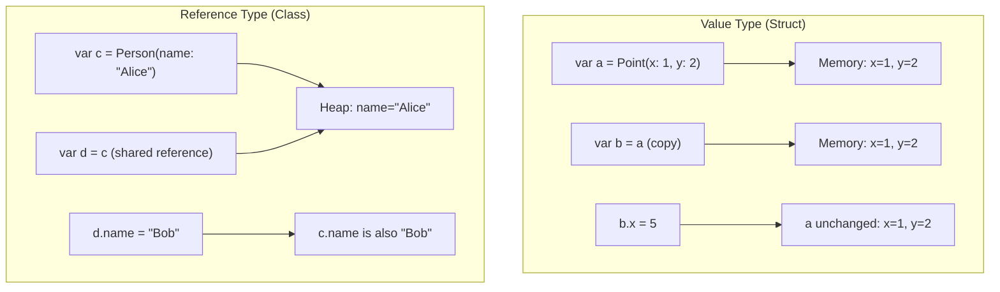
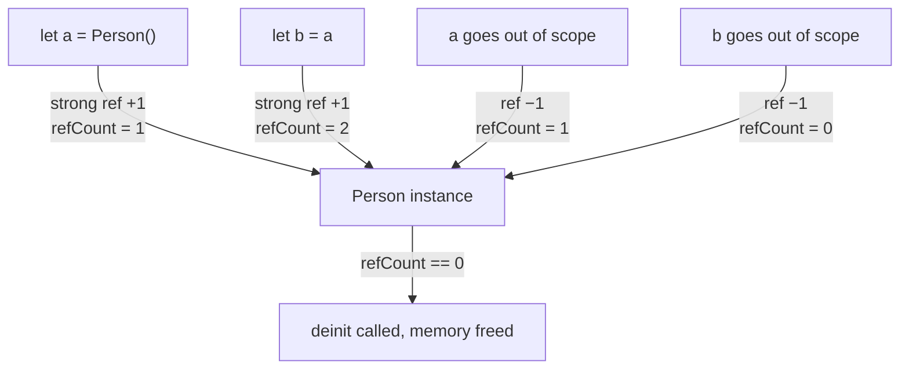

# Structs and Classes

Swift provides two mechanisms for defining custom types: structs (value types) and classes (reference types). Understanding their differences is fundamental to writing correct Swift code.

## Value Types vs Reference Types



| Characteristic | Struct (Value Type) | Class (Reference Type) |
|---|---|---|
| Storage | Stack (usually) | Heap |
| Assignment | Copies the value | Copies the reference |
| Identity | No identity — equality by value | Has identity (`===` operator) |
| Mutability | `mutating` keyword required | Mutable through any reference |
| Inheritance | ❌ | ✅ |
| Deinitializers | ❌ | ✅ (`deinit`) |
| Reference counting | ❌ | ✅ (ARC) |

### When to Use Which

**Use structs** (the default choice) when:
- The data is fundamentally a value (coordinates, sizes, colors)
- You want copy semantics — independent copies that don't affect each other
- The data will be used across threads (value types are inherently thread-safe)
- No need for inheritance

**Use classes** when:
- You need identity (two variables should reference the same instance)
- You need inheritance hierarchies
- You need deinitializers for resource cleanup
- You're interoperating with Objective-C or reference-based frameworks

## Structs

```swift
struct Point {
    var x: Double
    var y: Double

    // Computed property
    var magnitude: Double {
        (x * x + y * y).squareRoot()
    }

    // Mutating method — required to modify self in a value type
    mutating func translate(dx: Double, dy: Double) {
        x += dx
        y += dy
    }

    // Non-mutating method
    func distance(to other: Point) -> Double {
        let dx = x - other.x
        let dy = y - other.y
        return (dx * dx + dy * dy).squareRoot()
    }
}

var origin = Point(x: 0, y: 0)  // Memberwise initializer (auto-generated)
origin.translate(dx: 3, dy: 4)
print(origin.magnitude)  // 5.0
```

### Memberwise Initializer

Structs automatically get a memberwise initializer. It's lost if you define a custom one (unless you place the custom init in an extension):

```swift
struct Size {
    var width: Double
    var height: Double
    var area: Double { width * height }
}

// Auto-generated: Size(width:height:)
let box = Size(width: 10, height: 5)

// Preserve memberwise init by extending
extension Size {
    init(square side: Double) {
        self.init(width: side, height: side)
    }
}
```

## Classes

```swift
class Vehicle {
    let make: String
    let model: String
    var mileage: Double

    init(make: String, model: String, mileage: Double = 0) {
        self.make = make
        self.model = model
        self.mileage = mileage
    }

    func drive(miles: Double) {
        mileage += miles  // No 'mutating' needed — classes are reference types
    }

    deinit {
        print("\(make) \(model) is being deallocated")
    }
}

let car = Vehicle(make: "Tesla", model: "Model 3")
let reference = car  // Both point to the SAME instance
reference.drive(miles: 100)
print(car.mileage)  // 100 — same object
```

### Identity Operators

```swift
let car1 = Vehicle(make: "BMW", model: "M3")
let car2 = car1        // Same reference
let car3 = Vehicle(make: "BMW", model: "M3")  // Different instance

car1 === car2  // true — same object
car1 === car3  // false — different object, even with same values
```

## Properties

### Stored Properties

```swift
struct Person {
    let id: UUID           // Constant stored property
    var name: String       // Variable stored property
    lazy var avatar: UIImage = loadAvatar()  // Lazy — computed on first access
}
```

`lazy` properties are computed only once, on first access. They must be `var` because their value is set after initialization.

### Computed Properties

Computed properties calculate a value each time they're accessed:

```swift
struct Circle {
    var radius: Double

    var diameter: Double {
        get { radius * 2 }
        set { radius = newValue / 2 }  // newValue is the implicit parameter
    }

    // Read-only computed (get-only, simplified syntax)
    var area: Double {
        .pi * radius * radius
    }

    var circumference: Double {
        2 * .pi * radius
    }
}

var circle = Circle(radius: 5)
print(circle.area)        // ~78.54
circle.diameter = 20      // Sets radius to 10
print(circle.radius)      // 10.0
```

### Property Observers

Observe and respond to changes in stored properties:

```swift
struct StepTracker {
    var totalSteps: Int = 0 {
        willSet {
            print("About to change from \(totalSteps) to \(newValue)")
        }
        didSet {
            if totalSteps > oldValue {
                print("Added \(totalSteps - oldValue) steps")
            }
        }
    }
}

var tracker = StepTracker()
tracker.totalSteps = 100   // willSet fires, then didSet
tracker.totalSteps = 250   // "Added 150 steps"
```

| Observer | Timing | Available Value |
|----------|--------|-----------------|
| `willSet` | Before the change | `newValue` (the incoming value) |
| `didSet` | After the change | `oldValue` (the previous value) |

### Type Properties and Methods

```swift
struct AppConfig {
    static let version = "2.1.0"           // Type property (stored)
    static var isDebug = false             // Mutable type property
    static var buildInfo: String {         // Type computed property
        "\(version) (\(isDebug ? "Debug" : "Release"))"
    }

    static func reset() {                  // Type method
        isDebug = false
    }
}

print(AppConfig.version)     // "2.1.0"
print(AppConfig.buildInfo)   // "2.1.0 (Release)"
```

## Initializers

### Designated and Convenience Initializers (Classes)

```swift
class Food {
    let name: String
    let calories: Int

    // Designated initializer — fully initializes all properties
    init(name: String, calories: Int) {
        self.name = name
        self.calories = calories
    }

    // Convenience initializer — delegates to designated
    convenience init(name: String) {
        self.init(name: name, calories: 0)
    }
}
```

### Failable Initializers

Return `nil` if initialization fails:

```swift
struct URL {
    let scheme: String
    let host: String

    init?(string: String) {
        guard string.contains("://") else { return nil }
        let parts = string.components(separatedBy: "://")
        guard parts.count == 2 else { return nil }
        scheme = parts[0]
        host = parts[1]
    }
}

let valid = URL(string: "https://example.com")    // Optional(URL)
let invalid = URL(string: "not a url")             // nil
```

### Required Initializers (Classes)

```swift
class SerializableObject {
    required init(from data: Data) {
        // Subclasses MUST override this
    }
}
```

## Automatic Reference Counting (ARC)

ARC automatically manages memory for class instances by tracking how many references point to each object:



### Strong Reference Cycles

Two objects holding strong references to each other will never be deallocated:

```swift
class Person {
    let name: String
    var apartment: Apartment?
    init(name: String) { self.name = name }
    deinit { print("\(name) deinitialized") }
}

class Apartment {
    let unit: String
    weak var tenant: Person?  // weak breaks the cycle
    init(unit: String) { self.unit = unit }
    deinit { print("Apartment \(unit) deinitialized") }
}
```

### Reference Strength

| Type | Syntax | Increments ref count | Becomes nil when target is freed | Use case |
|------|--------|---------------------|----------------------------------|----------|
| Strong | (default) | ✅ | N/A (keeps target alive) | Ownership |
| Weak | `weak var` | ❌ | ✅ (becomes nil) | Optional back-references |
| Unowned | `unowned let` | ❌ | ❌ (dangling — crashes) | Non-optional, same lifetime |

### Rules for Choosing

- **`weak`** — when the referenced object may be deallocated first (e.g., delegates, parent references)
- **`unowned`** — when you guarantee the reference will always be valid (same or longer lifetime)
- **Strong** — the default; expresses ownership

## Inheritance (Classes Only)

```swift
class Shape {
    var color: String = "black"

    func area() -> Double {
        fatalError("Subclasses must override area()")
    }

    final func describe() -> String {  // Cannot be overridden
        "A \(color) shape with area \(area())"
    }
}

class Rectangle: Shape {
    var width: Double
    var height: Double

    init(width: Double, height: Double) {
        self.width = width
        self.height = height
        super.init()  // Call superclass init
    }

    override func area() -> Double {
        width * height
    }
}
```

## Key Takeaways

- Prefer structs by default — they're simpler, thread-safe, and the compiler optimizes them aggressively
- Classes are for shared mutable state, identity, inheritance, or Objective-C interop
- Value types are copied on assignment; reference types share a single instance
- Property observers (`willSet`/`didSet`) let you react to changes without custom setters
- Computed properties provide derived values without storing redundant data
- ARC manages class instance memory automatically, but cycles require `weak` or `unowned`
- Use `weak` for optional references that may become nil; `unowned` only with lifetime guarantees
- Place custom initializers in extensions to preserve the auto-generated memberwise init
