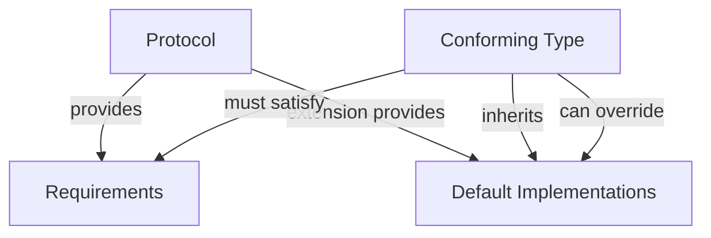
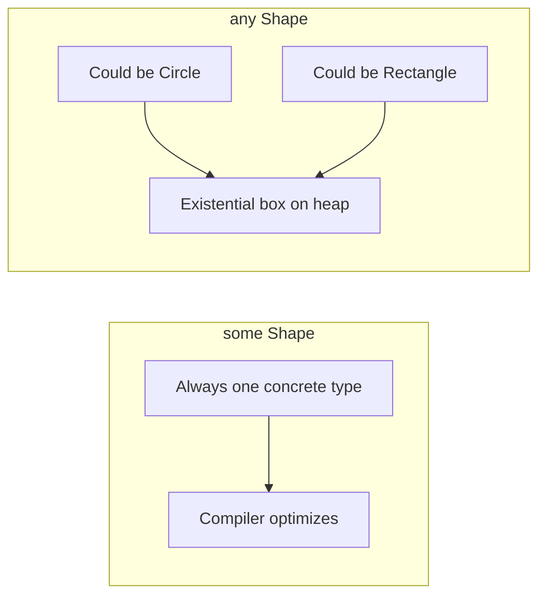

# Protocols and Generics

Swift is a protocol-oriented language. Protocols define contracts that types must fulfill, while generics enable code reuse across types. Together, they form the backbone of Swift's abstraction system.

## Protocols

A protocol defines a blueprint of methods, properties, and requirements:

```swift
protocol Drawable {
    var boundingBox: CGRect { get }
    func draw(on canvas: Canvas)
}

protocol Resizable {
    mutating func resize(by factor: Double)
}
```

### Property Requirements

Protocols specify whether properties must be gettable or gettable-and-settable:

```swift
protocol Named {
    var name: String { get }        // Read-only requirement
    var nickname: String { get set } // Read-write requirement
}

// Conforming with stored property (satisfies both get and get/set)
struct User: Named {
    var name: String       // var satisfies { get }
    var nickname: String   // var satisfies { get set }
}

// Conforming with computed property
struct AnonymousUser: Named {
    var name: String { "Anonymous" }        // Computed, read-only
    var nickname: String {                   // Computed, read-write
        get { "Anon" }
        set { /* ignore */ }
    }
}
```

### Method Requirements

```swift
protocol DataSource {
    func numberOfItems() -> Int
    func item(at index: Int) -> String
    mutating func addItem(_ item: String)  // mutating for value types
}
```

### Protocol Conformance

```swift
struct Circle: Drawable, Resizable {
    var center: CGPoint
    var radius: Double

    var boundingBox: CGRect {
        CGRect(x: center.x - radius, y: center.y - radius,
               width: radius * 2, height: radius * 2)
    }

    func draw(on canvas: Canvas) {
        canvas.drawCircle(center: center, radius: radius)
    }

    mutating func resize(by factor: Double) {
        radius *= factor
    }
}
```

### Protocol Inheritance

Protocols can inherit from other protocols:

```swift
protocol Shape: Drawable {
    var area: Double { get }
    var perimeter: Double { get }
}

// A type conforming to Shape must satisfy Shape + Drawable requirements
```

## Protocol Extensions

Protocol extensions provide default implementations — the foundation of protocol-oriented programming:

```swift
protocol Describable {
    var description: String { get }
}

extension Describable {
    var description: String {
        "A \(type(of: self)) instance"
    }

    func printDescription() {
        print(description)
    }
}

struct Point: Describable {
    var x: Double, y: Double
    // Gets default description for free, or can override:
    var description: String { "(\(x), \(y))" }
}
```

### Conditional Conformance

Extend a type to conform to a protocol only when certain conditions are met:

```swift
// Array conforms to Equatable only when its Element is Equatable
extension Array: Equatable where Element: Equatable {
    // == is automatically synthesized
}

// Custom conditional conformance
extension Array: Describable where Element: Describable {
    var description: String {
        let items = map(\.description).joined(separator: ", ")
        return "[\(items)]"
    }
}
```



## Associated Types

Protocols can define placeholder types that conforming types fill in:

```swift
protocol Container {
    associatedtype Item
    var count: Int { get }
    mutating func append(_ item: Item)
    subscript(i: Int) -> Item { get }
}

struct Stack<Element>: Container {
    // Item is inferred as Element
    private var items: [Element] = []
    var count: Int { items.count }

    mutating func append(_ item: Element) {
        items.append(item)
    }

    subscript(i: Int) -> Element {
        items[i]
    }
}
```

### Constraining Associated Types

```swift
protocol SortableContainer: Container where Item: Comparable {
    func sorted() -> [Item]
}

extension SortableContainer {
    func sorted() -> [Item] {
        (0..<count).map { self[$0] }.sorted()
    }
}
```

## Generics

Generics let you write flexible, reusable code that works with any type meeting specified constraints:

```swift
func swapValues<T>(_ a: inout T, _ b: inout T) {
    let temp = a
    a = b
    b = temp
}

var x = 10, y = 20
swapValues(&x, &y)  // Works with Int

var s1 = "hello", s2 = "world"
swapValues(&s1, &s2)  // Works with String
```

### Generic Types

```swift
struct Queue<Element> {
    private var elements: [Element] = []

    var isEmpty: Bool { elements.isEmpty }
    var count: Int { elements.count }

    mutating func enqueue(_ element: Element) {
        elements.append(element)
    }

    mutating func dequeue() -> Element? {
        isEmpty ? nil : elements.removeFirst()
    }

    var peek: Element? { elements.first }
}

var intQueue = Queue<Int>()
intQueue.enqueue(1)
intQueue.enqueue(2)
intQueue.dequeue()  // Optional(1)
```

### Type Constraints

Restrict generic types to those conforming to specific protocols:

```swift
// T must be Comparable
func binarySearch<T: Comparable>(in array: [T], for target: T) -> Int? {
    var low = 0, high = array.count - 1
    while low <= high {
        let mid = (low + high) / 2
        if array[mid] == target { return mid }
        else if array[mid] < target { low = mid + 1 }
        else { high = mid - 1 }
    }
    return nil
}

// Multiple constraints with where clause
func compareContainers<C1: Container, C2: Container>(
    _ c1: C1, _ c2: C2
) -> Bool where C1.Item == C2.Item, C1.Item: Equatable {
    guard c1.count == c2.count else { return false }
    for i in 0..<c1.count {
        if c1[i] != c2[i] { return false }
    }
    return true
}
```

## Opaque Types (`some`)

Opaque types hide the concrete type while preserving type identity. The compiler knows the specific type, but the caller sees only the protocol:

```swift
// Returns SOME specific type conforming to Shape — always the same type
func makeSquare(side: Double) -> some Shape {
    Rectangle(width: side, height: side)
}

// The caller knows it's a Shape but not which one
let shape = makeSquare(side: 5)
print(shape.area)  // Works — Shape requires area
```

Key rules of `some`:
- The function always returns the **same concrete type** (not different types per call)
- The compiler preserves full type information for optimization
- Used extensively in SwiftUI: `var body: some View`

### Why Not Just Return the Protocol?

```swift
// Returning protocol type (existential) — loses type information
func makeShape() -> Shape { /* could return Circle OR Rectangle */ }

// Returning opaque type — preserves type identity
func makeShape() -> some Shape { Rectangle(width: 5, height: 3) }
```

## Existential Types (`any`)

Existential types (boxes) hold any value conforming to a protocol. Since Swift 5.6, use `any` to make this explicit:

```swift
// Existential — can hold ANY type conforming to Shape
var shapes: [any Shape] = [
    Circle(radius: 5),
    Rectangle(width: 3, height: 4)
]

// Function accepting any conforming type
func printArea(of shape: any Shape) {
    print("Area: \(shape.area)")
}
```

### `some` vs `any`

| Feature | `some Protocol` (Opaque) | `any Protocol` (Existential) |
|---------|--------------------------|------------------------------|
| Concrete type known to compiler | ✅ | ❌ |
| Can hold different types | ❌ (always same type) | ✅ |
| Performance | Optimized (no boxing) | Heap allocation (boxed) |
| Can use `Self` or associated types | ✅ | ❌ (with limitations) |
| Use case | Return types, SwiftUI views | Heterogeneous collections |



## Protocol-Oriented Programming in Practice

### Composition Over Inheritance

```swift
protocol Identifiable {
    var id: UUID { get }
}

protocol Timestamped {
    var createdAt: Date { get }
    var updatedAt: Date { get set }
}

protocol Validatable {
    func validate() throws
}

// Compose protocols for specific needs
typealias PersistableEntity = Identifiable & Timestamped & Validatable

struct Order: PersistableEntity {
    let id = UUID()
    let createdAt = Date()
    var updatedAt = Date()

    var items: [String]

    func validate() throws {
        guard !items.isEmpty else {
            throw ValidationError.empty("Order must have items")
        }
    }
}
```

### Protocol Witnesses (Manual Conformance Pattern)

For cases where protocol conformance isn't appropriate (testing, configuration):

```swift
struct Logger {
    var log: (String) -> Void

    static let live = Logger { message in
        print("[LOG] \(message)")
    }

    static let silent = Logger { _ in }

    static let test = Logger { message in
        testOutput.append(message)
    }
}
```

## Key Takeaways

- Protocols define contracts; protocol extensions provide default behavior — together they enable protocol-oriented programming
- Prefer composition of small protocols over deep class inheritance hierarchies
- Associated types make protocols generic; constrain them with `where` clauses
- `some` (opaque types) hides the concrete type while preserving identity — the compiler knows the exact type
- `any` (existential types) enables heterogeneous collections at the cost of boxing overhead
- Use `some` for return types when you always return the same concrete type (SwiftUI pattern)
- Use `any` when you need to store different conforming types in the same collection
- Conditional conformance (`extension Array: P where Element: P`) enables powerful generic programming
- Generic constraints should be as narrow as possible — don't require `Equatable` if you only need `Hashable`
