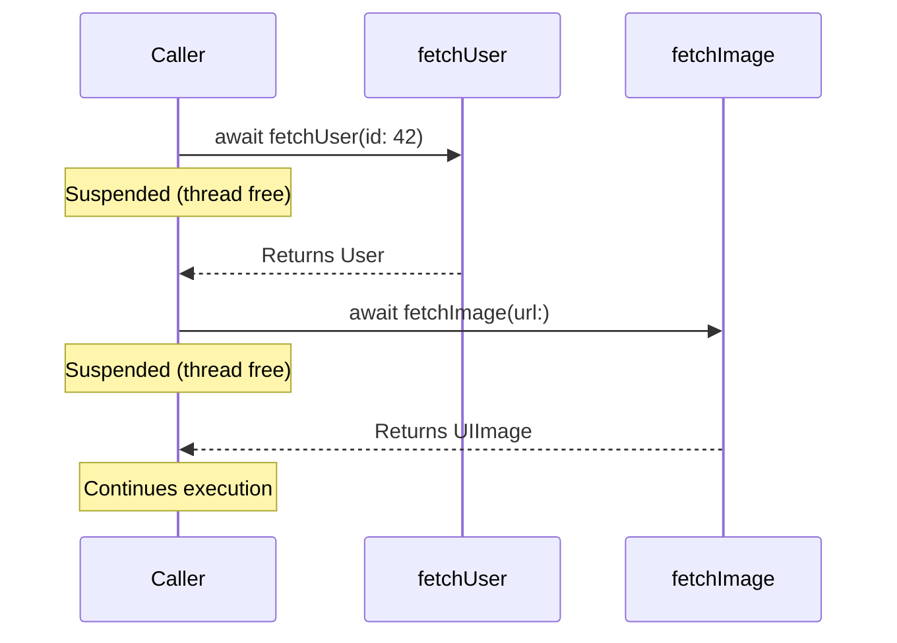
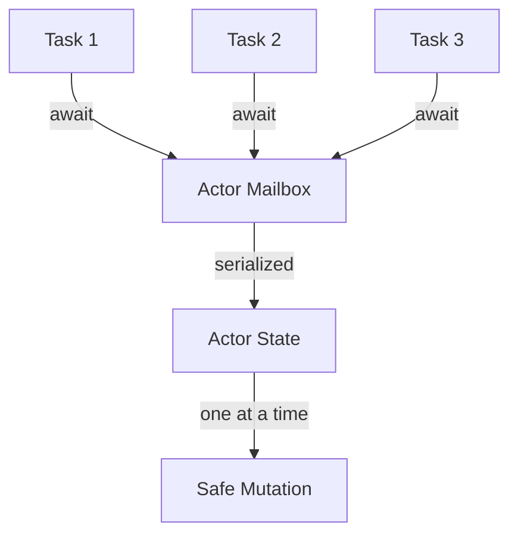

# Error Handling and Concurrency

Swift provides structured error handling with `throws`/`try`/`catch` and modern concurrency with `async`/`await`, actors, and structured task hierarchies.

## Error Handling

### Defining Errors

Errors conform to the `Error` protocol (usually implemented with enums):

```swift
enum NetworkError: Error {
    case invalidURL
    case noConnection
    case timeout(seconds: Int)
    case httpError(statusCode: Int, message: String)
}

enum ValidationError: Error, LocalizedError {
    case tooShort(minimum: Int)
    case invalidFormat(expected: String)

    var errorDescription: String? {
        switch self {
        case .tooShort(let min):
            return "Input must be at least \(min) characters"
        case .invalidFormat(let expected):
            return "Expected format: \(expected)"
        }
    }
}
```

### Throwing and Catching

```swift
func fetchUser(id: Int) throws -> User {
    guard id > 0 else {
        throw ValidationError.invalidFormat(expected: "positive integer")
    }

    let response = try makeRequest(url: "/users/\(id)")

    guard response.statusCode == 200 else {
        throw NetworkError.httpError(
            statusCode: response.statusCode,
            message: response.body
        )
    }

    return try decode(response.body)
}

// Calling throwing functions
do {
    let user = try fetchUser(id: 42)
    print("Got user: \(user.name)")
} catch NetworkError.httpError(404, _) {
    print("User not found")
} catch NetworkError.timeout(let seconds) {
    print("Request timed out after \(seconds)s")
} catch {
    print("Unexpected error: \(error)")  // 'error' is implicit
}
```

### Try Variants

| Syntax | Behavior | Use When |
|--------|----------|----------|
| `try` | Propagates error to caller | Inside a `do-catch` or throwing function |
| `try?` | Returns `nil` on error | You don't care about the specific error |
| `try!` | Crashes on error | You're certain it won't fail (rare) |

```swift
// try? — converts to optional
let user = try? fetchUser(id: 42)  // User? — nil if any error

// Combine with nil coalescing
let name = (try? fetchUser(id: 1))?.name ?? "Unknown"

// try! — force (crashes on error)
let config = try! loadConfig()  // Only for truly impossible failures
```

### Rethrowing Functions

Functions that only throw if their closure argument throws:

```swift
func withRetry<T>(attempts: Int, body: () throws -> T) rethrows -> T {
    for attempt in 1...attempts {
        do {
            return try body()
        } catch {
            if attempt == attempts { throw error }
            print("Attempt \(attempt) failed, retrying...")
        }
    }
    fatalError("Unreachable")
}

// If the body doesn't throw, no try needed at call site
let result = withRetry(attempts: 3) { "always succeeds" }

// If the body throws, try is required
let data = try withRetry(attempts: 3) { try fetchData() }
```

## The Result Type

`Result<Success, Failure>` encapsulates either a success value or an error:

```swift
enum Result<Success, Failure: Error> {
    case success(Success)
    case failure(Failure)
}

func fetchUserResult(id: Int) -> Result<User, NetworkError> {
    guard id > 0 else {
        return .failure(.invalidURL)
    }
    // ...
    return .success(user)
}

// Usage
switch fetchUserResult(id: 42) {
case .success(let user):
    print("User: \(user.name)")
case .failure(let error):
    print("Error: \(error)")
}

// Convert Result to throwing
let user = try fetchUserResult(id: 42).get()  // Throws on .failure
```

## Async/Await

Swift's structured concurrency replaces callback-based async code with linear, readable control flow:

```swift
// Async function
func fetchImage(url: URL) async throws -> UIImage {
    let (data, response) = try await URLSession.shared.data(from: url)

    guard let httpResponse = response as? HTTPURLResponse,
          httpResponse.statusCode == 200 else {
        throw NetworkError.httpError(statusCode: 0, message: "Bad response")
    }

    guard let image = UIImage(data: data) else {
        throw NetworkError.invalidURL
    }

    return image
}

// Calling async functions
func loadProfile() async throws -> Profile {
    let user = try await fetchUser(id: 42)
    let avatar = try await fetchImage(url: user.avatarURL)
    return Profile(user: user, avatar: avatar)
}
```



### Parallel Async Execution

```swift
// Sequential (slower) — each awaits before the next starts
func loadDashboard() async throws -> Dashboard {
    let user = try await fetchUser()
    let posts = try await fetchPosts()     // Waits for user first
    let notifications = try await fetchNotifications()  // Waits for posts
    return Dashboard(user: user, posts: posts, notifications: notifications)
}

// Parallel (faster) — async let starts all concurrently
func loadDashboard() async throws -> Dashboard {
    async let user = fetchUser()
    async let posts = fetchPosts()
    async let notifications = fetchNotifications()

    // All three run concurrently; we await them together
    return try await Dashboard(user: user, posts: posts, notifications: notifications)
}
```

## Tasks

Tasks are the unit of concurrency. They define a context for async work:

```swift
// Unstructured task — runs independently
Task {
    let data = try await fetchData()
    await MainActor.run {
        self.data = data  // Update UI on main thread
    }
}

// Detached task — no inherited context
Task.detached(priority: .background) {
    await processLargeDataset()
}

// Task cancellation
let task = Task {
    for i in 0..<1000 {
        try Task.checkCancellation()  // Throws if cancelled
        await process(item: i)
    }
}

// Later...
task.cancel()  // Cooperative cancellation
```

### Task Groups

For dynamic numbers of concurrent operations:

```swift
func fetchAllImages(urls: [URL]) async throws -> [UIImage] {
    try await withThrowingTaskGroup(of: UIImage.self) { group in
        for url in urls {
            group.addTask {
                try await fetchImage(url: url)
            }
        }

        var images: [UIImage] = []
        for try await image in group {
            images.append(image)
        }
        return images
    }
}
```

## Actors

Actors protect mutable state from data races by serializing access:

```swift
actor BankAccount {
    let owner: String
    private(set) var balance: Double

    init(owner: String, balance: Double) {
        self.owner = owner
        self.balance = balance
    }

    func deposit(_ amount: Double) {
        balance += amount
    }

    func withdraw(_ amount: Double) throws {
        guard balance >= amount else {
            throw BankError.insufficientFunds
        }
        balance -= amount
    }
}

// Access requires await (actor isolation)
let account = BankAccount(owner: "Alice", balance: 1000)
try await account.withdraw(500)
let balance = await account.balance  // Reading also requires await
```



### Global Actors

`@MainActor` ensures code runs on the main thread (essential for UI updates):

```swift
@MainActor
class ViewModel: ObservableObject {
    @Published var items: [Item] = []
    @Published var isLoading = false

    func refresh() async {
        isLoading = true
        items = try? await fetchItems()
        isLoading = false
    }
}
```

### Nonisolated

Opt out of actor isolation for properties or methods that don't access mutable state:

```swift
actor Cache {
    let maxSize: Int  // Immutable — safe to read without isolation
    private var storage: [String: Data] = [:]

    nonisolated var description: String {
        "Cache with max size \(maxSize)"  // Only reads 'let' property
    }
}
```

## Sendable

`Sendable` marks types safe to transfer across concurrency boundaries:

```swift
// Value types are implicitly Sendable
struct Point: Sendable {
    var x: Double
    var y: Double
}

// Classes must explicitly conform and be carefully designed
final class ImmutableConfig: Sendable {
    let apiKey: String  // All stored properties must be immutable or Sendable
    let timeout: TimeInterval

    init(apiKey: String, timeout: TimeInterval) {
        self.apiKey = apiKey
        self.timeout = timeout
    }
}

// @Sendable closures
func runInBackground(_ work: @Sendable () async -> Void) {
    Task.detached { await work() }
}
```

| Type | Sendable? | Reason |
|------|-----------|--------|
| Structs with Sendable properties | ✅ Implicit | Value semantics = safe to copy |
| Enums with Sendable associated values | ✅ Implicit | Same as structs |
| Actors | ✅ Always | Access is serialized |
| `final class` with only `let` Sendable properties | ✅ Explicit | Immutable = safe |
| Mutable class | ❌ | Shared mutable state = data race |

## Structured Concurrency

Structured concurrency ensures that child tasks don't outlive their parent:

```swift
func processOrder(_ order: Order) async throws -> Receipt {
    // These tasks are STRUCTURED — they're scoped to this function
    async let validation = validate(order)
    async let inventory = checkInventory(order.items)

    let (isValid, hasStock) = try await (validation, inventory)

    guard isValid && hasStock else {
        throw OrderError.cannotFulfill
    }

    // If this function throws or returns, child tasks are automatically cancelled
    return try await chargeAndShip(order)
}
```

Benefits of structured concurrency:
- Automatic cancellation propagation
- No leaked tasks
- Clear lifetimes visible in code structure
- Parent waits for all children before returning

## Key Takeaways

- Use `throws`/`try`/`catch` for synchronous error handling; define domain-specific error enums
- `try?` is ideal when you only care about success/failure, not the specific error
- `Result` is useful for storing outcomes or working with completion-handler APIs
- `async`/`await` makes asynchronous code read like synchronous code
- `async let` runs operations in parallel; `await` collects results
- Actors serialize access to mutable state — the compiler enforces isolation
- `@MainActor` guarantees code runs on the main thread (required for UI)
- `Sendable` marks types safe to cross concurrency boundaries — the compiler checks this
- Structured concurrency (task groups, `async let`) guarantees child tasks don't outlive parents
- Always check for cancellation in long-running tasks with `Task.checkCancellation()`
