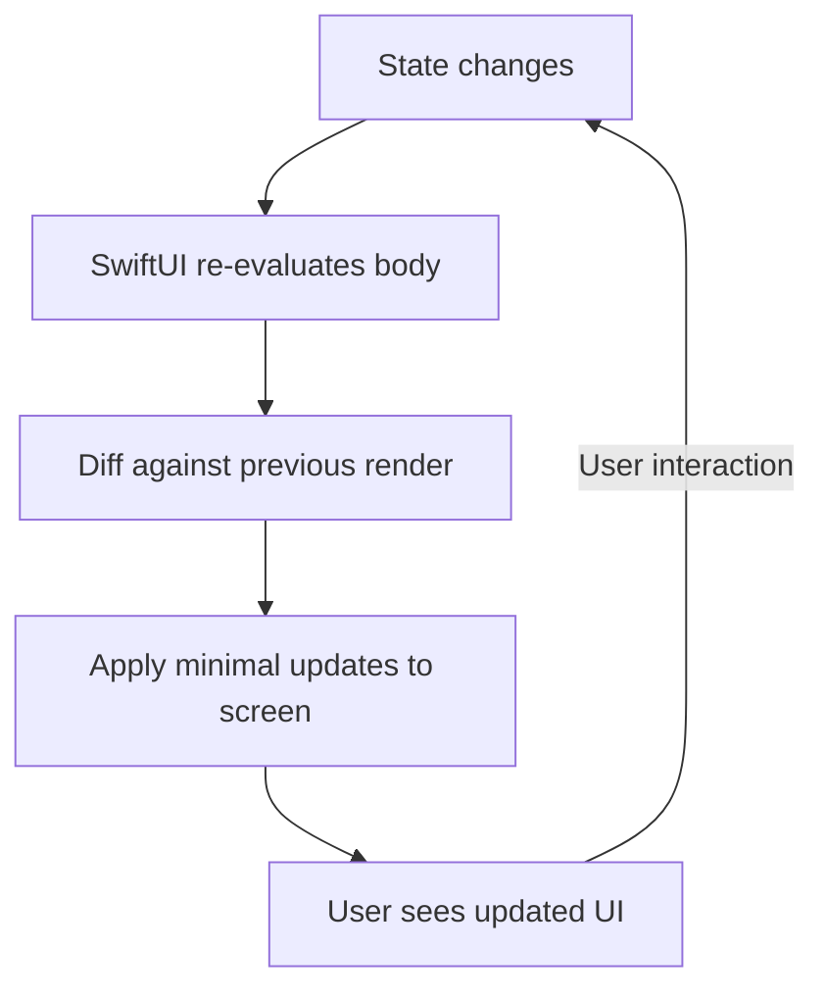
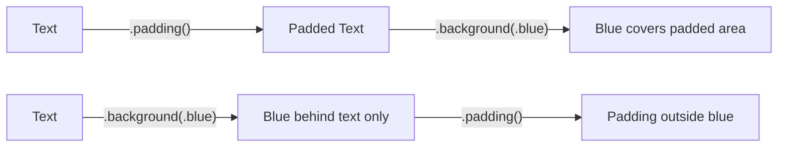

# SwiftUI Fundamentals

SwiftUI is Apple's declarative UI framework. Instead of imperatively constructing and mutating view hierarchies, you describe what the UI should look like for a given state, and the framework handles the rendering and updates.

## The View Protocol

Every SwiftUI view conforms to the `View` protocol:

```swift
protocol View {
    associatedtype Body: View
    @ViewBuilder var body: Self.Body { get }
}
```

A view is a lightweight struct that describes a piece of UI:

```swift
struct GreetingView: View {
    var body: some View {
        Text("Hello, World!")
    }
}
```



### Key Insight: Views Are Values

SwiftUI views are **value types** (structs). They are cheap to create, destroyed after each render, and recreated when state changes. The framework uses the view hierarchy as a blueprint to manage the actual rendered UI efficiently.

## Layout Stacks

### VStack (Vertical)

```swift
VStack(alignment: .leading, spacing: 12) {
    Text("Title")
        .font(.headline)
    Text("Subtitle")
        .font(.subheadline)
        .foregroundStyle(.secondary)
    Text("Body text goes here")
        .font(.body)
}
```

### HStack (Horizontal)

```swift
HStack(spacing: 8) {
    Image(systemName: "star.fill")
        .foregroundStyle(.yellow)
    Text("4.8")
        .font(.headline)
    Text("(2,341 reviews)")
        .foregroundStyle(.secondary)
}
```

### ZStack (Overlapping / Z-axis)

```swift
ZStack(alignment: .bottomTrailing) {
    Image("profile-photo")
        .resizable()
        .frame(width: 100, height: 100)
        .clipShape(Circle())

    // Badge overlaid in bottom-right corner
    Circle()
        .fill(.green)
        .frame(width: 20, height: 20)
        .overlay(
            Image(systemName: "checkmark")
                .font(.caption2)
                .foregroundStyle(.white)
        )
}
```

### Stack Comparison

| Stack | Direction | Use Case |
|-------|-----------|----------|
| `VStack` | Top to bottom | Forms, lists, content flows |
| `HStack` | Leading to trailing | Toolbars, inline elements |
| `ZStack` | Back to front (layered) | Overlays, badges, backgrounds |

## Common Views

### Text

```swift
Text("Hello")
    .font(.title)
    .fontWeight(.bold)
    .foregroundStyle(.primary)
    .lineLimit(2)
    .multilineTextAlignment(.center)

// Attributed text
Text("Price: ") + Text("$9.99").bold().foregroundStyle(.green)

// Markdown support
Text("This is **bold** and this is *italic*")

// Date formatting
Text(Date.now, style: .date)
Text(Date.now, style: .timer)
```

### Image

```swift
// SF Symbols (built-in icon library)
Image(systemName: "heart.fill")
    .font(.largeTitle)
    .foregroundStyle(.red)

// Asset catalog image
Image("landscape")
    .resizable()
    .aspectRatio(contentMode: .fill)
    .frame(width: 300, height: 200)
    .clipped()

// Async image loading
AsyncImage(url: URL(string: "https://example.com/photo.jpg")) { image in
    image.resizable().aspectRatio(contentMode: .fit)
} placeholder: {
    ProgressView()
}
```

### Button

```swift
// Simple button
Button("Tap Me") {
    print("Button tapped")
}

// Custom label
Button {
    performAction()
} label: {
    HStack {
        Image(systemName: "plus.circle.fill")
        Text("Add Item")
    }
    .padding()
    .background(.blue)
    .foregroundStyle(.white)
    .clipShape(RoundedRectangle(cornerRadius: 8))
}

// Button styles
Button("Primary") { }
    .buttonStyle(.borderedProminent)

Button("Secondary") { }
    .buttonStyle(.bordered)
```

### TextField and Input

```swift
struct LoginForm: View {
    @State private var email = ""
    @State private var password = ""

    var body: some View {
        VStack(spacing: 16) {
            TextField("Email", text: $email)
                .textFieldStyle(.roundedBorder)
                .keyboardType(.emailAddress)
                .textContentType(.emailAddress)
                .autocorrectionDisabled()

            SecureField("Password", text: $password)
                .textFieldStyle(.roundedBorder)
                .textContentType(.password)

            Button("Sign In") { authenticate() }
                .buttonStyle(.borderedProminent)
                .disabled(email.isEmpty || password.isEmpty)
        }
        .padding()
    }
}
```

## Modifiers

Modifiers are methods that return a new view wrapping the original. They're the primary way to configure appearance and behavior:

```swift
Text("Modified")
    .font(.title)                    // Typography
    .foregroundStyle(.blue)          // Color
    .padding()                       // Spacing
    .background(.yellow)             // Background
    .clipShape(RoundedRectangle(cornerRadius: 8))  // Shape
    .shadow(radius: 4)              // Effects
```

### Modifier Order Matters

Modifiers apply from innermost to outermost. Order changes the result:

```swift
// Padding THEN background → background covers padding
Text("A")
    .padding()
    .background(.blue)

// Background THEN padding → background only behind text
Text("B")
    .background(.blue)
    .padding()
```



### Frame and Sizing

```swift
Text("Fixed size")
    .frame(width: 200, height: 50)

Text("Flexible")
    .frame(maxWidth: .infinity, alignment: .leading)  // Expand to fill

Text("Constrained")
    .frame(minWidth: 100, maxWidth: 300)

Spacer()  // Pushes adjacent views apart, fills available space
```

### Conditional Modifiers

```swift
Text("Status")
    .foregroundStyle(isError ? .red : .primary)
    .fontWeight(isImportant ? .bold : .regular)

// For complex conditional styling, use Group or custom ViewModifier
struct CardStyle: ViewModifier {
    let isHighlighted: Bool

    func body(content: Content) -> some View {
        content
            .padding()
            .background(isHighlighted ? Color.yellow.opacity(0.2) : Color.clear)
            .overlay(
                RoundedRectangle(cornerRadius: 8)
                    .stroke(isHighlighted ? Color.orange : Color.gray.opacity(0.3))
            )
    }
}

extension View {
    func cardStyle(highlighted: Bool = false) -> some View {
        modifier(CardStyle(isHighlighted: highlighted))
    }
}

// Usage
Text("Important").cardStyle(highlighted: true)
```

## Layout System

SwiftUI's layout algorithm:
1. Parent proposes a size to the child
2. Child chooses its own size (respecting constraints)
3. Parent positions the child within its coordinate space

```swift
// GeometryReader exposes the proposed size
GeometryReader { geometry in
    HStack(spacing: 0) {
        Color.red
            .frame(width: geometry.size.width * 0.3)
        Color.blue
            .frame(width: geometry.size.width * 0.7)
    }
}
```

### Alignment

```swift
VStack(alignment: .leading) {   // Align children to leading edge
    Text("Title").font(.headline)
    Text("A longer subtitle that wraps")
}

HStack(alignment: .firstTextBaseline) {  // Align by text baseline
    Text("Large").font(.title)
    Text("Small").font(.caption)
}
```

### Padding and Spacing

```swift
VStack(spacing: 0) {  // No automatic spacing between children
    Text("Top")
        .padding(.bottom, 8)   // Specific edge
    Text("Middle")
        .padding(.horizontal)  // Leading + trailing
    Text("Bottom")
        .padding()             // All edges, system default (~16pt)
}
```

## ViewBuilder

`@ViewBuilder` enables the DSL syntax that lets you write multiple views in a closure:

```swift
@ViewBuilder
func statusBadge(for status: Status) -> some View {
    switch status {
    case .active:
        Label("Active", systemImage: "checkmark.circle.fill")
            .foregroundStyle(.green)
    case .inactive:
        Label("Inactive", systemImage: "xmark.circle.fill")
            .foregroundStyle(.red)
    }
}
```

## Previews

Xcode renders live previews of your views:

```swift
#Preview {
    GreetingView()
}

#Preview("Dark Mode") {
    GreetingView()
        .preferredColorScheme(.dark)
}

#Preview("Large Text") {
    GreetingView()
        .environment(\.dynamicTypeSize, .accessibility3)
}
```

## Key Takeaways

- SwiftUI views are structs that describe UI — they're blueprints, not the actual rendered objects
- The `body` property is re-evaluated whenever state changes; SwiftUI diffs and applies minimal updates
- Stacks (`VStack`, `HStack`, `ZStack`) are the primary layout primitives
- Modifier order matters — each modifier wraps the previous result in a new view
- Use `some View` as the return type — the compiler handles the complex generic types
- `@ViewBuilder` enables the multi-statement closure syntax in the `body` property
- Prefer `.frame(maxWidth: .infinity)` over `GeometryReader` for flexible layouts
- Custom `ViewModifier` types keep styling reusable and composable
- SwiftUI's layout is a negotiation: parent proposes size, child decides, parent positions
