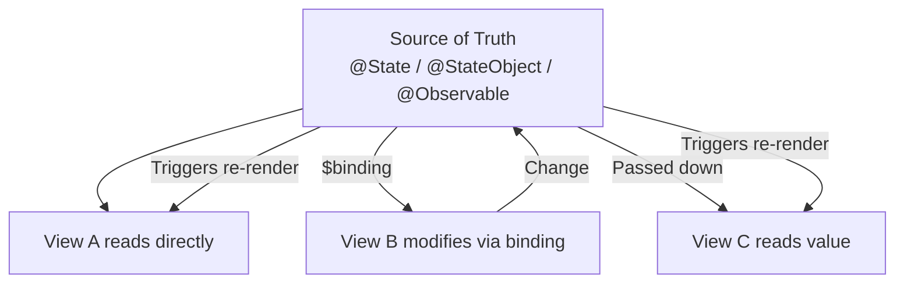
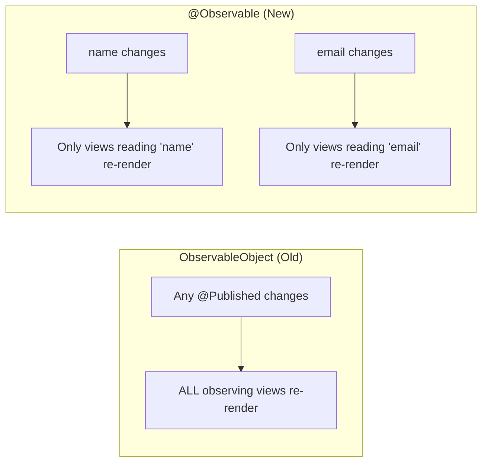
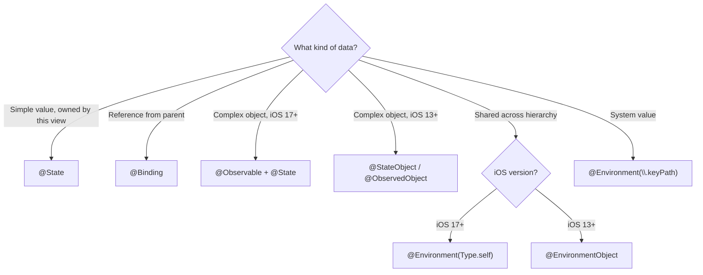

# SwiftUI State Management

State management is the core of SwiftUI. The framework provides property wrappers that connect data to views, ensuring the UI automatically reflects the current state.

## The Principle: Single Source of Truth

Every piece of data in a SwiftUI app should have one owner. Other views receive a reference or binding to that data rather than creating their own copy.



## @State

`@State` manages simple value types owned by the view. SwiftUI persists the value across re-renders:

```swift
struct CounterView: View {
    @State private var count = 0

    var body: some View {
        VStack {
            Text("Count: \(count)")
                .font(.largeTitle)

            HStack {
                Button("−") { count -= 1 }
                Button("+") { count += 1 }
            }
            .buttonStyle(.bordered)
        }
    }
}
```

Rules for `@State`:
- Always mark `private` — only the owning view should access it directly
- Use for simple value types (`Int`, `String`, `Bool`, small structs)
- The view owns this data — it's created and destroyed with the view's lifetime

### Binding to Child Views

Use `$` prefix to create a `Binding` that lets a child view read and write the parent's state:

```swift
struct SettingsView: View {
    @State private var volume: Double = 0.5
    @State private var isMuted: Bool = false

    var body: some View {
        VStack {
            VolumeSlider(volume: $volume, isMuted: $isMuted)
            Text("Volume: \(Int(volume * 100))%")
        }
    }
}
```

## @Binding

`@Binding` provides read-write access to state owned by a parent view:

```swift
struct VolumeSlider: View {
    @Binding var volume: Double
    @Binding var isMuted: Bool

    var body: some View {
        VStack {
            Slider(value: $volume, in: 0...1)
                .disabled(isMuted)

            Toggle("Mute", isOn: $isMuted)
        }
    }
}
```

`@Binding` does NOT own the data — it's a two-way reference to someone else's `@State`.

### Constant Bindings (for Previews)

```swift
#Preview {
    VolumeSlider(volume: .constant(0.7), isMuted: .constant(false))
}
```

## ObservableObject and @Published (Pre-iOS 17)

For complex shared state, use a class conforming to `ObservableObject`:

```swift
class ShoppingCart: ObservableObject {
    @Published var items: [Item] = []
    @Published var couponCode: String?

    var total: Double {
        items.reduce(0) { $0 + $1.price }
    }

    var discountedTotal: Double {
        guard couponCode != nil else { return total }
        return total * 0.9
    }

    func add(_ item: Item) {
        items.append(item)
    }

    func remove(at index: Int) {
        items.remove(at: index)
    }
}
```

`@Published` automatically emits change notifications through the `objectWillChange` publisher.

### @StateObject vs @ObservedObject

| Property Wrapper | Ownership | Lifetime | Use When |
|-----------------|-----------|----------|----------|
| `@StateObject` | View creates and owns | Persists across re-renders | The view is the source of truth for this object |
| `@ObservedObject` | View receives, doesn't own | Depends on parent | The object is passed in from a parent |

```swift
struct ShopView: View {
    // This view CREATES the cart — use @StateObject
    @StateObject private var cart = ShoppingCart()

    var body: some View {
        VStack {
            CartSummary(cart: cart)
            ProductList(cart: cart)
        }
    }
}

struct CartSummary: View {
    // This view RECEIVES the cart — use @ObservedObject
    @ObservedObject var cart: ShoppingCart

    var body: some View {
        Text("Items: \(cart.items.count) · Total: $\(cart.total, specifier: "%.2f")")
    }
}
```

**Critical distinction:** If you use `@ObservedObject` where you should use `@StateObject`, the object may be recreated on every parent re-render, losing its state.

## @EnvironmentObject

Inject an observable object into the view hierarchy without passing it explicitly through every level:

```swift
@main
struct MyApp: App {
    @StateObject private var settings = AppSettings()
    @StateObject private var auth = AuthManager()

    var body: some Scene {
        WindowGroup {
            ContentView()
                .environmentObject(settings)
                .environmentObject(auth)
        }
    }
}

// Any descendant view can access it without explicit passing
struct DeepNestedView: View {
    @EnvironmentObject var settings: AppSettings

    var body: some View {
        Toggle("Dark Mode", isOn: $settings.isDarkMode)
    }
}
```

**Warning:** If the expected `@EnvironmentObject` isn't provided by an ancestor, the app crashes at runtime. Always ensure it's injected.

## @Observable (iOS 17+ / macOS 14+)

The modern approach replaces `ObservableObject`/`@Published` with the `@Observable` macro:

```swift
import Observation

@Observable
class UserProfile {
    var name: String = ""
    var email: String = ""
    var avatarURL: URL?

    // No @Published needed — all stored properties are tracked automatically
    // Computed properties that derive from tracked properties are also tracked

    var initials: String {
        let components = name.split(separator: " ")
        return components.map { String($0.prefix(1)) }.joined()
    }
}
```

### Using @Observable in Views

With `@Observable`, you don't need `@ObservedObject` or `@StateObject`. Views automatically track which properties they read:

```swift
struct ProfileView: View {
    var profile: UserProfile  // Just a regular property!

    var body: some View {
        VStack {
            Text(profile.name)      // View re-renders only when 'name' changes
            Text(profile.email)     // View re-renders only when 'email' changes
        }
    }
}

// For ownership (creating the object):
struct ProfileContainer: View {
    @State private var profile = UserProfile()  // @State works with @Observable

    var body: some View {
        ProfileView(profile: profile)
    }
}
```

### @Observable vs ObservableObject

| Feature | `ObservableObject` + `@Published` | `@Observable` macro |
|---------|-----------------------------------|---------------------|
| iOS version | iOS 13+ | iOS 17+ |
| Property annotation | Each property needs `@Published` | Automatic for all stored properties |
| View property wrapper | `@StateObject` / `@ObservedObject` | Plain property or `@State` |
| Granularity | Entire object notifies on any change | Per-property tracking |
| Environment | `@EnvironmentObject` | `@Environment` |
| Performance | Re-renders on any `@Published` change | Only re-renders views reading changed property |



### @Observable with @Environment

```swift
// Injection
@main
struct MyApp: App {
    @State private var settings = AppSettings()

    var body: some Scene {
        WindowGroup {
            ContentView()
                .environment(settings)  // Note: .environment, not .environmentObject
        }
    }
}

// Consumption
struct ChildView: View {
    @Environment(AppSettings.self) private var settings

    var body: some View {
        // Use settings directly
        Text(settings.appName)
    }
}
```

## @Environment (System Values)

Access system-provided values like color scheme, locale, or dismiss action:

```swift
struct AdaptiveView: View {
    @Environment(\.colorScheme) private var colorScheme
    @Environment(\.horizontalSizeClass) private var sizeClass
    @Environment(\.dismiss) private var dismiss
    @Environment(\.openURL) private var openURL

    var body: some View {
        VStack {
            Text(colorScheme == .dark ? "Dark Mode" : "Light Mode")

            if sizeClass == .compact {
                CompactLayout()
            } else {
                RegularLayout()
            }

            Button("Done") { dismiss() }

            Button("Help") {
                openURL(URL(string: "https://help.example.com")!)
            }
        }
    }
}
```

## Choosing the Right Property Wrapper



| Scenario | Pre-iOS 17 | iOS 17+ |
|----------|------------|---------|
| Simple local value | `@State` | `@State` |
| Pass writable reference | `@Binding` | `@Binding` |
| Create complex object | `@StateObject` | `@State` + `@Observable` |
| Receive complex object | `@ObservedObject` | Plain property |
| Inject into hierarchy | `@EnvironmentObject` | `@Environment(Type.self)` |
| System environment values | `@Environment(\.key)` | `@Environment(\.key)` |

## Key Takeaways

- Every piece of mutable data has exactly one owner — other views access it via binding or observation
- `@State` is for simple values owned by the view; always mark it `private`
- `@StateObject` creates and owns an `ObservableObject`; `@ObservedObject` borrows one
- `@Observable` (iOS 17+) is the modern approach — per-property tracking means fewer unnecessary re-renders
- With `@Observable`, you don't need `@Published`, `@StateObject`, or `@ObservedObject`
- Use `@Environment` for system values (color scheme, dismiss, locale) and injected `@Observable` objects
- The `$` prefix creates a `Binding` — a two-way reference to the underlying value
- Misusing `@ObservedObject` where `@StateObject` is needed causes data loss on re-renders
