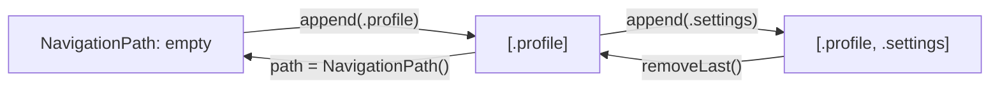

# SwiftUI Navigation

SwiftUI provides several navigation paradigms: stack-based hierarchical navigation, modal presentations (sheets), alerts, and tab-based navigation. iOS 16+ introduced `NavigationStack` with programmatic, type-safe navigation paths.

## NavigationStack

`NavigationStack` manages a push/pop navigation hierarchy:

```swift
struct ContentView: View {
    var body: some View {
        NavigationStack {
            List {
                NavigationLink("Profile", value: Route.profile)
                NavigationLink("Settings", value: Route.settings)
                NavigationLink("User #42", value: Route.user(id: 42))
            }
            .navigationTitle("Home")
            .navigationDestination(for: Route.self) { route in
                switch route {
                case .profile:
                    ProfileView()
                case .settings:
                    SettingsView()
                case .user(let id):
                    UserDetailView(id: id)
                }
            }
        }
    }
}

enum Route: Hashable {
    case profile
    case settings
    case user(id: Int)
}
```

### NavigationLink Styles

```swift
// Value-based (preferred — decouples link from destination)
NavigationLink("Show Detail", value: item)

// View-based (inline destination — simpler but less flexible)
NavigationLink("Show Detail") {
    DetailView(item: item)
}

// Custom label
NavigationLink(value: Route.profile) {
    HStack {
        Image(systemName: "person.circle")
        Text("View Profile")
    }
}
```

## Programmatic Navigation with Path

For full control over the navigation stack, bind it to a `NavigationPath`:

```swift
struct AppView: View {
    @State private var path = NavigationPath()

    var body: some View {
        NavigationStack(path: $path) {
            HomeView(path: $path)
                .navigationDestination(for: Route.self) { route in
                    destinationView(for: route)
                }
        }
    }

    @ViewBuilder
    func destinationView(for route: Route) -> some View {
        switch route {
        case .profile:
            ProfileView()
        case .settings:
            SettingsView(path: $path)
        case .user(let id):
            UserDetailView(id: id, path: $path)
        }
    }
}

// Push programmatically
struct HomeView: View {
    @Binding var path: NavigationPath

    var body: some View {
        Button("Go to User 7") {
            path.append(Route.user(id: 7))
        }

        Button("Deep Link: Profile → Settings") {
            path.append(Route.profile)
            path.append(Route.settings)
        }

        Button("Pop to Root") {
            path = NavigationPath()  // Clear the path
        }
    }
}
```



### Type-Safe Homogeneous Paths

For simpler cases with a single destination type:

```swift
struct ProductListView: View {
    @State private var path: [Product] = []

    var body: some View {
        NavigationStack(path: $path) {
            List(products) { product in
                NavigationLink(product.name, value: product)
            }
            .navigationDestination(for: Product.self) { product in
                ProductDetailView(product: product)
            }
        }
    }
}
```

## Sheets (Modal Presentation)

Sheets slide up from the bottom and present content modally:

```swift
struct ParentView: View {
    @State private var showingSheet = false
    @State private var selectedItem: Item?

    var body: some View {
        VStack {
            // Boolean-triggered sheet
            Button("Show Settings") {
                showingSheet = true
            }
            .sheet(isPresented: $showingSheet) {
                SettingsSheet()
            }

            // Item-triggered sheet (presents when non-nil)
            Button("Show Item") {
                selectedItem = items.first
            }
            .sheet(item: $selectedItem) { item in
                ItemDetailSheet(item: item)
            }
        }
    }
}
```

### Dismissing Sheets

```swift
struct SettingsSheet: View {
    @Environment(\.dismiss) private var dismiss

    var body: some View {
        NavigationStack {
            Form {
                // Settings content...
            }
            .navigationTitle("Settings")
            .toolbar {
                ToolbarItem(placement: .confirmationAction) {
                    Button("Done") { dismiss() }
                }
            }
        }
    }
}
```

### Full-Screen Cover

For full-screen modal presentations (no swipe-to-dismiss):

```swift
.fullScreenCover(isPresented: $showOnboarding) {
    OnboardingView()
}
```

### Sheet Sizing (iOS 16+)

```swift
.sheet(isPresented: $showSheet) {
    SheetContent()
        .presentationDetents([.medium, .large])  // Half or full height
        .presentationDragIndicator(.visible)
        .presentationCornerRadius(20)
}
```

## Alerts and Confirmation Dialogs

### Alerts

```swift
struct AlertExample: View {
    @State private var showingAlert = false
    @State private var alertError: AppError?

    var body: some View {
        Button("Delete Account") {
            showingAlert = true
        }
        .alert("Are you sure?", isPresented: $showingAlert) {
            Button("Cancel", role: .cancel) { }
            Button("Delete", role: .destructive) {
                deleteAccount()
            }
        } message: {
            Text("This action cannot be undone.")
        }

        // Error-driven alert
        .alert(
            "Error",
            isPresented: .constant(alertError != nil),
            presenting: alertError
        ) { error in
            Button("Retry") { retry(error) }
            Button("OK", role: .cancel) { alertError = nil }
        } message: { error in
            Text(error.localizedDescription)
        }
    }
}
```

### Confirmation Dialog (Action Sheet)

```swift
.confirmationDialog("Sort by", isPresented: $showingSortOptions) {
    Button("Name") { sortOrder = .name }
    Button("Date") { sortOrder = .date }
    Button("Size") { sortOrder = .size }
    Button("Cancel", role: .cancel) { }
} message: {
    Text("Choose how to sort items")
}
```

## TabView

Tab-based navigation for top-level sections:

```swift
struct MainTabView: View {
    @State private var selectedTab = 0

    var body: some View {
        TabView(selection: $selectedTab) {
            HomeView()
                .tabItem {
                    Label("Home", systemImage: "house")
                }
                .tag(0)

            SearchView()
                .tabItem {
                    Label("Search", systemImage: "magnifyingglass")
                }
                .tag(1)

            ProfileView()
                .tabItem {
                    Label("Profile", systemImage: "person")
                }
                .tag(2)
                .badge(3)  // Notification badge
        }
    }
}
```

### Programmatic Tab Switching

```swift
// From anywhere with access to the binding:
Button("Go to Profile") {
    selectedTab = 2
}
```

## Toolbar

```swift
struct DocumentView: View {
    var body: some View {
        ScrollView {
            // Content...
        }
        .navigationTitle("Document")
        .toolbar {
            ToolbarItem(placement: .primaryAction) {
                Button("Save") { save() }
            }

            ToolbarItem(placement: .secondaryAction) {
                Menu {
                    Button("Export PDF") { exportPDF() }
                    Button("Share") { share() }
                    Divider()
                    Button("Delete", role: .destructive) { delete() }
                } label: {
                    Image(systemName: "ellipsis.circle")
                }
            }

            ToolbarItemGroup(placement: .bottomBar) {
                Button(action: previousPage) {
                    Image(systemName: "chevron.left")
                }
                Spacer()
                Text("Page \(currentPage) of \(totalPages)")
                Spacer()
                Button(action: nextPage) {
                    Image(systemName: "chevron.right")
                }
            }
        }
    }
}
```

### Toolbar Placement Options

| Placement | Location | Use Case |
|-----------|----------|----------|
| `.primaryAction` | Trailing top | Main action |
| `.secondaryAction` | Under "..." menu | Less common actions |
| `.cancellationAction` | Leading top | Cancel/back |
| `.confirmationAction` | Trailing top | Confirm/done |
| `.bottomBar` | Bottom of screen | Document navigation |
| `.navigationBarLeading` | Left of nav bar | Custom back button |
| `.navigationBarTrailing` | Right of nav bar | Edit/add buttons |

## Navigation Patterns

### Coordinator Pattern (Complex Navigation)

```swift
@Observable
class NavigationCoordinator {
    var path = NavigationPath()
    var presentedSheet: Sheet?
    var presentedAlert: AlertState?

    enum Sheet: Identifiable {
        case settings
        case newItem
        var id: Self { self }
    }

    func navigateToUser(_ id: Int) {
        path.append(Route.user(id: id))
    }

    func popToRoot() {
        path = NavigationPath()
    }

    func showSettings() {
        presentedSheet = .settings
    }
}

struct RootView: View {
    @State private var coordinator = NavigationCoordinator()

    var body: some View {
        NavigationStack(path: $coordinator.path) {
            HomeView()
                .navigationDestination(for: Route.self) { route in
                    // ...
                }
        }
        .sheet(item: $coordinator.presentedSheet) { sheet in
            // ...
        }
        .environment(coordinator)
    }
}
```

## Key Takeaways

- `NavigationStack` (iOS 16+) replaces the deprecated `NavigationView` — always use it for new code
- Value-based `NavigationLink` decouples the link from the destination via `.navigationDestination`
- `NavigationPath` enables programmatic push, pop, and deep linking
- Sheets are presented with boolean or optional item bindings; dismiss via `@Environment(\.dismiss)`
- `TabView` with `selection` binding enables programmatic tab switching
- Toolbar items use semantic placements (`.primaryAction`, `.confirmationAction`) for platform-appropriate positioning
- For complex apps, extract navigation logic into a coordinator object passed via `@Environment`
- Always provide navigation titles — they're used by accessibility and by the back button
