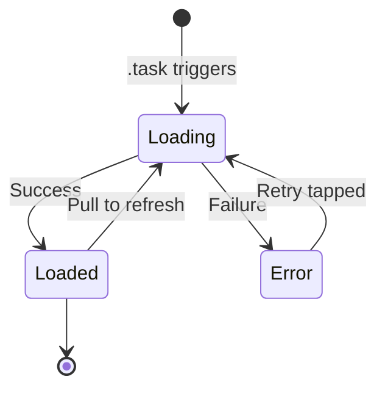

# SwiftUI Lists and Data

Lists are the most common way to display collections of data in iOS apps. SwiftUI's `List` and `ForEach` provide efficient, scrollable displays with built-in support for selection, swipe actions, and dynamic content.

## List Basics

```swift
struct FruitListView: View {
    let fruits = ["Apple", "Banana", "Cherry", "Date", "Elderberry"]

    var body: some View {
        List(fruits, id: \.self) { fruit in
            Text(fruit)
        }
    }
}
```

### The Identifiable Protocol

For custom types, conform to `Identifiable` so SwiftUI can track items efficiently:

```swift
struct Task: Identifiable {
    let id = UUID()
    var title: String
    var isCompleted: Bool
    var priority: Priority

    enum Priority: String, CaseIterable {
        case low, medium, high
    }
}

struct TaskListView: View {
    @State private var tasks: [Task] = [
        Task(title: "Buy groceries", isCompleted: false, priority: .medium),
        Task(title: "Walk the dog", isCompleted: true, priority: .high),
        Task(title: "Read book", isCompleted: false, priority: .low),
    ]

    var body: some View {
        List(tasks) { task in  // No id: parameter needed — Task is Identifiable
            TaskRow(task: task)
        }
    }
}
```

## ForEach

`ForEach` generates views from a collection. It's used inside `List`, `VStack`, and other containers:

```swift
struct CategoryView: View {
    let categories = ["Work", "Personal", "Shopping"]
    @State private var items: [Task] = []

    var body: some View {
        List {
            // Static content mixed with dynamic
            Section("Quick Add") {
                Button("New Task") { addTask() }
            }

            // Dynamic content with ForEach
            ForEach(categories, id: \.self) { category in
                Section(category) {
                    ForEach(items.filter { $0.category == category }) { item in
                        TaskRow(task: item)
                    }
                }
            }
        }
    }
}
```

### ForEach with Index

```swift
ForEach(Array(items.enumerated()), id: \.element.id) { index, item in
    HStack {
        Text("\(index + 1).")
        Text(item.title)
    }
}
```

## List Sections and Styling

```swift
struct SettingsView: View {
    @State private var notificationsEnabled = true
    @State private var darkMode = false

    var body: some View {
        List {
            Section {
                Toggle("Notifications", isOn: $notificationsEnabled)
                Toggle("Dark Mode", isOn: $darkMode)
            } header: {
                Text("Preferences")
            } footer: {
                Text("Notifications require permission from system settings.")
            }

            Section("Account") {
                NavigationLink("Profile") { ProfileView() }
                NavigationLink("Security") { SecurityView() }
            }

            Section {
                Button("Sign Out", role: .destructive) { signOut() }
            }
        }
        .listStyle(.insetGrouped)  // iOS grouped appearance
    }
}
```

### List Styles

| Style | Appearance | Use Case |
|-------|------------|----------|
| `.automatic` | Platform default | General use |
| `.plain` | No separators between sections | Content-heavy lists |
| `.insetGrouped` | Rounded section groups | Settings, forms |
| `.sidebar` | macOS/iPadOS sidebar | Navigation sidebars |

## Swipe Actions

```swift
struct InboxView: View {
    @State private var messages: [Message] = []

    var body: some View {
        List {
            ForEach(messages) { message in
                MessageRow(message: message)
                    .swipeActions(edge: .trailing, allowsFullSwipe: true) {
                        Button(role: .destructive) {
                            delete(message)
                        } label: {
                            Label("Delete", systemImage: "trash")
                        }

                        Button {
                            archive(message)
                        } label: {
                            Label("Archive", systemImage: "archivebox")
                        }
                        .tint(.orange)
                    }
                    .swipeActions(edge: .leading) {
                        Button {
                            toggleRead(message)
                        } label: {
                            Label(
                                message.isRead ? "Unread" : "Read",
                                systemImage: message.isRead ? "envelope.badge" : "envelope.open"
                            )
                        }
                        .tint(.blue)
                    }
            }
        }
    }
}
```

## Deletion and Reordering

```swift
struct EditableListView: View {
    @State private var items = ["First", "Second", "Third", "Fourth"]

    var body: some View {
        NavigationStack {
            List {
                ForEach(items, id: \.self) { item in
                    Text(item)
                }
                .onDelete(perform: deleteItems)
                .onMove(perform: moveItems)
            }
            .toolbar {
                EditButton()  // Toggles edit mode
            }
        }
    }

    private func deleteItems(at offsets: IndexSet) {
        items.remove(atOffsets: offsets)
    }

    private func moveItems(from source: IndexSet, to destination: Int) {
        items.move(fromOffsets: source, toOffset: destination)
    }
}
```

## Search

```swift
struct SearchableListView: View {
    @State private var searchText = ""
    @State private var contacts: [Contact] = Contact.sampleData

    var filteredContacts: [Contact] {
        if searchText.isEmpty {
            return contacts
        }
        return contacts.filter { contact in
            contact.name.localizedCaseInsensitiveContains(searchText) ||
            contact.email.localizedCaseInsensitiveContains(searchText)
        }
    }

    var body: some View {
        NavigationStack {
            List(filteredContacts) { contact in
                ContactRow(contact: contact)
            }
            .navigationTitle("Contacts")
            .searchable(text: $searchText, prompt: "Search by name or email")
        }
    }
}
```

### Search Suggestions

```swift
.searchable(text: $searchText) {
    ForEach(suggestions, id: \.self) { suggestion in
        Text(suggestion)
            .searchCompletion(suggestion)  // Fills search field on tap
    }
}
```

### Search Scopes

```swift
enum SearchScope: String, CaseIterable {
    case all = "All"
    case active = "Active"
    case archived = "Archived"
}

@State private var searchScope: SearchScope = .all

.searchable(text: $searchText)
.searchScopes($searchScope) {
    ForEach(SearchScope.allCases, id: \.self) { scope in
        Text(scope.rawValue).tag(scope)
    }
}
```

## Async Data Loading

### Basic Pattern

```swift
struct UserListView: View {
    @State private var users: [User] = []
    @State private var isLoading = false
    @State private var error: Error?

    var body: some View {
        Group {
            if isLoading && users.isEmpty {
                ProgressView("Loading...")
            } else if let error {
                ContentUnavailableView {
                    Label("Error", systemImage: "exclamationmark.triangle")
                } description: {
                    Text(error.localizedDescription)
                } actions: {
                    Button("Retry") { Task { await loadUsers() } }
                }
            } else if users.isEmpty {
                ContentUnavailableView.search  // Empty state
            } else {
                List(users) { user in
                    UserRow(user: user)
                }
                .refreshable {
                    await loadUsers()
                }
            }
        }
        .task {
            await loadUsers()  // Called when view appears
        }
    }

    private func loadUsers() async {
        isLoading = true
        defer { isLoading = false }

        do {
            users = try await UserService.fetchAll()
            error = nil
        } catch {
            self.error = error
        }
    }
}
```



### The .task Modifier

`.task` runs async work tied to the view's lifecycle. It's automatically cancelled when the view disappears:

```swift
.task {
    await loadData()        // Runs when view appears
}

.task(id: selectedCategory) {
    // Re-runs whenever selectedCategory changes
    await loadItems(for: selectedCategory)
}
```

## Pagination Patterns

### Infinite Scroll

```swift
struct PaginatedListView: View {
    @State private var items: [Item] = []
    @State private var currentPage = 1
    @State private var hasMorePages = true
    @State private var isLoadingMore = false

    var body: some View {
        List {
            ForEach(items) { item in
                ItemRow(item: item)
                    .onAppear {
                        if item == items.last {
                            loadMoreIfNeeded()
                        }
                    }
            }

            if isLoadingMore {
                HStack {
                    Spacer()
                    ProgressView()
                    Spacer()
                }
            }
        }
        .task { await loadPage(1) }
    }

    private func loadMoreIfNeeded() {
        guard hasMorePages && !isLoadingMore else { return }
        Task { await loadPage(currentPage + 1) }
    }

    private func loadPage(_ page: Int) async {
        isLoadingMore = true
        defer { isLoadingMore = false }

        do {
            let response = try await API.fetchItems(page: page, perPage: 20)
            if page == 1 {
                items = response.items
            } else {
                items.append(contentsOf: response.items)
            }
            currentPage = page
            hasMorePages = response.hasNextPage
        } catch {
            print("Failed to load page \(page): \(error)")
        }
    }
}
```

### Cursor-Based Pagination

```swift
@State private var cursor: String? = nil

private func loadMore() async {
    let response = try await API.fetch(after: cursor, limit: 20)
    items.append(contentsOf: response.items)
    cursor = response.nextCursor  // nil when no more pages
    hasMorePages = cursor != nil
}
```

## Selection

```swift
struct SelectableListView: View {
    @State private var items = Item.sampleData
    @State private var selection = Set<Item.ID>()

    var body: some View {
        List(items, selection: $selection) { item in
            Text(item.name)
        }
        .toolbar {
            EditButton()
            if !selection.isEmpty {
                Button("Delete \(selection.count)") {
                    items.removeAll { selection.contains($0.id) }
                    selection.removeAll()
                }
            }
        }
    }
}
```

## Key Takeaways

- Conform model types to `Identifiable` for efficient list rendering — avoid `id: \.self` for mutable collections
- `ForEach` generates dynamic views; it's separate from `List` and can be used in any container
- Swipe actions support both edges, full-swipe gestures, and destructive/custom styles
- `.searchable` integrates natively with `NavigationStack` — filter in a computed property
- `.task` is the preferred way to load async data — it auto-cancels when the view disappears
- `.refreshable` adds pull-to-refresh with async support
- For pagination, trigger loading when the last item appears using `.onAppear`
- `ContentUnavailableView` provides standardized empty and error states (iOS 17+)
- Selection binding with `Set<ID>` enables multi-select in edit mode
