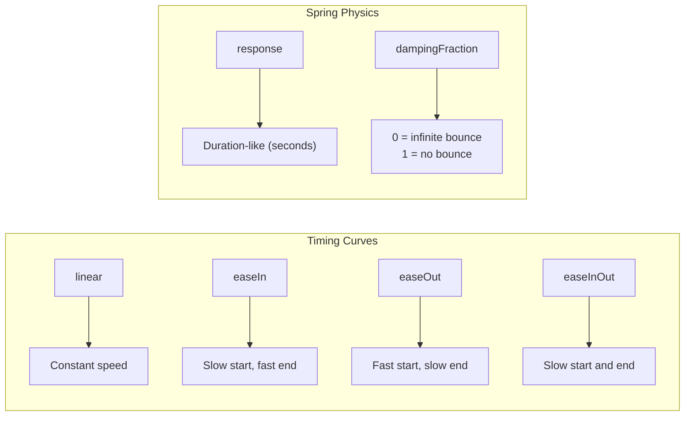

# Animations and Gestures

SwiftUI provides a powerful, declarative animation system. You describe the target state, and the framework interpolates the transition. Combined with gesture recognizers, you can build fluid, interactive experiences.

## Implicit Animations

Attach `.animation()` to a view — any change to the specified value is animated:

```swift
struct PulsingCircle: View {
    @State private var isExpanded = false

    var body: some View {
        Circle()
            .fill(.blue)
            .frame(width: isExpanded ? 200 : 100,
                   height: isExpanded ? 200 : 100)
            .animation(.easeInOut(duration: 0.5), value: isExpanded)
            .onTapGesture {
                isExpanded.toggle()
            }
    }
}
```

Implicit animations watch a specific value and animate any view changes caused by that value changing.

## Explicit Animations

`withAnimation` wraps a state change, animating all views affected by that change:

```swift
struct ExplicitExample: View {
    @State private var rotation: Double = 0
    @State private var scale: Double = 1.0
    @State private var opacity: Double = 1.0

    var body: some View {
        Image(systemName: "star.fill")
            .font(.system(size: 60))
            .rotationEffect(.degrees(rotation))
            .scaleEffect(scale)
            .opacity(opacity)
            .onTapGesture {
                withAnimation(.spring(response: 0.5, dampingFraction: 0.6)) {
                    rotation += 72
                    scale = scale == 1.0 ? 1.5 : 1.0
                }
            }
    }
}
```

### Implicit vs Explicit

| Approach | Syntax | Scope | Best For |
|----------|--------|-------|----------|
| Implicit | `.animation(.easeIn, value: x)` | That specific view | Single property changes |
| Explicit | `withAnimation { state = newValue }` | All views affected by the change | Coordinated multi-view animations |

## Animation Types

```swift
// Built-in timing curves
.animation(.linear(duration: 0.3), value: x)
.animation(.easeIn(duration: 0.3), value: x)
.animation(.easeOut(duration: 0.3), value: x)
.animation(.easeInOut(duration: 0.3), value: x)

// Spring animations (most natural feel)
.animation(.spring(), value: x)                          // Default spring
.animation(.spring(response: 0.5, dampingFraction: 0.7), value: x)  // Custom
.animation(.bouncy, value: x)                            // iOS 17+ preset
.animation(.snappy, value: x)                            // iOS 17+ preset

// Modifiers
.animation(.easeInOut.delay(0.2), value: x)              // Delayed start
.animation(.easeInOut.repeatCount(3), value: x)          // Repeat N times
.animation(.easeInOut.repeatForever(autoreverses: true), value: x)  // Infinite
.animation(.easeInOut.speed(2.0), value: x)              // Double speed
```



### Spring Parameters

| Parameter | Effect | Range |
|-----------|--------|-------|
| `response` | How long the animation takes | 0.1–2.0 (seconds) |
| `dampingFraction` | How much it bounces | 0.0 (forever) – 1.0 (no bounce) |
| `blendDuration` | Smoothing when interrupted | 0.0+ |

## Transitions

Transitions define how views appear and disappear:

```swift
struct NotificationBanner: View {
    @State private var showBanner = false

    var body: some View {
        VStack {
            if showBanner {
                Text("Operation successful!")
                    .padding()
                    .background(.green)
                    .foregroundStyle(.white)
                    .clipShape(RoundedRectangle(cornerRadius: 8))
                    .transition(.move(edge: .top).combined(with: .opacity))
            }

            Spacer()

            Button("Show Banner") {
                withAnimation(.spring()) {
                    showBanner = true
                }
                // Auto-dismiss after 3 seconds
                Task {
                    try await Task.sleep(for: .seconds(3))
                    withAnimation { showBanner = false }
                }
            }
        }
    }
}
```

### Built-in Transitions

```swift
.transition(.opacity)                      // Fade in/out
.transition(.scale)                        // Scale from center
.transition(.slide)                        // Slide from leading edge
.transition(.move(edge: .bottom))          // Slide from specific edge
.transition(.push(from: .trailing))        // Push (iOS 16+)

// Combinations
.transition(.opacity.combined(with: .scale))
.transition(.asymmetric(
    insertion: .scale.combined(with: .opacity),
    removal: .opacity
))
```

### Custom Transitions

```swift
struct RotateTransition: ViewModifier {
    let angle: Double
    let anchor: UnitPoint

    func body(content: Content) -> some View {
        content
            .rotationEffect(.degrees(angle), anchor: anchor)
            .opacity(angle == 0 ? 1 : 0)
    }
}

extension AnyTransition {
    static var rotate: AnyTransition {
        .modifier(
            active: RotateTransition(angle: -90, anchor: .topLeading),
            identity: RotateTransition(angle: 0, anchor: .topLeading)
        )
    }
}

// Usage
Text("Rotating in!")
    .transition(.rotate)
```

## matchedGeometryEffect

Creates smooth hero animations between two views:

```swift
struct HeroAnimationExample: View {
    @Namespace private var animation
    @State private var isExpanded = false

    var body: some View {
        VStack {
            if isExpanded {
                // Expanded state
                RoundedRectangle(cornerRadius: 20)
                    .fill(.blue)
                    .matchedGeometryEffect(id: "card", in: animation)
                    .frame(height: 300)
                    .onTapGesture {
                        withAnimation(.spring(response: 0.4, dampingFraction: 0.8)) {
                            isExpanded = false
                        }
                    }
            } else {
                // Collapsed state
                RoundedRectangle(cornerRadius: 10)
                    .fill(.blue)
                    .matchedGeometryEffect(id: "card", in: animation)
                    .frame(width: 100, height: 100)
                    .onTapGesture {
                        withAnimation(.spring(response: 0.4, dampingFraction: 0.8)) {
                            isExpanded = true
                        }
                    }
            }
        }
    }
}
```

The `id` and `namespace` link the two views — SwiftUI morphs one into the other with smooth frame and position interpolation.

## Gestures

### TapGesture

```swift
Image(systemName: "heart")
    .onTapGesture {
        // Single tap
    }
    .onTapGesture(count: 2) {
        // Double tap
    }
```

### LongPressGesture

```swift
struct LongPressExample: View {
    @State private var isPressed = false

    var body: some View {
        Circle()
            .fill(isPressed ? .green : .blue)
            .frame(width: 100, height: 100)
            .scaleEffect(isPressed ? 1.2 : 1.0)
            .animation(.spring(), value: isPressed)
            .gesture(
                LongPressGesture(minimumDuration: 0.5)
                    .onEnded { _ in
                        isPressed.toggle()
                    }
            )
    }
}
```

### DragGesture

```swift
struct DraggableCard: View {
    @State private var offset = CGSize.zero
    @State private var isDragging = false

    var body: some View {
        RoundedRectangle(cornerRadius: 16)
            .fill(.blue)
            .frame(width: 200, height: 120)
            .offset(offset)
            .scaleEffect(isDragging ? 1.05 : 1.0)
            .shadow(radius: isDragging ? 10 : 4)
            .gesture(
                DragGesture()
                    .onChanged { gesture in
                        offset = gesture.translation
                        isDragging = true
                    }
                    .onEnded { gesture in
                        isDragging = false
                        // Snap back with spring animation
                        withAnimation(.spring()) {
                            offset = .zero
                        }
                    }
            )
            .animation(.spring(), value: isDragging)
    }
}
```

### Swipe-to-Dismiss Pattern

```swift
struct SwipeCard: View {
    @State private var offset: CGFloat = 0
    let onDismiss: () -> Void

    var body: some View {
        CardContent()
            .offset(x: offset)
            .rotationEffect(.degrees(Double(offset / 20)))
            .opacity(2 - abs(Double(offset / 150)))
            .gesture(
                DragGesture()
                    .onChanged { offset = $0.translation.width }
                    .onEnded { gesture in
                        if abs(gesture.translation.width) > 150 {
                            // Swipe threshold met — dismiss
                            withAnimation(.easeOut) {
                                offset = gesture.translation.width > 0 ? 500 : -500
                            }
                            DispatchQueue.main.asyncAfter(deadline: .now() + 0.3) {
                                onDismiss()
                            }
                        } else {
                            // Snap back
                            withAnimation(.spring()) {
                                offset = 0
                            }
                        }
                    }
            )
    }
}
```

### MagnificationGesture (Pinch to Zoom)

```swift
struct ZoomableImage: View {
    @State private var scale: CGFloat = 1.0
    @State private var lastScale: CGFloat = 1.0

    var body: some View {
        Image("photo")
            .resizable()
            .scaledToFit()
            .scaleEffect(scale)
            .gesture(
                MagnifyGesture()
                    .onChanged { value in
                        scale = lastScale * value.magnification
                    }
                    .onEnded { _ in
                        lastScale = scale
                        // Clamp scale
                        withAnimation {
                            scale = min(max(scale, 1.0), 4.0)
                            lastScale = scale
                        }
                    }
            )
    }
}
```

### Composing Gestures

```swift
// Simultaneous — both gestures active at the same time
.gesture(
    SimultaneousGesture(rotationGesture, magnificationGesture)
)

// Sequenced — second gesture only starts after first succeeds
.gesture(
    LongPressGesture().sequenced(before: DragGesture())
)

// Exclusive — only one gesture recognized (first match wins)
.gesture(
    doubleTapGesture.exclusively(before: singleTapGesture)
)
```

## Phase Animations (iOS 17+)

```swift
struct PulseView: View {
    var body: some View {
        Image(systemName: "heart.fill")
            .font(.largeTitle)
            .foregroundStyle(.red)
            .phaseAnimator([false, true]) { content, phase in
                content
                    .scaleEffect(phase ? 1.2 : 1.0)
                    .opacity(phase ? 1.0 : 0.7)
            } animation: { phase in
                .easeInOut(duration: 0.8)
            }
    }
}
```

## Key Takeaways

- Use implicit animations (`.animation(_, value:)`) for single-property changes on a specific view
- Use explicit animations (`withAnimation`) when a state change affects multiple views
- Spring animations (`.spring()`) feel the most natural for interactive elements
- Transitions control how views appear/disappear — combine them for richer effects
- `matchedGeometryEffect` creates hero transitions by linking views with a shared ID and namespace
- `DragGesture` is the foundation for swipe-to-dismiss, drag-to-reorder, and pull-to-reveal
- Always provide spring-back behavior when drag thresholds aren't met
- Compose gestures with `.simultaneously`, `.sequenced`, or `.exclusively` for complex interactions
- Phase animations (iOS 17+) simplify looping multi-step animations without timers
