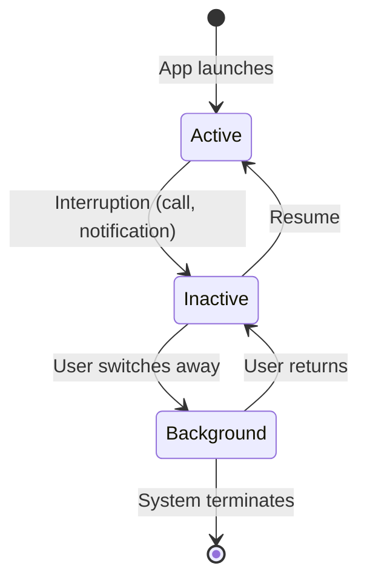
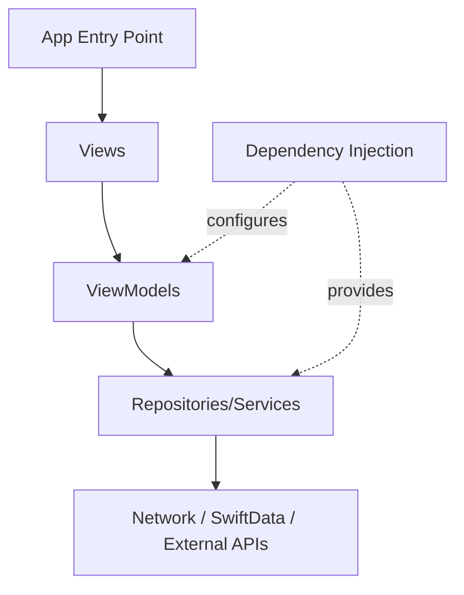

# App Architecture

Building production-quality SwiftUI apps requires architecture that separates concerns, enables testing, and scales with complexity. This section covers MVVM, dependency injection, SwiftData for persistence, networking with URLSession, and the app lifecycle.

## App Lifecycle

### The @main Entry Point

Every SwiftUI app starts with a struct conforming to `App`:

```swift
@main
struct MyApp: App {
    @State private var appState = AppState()

    var body: some Scene {
        WindowGroup {
            ContentView()
                .environment(appState)
        }
    }

    init() {
        // App-wide setup (configure logging, analytics, etc.)
        setupAppearance()
    }
}
```

### Scenes

Scenes represent a window or set of windows:

```swift
@main
struct MultiSceneApp: App {
    var body: some Scene {
        WindowGroup {
            MainView()
        }

        #if os(macOS)
        Settings {
            SettingsView()
        }

        Window("Activity", id: "activity") {
            ActivityView()
        }
        #endif
    }
}
```

### Scene Phase

Monitor app foreground/background transitions:

```swift
@main
struct MyApp: App {
    @Environment(\.scenePhase) private var scenePhase

    var body: some Scene {
        WindowGroup {
            ContentView()
        }
        .onChange(of: scenePhase) { oldPhase, newPhase in
            switch newPhase {
            case .active:
                print("App is active")
            case .inactive:
                print("App is inactive")
            case .background:
                print("App moved to background")
                saveState()
            @unknown default:
                break
            }
        }
    }
}
```



## MVVM Pattern in SwiftUI

Model-View-ViewModel separates UI (View), presentation logic (ViewModel), and domain data (Model):

```mermaid
graph LR
    A[View<br/>SwiftUI structs] -->|reads| B[ViewModel<br/>@Observable class]
    A -->|user actions| B
    B -->|fetches/updates| C[Model<br/>Data + Business Logic]
    C -->|data| B
    B -->|state changes trigger re-render| A
```

### ViewModel with @Observable

```swift
@Observable
class TaskListViewModel {
    private(set) var tasks: [TaskItem] = []
    private(set) var isLoading = false
    var errorMessage: String?
    var searchText = ""

    var filteredTasks: [TaskItem] {
        if searchText.isEmpty { return tasks }
        return tasks.filter { $0.title.localizedCaseInsensitiveContains(searchText) }
    }

    var completedCount: Int {
        tasks.filter(\.isCompleted).count
    }

    private let repository: TaskRepository

    init(repository: TaskRepository = .live) {
        self.repository = repository
    }

    func loadTasks() async {
        isLoading = true
        defer { isLoading = false }

        do {
            tasks = try await repository.fetchAll()
            errorMessage = nil
        } catch {
            errorMessage = error.localizedDescription
        }
    }

    func toggleCompletion(for task: TaskItem) async {
        guard let index = tasks.firstIndex(where: { $0.id == task.id }) else { return }
        tasks[index].isCompleted.toggle()

        do {
            try await repository.update(tasks[index])
        } catch {
            tasks[index].isCompleted.toggle()  // Rollback
            errorMessage = "Failed to update task"
        }
    }

    func deleteTask(_ task: TaskItem) async {
        tasks.removeAll { $0.id == task.id }

        do {
            try await repository.delete(task.id)
        } catch {
            tasks.append(task)  // Rollback
            errorMessage = "Failed to delete task"
        }
    }
}
```

### View Consuming the ViewModel

```swift
struct TaskListView: View {
    @State private var viewModel = TaskListViewModel()

    var body: some View {
        NavigationStack {
            Group {
                if viewModel.isLoading && viewModel.tasks.isEmpty {
                    ProgressView()
                } else {
                    taskList
                }
            }
            .navigationTitle("Tasks (\(viewModel.completedCount)/\(viewModel.tasks.count))")
            .searchable(text: $viewModel.searchText)
            .task { await viewModel.loadTasks() }
            .refreshable { await viewModel.loadTasks() }
            .alert("Error", isPresented: .constant(viewModel.errorMessage != nil)) {
                Button("OK") { viewModel.errorMessage = nil }
            } message: {
                Text(viewModel.errorMessage ?? "")
            }
        }
    }

    private var taskList: some View {
        List(viewModel.filteredTasks) { task in
            TaskRow(task: task)
                .swipeActions {
                    Button(role: .destructive) {
                        Task { await viewModel.deleteTask(task) }
                    } label: {
                        Label("Delete", systemImage: "trash")
                    }
                }
                .onTapGesture {
                    Task { await viewModel.toggleCompletion(for: task) }
                }
        }
    }
}
```

## Dependency Injection

### Protocol-Based Dependencies

```swift
protocol TaskRepository: Sendable {
    func fetchAll() async throws -> [TaskItem]
    func update(_ task: TaskItem) async throws
    func delete(_ id: UUID) async throws
}

// Production implementation
struct LiveTaskRepository: TaskRepository {
    private let client: HTTPClient

    func fetchAll() async throws -> [TaskItem] {
        try await client.get("/tasks")
    }

    func update(_ task: TaskItem) async throws {
        try await client.put("/tasks/\(task.id)", body: task)
    }

    func delete(_ id: UUID) async throws {
        try await client.delete("/tasks/\(id)")
    }
}

// Test/Preview implementation
struct MockTaskRepository: TaskRepository {
    var tasks: [TaskItem] = TaskItem.sampleData
    var shouldFail = false

    func fetchAll() async throws -> [TaskItem] {
        if shouldFail { throw URLError(.notConnectedToInternet) }
        return tasks
    }

    func update(_ task: TaskItem) async throws { }
    func delete(_ id: UUID) async throws { }
}
```

### Static Factory Pattern

```swift
extension TaskRepository where Self == LiveTaskRepository {
    static var live: LiveTaskRepository { LiveTaskRepository(client: .shared) }
}

extension TaskRepository where Self == MockTaskRepository {
    static var preview: MockTaskRepository { MockTaskRepository() }
    static var failing: MockTaskRepository { MockTaskRepository(shouldFail: true) }
}

// Usage
let vm = TaskListViewModel(repository: .live)      // Production
let vm = TaskListViewModel(repository: .preview)   // Previews
let vm = TaskListViewModel(repository: .failing)   // Error state testing
```

## Networking with URLSession

### HTTP Client

```swift
actor HTTPClient {
    static let shared = HTTPClient()

    private let session: URLSession
    private let decoder: JSONDecoder
    private let baseURL: URL

    init(
        baseURL: URL = URL(string: "https://api.example.com")!,
        session: URLSession = .shared
    ) {
        self.baseURL = baseURL
        self.session = session
        self.decoder = JSONDecoder()
        self.decoder.dateDecodingStrategy = .iso8601
        self.decoder.keyDecodingStrategy = .convertFromSnakeCase
    }

    func get<T: Decodable>(_ path: String) async throws -> T {
        let url = baseURL.appendingPathComponent(path)
        var request = URLRequest(url: url)
        request.httpMethod = "GET"
        request.setValue("application/json", forHTTPHeaderField: "Accept")

        let (data, response) = try await session.data(for: request)
        try validateResponse(response)
        return try decoder.decode(T.self, from: data)
    }

    func post<T: Encodable, R: Decodable>(_ path: String, body: T) async throws -> R {
        let url = baseURL.appendingPathComponent(path)
        var request = URLRequest(url: url)
        request.httpMethod = "POST"
        request.setValue("application/json", forHTTPHeaderField: "Content-Type")
        request.httpBody = try JSONEncoder().encode(body)

        let (data, response) = try await session.data(for: request)
        try validateResponse(response)
        return try decoder.decode(R.self, from: data)
    }

    private func validateResponse(_ response: URLResponse) throws {
        guard let http = response as? HTTPURLResponse else {
            throw NetworkError.invalidResponse
        }
        guard (200...299).contains(http.statusCode) else {
            throw NetworkError.httpError(statusCode: http.statusCode)
        }
    }
}
```

### Model Types

```swift
struct TaskItem: Identifiable, Codable, Hashable {
    let id: UUID
    var title: String
    var isCompleted: Bool
    var createdAt: Date
    var priority: Priority

    enum Priority: String, Codable, CaseIterable {
        case low, medium, high
    }
}
```

## SwiftData (iOS 17+)

SwiftData is Apple's modern persistence framework, replacing Core Data with a Swift-native API:

### Model Definition

```swift
import SwiftData

@Model
class Note {
    var title: String
    var content: String
    var createdAt: Date
    var isPinned: Bool

    @Relationship(deleteRule: .cascade)
    var tags: [Tag]

    init(title: String, content: String = "", isPinned: Bool = false) {
        self.title = title
        self.content = content
        self.createdAt = Date()
        self.isPinned = isPinned
        self.tags = []
    }
}

@Model
class Tag {
    var name: String
    var color: String

    @Relationship(inverse: \Note.tags)
    var notes: [Note]

    init(name: String, color: String = "blue") {
        self.name = name
        self.color = color
        self.notes = []
    }
}
```

### Container Setup

```swift
@main
struct NotesApp: App {
    var body: some Scene {
        WindowGroup {
            ContentView()
        }
        .modelContainer(for: [Note.self, Tag.self])
    }
}
```

### Querying with @Query

```swift
struct NotesListView: View {
    @Query(sort: \Note.createdAt, order: .reverse)
    private var notes: [Note]

    @Environment(\.modelContext) private var context

    var body: some View {
        List(notes) { note in
            NoteRow(note: note)
        }
    }

    func addNote() {
        let note = Note(title: "New Note")
        context.insert(note)
        // SwiftData auto-saves — no explicit save needed in most cases
    }

    func deleteNote(_ note: Note) {
        context.delete(note)
    }
}
```

### Filtered Queries

```swift
struct PinnedNotesView: View {
    @Query(
        filter: #Predicate<Note> { $0.isPinned },
        sort: \Note.title
    )
    private var pinnedNotes: [Note]

    var body: some View {
        ForEach(pinnedNotes) { note in
            Text(note.title)
        }
    }
}
```

### Dynamic Queries

```swift
struct SearchableNotes: View {
    @State private var searchText = ""

    var body: some View {
        NotesList(searchText: searchText)
            .searchable(text: $searchText)
    }
}

struct NotesList: View {
    @Query private var notes: [Note]

    init(searchText: String) {
        let predicate: Predicate<Note>? = searchText.isEmpty ? nil :
            #Predicate { $0.title.localizedStandardContains(searchText) }

        _notes = Query(filter: predicate, sort: \Note.createdAt, order: .reverse)
    }

    var body: some View {
        List(notes) { note in
            Text(note.title)
        }
    }
}
```

## Putting It All Together

### Project Structure

```
MyApp/
├── MyApp.swift                    // @main App entry point
├── Models/
│   ├── TaskItem.swift             // Data models
│   └── User.swift
├── ViewModels/
│   ├── TaskListViewModel.swift    // Presentation logic
│   └── ProfileViewModel.swift
├── Views/
│   ├── TaskListView.swift         // UI
│   ├── TaskRow.swift
│   └── ProfileView.swift
├── Services/
│   ├── HTTPClient.swift           // Networking
│   ├── TaskRepository.swift       // Data access abstraction
│   └── AuthService.swift
├── Utilities/
│   └── Extensions.swift
└── Resources/
    └── Assets.xcassets
```



## Key Takeaways

- `@main` marks the app entry point; `Scene` defines window groups for each platform
- Monitor `scenePhase` for background/foreground transitions (save state, pause timers)
- MVVM separates UI (View), presentation logic (ViewModel), and data access (Repository)
- Use `@Observable` for ViewModels — views automatically track only the properties they read
- Inject dependencies via init parameters with protocol abstractions — enables testing and previews
- `URLSession` with `async`/`await` provides clean, testable networking
- SwiftData uses `@Model` classes with `@Query` in views — far less boilerplate than Core Data
- `#Predicate` provides type-safe, compile-checked filtering for SwiftData queries
- Structure apps with clear layers: Views → ViewModels → Repositories → External services
- Optimistic UI updates (mutate, then sync) with rollback on failure provide the best UX
