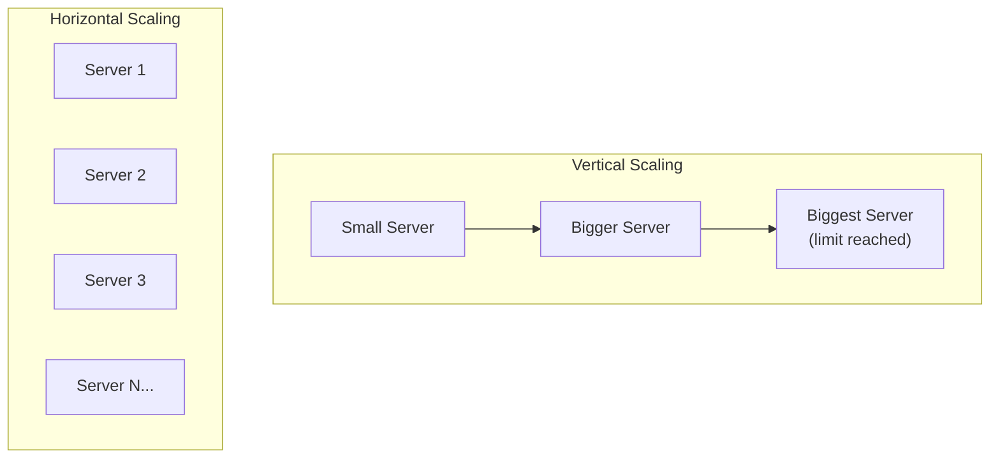
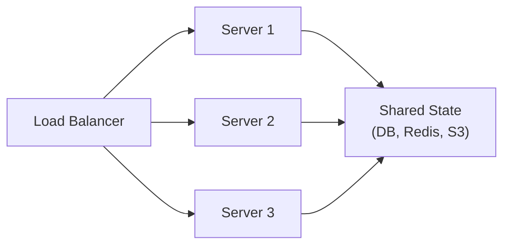

## Why System Design?

Writing code that works on your laptop is one skill. Designing systems that serve millions of users reliably is another. System design is about making **tradeoffs** — every choice has consequences for scalability, reliability, cost, and complexity.

---

## Core Metrics

### Latency

Time from request to response. Measured in milliseconds (ms).

| Operation | Typical Latency |
|-----------|----------------|
| L1 cache reference | 0.5 ns |
| RAM access | 100 ns |
| SSD random read | 150 μs |
| HDD seek | 10 ms |
| Same-datacenter roundtrip | 0.5 ms |
| US coast-to-coast roundtrip | 40 ms |
| Europe to US roundtrip | 80 ms |

**P50 vs P95 vs P99:** Don't measure averages — measure percentiles. P99 latency (worst 1% of requests) is what users feel during peak load.

### Throughput

Volume of work processed per unit time. Measured as:
- **QPS** (Queries Per Second) — for databases and APIs
- **RPS** (Requests Per Second) — for web servers
- **TPS** (Transactions Per Second) — for payment systems
- **Bandwidth** (Mbps/Gbps) — for network and data transfer

### Availability

Percentage of time the system is operational:

| Availability | Downtime/Year | Downtime/Month | Common Name |
|-------------|---------------|----------------|-------------|
| 99% | 3.65 days | 7.3 hours | Two nines |
| 99.9% | 8.76 hours | 43.8 minutes | Three nines |
| 99.95% | 4.38 hours | 21.9 minutes | Three and a half nines |
| 99.99% | 52.6 minutes | 4.4 minutes | Four nines |
| 99.999% | 5.26 minutes | 26.3 seconds | Five nines |

**SLA** (Service Level Agreement): Contractual commitment to availability.
**SLO** (Service Level Objective): Internal target (usually stricter than SLA).
**SLI** (Service Level Indicator): The actual measured metric.

---

## Back-of-the-Envelope Estimation

Quick math to sanity-check designs. Memorize these approximations:

### Powers of 2

| Power | Value | Approx |
|-------|-------|--------|
| 2^10 | 1,024 | ~1 thousand |
| 2^20 | 1,048,576 | ~1 million |
| 2^30 | 1,073,741,824 | ~1 billion |
| 2^40 | ~1 trillion | ~1 TB |

### Common Estimates

| What | Value |
|------|-------|
| Daily seconds | 86,400 ≈ ~100K |
| Monthly seconds | ~2.5 million |
| Yearly seconds | ~30 million |
| 1 million requests/day | ~12 QPS |
| 100 million requests/day | ~1,200 QPS |
| 1 billion requests/day | ~12,000 QPS |

### Example Calculation

> "Design a URL shortener handling 100M new URLs/day"

```
Writes: 100M / 86400 ≈ 1,200 writes/sec
Reads (assuming 10:1 read:write): 12,000 reads/sec
Storage (each URL = 500 bytes): 100M × 500B = 50GB/day → 18TB/year
```

---

## Scaling Approaches

### Vertical Scaling (Scale Up)

Add more power to a single machine: more CPU, RAM, faster disks.

| Pros | Cons |
|------|------|
| Simple — no code changes | Hardware limits (can't buy infinite RAM) |
| No distributed complexity | Single point of failure |
| Strong consistency easy | Cost increases exponentially |

### Horizontal Scaling (Scale Out)

Add more machines and distribute the load.

| Pros | Cons |
|------|------|
| Theoretically unlimited | Distributed system complexity |
| Fault tolerant (no SPOF) | Data consistency challenges |
| Cost-efficient (commodity hardware) | Need load balancers, service discovery |



### When to Use Which

| Start with | Move to horizontal when |
|-----------|------------------------|
| Vertical (simple, fast) | You hit hardware limits |
| | You need fault tolerance |
| | Costs become disproportionate |
| | Traffic is unpredictable (auto-scaling) |

---

## Stateless vs Stateful

### Stateless Services

No server-side session state. Any instance can handle any request.



**Benefits:** Easy to scale (add/remove instances), easy to deploy, fault tolerant.

**How:** Store state externally (database, Redis, object storage). Pass context in requests (JWT tokens, request parameters).

### Stateful Services

Server holds state (sessions, connections, in-memory cache).

**When necessary:** WebSocket connections, in-memory caches, game servers, databases.

**Challenge:** Need sticky sessions or state transfer on failover.

---

## Single Points of Failure (SPOF)

Any component whose failure takes down the entire system:

| SPOF | Mitigation |
|------|-----------|
| Single database server | Primary + replica with automatic failover |
| Single load balancer | Redundant pair (active-passive or active-active) |
| Single datacenter | Multi-region deployment |
| Single DNS provider | Multiple NS records, secondary DNS |
| Single deployment | Blue-green or canary deployments |

**Design principle:** If something fails, what happens? Make the answer "minimal impact" for every component.

---

## Consistency Models

| Model | Guarantee | Example |
|-------|-----------|---------|
| **Strong consistency** | Read always returns latest write | Single-node database, synchronous replication |
| **Eventual consistency** | Reads may be stale but will converge | DNS, CDN caches, DynamoDB (default) |
| **Causal consistency** | Respects cause-effect ordering | Social media feeds (see reply after the post) |
| **Read-your-writes** | You see your own writes immediately | User profile updates |

**Tradeoff:** Stronger consistency = higher latency and lower availability (CAP theorem).

---

## Key Takeaways

1. **Design for failure** — everything will fail eventually; design so that failures are graceful, not catastrophic
2. **Scale horizontally** for most workloads — stateless services behind load balancers
3. **Measure in percentiles** — P99 latency matters more than average
4. **Do back-of-the-envelope math** before building — sanity-check your approach with numbers
5. **Tradeoffs are everywhere** — consistency vs availability, latency vs throughput, simplicity vs flexibility
6. **Start simple, scale when needed** — premature optimization is the root of all evil, but know what "needed" looks like
