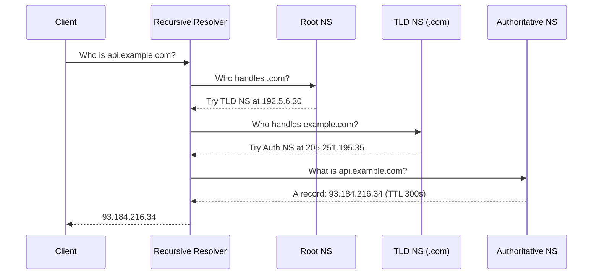
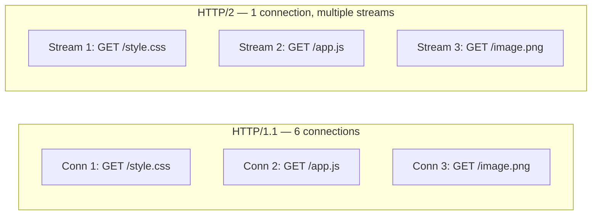
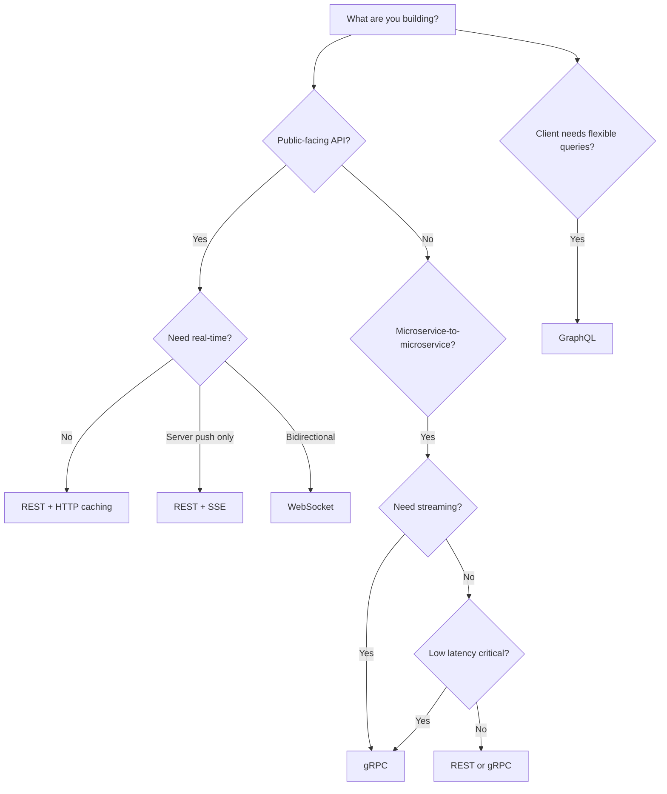

# Networking & Protocols

Understanding how data moves across the network is the foundation of system design. Every architectural decision — from API style to database placement — is constrained by networking realities.

## DNS Resolution

The Domain Name System translates human-readable domain names into IP addresses. A single page load may trigger dozens of DNS lookups.

### Resolution Flow



### DNS Record Types

| Record | Purpose | Example |
|--------|---------|---------|
| A | Maps name to IPv4 address | `api.example.com → 93.184.216.34` |
| AAAA | Maps name to IPv6 address | `api.example.com → 2606:2800:220:1:...` |
| CNAME | Alias to another domain name | `www.example.com → example.com` |
| MX | Mail server routing | `example.com → mail.example.com` |
| NS | Delegates a zone to nameservers | `example.com → ns1.provider.com` |
| SRV | Service discovery (host + port) | `_http._tcp.example.com → 8080 web1` |
| TXT | Arbitrary text (SPF, verification) | `v=spf1 include:_spf.google.com` |

### DNS Caching Layers

1. **Browser cache** — respects TTL from response
2. **OS resolver cache** — shared across all applications
3. **Router/ISP cache** — intermediate caching resolver
4. **Recursive resolver** — (e.g., 8.8.8.8, 1.1.1.1) caches per TTL

**Design implication:** Low TTLs (30–60s) enable fast failover but increase lookup latency. High TTLs (3600s+) improve performance but slow propagation of changes.

---

## Transport Protocols: TCP vs UDP

| Characteristic | TCP | UDP |
|---------------|-----|-----|
| Connection | Connection-oriented (3-way handshake) | Connectionless |
| Reliability | Guaranteed delivery, ordering, retransmission | Best-effort, no guarantees |
| Flow control | Yes (sliding window) | No |
| Congestion control | Yes (slow start, AIMD) | No |
| Header size | 20–60 bytes | 8 bytes |
| Use cases | HTTP, databases, file transfer | DNS, video streaming, gaming, VoIP |
| Latency | Higher (handshake + ACKs) | Lower (fire and forget) |

### TCP Three-Way Handshake

```
Client → Server:  SYN (seq=x)
Server → Client:  SYN-ACK (seq=y, ack=x+1)
Client → Server:  ACK (ack=y+1)
```

This adds 1 RTT before any data flows — a critical consideration for latency-sensitive systems.

---

## HTTP Evolution

### HTTP/1.1 vs HTTP/2 vs HTTP/3

| Feature | HTTP/1.1 | HTTP/2 | HTTP/3 |
|---------|----------|--------|--------|
| Transport | TCP | TCP | QUIC (over UDP) |
| Multiplexing | No (one request per connection) | Yes (streams over single connection) | Yes (independent streams) |
| Head-of-line blocking | Yes (at TCP and HTTP level) | Partial (TCP level remains) | No (stream-independent) |
| Header compression | None | HPACK | QPACK |
| Server push | No | Yes | Yes |
| Connection setup | TCP + TLS = 2–3 RTT | TCP + TLS = 2–3 RTT | 0–1 RTT (QUIC integrates TLS) |
| Binary framing | No (text-based) | Yes | Yes |

### HTTP/2 Multiplexing



### When to Use What

- **HTTP/1.1** — Legacy systems, simple proxies, environments without HTTP/2 support
- **HTTP/2** — Web applications, APIs, any client-server with modern TLS
- **HTTP/3** — Mobile clients (handles network switching), high-latency links, loss-prone networks

---

## WebSockets

WebSockets provide full-duplex, persistent connections over a single TCP socket. The connection begins as an HTTP upgrade:

```
GET /chat HTTP/1.1
Host: server.example.com
Upgrade: websocket
Connection: Upgrade
Sec-WebSocket-Key: dGhlIHNhbXBsZSBub25jZQ==
Sec-WebSocket-Version: 13

HTTP/1.1 101 Switching Protocols
Upgrade: websocket
Connection: Upgrade
Sec-WebSocket-Accept: s3pPLMBiTxaQ9kYGzzhZRbK+xOo=
```

After the handshake, both client and server can send frames at any time without HTTP overhead.

**Use cases:** Chat applications, live dashboards, collaborative editing, gaming, real-time notifications.

**Scaling challenge:** Each WebSocket holds a persistent TCP connection, consuming server resources. You need connection-aware load balancing and often a pub/sub backbone (Redis Pub/Sub, Kafka) to broadcast across server instances.

---

## Real-Time Communication Patterns

| Pattern | Direction | Latency | Connection | Overhead | Best For |
|---------|-----------|---------|------------|----------|----------|
| **Short polling** | Client → Server | High (interval-based) | New connection each poll | High | Simple dashboards, low-frequency updates |
| **Long polling** | Client → Server (held open) | Medium | Held until data or timeout | Medium | Notifications, moderate real-time needs |
| **Server-Sent Events (SSE)** | Server → Client only | Low | Persistent HTTP connection | Low | Live feeds, stock tickers, log streaming |
| **WebSocket** | Bidirectional | Very low | Persistent TCP socket | Very low per message | Chat, gaming, collaborative apps |

### Long Polling Flow

```
1. Client sends request
2. Server holds connection open until data is available (or timeout)
3. Server responds with data
4. Client immediately sends a new request
5. Repeat
```

### SSE vs WebSocket Decision

- Need **bidirectional** communication → WebSocket
- Need **server-to-client push only** → SSE (simpler, auto-reconnect, works through HTTP proxies)
- Need to work with **HTTP/2** multiplexing naturally → SSE

---

## API Paradigms: REST vs gRPC vs GraphQL

| Aspect | REST | gRPC | GraphQL |
|--------|------|------|---------|
| Protocol | HTTP/1.1 or HTTP/2 | HTTP/2 (always) | HTTP (typically POST) |
| Data format | JSON (text) | Protocol Buffers (binary) | JSON |
| Contract | OpenAPI/Swagger (optional) | .proto files (required) | Schema (required) |
| Streaming | Limited (SSE, chunked) | Bidirectional streaming | Subscriptions (via WebSocket) |
| Code generation | Optional | Built-in (multi-language) | Client libraries |
| Browser support | Native | Requires grpc-web proxy | Native |
| Caching | HTTP caching (ETags, Cache-Control) | No native HTTP caching | Difficult (single endpoint) |
| Over/under-fetching | Common problem | Fixed by proto definition | Solved by design |
| Learning curve | Low | Medium | Medium-High |

### When to Choose What

**REST** — Public APIs, browser-first clients, simple CRUD, leveraging HTTP caching, team familiarity.

**gRPC** — Service-to-service communication, low-latency requirements, streaming needs, polyglot microservices, strict contracts.

**GraphQL** — Client-driven data requirements, mobile apps needing bandwidth efficiency, aggregating multiple backend services into one API, rapid frontend iteration.

### gRPC Streaming Modes

```protobuf
service ChatService {
  // Unary (request-response)
  rpc GetUser(UserRequest) returns (UserResponse);

  // Server streaming
  rpc ListMessages(ChannelRequest) returns (stream Message);

  // Client streaming
  rpc UploadFile(stream FileChunk) returns (UploadStatus);

  // Bidirectional streaming
  rpc Chat(stream ChatMessage) returns (stream ChatMessage);
}
```

---

## Protocol Selection Guide



---

## Key Takeaways

1. **DNS is a distributed cache** — TTL choices directly impact failover speed vs. lookup performance. Design for the trade-off your system needs.

2. **TCP guarantees delivery at the cost of latency** — the 3-way handshake and retransmissions add overhead. HTTP/3 (QUIC) eliminates TCP's head-of-line blocking.

3. **HTTP/2 multiplexing solves connection limits** — but TCP-level head-of-line blocking remains. HTTP/3 solves this completely with independent QUIC streams.

4. **WebSockets are powerful but expensive** — persistent connections consume server resources. Use SSE when you only need server-to-client push.

5. **REST is not always the answer** — gRPC excels for internal services (performance, contracts, streaming). GraphQL excels when clients need flexible data fetching.

6. **Protocol choice cascades into infrastructure** — gRPC requires HTTP/2-aware load balancers, WebSockets need sticky sessions or connection-aware routing, GraphQL complicates HTTP caching.

7. **Match the pattern to the problem** — short polling for simplicity, long polling for moderate real-time, SSE for one-way streaming, WebSockets for full duplex.
