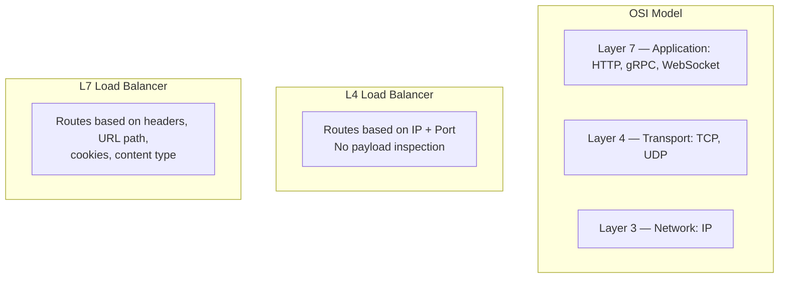
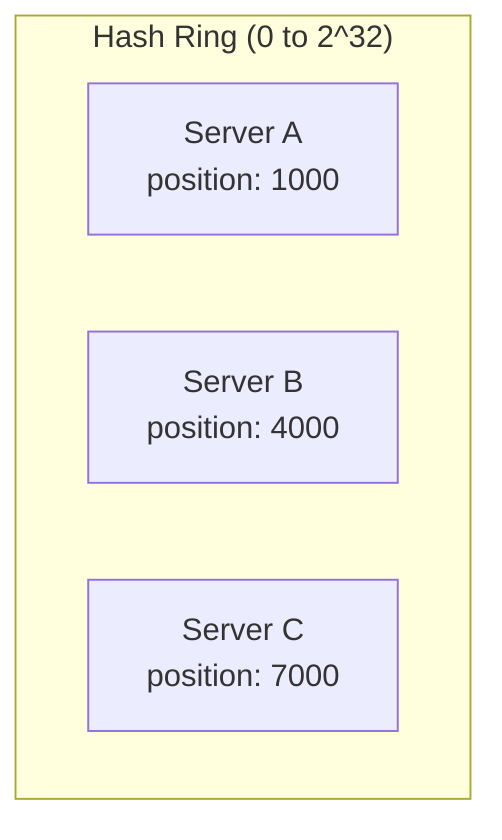
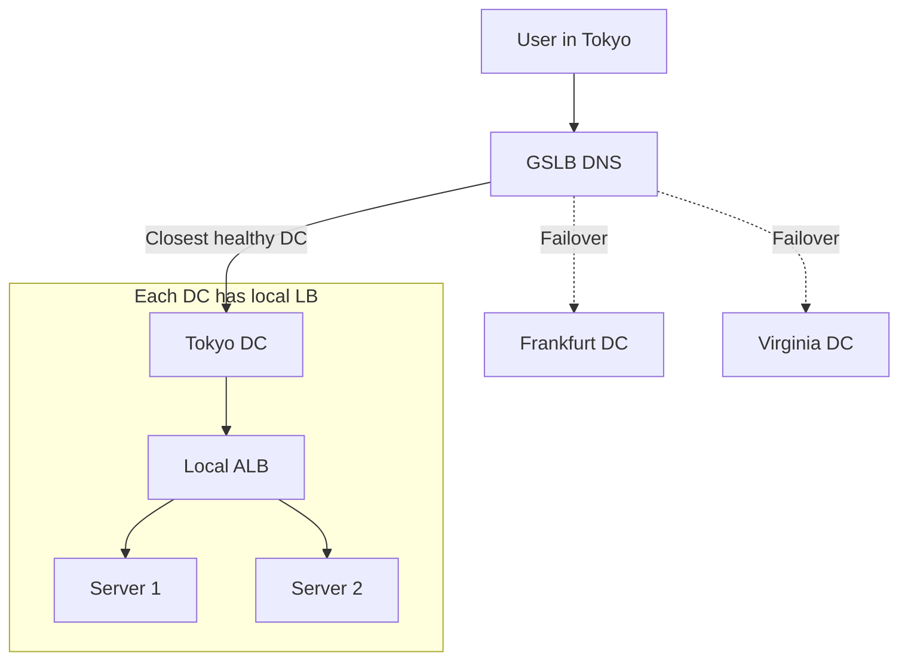
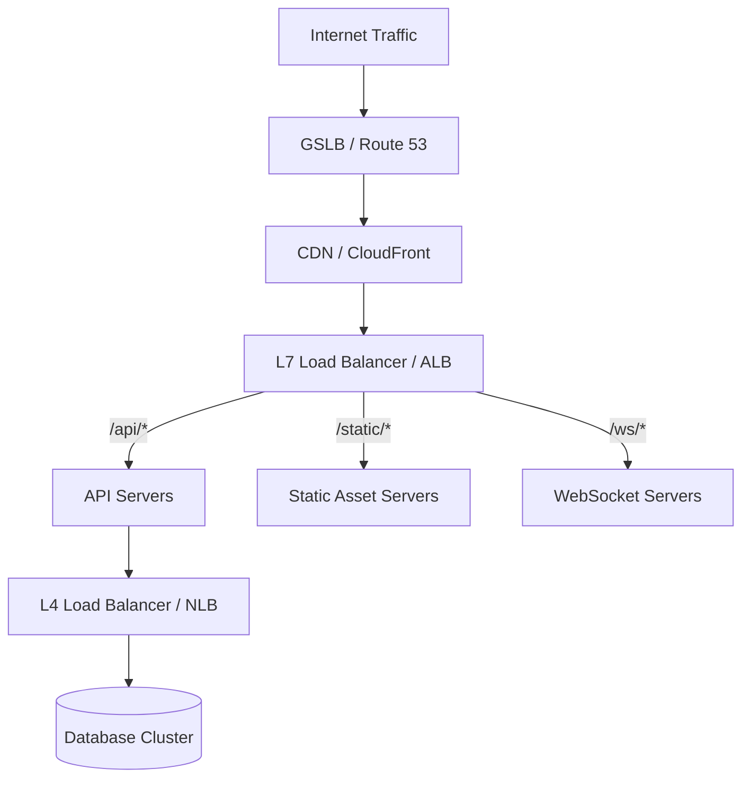

# Load Balancing

Load balancers distribute incoming traffic across multiple servers to improve availability, reliability, and performance. They are one of the most fundamental building blocks in scalable system design.

## Why Load Balancers?

| Problem | How Load Balancing Solves It |
|---------|------------------------------|
| Single point of failure | Traffic reroutes to healthy servers if one dies |
| Capacity limits | Spread load across multiple machines |
| Uneven load distribution | Algorithms ensure balanced utilization |
| Maintenance downtime | Drain connections before taking servers offline |
| Geographic latency | Route to the nearest healthy endpoint |

---

## Layer 4 vs Layer 7 Load Balancing



### Comparison Table

| Feature | L4 Load Balancer | L7 Load Balancer |
|---------|-----------------|-----------------|
| Decision basis | IP address + TCP/UDP port | HTTP headers, URL, cookies, payload |
| Performance | Faster (no payload parsing) | Slightly slower (must parse application data) |
| SSL termination | Typically no (pass-through) | Yes (terminates TLS, re-encrypts optionally) |
| Content routing | No | Yes (path-based, host-based routing) |
| WebSocket support | Pass-through (no awareness) | Upgrade-aware, can route by path |
| Health checks | TCP connect / port check | HTTP status codes, response body checks |
| Connection pooling | No | Yes (reduces backend connections) |
| Sticky sessions | IP-based only | Cookie-based, header-based |
| Use case | High-throughput TCP (databases, gRPC) | Web applications, APIs, microservices |
| AWS equivalent | Network Load Balancer (NLB) | Application Load Balancer (ALB) |

---

## Load Balancing Algorithms

### Round Robin

Distributes requests sequentially across all servers.

```
Request 1 → Server A
Request 2 → Server B
Request 3 → Server C
Request 4 → Server A  (cycle repeats)
```

**Pros:** Simple, no state required, fair distribution with homogeneous servers.
**Cons:** Ignores server capacity differences and current load.

### Weighted Round Robin

Assigns a weight to each server proportional to its capacity.

```
Server A (weight=5): receives 5 out of every 8 requests
Server B (weight=2): receives 2 out of every 8 requests
Server C (weight=1): receives 1 out of every 8 requests
```

**Use case:** Mixed fleet — newer, more powerful servers get proportionally more traffic.

### Least Connections

Routes to the server with the fewest active connections.

```
Server A: 12 active connections
Server B: 3 active connections  ← next request goes here
Server C: 8 active connections
```

**Pros:** Adapts to varying request durations (long-running vs. quick requests).
**Cons:** Requires tracking connection state per backend.

### Weighted Least Connections

Combines least connections with server weights. Computes `active_connections / weight` and routes to the lowest ratio.

### IP Hash

Hashes the client IP to deterministically select a server.

```python
server_index = hash(client_ip) % number_of_servers
```

**Pros:** Same client always reaches the same server (pseudo-sticky).
**Cons:** Adding/removing servers remaps many clients (solved by consistent hashing).

### Consistent Hashing

Maps both servers and requests onto a hash ring. Each request routes to the next server clockwise on the ring.



**Key property:** When a server is added or removed, only `1/N` of keys are remapped (vs. all keys with modular hashing).

**Virtual nodes:** Each physical server maps to multiple points on the ring (e.g., 150 virtual nodes per server), ensuring even distribution even with few physical servers.

---

## Health Checks

### Active Health Checks

The load balancer periodically probes backends:

```
Every 10 seconds:
  GET /health → 200 OK    → mark healthy
  GET /health → 503/timeout → mark unhealthy after 3 consecutive failures
  
Recovery:
  GET /health → 200 OK    → mark healthy after 2 consecutive successes
```

**Configuration parameters:**
- **Interval** — how often to check (5–30 seconds)
- **Timeout** — how long to wait for response (2–5 seconds)
- **Unhealthy threshold** — consecutive failures before removal (2–5)
- **Healthy threshold** — consecutive successes before re-adding (2–3)

### Passive Health Checks

Monitor real traffic for failures rather than sending probes:

```
If a backend returns 5xx for 50% of requests in a 30-second window:
  → Mark unhealthy
  → Stop routing new requests
  → Resume active health checking
```

**Pros:** No additional probe traffic, detects issues faster under load.
**Cons:** Requires real traffic to detect problems (cold start issue).

### Health Check Best Practices

| Practice | Reason |
|----------|--------|
| Check dependencies (DB, cache) in `/health` | Detect cascading failures |
| Separate liveness from readiness | Don't restart a pod that's just slow to start |
| Return structured JSON | Include version, uptime, dependency status |
| Keep checks lightweight | A slow health check causes false positives |

---

## DNS-Based Load Balancing

DNS can distribute traffic by returning different IP addresses:

```
dig api.example.com
;; ANSWER SECTION:
api.example.com.  60  IN  A  10.0.1.1
api.example.com.  60  IN  A  10.0.2.1
api.example.com.  60  IN  A  10.0.3.1
```

**Weighted DNS:** Route53 weighted routing returns specific IPs based on configured weights.

| Advantage | Limitation |
|-----------|-----------|
| No single point of failure | Slow failover (TTL caching) |
| Geographic routing possible | No health-aware routing (unless managed DNS) |
| Simple to configure | Client may cache stale IPs |
| Scales globally | Cannot balance based on server load |

**Modern approach:** Use DNS for coarse geographic routing (region level), then dedicated load balancers for fine-grained distribution within a region.

---

## Sticky Sessions (Session Affinity)

Ensure all requests from a client reach the same backend server.

### Implementation Methods

| Method | Mechanism | Pros | Cons |
|--------|-----------|------|------|
| Cookie-based | LB injects a cookie identifying the backend | Works through NAT, accurate | Requires L7 LB |
| IP-based | Hash client IP to select server | Works at L4 | Breaks with shared IPs (NAT, proxy) |
| Header-based | Custom header identifies the session | Flexible | Requires client cooperation |

### When to Use Sticky Sessions

- **Use:** Local session state, WebSocket connections, shopping carts in memory
- **Avoid:** Stateless services, services with shared session stores (Redis)

**Problem:** Sticky sessions create hot spots. If one server handles heavy users, it becomes overloaded while others idle.

**Better pattern:** Externalize state to Redis/Memcached, making all backends interchangeable.

---

## Software vs Hardware Load Balancers

| Aspect | Hardware (F5, Citrix) | Software (HAProxy, Nginx, Envoy) |
|--------|----------------------|----------------------------------|
| Cost | $50K–$500K+ per unit | Free / low cost |
| Performance | Dedicated ASICs, very high throughput | CPU-bound, but modern hardware is fast |
| Flexibility | Limited to vendor features | Fully customizable, scriptable |
| Deployment | Physical appliance | Container, VM, sidecar |
| Scaling | Buy bigger box (vertical) | Add more instances (horizontal) |
| Cloud-native | No | Yes |
| Updates | Vendor firmware cycles | Deploy anytime |

### Software Load Balancer Options

| Tool | Layer | Best For |
|------|-------|----------|
| **HAProxy** | L4/L7 | High-performance TCP/HTTP, battle-tested |
| **Nginx** | L7 (with L4 stream) | Web serving + reverse proxy + LB |
| **Envoy** | L7 | Service mesh, gRPC, observability |
| **AWS ALB** | L7 | Managed, integrates with ECS/EKS |
| **AWS NLB** | L4 | Ultra-low latency, static IPs, TCP/UDP |
| **Traefik** | L7 | Auto-discovery, Kubernetes-native |

---

## Global Server Load Balancing (GSLB)

GSLB distributes traffic across geographically distributed data centers.



### GSLB Routing Policies

| Policy | Routes Based On | Use Case |
|--------|----------------|----------|
| Geographic | Client's location (GeoIP) | Data residency, latency reduction |
| Latency-based | Measured RTT to each endpoint | Lowest latency globally |
| Weighted | Configured percentages | Gradual migration, canary releases |
| Failover | Primary/secondary priority | Disaster recovery |
| Multivalue | Return multiple healthy IPs | Simple distribution |

### AWS Route 53 Example

```
api.example.com:
  - Latency record → us-east-1 ALB (for US users)
  - Latency record → eu-west-1 ALB (for EU users)
  - Latency record → ap-northeast-1 ALB (for APAC users)
  
  Health checks on each ALB:
  - If us-east-1 fails → traffic reroutes to eu-west-1
```

---

## Multi-Tier Load Balancing Architecture

Production systems typically use multiple layers:



Each layer handles a different concern:
1. **GSLB** — geographic routing and DR failover
2. **CDN** — cache static content at edge
3. **L7 LB** — path-based routing, SSL termination, rate limiting
4. **L4 LB** — high-performance TCP routing to databases or internal services

---

## Key Takeaways

1. **L4 vs L7 is not better/worse — it's different concerns.** Use L4 for raw TCP performance (databases, gRPC), L7 for HTTP intelligence (routing, caching, auth).

2. **Consistent hashing is essential for stateful routing** — minimizes redistribution when servers join or leave. Use virtual nodes for even distribution.

3. **Health checks prevent cascading failures** — combine active probes with passive monitoring. A dead server receiving traffic is worse than an overloaded live one.

4. **Sticky sessions are a code smell** — they indicate state that should be externalized. Use them as a bridge, not a permanent architecture.

5. **DNS-based load balancing is coarse but resilient** — use it for global routing, not per-request balancing. TTL caching makes it slow to react.

6. **Layer your load balancing** — GSLB for regions, CDN for static content, L7 for application routing, L4 for backend services. Each layer solves a different problem.

7. **Software load balancers have won** — unless you need multi-100 Gbps throughput with sub-microsecond latency, software LBs (HAProxy, Envoy, cloud-managed) are the right choice.
