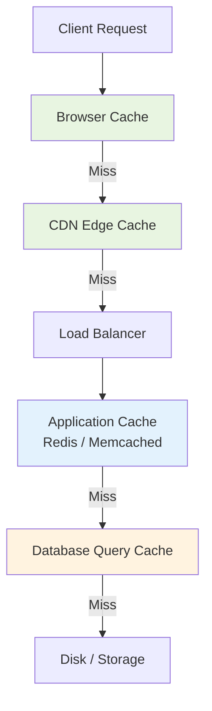
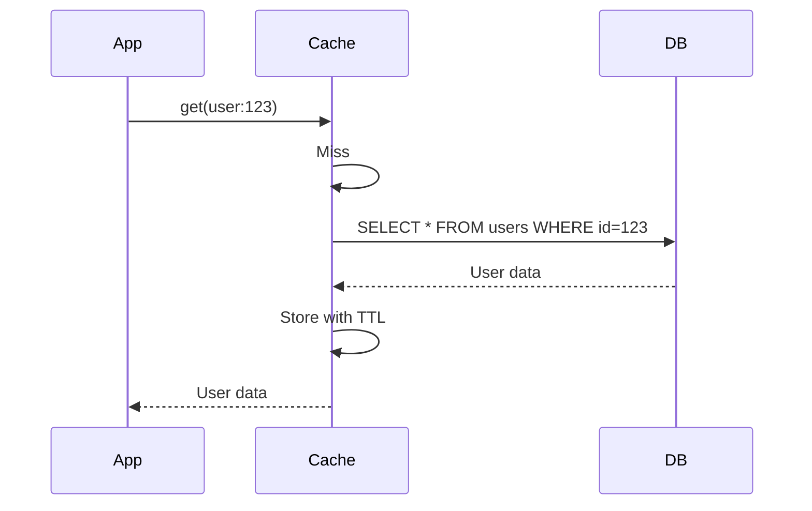
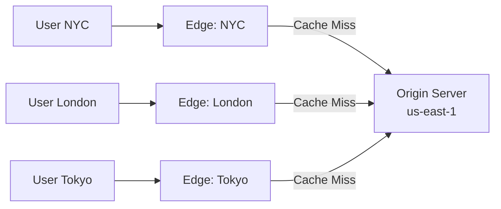

# Caching

Caching stores copies of data in a faster storage layer so future requests can be served without hitting the slower origin. It is the single most impactful technique for reducing latency and database load in distributed systems.

## The Cache Hierarchy

Every request traverses multiple caching layers. Each layer trades freshness for speed.



| Layer | Latency | Scope | Controlled By |
|-------|---------|-------|---------------|
| **CPU cache (L1/L2/L3)** | 1–10 ns | Single process | Hardware |
| **In-process cache** | 10–100 ns | Single instance | Application code |
| **Browser cache** | 0 ms (local) | Single user | Cache-Control headers |
| **CDN** | 5–50 ms | Geographic region | CDN config + headers |
| **Application cache (Redis)** | 1–5 ms | Cluster-wide | Application code |
| **Database query cache** | 1–10 ms | Database cluster | DB configuration |
| **Database buffer pool** | 0.1–1 ms | Database instance | DB engine |

---

## Caching Strategies

### Cache-Aside (Lazy Loading)

The application manages the cache explicitly.

```python
def get_user(user_id: str) -> User:
    # 1. Check cache
    cached = redis.get(f"user:{user_id}")
    if cached:
        return deserialize(cached)
    
    # 2. Cache miss — query database
    user = db.query("SELECT * FROM users WHERE id = %s", user_id)
    
    # 3. Populate cache
    redis.setex(f"user:{user_id}", ttl=3600, value=serialize(user))
    
    return user
```

| Pros | Cons |
|------|------|
| Only caches data that is actually requested | Cache miss = extra latency (cache check + DB + cache write) |
| Cache failure doesn't break reads (fallback to DB) | Data can become stale (until TTL expires or explicit invalidation) |
| Simple to implement | Application must handle cache logic |

### Read-Through

The cache itself is responsible for loading data on a miss. The application always reads from the cache.



**Difference from cache-aside:** The cache library handles loading, not your application code. Simplifies application logic but couples you to the cache provider's loading mechanism.

### Write-Through

Every write goes to the cache AND the database synchronously.

```
App → Cache.set(key, value) → DB.write(key, value) → Ack to App
```

| Pros | Cons |
|------|------|
| Cache is always consistent with DB | Higher write latency (two writes per operation) |
| Read-through + write-through = always-fresh cache | Caches data that may never be read |
| Simplifies read path | Write amplification |

### Write-Behind (Write-Back)

Writes go to the cache immediately. The cache asynchronously flushes to the database.

```
App → Cache.set(key, value) → Ack to App
                            ↓ (async, batched)
                          DB.write(batch)
```

| Pros | Cons |
|------|------|
| Very low write latency | Risk of data loss if cache fails before flush |
| Batches reduce DB write load | Complex to implement correctly |
| Smooths write spikes | Eventual consistency between cache and DB |

### Strategy Comparison

| Strategy | Read Miss Cost | Write Cost | Consistency | Complexity |
|----------|---------------|------------|-------------|------------|
| Cache-aside | High (DB + cache write) | N/A (app writes DB directly) | Eventual | Low |
| Read-through | Medium (cache handles loading) | N/A | Eventual | Medium |
| Write-through | Low (cache always warm) | High (sync dual write) | Strong | Medium |
| Write-behind | Low (cache always warm) | Very low (async) | Eventual | High |

---

## Cache Invalidation

> "There are only two hard things in Computer Science: cache invalidation and naming things." — Phil Karlton

### TTL-Based Expiry

Simplest approach: data expires after a fixed time.

```python
redis.setex("product:456", ttl=300, value=product_json)  # 5 minutes
```

**Trade-off:** Short TTL = fresher data but more cache misses. Long TTL = better hit rate but staler data.

### Event-Based Invalidation

Invalidate when the source data changes:

```python
def update_product(product_id: str, data: dict):
    db.update("products", product_id, data)
    redis.delete(f"product:{product_id}")        # Invalidate specific key
    redis.delete("products:list:page:*")          # Invalidate related lists
    publish_event("product.updated", product_id)  # Notify other services
```

### Versioned Keys

Include a version in the cache key. Changing the version effectively invalidates all old entries without explicit deletion.

```python
SCHEMA_VERSION = "v3"

def cache_key(product_id: str) -> str:
    return f"product:{SCHEMA_VERSION}:{product_id}"

# When schema changes: bump SCHEMA_VERSION → old keys naturally expire via TTL
```

### Invalidation Comparison

| Approach | Freshness | Complexity | Cache Hit Rate |
|----------|-----------|------------|----------------|
| TTL only | Bounded staleness | Very low | High (until expiry) |
| Event-based | Near-immediate | High (requires pub/sub) | High (warm until change) |
| Versioned keys | Immediate on deploy | Low | Temporarily low after version bump |
| Hybrid (TTL + events) | Best of both worlds | Medium | High |

---

## Cache Stampede / Thundering Herd

When a popular cache key expires, hundreds of concurrent requests may simultaneously hit the database.

### Problem

```
TTL expires for "hot_product:123"
  → 500 concurrent requests arrive
  → All see cache miss
  → All query the database
  → Database overloaded
```

### Solutions

**1. Lock / Mutex**

Only one request fetches from DB; others wait for the cache to be repopulated.

```python
def get_with_lock(key: str) -> str:
    value = redis.get(key)
    if value:
        return value
    
    lock_acquired = redis.set(f"lock:{key}", "1", nx=True, ex=5)
    if lock_acquired:
        # Winner: fetch from DB and populate cache
        value = db.query(...)
        redis.setex(key, ttl=3600, value=value)
        redis.delete(f"lock:{key}")
        return value
    else:
        # Loser: wait and retry
        time.sleep(0.05)
        return get_with_lock(key)
```

**2. Background Refresh (Proactive Revalidation)**

Refresh the cache before it expires. When a key has < 10% of its TTL remaining, trigger an async refresh while still serving the stale value.

```python
def get_with_early_refresh(key: str, ttl: int = 3600) -> str:
    value, remaining_ttl = redis.get_with_ttl(key)
    if value and remaining_ttl > ttl * 0.1:
        return value  # Fresh enough
    if value:
        # Stale but usable — trigger async refresh
        trigger_background_refresh(key)
        return value  # Serve stale while refreshing
    # Full miss
    return fetch_and_cache(key, ttl)
```

**3. Jittered TTLs**

Add random variance to TTLs so keys don't expire simultaneously:

```python
base_ttl = 3600
jitter = random.randint(0, 300)  # 0–5 minutes
redis.setex(key, base_ttl + jitter, value)
```

---

## CDN Concepts

A Content Delivery Network caches content at geographically distributed **edge** locations close to end users.

### Architecture



### Cache-Control Headers

| Header | Example | Meaning |
|--------|---------|---------|
| `Cache-Control: public, max-age=3600` | Cacheable by CDN and browser for 1 hour | |
| `Cache-Control: private, max-age=300` | Cacheable by browser only (user-specific) | |
| `Cache-Control: no-store` | Never cache (sensitive data) | |
| `Cache-Control: no-cache` | Cache but revalidate every time (ETag check) | |
| `Cache-Control: s-maxage=86400` | CDN caches for 24h (overrides max-age for shared caches) | |
| `Vary: Accept-Encoding` | Cache separate versions per encoding | |
| `ETag: "abc123"` | Conditional revalidation token | |

### CDN Cache Key

The cache key typically includes:
- URL path + query string
- `Vary` header values (e.g., `Accept-Encoding`, `Accept-Language`)
- Custom headers (e.g., device type, country)

**Cache-busting pattern:** Include content hash in URL for immutable assets:
```
/static/app.a3f8c2.js  → Cache-Control: public, max-age=31536000
```

---

## Redis Caching Patterns

### Common Data Structures for Caching

| Pattern | Redis Type | Use Case |
|---------|-----------|----------|
| Simple key-value | STRING | User sessions, API responses |
| Counters | STRING (INCR) | Rate limiting, view counts |
| Ranked lists | SORTED SET | Leaderboards, trending items |
| Recent items | LIST (LPUSH + LTRIM) | Activity feeds, recent searches |
| Unique counts | HYPERLOGLOG | Unique visitors, cardinality |
| Object fields | HASH | User profiles (partial updates) |
| Bloom filter | BITMAP / Module | "Definitely not in set" checks |

### Cache Warming

Pre-populate the cache for predictable traffic patterns:

```python
def warm_cache():
    """Run before traffic spike (e.g., scheduled before marketing campaign)."""
    popular_products = db.query("SELECT * FROM products ORDER BY views DESC LIMIT 1000")
    pipeline = redis.pipeline()
    for product in popular_products:
        pipeline.setex(f"product:{product.id}", 3600, serialize(product))
    pipeline.execute()
```

### Eviction Policies

When Redis reaches max memory:

| Policy | Behavior | Best For |
|--------|----------|----------|
| `allkeys-lru` | Evict least recently used key | General caching |
| `volatile-lru` | Evict LRU among keys with TTL | Mix of cache + permanent data |
| `allkeys-lfu` | Evict least frequently used | Skewed access patterns |
| `volatile-ttl` | Evict keys closest to expiry | TTL-managed caches |
| `noeviction` | Return error on write | When data loss is unacceptable |

---

## When NOT to Cache

Caching is not free — it adds complexity, consistency challenges, and operational burden.

| Scenario | Why Caching Hurts |
|----------|-------------------|
| Write-heavy workloads | Cache invalidation dominates, minimal read benefit |
| Highly personalized data | Low cache hit rate (unique per user) |
| Data that must be real-time consistent | Stale reads cause business logic errors (financial transactions) |
| Small dataset that fits in DB buffer | DB is already fast — cache adds complexity for no gain |
| Infrequently accessed data | Cache pollution, low hit rate |
| Security-sensitive data | Cached data expands attack surface |
| Cache larger than dataset | You're paying for complexity without benefit |

### The Cache Cost Formula

```
Value of caching ≈ (read frequency) × (origin latency - cache latency) × (hit rate)
                  - (invalidation complexity) - (operational cost) - (consistency risk)
```

If the value is negative, don't cache.

---

## Key Takeaways

1. **Caching is a spectrum, not a binary** — from browser to CDN to application to database, each layer has different latency, scope, and freshness guarantees. Layer them intentionally.

2. **Cache-aside is the default choice** — it's simple, resilient to cache failures, and caches only what's needed. Start here unless you have a specific reason for other strategies.

3. **Invalidation is the hard part** — TTL gives bounded staleness with zero complexity. Event-based gives immediate freshness but requires infrastructure. Combine them.

4. **Thundering herd kills databases** — protect hot keys with locks, background refresh, or jittered TTLs. This is not optional for high-traffic systems.

5. **CDN is your first line of defense** — for public, static, or semi-static content, a CDN reduces origin traffic by 80–95%. Use `Cache-Control` headers deliberately.

6. **Not everything should be cached** — write-heavy data, real-time financial data, and rarely-accessed data are often better served directly. Calculate the value before adding complexity.

7. **Monitor your cache** — hit rate, eviction rate, and memory usage tell you if caching is working. A hit rate below 80% suggests your access pattern doesn't benefit from caching.
