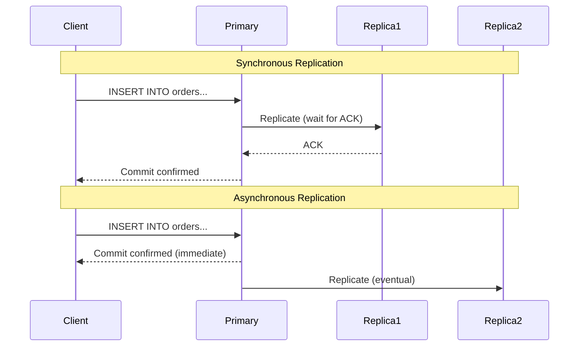
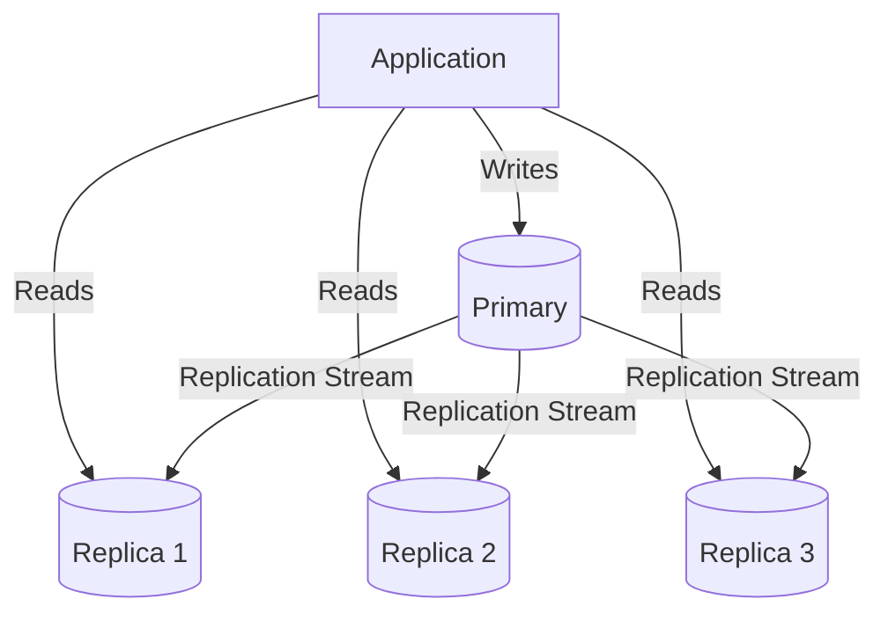
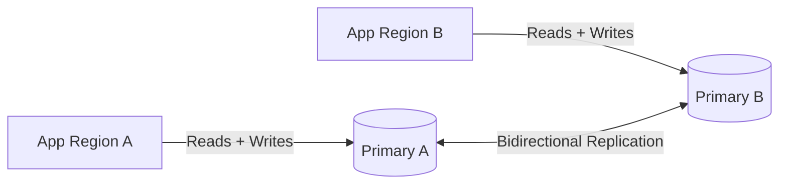
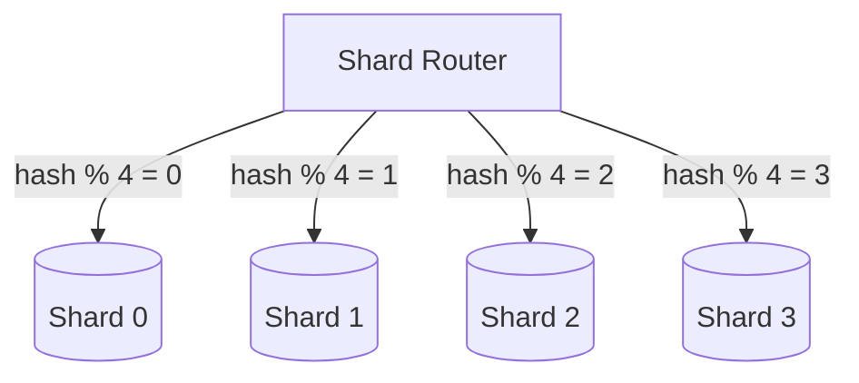
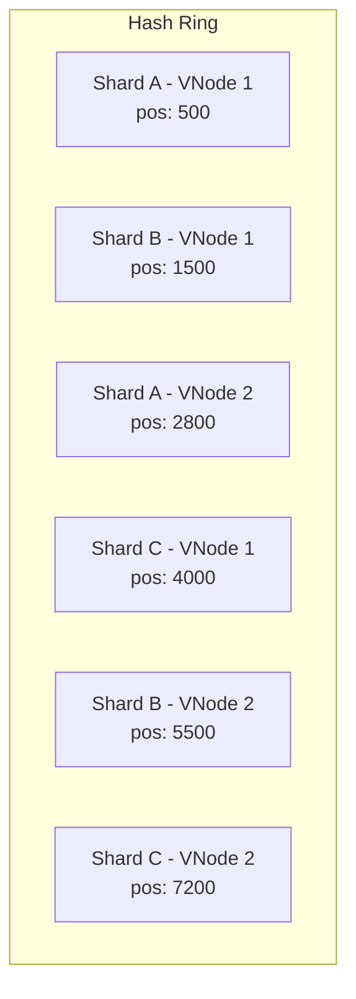
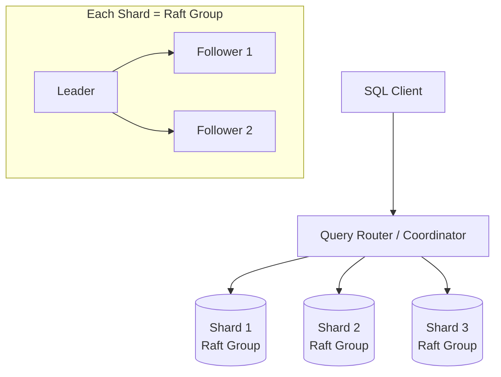
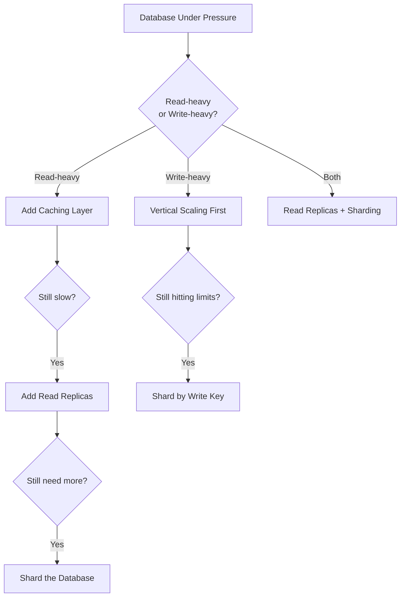

# Databases at Scale

A single database server eventually becomes a bottleneck — whether for read throughput, write throughput, storage capacity, or availability. Scaling databases requires understanding replication, sharding, and the trade-offs each introduces.

## Replication

Replication maintains copies of data across multiple database nodes for availability, durability, and read scaling.

### Synchronous vs Asynchronous Replication



| Aspect | Synchronous | Asynchronous |
|--------|-------------|--------------|
| Write latency | Higher (wait for replica ACK) | Lower (immediate commit) |
| Data safety | Zero data loss on primary failure | Potential data loss (replication lag) |
| Availability | Slower (blocked if replica is down) | Higher (primary independent) |
| Consistency | Strong (replicas always current) | Eventual (replicas may lag) |
| Throughput | Lower (bounded by slowest replica) | Higher (primary writes freely) |
| Use case | Financial transactions, inventory | Analytics, read-heavy workloads |

### Semi-Synchronous

A hybrid: the primary waits for **at least one** replica to acknowledge before confirming to the client. Other replicas receive updates asynchronously.

```
Write → Primary → Wait for 1 replica ACK → Confirm to client
                → Async replicate to remaining replicas
```

This balances durability (no data loss if primary + one replica survive) with write performance.

---

### Primary-Replica (Master-Slave)



| Characteristic | Detail |
|---------------|--------|
| Write path | Primary only |
| Read path | Any replica (or primary) |
| Failover | Promote a replica to primary |
| Scaling | Reads scale horizontally, writes do not |
| Replication lag | Replicas may serve stale data (ms to seconds) |

**Read-after-write consistency problem:** User writes to primary, immediately reads from replica that hasn't received the update yet.

**Solutions:**
1. Route reads to primary for recently-written data (time window)
2. Route reads to primary for the user who wrote (session-level)
3. Client tracks write timestamp; replica must be at least that fresh

### Multi-Primary (Master-Master)



| Pros | Cons |
|------|------|
| Writes scale horizontally | Conflict resolution is complex |
| No single point of failure | Split-brain risk during network partition |
| Geographic write locality | Higher replication lag between regions |
| Active-active deployments | Eventual consistency between primaries |

**Conflict resolution strategies:**
- **Last-write-wins (LWW)** — timestamp-based, simple but can lose data
- **Application-level** — custom merge logic per domain
- **CRDTs** — conflict-free replicated data types (counters, sets)
- **Avoid conflicts** — partition writes by key range or region

---

## Read Replicas

Dedicated replicas optimized for read queries, offloading the primary.

### Routing Logic

```python
class DatabaseRouter:
    def __init__(self, primary, replicas):
        self.primary = primary
        self.replicas = replicas
        self._index = 0
    
    def get_connection(self, operation: str):
        if operation == "write":
            return self.primary
        # Round-robin across read replicas
        replica = self.replicas[self._index % len(self.replicas)]
        self._index += 1
        return replica
    
    def get_fresh_read(self):
        """For read-after-write consistency."""
        return self.primary
```

### Read Replica Considerations

| Consideration | Detail |
|---------------|--------|
| Replication lag | Typically ms, but can spike during heavy writes |
| Failover | Replicas can be promoted; need health checking |
| Cross-region replicas | Higher lag but lower read latency for distant users |
| Replica count | Typically 1–5; each adds replication overhead on primary |
| Dedicated replicas | Separate for analytics (long queries don't affect app reads) |

---

## Connection Pooling

Database connections are expensive (TCP handshake, TLS, authentication, memory allocation). Pooling reuses connections across requests.

### Without Pooling

```
Request 1: Open connection → Query → Close connection  (50ms overhead)
Request 2: Open connection → Query → Close connection  (50ms overhead)
Request 3: Open connection → Query → Close connection  (50ms overhead)
```

### With Pooling

```
Startup: Create pool of 20 connections

Request 1: Borrow connection → Query → Return to pool  (< 1ms overhead)
Request 2: Borrow connection → Query → Return to pool  (< 1ms overhead)
Request 3: Borrow connection → Query → Return to pool  (< 1ms overhead)
```

### Pool Configuration

| Parameter | Typical Value | Effect |
|-----------|--------------|--------|
| Min connections | 5–10 | Always available, no cold start |
| Max connections | 20–100 | Prevents overwhelming the database |
| Connection timeout | 5s | How long to wait for a free connection |
| Idle timeout | 300s | Close unused connections to free DB resources |
| Max lifetime | 1800s | Prevent stale connections (DNS changes, credential rotation) |

### Connection Pool Architectures

| Approach | Example | Best For |
|----------|---------|----------|
| Application-level | HikariCP, SQLAlchemy pool | Most applications |
| Sidecar proxy | PgBouncer, ProxySQL | Many short-lived connections (serverless) |
| Cloud-managed | RDS Proxy, Cloud SQL Auth Proxy | Serverless + managed databases |

**PgBouncer pooling modes:**
- **Session** — connection held for entire client session
- **Transaction** — connection returned after each transaction (recommended)
- **Statement** — connection returned after each statement (most aggressive)

---

## Sharding (Horizontal Partitioning)

Sharding splits data across multiple database instances, each holding a subset. Unlike replication (copies of all data), sharding distributes different data to different nodes.

### Data Partitioning vs Sharding

| Concept | Scope | Example |
|---------|-------|---------|
| **Partitioning** | Within a single database instance | Table split into monthly partitions on the same server |
| **Sharding** | Across multiple database instances | User data split across 8 separate database servers |

Partitioning improves query performance (scan less data). Sharding enables horizontal scalability (each shard handles a fraction of total traffic).

---

### Hash-Based Sharding

```python
def get_shard(user_id: str, num_shards: int) -> int:
    return hash(user_id) % num_shards
```



| Pros | Cons |
|------|------|
| Even distribution (good hash function) | Resharding requires data migration |
| Simple routing logic | Adjacent keys land on different shards (no range queries) |
| No hot spots (with good key choice) | Adding/removing shards remaps most keys |

### Range-Based Sharding

Assign contiguous ranges of the shard key to each shard.

```
Shard A: user_id 1 – 1,000,000
Shard B: user_id 1,000,001 – 2,000,000
Shard C: user_id 2,000,001 – 3,000,000
```

| Pros | Cons |
|------|------|
| Range queries within a shard are efficient | Uneven distribution (new users concentrate on latest shard) |
| Simple to understand and implement | Hot spots if access patterns are skewed |
| Easy to split a shard (divide the range) | Requires monitoring and manual rebalancing |

### Directory-Based Sharding

A lookup table maps each key (or key range) to its shard.

```
Lookup Table:
  user_123 → Shard B
  user_456 → Shard A
  user_789 → Shard C
```

| Pros | Cons |
|------|------|
| Maximum flexibility in placement | Lookup table is a single point of failure |
| Can move individual keys without rehashing | Additional latency (extra lookup) |
| Supports complex placement policies | Lookup table must be highly available |

---

### Consistent Hashing with Virtual Nodes

Solves the key redistribution problem when shards are added or removed.



**How it works:**
1. Each physical shard maps to **N virtual nodes** (typically 100–200) on the hash ring
2. A key hashes to a position and routes to the next virtual node clockwise
3. When a shard is added, it claims virtual node positions, taking ~`1/total_vnodes` of keys from neighbors
4. When removed, its virtual nodes' key ranges are absorbed by the next node clockwise

**Properties:**
- Adding a shard moves only `1/N` of keys (vs. all keys with modular hashing)
- Virtual nodes ensure even load even with few physical shards
- Used by DynamoDB, Cassandra, and most distributed databases

---

## Cross-Shard Queries

The biggest challenge of sharding: queries that span multiple shards.

### The Problem

```sql
-- Easy: single-shard query (shard key in WHERE clause)
SELECT * FROM orders WHERE user_id = 'user_123';

-- Hard: cross-shard query (no shard key filter)
SELECT * FROM orders WHERE total > 1000 ORDER BY created_at DESC LIMIT 10;
```

### Approaches

| Strategy | How It Works | Trade-off |
|----------|-------------|-----------|
| **Scatter-gather** | Query all shards, merge results | Latency = slowest shard; high load |
| **Denormalization** | Store copies in multiple shards | Storage cost; consistency complexity |
| **Secondary index shard** | Separate index mapping non-shard attributes to shard locations | Additional infrastructure |
| **Global tables** | Small tables replicated to all shards (e.g., countries, currencies) | Only works for small, rarely-changing data |
| **Composite shard key** | Include multiple dimensions in shard key | Limits query flexibility |

### Shard Key Selection

The shard key is the most critical decision in a sharded architecture:

| Good Shard Key Properties | Bad Shard Key Properties |
|---------------------------|--------------------------|
| High cardinality (many unique values) | Low cardinality (few values = hot shards) |
| Uniform distribution | Skewed distribution (celebrity problem) |
| Included in most queries (avoids scatter) | Rarely in WHERE clauses |
| Immutable (never changes) | Mutable (requires cross-shard move) |
| Examples: user_id, tenant_id, order_id | Examples: country, status, created_date |

---

## NewSQL Databases

NewSQL databases attempt to provide the scalability of NoSQL with the ACID guarantees and SQL interface of traditional relational databases.

| Database | Architecture | Key Feature |
|----------|-------------|-------------|
| **Google Spanner** | Globally distributed, TrueTime | External consistency across continents |
| **CockroachDB** | Distributed SQL, Raft consensus | PostgreSQL-compatible, survives region failures |
| **TiDB** | MySQL-compatible, distributed storage | Horizontal scaling with MySQL wire protocol |
| **YugabyteDB** | Distributed, PostgreSQL-compatible | Multi-region, automatic sharding |
| **VoltDB** | In-memory, partitioned | Extreme throughput for OLTP |

### How They Work



**Key innovations:**
- **Automatic sharding** — the database handles data distribution transparently
- **Distributed transactions** — Two-phase commit or equivalent across shards
- **Consensus replication** — Raft/Paxos within each shard for strong consistency
- **SQL interface** — Standard SQL, joins, indexes work transparently across shards

### When to Choose NewSQL

| Choose NewSQL When | Stick with Traditional RDBMS When |
|-------------------|-----------------------------------|
| Need horizontal write scaling + ACID | Single-node performance is sufficient |
| Global distribution with consistency | Single region deployment |
| Outgrown a single PostgreSQL/MySQL | Can scale vertically (bigger instance) |
| Need automatic failover across regions | Manual failover is acceptable |
| Running multi-tenant SaaS at scale | Single-tenant or small scale |

---

## Scaling Decision Framework



### Scaling Progression

| Step | When | Complexity | Impact |
|------|------|-----------|--------|
| 1. Optimize queries | Always first | Low | 10–100× improvement |
| 2. Add indexes | Query patterns clear | Low | 10–1000× for specific queries |
| 3. Connection pooling | Many short connections | Low | Reduces DB overhead |
| 4. Caching layer | Read-heavy, cacheable data | Medium | 80–95% fewer DB reads |
| 5. Read replicas | Reads exceed single-node capacity | Medium | Linear read scaling |
| 6. Vertical scaling | Write bottleneck, single-node | Low | 2–4× (hardware limits) |
| 7. Sharding | Beyond single-node write/storage capacity | High | Near-linear total scaling |
| 8. NewSQL migration | Need horizontal scale + SQL + ACID | Very high | Transparent distribution |

---

## Key Takeaways

1. **Replication scales reads, not writes** — every replica receives every write. For write scaling, you need sharding or a distributed database.

2. **Async replication trades consistency for performance** — accept replication lag as a design constraint. Build your application to tolerate stale reads where possible.

3. **Connection pooling is almost always free performance** — the overhead of connection creation dominates in most applications. Use PgBouncer or application-level pooling.

4. **Shard key selection is irreversible** — choose a key that is high-cardinality, uniformly distributed, and present in most queries. Changing it later requires a full data migration.

5. **Consistent hashing minimizes redistribution** — with virtual nodes, adding a shard moves only `1/N` of data. This is why every major distributed database uses it.

6. **Cross-shard queries are the tax of sharding** — design your data model to co-locate related data on the same shard. Avoid joins that span shards.

7. **NewSQL is not magic** — it pushes complexity into the database layer rather than eliminating it. Network latency, CAP theorem, and distributed transaction costs still apply. Use when you genuinely need horizontal scale with ACID.

8. **Scale progressively** — don't shard on day one. Optimize queries → add caching → add replicas → vertical scaling → shard. Each step buys time before needing the next.
