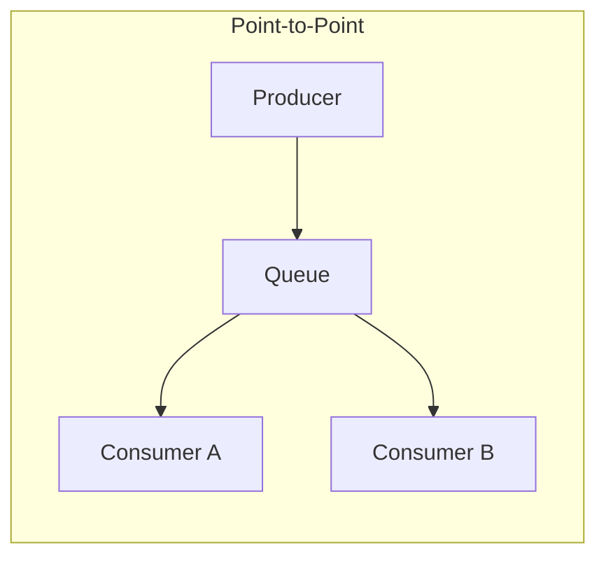
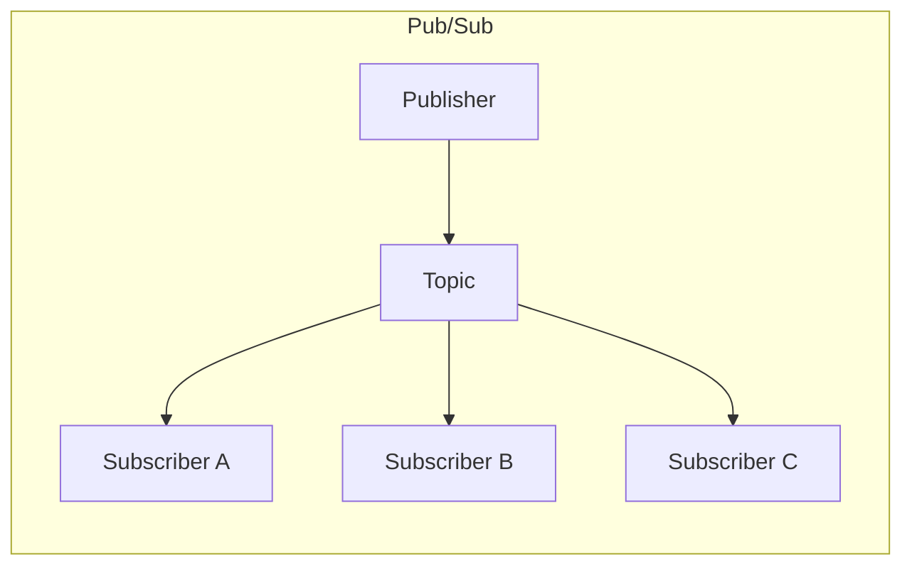
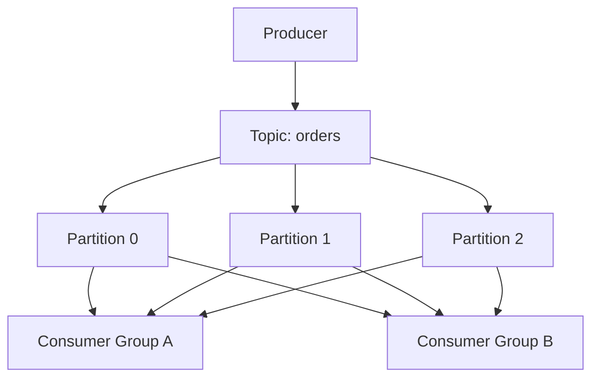
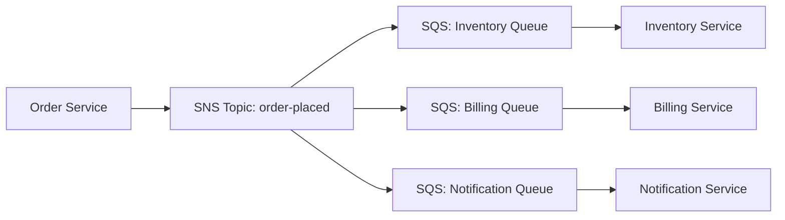
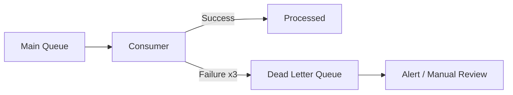

# Message Queues & Event-Driven Architecture

Asynchronous messaging is the backbone of scalable distributed systems. Instead of services waiting for each other synchronously, message queues decouple producers from consumers, enabling independent scaling, fault tolerance, and temporal decoupling.

---

## Why Asynchronous Processing?

Synchronous communication (request-response) creates tight coupling between services. If the downstream service is slow or down, the upstream service is directly impacted.

| Concern | Synchronous | Asynchronous |
|---------|-------------|--------------|
| Coupling | Tight — caller waits for response | Loose — producer doesn't know consumer |
| Latency | Cumulative across call chain | Producer returns immediately |
| Failure handling | Cascading failures | Failures isolated to consumer |
| Scaling | Both sides must scale together | Producer and consumer scale independently |
| Ordering | Implicit (request-response) | Must be explicitly managed |
| Complexity | Simpler mental model | Requires queue infrastructure |

### When to Use Async

- **Task takes > 500ms** — don't make the user wait for email sends, PDF generation, or analytics processing
- **Spiky traffic** — buffer requests during peaks and process at a steady rate
- **Cross-service coordination** — notify multiple services without coupling them
- **Retry-heavy operations** — let the queue handle retries rather than the caller

---

## Message Queue vs Event Stream

These are fundamentally different communication models despite superficial similarities.

| Property | Message Queue | Event Stream |
|----------|--------------|--------------|
| Consumption | Message removed after processing | Events remain for a retention period |
| Consumers | Single consumer per message | Multiple consumers read independently |
| Replay | Not possible (message gone) | Replay from any point in time |
| Ordering | Per-queue (FIFO optional) | Per-partition guaranteed |
| Use case | Task distribution, work queues | Event sourcing, log aggregation, CDC |
| Examples | SQS, RabbitMQ | Kafka, Kinesis, Pulsar |

---

## Point-to-Point vs Pub/Sub



In point-to-point, each message is delivered to **exactly one** consumer. Multiple consumers compete for messages (competing consumers pattern).



In pub/sub, each message is delivered to **all** subscribers. Every subscriber gets a copy.

| Pattern | Use Case | Example |
|---------|----------|---------|
| Point-to-Point | Work distribution among workers | Process uploaded images |
| Pub/Sub | Event notification to multiple services | Order placed → notify inventory, billing, shipping |

---

## Apache Kafka

Kafka is a distributed event streaming platform designed for high-throughput, fault-tolerant, real-time data pipelines.

### Core Concepts



**Topics** — Named streams of records. A topic is a logical channel (e.g., `orders`, `user-events`).

**Partitions** — A topic is split into partitions for parallelism. Each partition is an ordered, immutable append-only log. Messages within a partition have a sequential offset.

**Consumer Groups** — A group of consumers that cooperatively consume a topic. Each partition is assigned to exactly one consumer within a group. Different groups consume independently (each gets all messages).

**Replication** — Each partition is replicated across brokers. One replica is the leader (handles reads/writes), others are followers for fault tolerance.

### Partition Key Strategy

The partition key determines which partition a message lands in. All messages with the same key go to the same partition, preserving order for that key.

```python
# Messages for the same order_id are always in the same partition
producer.send("orders", key=order_id, value=order_event)
```

Choose partition keys carefully:

| Key Choice | Effect |
|-----------|--------|
| User ID | All events for a user are ordered |
| Order ID | All updates to an order are ordered |
| Random/null | Round-robin for maximum throughput (no ordering) |
| Region | Geographic locality for consumers |

---

## AWS SQS and SNS

### SQS (Simple Queue Service)

Fully managed message queue. Two flavours:

| Feature | Standard Queue | FIFO Queue |
|---------|---------------|------------|
| Throughput | Unlimited | 3,000 msg/s (with batching) |
| Ordering | Best-effort | Strict FIFO per message group |
| Delivery | At-least-once (possible duplicates) | Exactly-once processing |
| Deduplication | None | 5-minute dedup window |

### SNS (Simple Notification Service)

Pub/sub topic service. Publishers send to a topic; subscribers (SQS queues, Lambda, HTTP endpoints, email) receive copies.

### Fan-Out Pattern: SNS + SQS



Each downstream service processes at its own pace, independently. If billing is slow, it doesn't affect inventory processing.

---

## RabbitMQ

RabbitMQ is a traditional message broker supporting multiple protocols (AMQP, MQTT, STOMP). It offers flexible routing through exchanges.

| Exchange Type | Routing Behaviour |
|---------------|-------------------|
| Direct | Routes to queues with matching routing key |
| Fanout | Routes to all bound queues (broadcast) |
| Topic | Pattern-matching on routing key (e.g., `order.*.created`) |
| Headers | Routes based on message header attributes |

RabbitMQ excels at complex routing scenarios, priority queues, and request-reply patterns. Kafka excels at high-throughput event streaming with replay capability.

---

## Delivery Guarantees

| Guarantee | Description | Trade-off |
|-----------|-------------|-----------|
| At-most-once | Message may be lost, never duplicated | Fastest, lowest overhead |
| At-least-once | Message never lost, may be duplicated | Requires idempotent consumers |
| Exactly-once | Message processed exactly once | Highest complexity and latency |

### Achieving Exactly-Once (in practice)

True exactly-once is extremely difficult in distributed systems. The practical approach is **at-least-once delivery + idempotent processing**:

```python
def process_message(message):
    # Idempotency key prevents duplicate processing
    if already_processed(message.id):
        return  # Skip duplicate
    
    perform_operation(message.payload)
    mark_as_processed(message.id)
```

Kafka supports exactly-once semantics within its ecosystem via transactional producers and consumer offsets committed atomically with output records.

---

## Dead Letter Queues (DLQ)

A DLQ captures messages that fail processing after a configured number of retries. Without a DLQ, poison messages block the queue indefinitely.



### DLQ Best Practices

- Set a reasonable retry count (typically 3-5 attempts)
- Include original message metadata (timestamp, source, error reason)
- Monitor DLQ depth — a growing DLQ indicates a systemic problem
- Build tooling to replay DLQ messages after fixing the root cause
- Apply separate retention policies (DLQ messages often need longer retention)

---

## Backpressure

Backpressure occurs when a consumer cannot keep up with the rate of incoming messages. Without management, queues grow unboundedly, leading to memory exhaustion or message expiration.

### Backpressure Strategies

| Strategy | How It Works |
|----------|--------------|
| Queue depth limits | Reject new messages when queue is full |
| Rate limiting | Throttle producers at the API layer |
| Autoscaling consumers | Add more consumers when queue depth grows |
| Load shedding | Drop low-priority messages under pressure |
| Batch processing | Consumers process messages in batches for efficiency |

### Key Monitoring Metrics

- **Queue depth** (messages waiting) — growing means consumers are falling behind
- **Message age** (oldest message in queue) — how stale is the backlog?
- **Processing rate** vs **ingestion rate** — is the gap widening?

---

## Event-Driven Architecture

In event-driven architecture, services communicate by producing and consuming events rather than making direct calls. Events represent facts — things that happened.

### Principles

1. **Events are facts** — "OrderPlaced" not "PlaceOrder". Past tense, immutable.
2. **Producers don't know consumers** — complete decoupling.
3. **Consumers react independently** — each decides what to do with the event.
4. **Events carry context** — include enough data for consumers to act without calling back.

### Event Payload: Thin vs Fat Events

| Approach | Payload | Pros | Cons |
|----------|---------|------|------|
| Thin event | `{order_id: 123}` | Small, fast | Consumer must fetch full data |
| Fat event | `{order_id: 123, items: [...], total: 99.50}` | Consumer self-sufficient | Larger messages, potential staleness |

---

## Event Sourcing Introduction

Event sourcing stores the state of a system as a sequence of events rather than current state. Instead of updating a row, you append an event.

```
# Traditional (current state)
UPDATE accounts SET balance = 150 WHERE id = 42;

# Event sourcing (append events)
AccountCreated { id: 42, balance: 0 }
MoneyDeposited { id: 42, amount: 200 }
MoneyWithdrawn { id: 42, amount: 50 }
# Current balance = replay events: 0 + 200 - 50 = 150
```

| Benefit | Challenge |
|---------|-----------|
| Complete audit trail | Eventual consistency |
| Temporal queries (state at any point) | Schema evolution of immutable events |
| Event replay through new logic | Storage growth (snapshots help) |
| Debugging (see how state was reached) | Significant paradigm shift from CRUD |

---

## Key Takeaways

- **Async messaging decouples services** in time and availability — producers and consumers operate independently
- **Message queues (SQS, RabbitMQ)** are for task distribution; **event streams (Kafka)** are for durable, replayable event logs
- **Delivery guarantees** are a spectrum — prefer at-least-once with idempotent consumers over expensive exactly-once
- **Dead letter queues** prevent poison messages from blocking processing — always configure them
- **Backpressure** is inevitable at scale — monitor queue depth and autoscale consumers
- **Event-driven architecture** enables loose coupling but requires careful event design and eventual consistency handling
- **Event sourcing** provides a complete audit trail but introduces significant complexity — use it where the audit/replay benefits justify the cost
