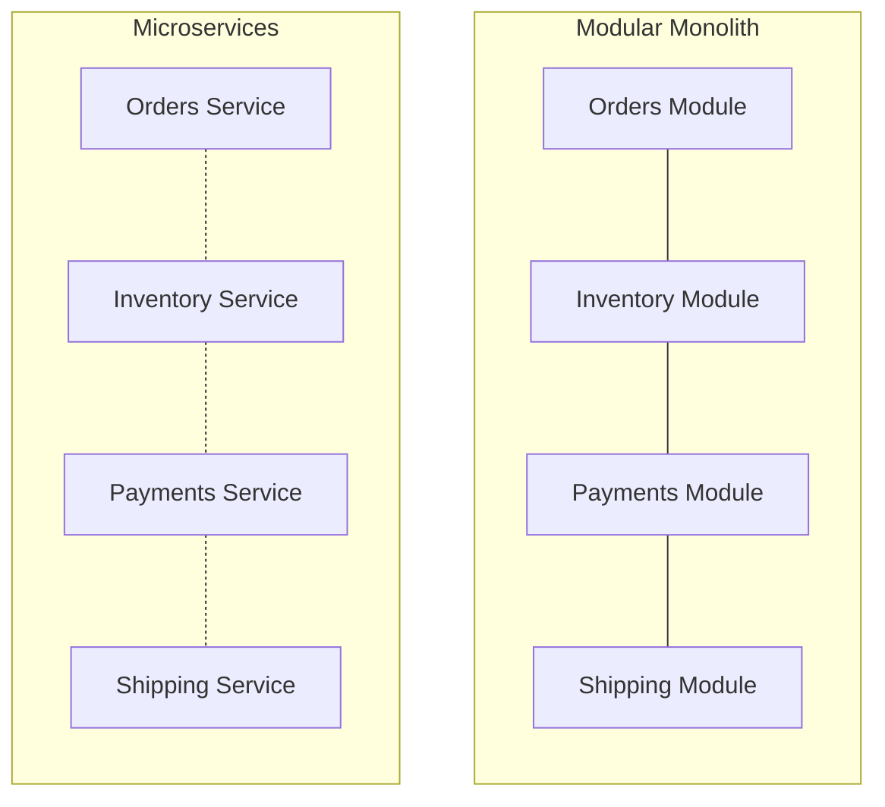
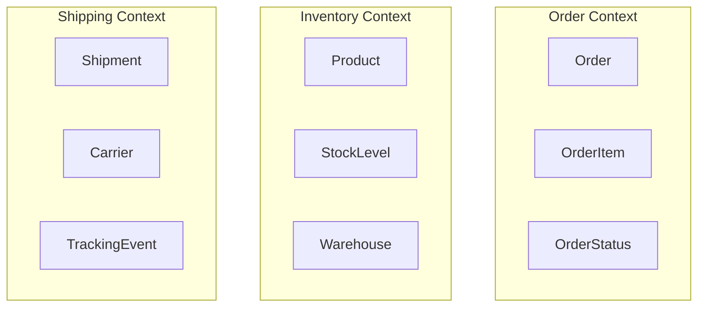
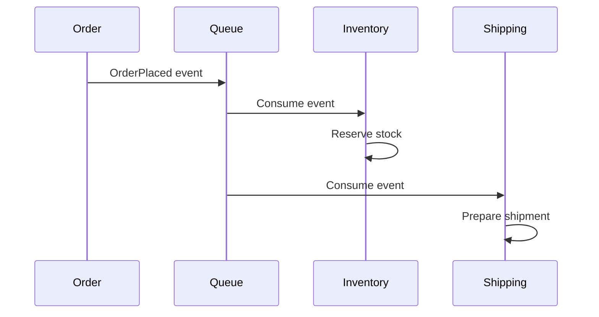
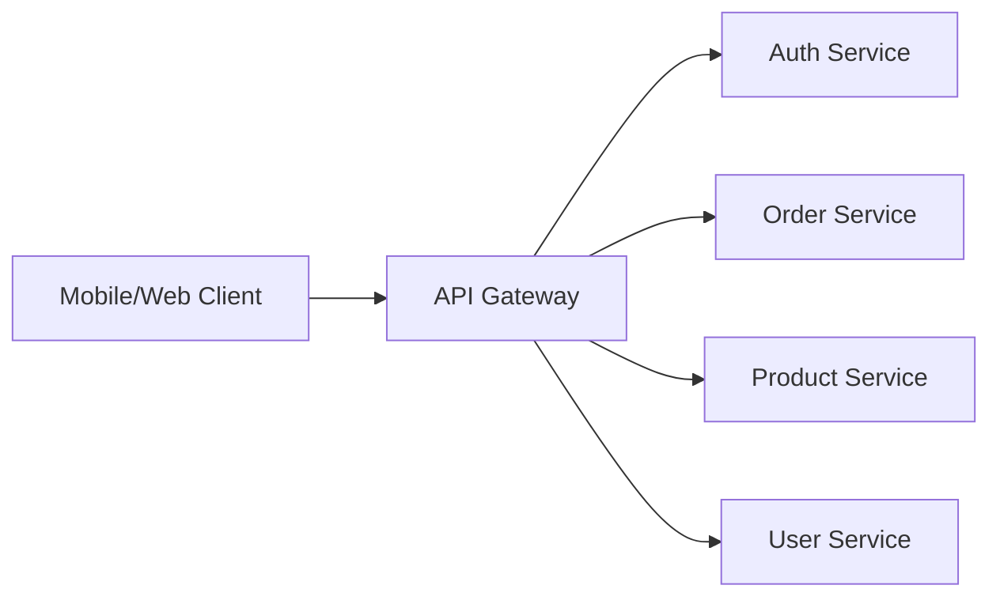
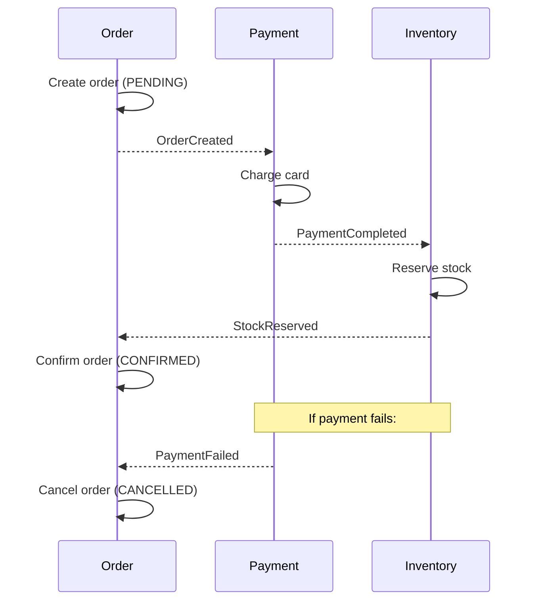

# Microservices Architecture

Microservices decompose a system into small, independently deployable services, each owning a specific business capability. This architectural style enables teams to move fast and scale independently — but introduces significant distributed systems complexity.

---

## Monolith vs Microservices

| Aspect | Monolith | Microservices |
|--------|----------|---------------|
| Deployment | Single deployable unit | Each service deployed independently |
| Scaling | Scale entire application | Scale individual services |
| Technology | Single tech stack | Polyglot (per-service choice) |
| Data | Shared database | Database per service |
| Team structure | One team or many teams on one codebase | Small teams per service (2-pizza rule) |
| Complexity | In-process calls, simple | Network calls, distributed complexity |
| Consistency | Strong (ACID transactions) | Eventual consistency (sagas) |
| Testing | End-to-end straightforward | Integration testing complex |
| Latency | In-process (nanoseconds) | Network (milliseconds) |
| Debugging | Single process, stack traces | Distributed tracing required |
| Initial velocity | Faster to start | Slower to start (infrastructure overhead) |
| Long-term velocity | Slows as codebase grows | Maintains speed per service |

### The Monolith Is Not the Enemy

A well-structured monolith (modular monolith) is a valid architecture. Many successful systems start as monoliths and only decompose when specific scaling or team boundaries demand it.



---

## Service Boundaries (Domain-Driven Design)

The hardest part of microservices is deciding where to draw service boundaries. Domain-Driven Design (DDD) provides a framework.

### Bounded Contexts

A bounded context is a logical boundary within which a particular domain model applies. Each microservice should align with one bounded context.



### Heuristics for Finding Boundaries

| Signal | Suggests Separate Service |
|--------|--------------------------|
| Different rate of change | Orders change weekly, catalog changes monthly |
| Different scaling needs | Search handles 100x the traffic of checkout |
| Different team ownership | Team A owns pricing, Team B owns fulfilment |
| Different data models | "Customer" means different things in billing vs marketing |
| Independent deployability | Can this change without coordinating with others? |

### Anti-Pattern: Entity Services

Don't decompose by entities (UserService, OrderService, ProductService). This creates an anaemic architecture where every operation requires multiple services. Decompose by **capability**: OrderManagement, Fulfilment, Pricing.

---

## Communication Patterns

### Synchronous: HTTP/REST and gRPC

| Property | REST (HTTP/JSON) | gRPC (HTTP/2 + Protobuf) |
|----------|-----------------|--------------------------|
| Format | JSON (human-readable) | Protobuf (binary, compact) |
| Performance | Higher latency, larger payloads | Lower latency, smaller payloads |
| Streaming | Limited (WebSockets separate) | Native bidirectional streaming |
| Schema | OpenAPI (optional) | Protobuf IDL (mandatory) |
| Browser support | Native | Requires gRPC-web proxy |
| Use case | Public APIs, simple CRUD | Internal service-to-service, high throughput |

### Asynchronous: Event-Driven Messaging



### When to Use Which

| Scenario | Pattern |
|----------|---------|
| User needs immediate response | Sync (REST/gRPC) |
| Fire-and-forget notifications | Async (event) |
| Long-running operations | Async + polling/callback |
| Multiple services need same data | Pub/sub events |
| Query across services | API composition or CQRS |

---

## API Gateway Pattern

An API gateway sits between clients and microservices, providing a single entry point.



### Responsibilities

| Responsibility | Description |
|---------------|-------------|
| Routing | Route requests to appropriate service |
| Authentication | Verify tokens, reject unauthorized requests |
| Rate limiting | Protect services from traffic spikes |
| Request aggregation | Compose responses from multiple services |
| Protocol translation | REST externally, gRPC internally |
| SSL termination | Handle TLS at the edge |
| Caching | Cache GET responses to reduce backend load |

### BFF (Backend for Frontend)

A specialisation where each client type (web, mobile, IoT) has its own gateway optimised for that client's needs. The mobile BFF returns smaller payloads; the web BFF supports richer responses.

---

## Service Discovery

In dynamic environments (containers, auto-scaling), service locations change frequently. Service discovery solves "how does Service A find Service B?"

| Approach | How It Works | Examples |
|----------|-------------|----------|
| Client-side discovery | Client queries registry, picks instance | Netflix Eureka, Consul |
| Server-side discovery | Load balancer queries registry | AWS ALB, Kubernetes Services |
| DNS-based | Services registered as DNS records | AWS Cloud Map, Consul DNS |
| Platform-native | Orchestrator provides discovery | Kubernetes DNS, ECS Service Connect |

In Kubernetes, service discovery is built-in:
```
http://order-service.namespace.svc.cluster.local:8080
```

---

## Data Ownership: Database per Service

Each microservice owns its data exclusively. No other service may access another's database directly.

### Rules

1. **Private database** — each service has its own DB (or schema)
2. **No shared tables** — if two services need the same data, they sync via events
3. **API access only** — query another service's data through its API, never its DB
4. **Eventual consistency** — accept that data across services may be temporarily inconsistent

### Data Duplication is Acceptable

Services may maintain local copies of data they frequently need. The shipping service keeps a local copy of customer addresses — this avoids synchronous calls to the customer service on every shipment.

---

## Saga Pattern for Distributed Transactions

With database-per-service, you can't use ACID transactions across services. The saga pattern manages distributed transactions as a sequence of local transactions with compensating actions.

### Choreography (Event-Based)

Each service listens for events and reacts:



### Orchestration (Central Coordinator)

A saga orchestrator tells each service what to do and handles compensations on failure.

| Approach | Pros | Cons |
|----------|------|------|
| Choreography | Decoupled, no single point of failure | Hard to track, complex flows unclear |
| Orchestration | Clear flow, easy to understand | Central coordinator is a coupling point |

---

## Service Mesh

A service mesh manages service-to-service communication through sidecar proxies, extracting cross-cutting concerns from application code.

### What a Service Mesh Provides

| Feature | Without Mesh | With Mesh |
|---------|-------------|-----------|
| mTLS | Application-level TLS config | Automatic, transparent |
| Retries | Each service implements retry logic | Configured in mesh policy |
| Circuit breaking | Library (e.g., Resilience4j) | Proxy-level, language-agnostic |
| Observability | Instrument each service | Automatic metrics/traces from proxies |
| Traffic splitting | Application routing logic | Mesh config (canary, A/B) |
| Rate limiting | Per-service implementation | Mesh-wide policy |

**Popular service meshes:** Istio, Linkerd, Consul Connect, AWS App Mesh.

Use a service mesh when you have 10+ services, polyglot stacks, or strong security requirements (mTLS everywhere).

---

## When NOT to Use Microservices

Microservices are not a default — they are a tool for specific problems.

| Situation | Why Microservices Hurt |
|-----------|----------------------|
| Small team (< 5 engineers) | Operational overhead exceeds benefit |
| Unclear domain boundaries | You'll draw boundaries wrong and pay the refactoring cost |
| Early-stage startup | Need to iterate fast; monolith is faster to change |
| No DevOps maturity | Need CI/CD, monitoring, container orchestration first |
| Strong consistency required | Distributed transactions are painful |
| Low traffic / simple app | Complexity unjustified by scale needs |

### Start Monolith, Extract Later

1. Build a well-structured modular monolith
2. Define clear module boundaries (packages/namespaces)
3. Extract to microservices only when you feel the pain: team conflicts, deployment coupling, or independent scaling needs

---

## Key Takeaways

- **Microservices trade code complexity for operational complexity** — make sure you can afford the operational cost
- **Service boundaries should follow business capabilities** (bounded contexts), not technical layers or entities
- **Database per service** is non-negotiable — shared databases destroy independence
- **Prefer async communication** between services; use sync only when the caller truly needs an immediate response
- **Sagas replace transactions** in distributed systems — design compensating actions for every step
- **API gateways** provide a stable client interface while allowing internal service evolution
- **A well-structured monolith is better than poorly-designed microservices** — don't split prematurely
- **Service meshes** extract cross-cutting concerns but add infrastructure complexity — adopt only at sufficient scale
