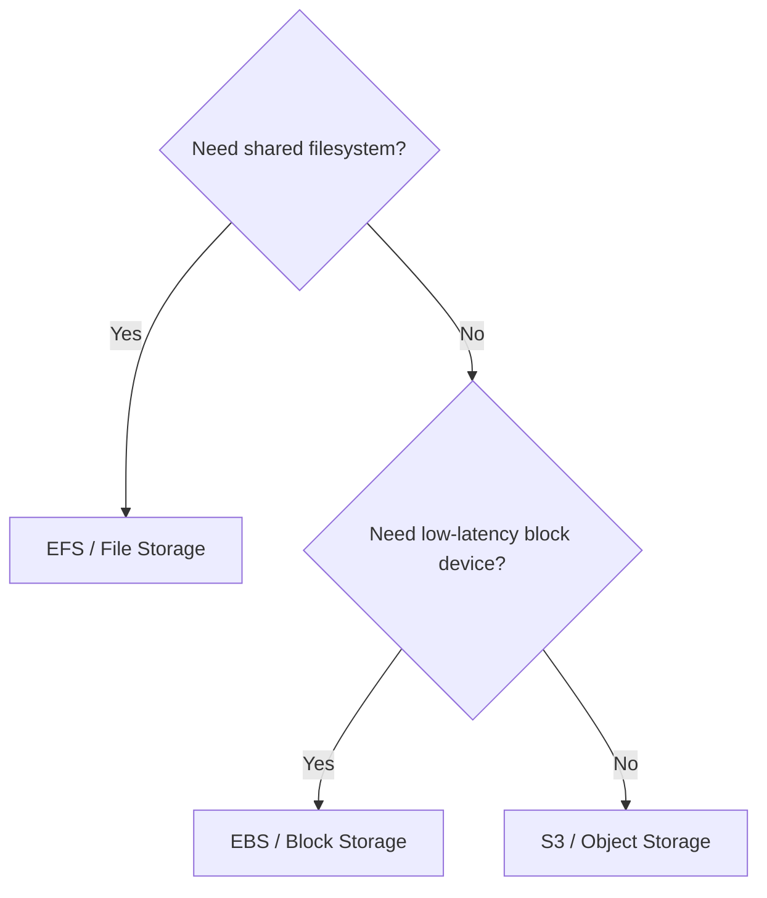
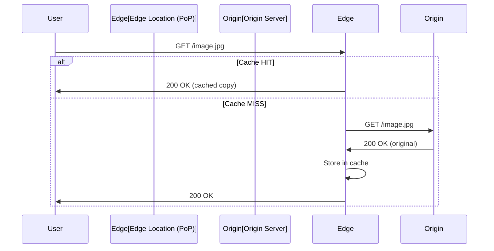

# Storage & Content Delivery Networks

Choosing the right storage type and delivery mechanism directly impacts performance, cost, and reliability. This section covers cloud storage models, CDN architecture, and patterns for serving content at global scale.

---

## Storage Types Compared

| Property | Object Storage (S3) | Block Storage (EBS) | File Storage (EFS) |
|----------|--------------------|--------------------|-------------------|
| Abstraction | Flat key-value (objects) | Raw disk blocks | Hierarchical file system |
| Access pattern | HTTP API (GET/PUT) | Attached to single instance | Mounted by multiple instances (NFS) |
| Scalability | Virtually unlimited | Fixed size (resizable) | Grows automatically |
| Latency | Higher (network, HTTP) | Very low (attached disk) | Low-moderate (network) |
| Durability | 99.999999999% (11 nines) | 99.999% (within AZ) | 99.999999999% (multi-AZ) |
| Use case | Static assets, backups, data lakes | OS disks, databases | Shared config, CMS content |
| Cost model | Per GB stored + requests | Per GB provisioned | Per GB used |
| Concurrency | Unlimited concurrent readers | Single writer | Multiple readers/writers |

### When to Use Each



---

## Object Storage (S3) Deep Dive

### Key Concepts

- **Bucket** — container for objects (globally unique name)
- **Object** — file + metadata, identified by a key (path-like string)
- **Prefix** — simulated folder structure (`images/2024/photo.jpg`)
- **Versioning** — keep multiple versions of every object
- **Lifecycle policies** — automatically transition or delete objects based on age

### Storage Classes and Lifecycle

| Storage Class | Access Pattern | Retrieval | Cost (relative) |
|--------------|----------------|-----------|-----------------|
| S3 Standard | Frequent access | Immediate | $$$ |
| S3 Intelligent-Tiering | Unknown/changing patterns | Immediate | $$ (auto-tiers) |
| S3 Standard-IA | Infrequent (monthly) | Immediate | $$ |
| S3 One Zone-IA | Infrequent, non-critical | Immediate | $ |
| S3 Glacier Instant | Rare, needs instant access | Immediate | $ |
| S3 Glacier Flexible | Archival | Minutes to hours | ¢ |
| S3 Glacier Deep Archive | Compliance, long-term | 12-48 hours | ¢¢ |

### Lifecycle Policy Example

```json
{
  "Rules": [
    {
      "ID": "ArchiveOldLogs",
      "Status": "Enabled",
      "Prefix": "logs/",
      "Transitions": [
        { "Days": 30, "StorageClass": "STANDARD_IA" },
        { "Days": 90, "StorageClass": "GLACIER" }
      ],
      "Expiration": { "Days": 365 }
    }
  ]
}
```

---

## CDN Architecture

A Content Delivery Network (CDN) caches content at geographically distributed edge locations, reducing latency for end users by serving content from a nearby point of presence (PoP).

### How a CDN Works



### Key Terminology

| Term | Definition |
|------|-----------|
| Edge location | Physical server in a geographic region that caches content |
| PoP (Point of Presence) | Data centre with multiple edge servers |
| Origin | Source of truth (S3 bucket, ALB, web server) |
| Distribution | CDN configuration connecting origin to edge network |
| TTL | Time-to-live — how long edge caches content before revalidating |
| Cache hit ratio | % of requests served from cache (higher = better) |

### CDN Benefits

| Benefit | How |
|---------|-----|
| Lower latency | Content served from nearest edge (50ms vs 500ms) |
| Reduced origin load | 90%+ of requests never reach origin |
| DDoS protection | Distributed network absorbs attack traffic |
| TLS termination | Edge handles HTTPS, reducing origin CPU |
| Compression | Edge applies gzip/brotli before delivery |

---

## Cache-Control Headers

Cache-Control headers tell the CDN (and browser) how to cache responses.

| Directive | Effect |
|-----------|--------|
| `max-age=3600` | Cache for 3600 seconds |
| `s-maxage=86400` | CDN caches for 86400s (overrides max-age for shared caches) |
| `no-cache` | Must revalidate with origin before serving |
| `no-store` | Never cache (sensitive data) |
| `public` | Any cache may store (CDN, browser) |
| `private` | Only browser may cache (user-specific) |
| `immutable` | Content will never change (use with hashed filenames) |
| `stale-while-revalidate=60` | Serve stale while fetching fresh in background |

### Best Practice by Content Type

| Content Type | Cache Strategy | Headers |
|--------------|---------------|---------|
| Hashed static assets (JS, CSS) | Aggressive, immutable | `Cache-Control: public, max-age=31536000, immutable` |
| Images / fonts | Long-lived | `Cache-Control: public, max-age=86400` |
| HTML pages | Short or no-cache | `Cache-Control: public, max-age=60, s-maxage=300` |
| API responses | Varies | `Cache-Control: private, max-age=0` or short TTL |
| User-specific data | Never CDN-cache | `Cache-Control: private, no-store` |

---

## CDN Invalidation

When content changes, you need to remove stale copies from edge caches.

| Strategy | Description | Trade-off |
|----------|-------------|-----------|
| Versioned URLs | `/app.3f4a2b.js` — new hash = new URL | Best: no invalidation needed |
| Path invalidation | Purge `/images/logo.png` from all edges | Slow (propagation delay) |
| Wildcard invalidation | Purge `/images/*` | Expensive, nuclear option |
| TTL expiry | Wait for cache to naturally expire | Simple but delayed |

**Best practice:** Use content-hashed filenames for static assets. Reserve invalidation for HTML and API responses where URL versioning isn't practical.

---

## Signed URLs and Signed Cookies

Restrict access to CDN content without making the origin public.

### Signed URLs

Generate a time-limited URL that grants access to a specific object:

```python
import boto3
from datetime import datetime, timedelta

s3 = boto3.client("s3")
url = s3.generate_presigned_url(
    "get_object",
    Params={"Bucket": "my-bucket", "Key": "private/report.pdf"},
    ExpiresIn=3600,  # 1 hour
)
```

| Use Case | Mechanism |
|----------|-----------|
| Single file download | Signed URL |
| Multiple restricted files (e.g., video streaming) | Signed cookies |
| Temporary upload permission | Presigned POST/PUT |

---

## Static Site Hosting

Object storage + CDN is the standard pattern for static websites (HTML, CSS, JS, images).


### Configuration

1. Upload static files to S3 bucket
2. Enable static website hosting on the bucket
3. Create CloudFront distribution pointing to bucket
4. Configure custom domain + TLS certificate (ACM)
5. Set cache behaviours per path pattern

### Advantages Over Traditional Hosting

| Property | Static Site (S3 + CDN) | Traditional Server |
|----------|----------------------|-------------------|
| Scaling | Infinite (CDN handles it) | Requires auto-scaling |
| Cost | Pennies/month for most sites | Server always running |
| Security | No server to patch | OS/runtime vulnerabilities |
| Deploy | Upload files | Build, deploy, restart |
| Availability | 99.99%+ (global CDN) | Depends on server health |

---

## Blob Storage Patterns

### Write-Once, Read-Many (WORM)

Objects written once and read frequently. Common for logs, media, compliance records. Enable object lock for regulatory requirements.

### Multipart Upload

For large files (> 100 MB), break into parts and upload in parallel:

1. Initiate multipart upload → get upload ID
2. Upload parts in parallel (each 5 MB - 5 GB)
3. Complete upload → S3 assembles the object

### Event-Driven Processing


---

## Data Lakes Introduction

A data lake stores raw data in its native format (structured, semi-structured, unstructured) at any scale, enabling diverse analytics workloads.

### Data Lake Architecture

| Layer | Purpose | Example |
|-------|---------|---------|
| Raw / Landing | Ingested data as-is | JSON logs, CSV exports |
| Cleaned / Processed | Validated, deduplicated | Parquet files |
| Curated / Serving | Business-ready datasets | Aggregated tables |

### Data Lake vs Data Warehouse

| Aspect | Data Lake | Data Warehouse |
|--------|-----------|----------------|
| Schema | Schema-on-read | Schema-on-write |
| Data types | Any (structured, unstructured) | Structured only |
| Users | Data scientists, ML engineers | Business analysts |
| Query engine | Athena, Spark, Presto | Redshift, BigQuery, Snowflake |
| Cost | Low (object storage) | Higher (compute + storage) |
| Flexibility | High (raw data preserved) | Lower (must fit schema) |

### File Formats for Analytics

| Format | Type | Strengths |
|--------|------|-----------|
| Parquet | Columnar | Fast analytical queries, compression |
| ORC | Columnar | Hive-optimized, good for updates |
| Avro | Row-based | Schema evolution, streaming |
| JSON | Row-based | Human-readable, flexible |
| CSV | Row-based | Universal, simple |

---

## Key Takeaways

- **Object storage** is the default for unstructured data (files, images, backups) — it's durable, cheap, and infinitely scalable
- **Block storage** is for databases and OS disks requiring low-latency I/O
- **Storage lifecycle policies** move data to cheaper tiers automatically — configure them from day one to control costs
- **CDNs reduce latency by 10x** by serving content from edge locations near users — use them for all static assets
- **Content-hashed URLs** (`app.a3f2.js`) eliminate the need for cache invalidation — the best invalidation is no invalidation
- **Signed URLs** provide time-limited secure access without making origins public
- **Data lakes** on object storage provide a cost-effective foundation for analytics — use columnar formats (Parquet) for query performance
