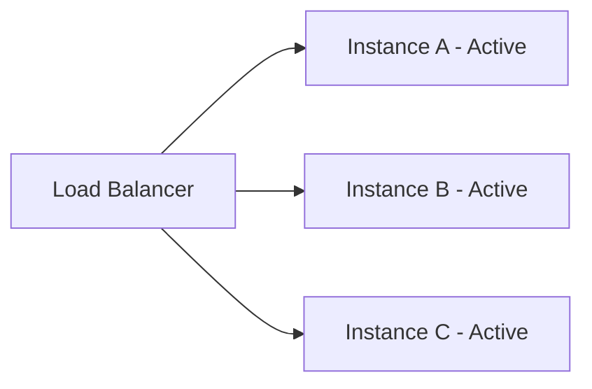
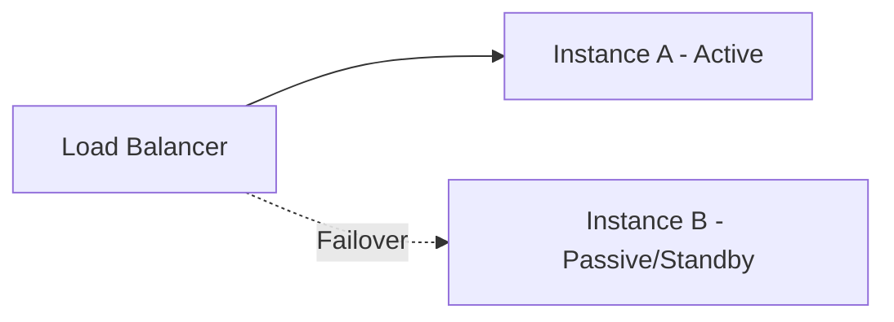
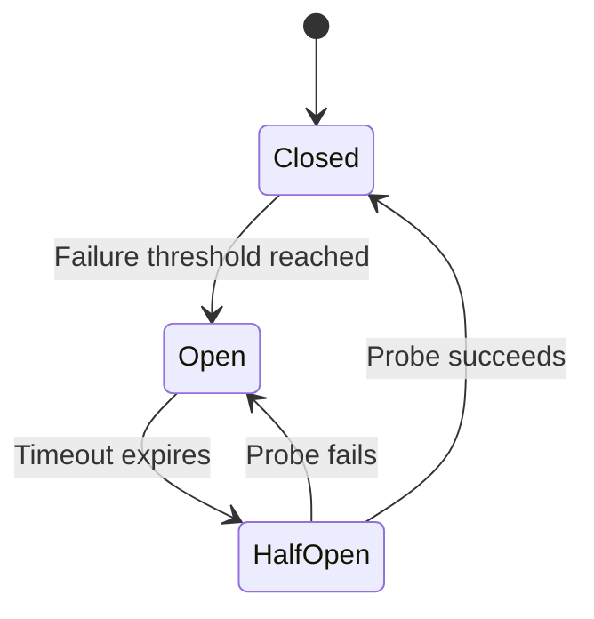
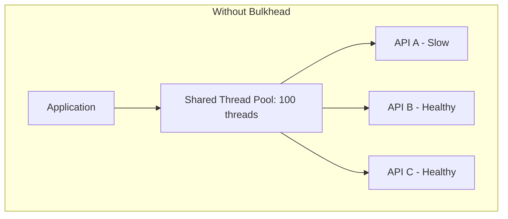
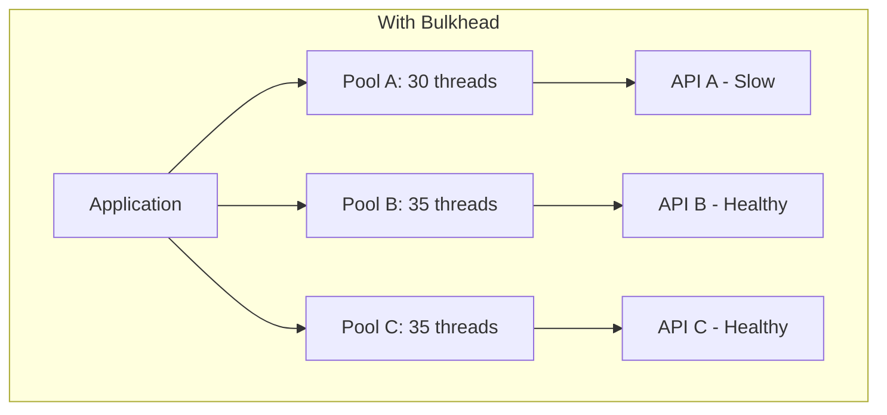
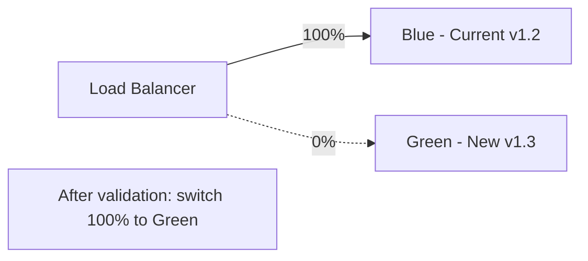
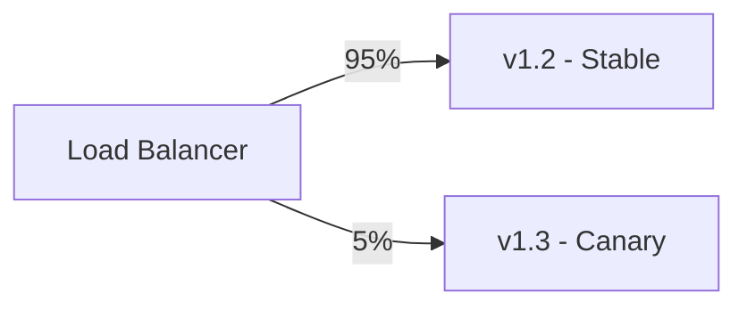

# Reliability & Resilience

Failures are inevitable in distributed systems. Reliability engineering is about designing systems that continue operating correctly despite hardware failures, network partitions, software bugs, and operator errors. Resilience is the ability to recover quickly when failures occur.

---

## Fault Tolerance Principles

| Principle | Description |
|-----------|-------------|
| Assume failure | Design every component assuming it will fail |
| Blast radius | Contain failures to the smallest possible scope |
| Graceful degradation | Serve partial results rather than complete failure |
| No single point of failure | Every critical path has redundancy |
| Fail fast | Detect failures quickly rather than hanging |
| Design for recovery | Optimise mean time to recovery (MTTR), not just mean time between failures (MTBF) |

### Failure Categories

| Type | Examples | Mitigation |
|------|----------|-----------|
| Hardware | Disk failure, server crash | Replication, multi-AZ |
| Network | Partition, packet loss, high latency | Timeouts, retries, circuit breakers |
| Software | Bugs, memory leaks, crashes | Health checks, auto-restart, canary deploys |
| Dependency | Third-party API down | Circuit breaker, fallbacks, bulkheads |
| Capacity | Traffic spike, resource exhaustion | Auto-scaling, rate limiting, load shedding |
| Human | Misconfig, bad deploy | Canary releases, rollback procedures |

---

## Redundancy Patterns

### Active-Active

All instances handle traffic simultaneously. If one fails, the remaining instances absorb its load.



| Property | Detail |
|----------|--------|
| Failover time | Near-zero (traffic already distributed) |
| Resource utilisation | High (all instances serve traffic) |
| Complexity | Requires stateless services or shared state |
| Cost | All instances always running |

### Active-Passive

One instance handles traffic (active); the standby takes over only on failure.



| Property | Detail |
|----------|--------|
| Failover time | Seconds to minutes (detect failure + switch) |
| Resource utilisation | Standby is idle |
| Complexity | Simpler (no concurrent state management) |
| Cost | Standby instance always provisioned |
| Use case | Databases (primary/replica), stateful services |

---

## Circuit Breaker Pattern

The circuit breaker prevents a service from repeatedly calling a failing dependency, giving it time to recover.

### State Diagram



### States Explained

| State | Behaviour |
|-------|-----------|
| **Closed** | Normal operation. Requests pass through. Failures are counted. |
| **Open** | Requests fail immediately (fast-fail). No calls to dependency. |
| **Half-Open** | Limited probe requests allowed. If they succeed → Closed. If they fail → Open. |

### Configuration Parameters

| Parameter | Purpose | Typical Value |
|-----------|---------|---------------|
| Failure threshold | Failures before opening | 5 failures in 60s |
| Timeout | Time in Open before trying Half-Open | 30-60 seconds |
| Probe count | Requests allowed in Half-Open | 1-3 requests |
| Success threshold | Successes in Half-Open to close | 3 consecutive |

### Implementation Example

```python
class CircuitBreaker:
    def __init__(self, failure_threshold=5, timeout=30):
        self.state = "CLOSED"
        self.failure_count = 0
        self.failure_threshold = failure_threshold
        self.timeout = timeout
        self.last_failure_time = None
    
    def call(self, func, *args):
        if self.state == "OPEN":
            if time.time() - self.last_failure_time > self.timeout:
                self.state = "HALF_OPEN"
            else:
                raise CircuitOpenError("Circuit is open")
        
        try:
            result = func(*args)
            self._on_success()
            return result
        except Exception as e:
            self._on_failure()
            raise
    
    def _on_success(self):
        self.failure_count = 0
        self.state = "CLOSED"
    
    def _on_failure(self):
        self.failure_count += 1
        self.last_failure_time = time.time()
        if self.failure_count >= self.failure_threshold:
            self.state = "OPEN"
```

---

## Retries with Exponential Backoff and Jitter

Retries handle transient failures (network blips, temporary overload). Without backoff, retries amplify the problem (thundering herd).

### Exponential Backoff Formula

```
wait_time = base_delay * (2 ^ attempt) + random_jitter
```

| Attempt | Base Delay | Backoff (no jitter) | With Jitter (example) |
|---------|-----------|--------------------|-----------------------|
| 1 | 1s | 2s | 1.7s |
| 2 | 1s | 4s | 3.2s |
| 3 | 1s | 8s | 6.9s |
| 4 | 1s | 16s | 14.1s |

### Why Jitter Matters

Without jitter, all clients retry at exactly the same time (correlated retries), creating periodic thundering herds. Full jitter spreads retries uniformly:

```python
import random
import time

def retry_with_backoff(func, max_retries=4, base_delay=1.0):
    for attempt in range(max_retries):
        try:
            return func()
        except TransientError:
            if attempt == max_retries - 1:
                raise
            # Full jitter: uniform random between 0 and exponential cap
            delay = random.uniform(0, base_delay * (2 ** attempt))
            time.sleep(delay)
```

### Retry Best Practices

- Only retry on transient errors (5xx, timeouts, connection reset) — never on 4xx
- Set a maximum retry count (3-5 attempts typical)
- Set a maximum total timeout (don't retry forever)
- Add jitter to prevent thundering herd
- Make operations idempotent before adding retries

---

## Bulkhead Pattern

Named after ship bulkheads that contain flooding, the bulkhead pattern isolates failures by partitioning resources.



If API A becomes slow, it consumes all 100 threads — APIs B and C are also affected.



API A can only consume its allocated 30 threads. APIs B and C continue functioning normally.

---

## Timeouts

Every network call must have a timeout. Without timeouts, a hung dependency hangs the caller indefinitely.

| Timeout Type | Purpose | Typical Value |
|-------------|---------|---------------|
| Connection timeout | Time to establish TCP connection | 1-5 seconds |
| Read/response timeout | Time to receive response | 5-30 seconds |
| Total request timeout | End-to-end including retries | 30-60 seconds |
| Idle timeout | Close inactive connections | 60-300 seconds |

### Timeout Budget Pattern

In a chain of services (A → B → C), each hop must have a smaller timeout than its caller:

```
Client timeout: 10s
  → Service A timeout to B: 5s
    → Service B timeout to C: 2s
```

If the budget is exhausted at any point, fail fast rather than consuming the remaining budget.

---

## Graceful Degradation

When a dependency fails, serve reduced functionality rather than failing completely.

| Scenario | Degraded Response |
|----------|-------------------|
| Recommendation service down | Show popular items instead |
| Search service slow | Show cached results |
| Image CDN unavailable | Show placeholder images |
| Payment processor timeout | Queue order for later processing |
| Feature flag service down | Use cached/default flags |

---

## Chaos Engineering

Chaos engineering deliberately injects failures into production (or staging) to discover weaknesses before they manifest in real incidents.

### Principles

1. **Define steady state** — what does "normal" look like in metrics?
2. **Hypothesise** — "If we kill this instance, traffic shifts within 30s"
3. **Inject failure** — kill instance, add latency, partition network
4. **Observe** — did the system behave as hypothesised?
5. **Fix weaknesses** — address any unexpected behaviour

### Common Experiments

| Experiment | What It Tests |
|-----------|---------------|
| Kill random instance | Auto-scaling, health checks, load balancing |
| Inject network latency | Timeouts, circuit breakers |
| Block DNS resolution | Fallback behaviour, caching |
| Fill disk | Alerting, log rotation |
| CPU stress | Auto-scaling triggers, degradation behaviour |
| Kill entire AZ | Multi-AZ redundancy |

**Tools:** Netflix Chaos Monkey, Gremlin, AWS Fault Injection Simulator, LitmusChaos.

---

## Disaster Recovery (RPO / RTO)

| Metric | Definition | Question It Answers |
|--------|-----------|---------------------|
| **RPO** (Recovery Point Objective) | Maximum acceptable data loss (time) | How much data can we afford to lose? |
| **RTO** (Recovery Time Objective) | Maximum acceptable downtime | How quickly must we recover? |

### DR Strategies (Increasing Cost and Speed)

| Strategy | RTO | RPO | Cost | Description |
|----------|-----|-----|------|-------------|
| Backup & Restore | Hours | Hours | $ | Restore from backups when disaster hits |
| Pilot Light | 10-30 min | Minutes | $$ | Core infra running, scale up on failover |
| Warm Standby | Minutes | Seconds | $$$ | Scaled-down copy always running |
| Active-Active | Near-zero | Near-zero | $$$$ | Full capacity in multiple regions |

---

## Blue-Green and Canary Deployments

### Blue-Green

Two identical environments. One (Blue) serves production; the other (Green) receives the new deployment. Switch traffic instantly.



| Advantage | Disadvantage |
|-----------|-------------|
| Instant rollback (switch back) | Double infrastructure cost |
| Zero-downtime deployment | Database migrations require care |
| Full testing in prod-like env | State synchronisation between envs |

### Canary Deployment

Route a small percentage of traffic to the new version. Gradually increase if metrics are healthy.



Progression: 5% → 25% → 50% → 100% (rollback at any stage if errors spike)

---

## Health Checks and Readiness Probes

| Probe Type | Purpose | Action on Failure |
|-----------|---------|-------------------|
| **Liveness** | Is the process alive? | Restart the container |
| **Readiness** | Can it serve traffic? | Remove from load balancer |
| **Startup** | Has it finished initialising? | Wait (don't kill prematurely) |

### Health Check Depth

| Level | What It Checks | Example |
|-------|---------------|---------|
| Shallow | Process is running, HTTP responds | `GET /health` → 200 |
| Medium | Can reach dependencies | Ping database, check cache |
| Deep | Full functional check | Execute a test query |

**Best practice:** Load balancer health checks should be shallow (fast, low overhead). Deep checks are for monitoring/alerting, not traffic routing.

### Implementation

```python
@app.get("/health/live")
def liveness():
    """Am I alive? Always return 200 unless process is hung."""
    return {"status": "ok"}

@app.get("/health/ready")
def readiness():
    """Can I serve traffic? Check critical dependencies."""
    db_ok = check_database_connection()
    cache_ok = check_cache_connection()
    if db_ok and cache_ok:
        return {"status": "ready"}
    return JSONResponse(status_code=503, content={"status": "not ready"})
```

---

## Key Takeaways

- **Design for failure from day one** — every dependency will eventually fail; plan your response in advance
- **Circuit breakers prevent cascading failures** — fail fast and give dependencies time to recover
- **Retries must use exponential backoff with jitter** — otherwise retries amplify the problem (thundering herd)
- **Bulkheads isolate blast radius** — one slow dependency shouldn't bring down unrelated functionality
- **Every network call needs a timeout** — a missing timeout is a bug waiting to become an incident
- **Graceful degradation beats total failure** — serve partial results, cached data, or defaults when components fail
- **Chaos engineering validates your resilience** — test failure handling before real failures test it for you
- **RPO and RTO drive DR strategy** — know your business requirements before choosing (and paying for) a DR approach
- **Canary deployments catch problems early** — expose new code to a fraction of traffic before full rollout
