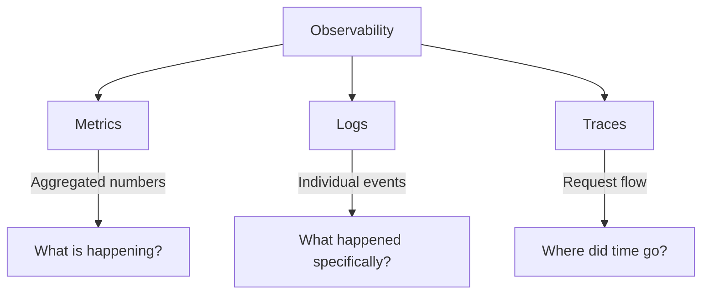
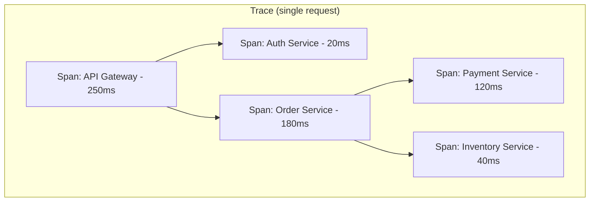

# Observability

Observability is the ability to understand the internal state of a system by examining its external outputs. In distributed systems, you cannot debug by attaching a debugger — you need telemetry: metrics, logs, and traces working together to answer "why is this broken?"

---

## Observability vs Monitoring

| Aspect | Monitoring | Observability |
|--------|-----------|---------------|
| Approach | Predefined checks against known failures | Explore unknown failures dynamically |
| Questions | "Is the system up?" (known-knowns) | "Why is it slow for user X?" (unknown-unknowns) |
| Data | Predefined metrics and thresholds | High-cardinality, high-dimensionality data |
| Alerts | Threshold-based (CPU > 80%) | SLO burn-rate based |
| Debug flow | Dashboard → runbook → fix | Query telemetry → form hypothesis → verify |

Monitoring tells you **something is wrong**. Observability helps you understand **why**.

---

## Three Pillars of Observability



### How They Work Together

1. **Alert fires** (metric: error rate > 1%) → something is wrong
2. **Dashboard** (metrics) → which service? which endpoint?
3. **Traces** → find slow/failing requests, see which service in the chain failed
4. **Logs** → read the exact error message, stack trace, context

---

## Metrics

Metrics are aggregated numerical measurements over time. They answer "how much" and "how fast" questions cheaply.

### Metric Types

| Type | Description | Example |
|------|-------------|---------|
| **Counter** | Monotonically increasing value | Total requests served, errors count |
| **Gauge** | Value that goes up and down | Current memory usage, queue depth |
| **Histogram** | Distribution of values in buckets | Request duration (p50, p95, p99) |
| **Summary** | Client-calculated quantiles | Similar to histogram, pre-computed |

### Counter vs Gauge

```
Counter: 0 → 1 → 2 → 3 → 4 → 5 → 6  (always increasing, reset on restart)
Gauge:   45 → 62 → 38 → 71 → 55 → 40  (fluctuates)
```

Counters track cumulative totals (derive rate with `rate()` function). Gauges track current state.

### Histogram: Understanding Percentiles

A histogram tracks the distribution of values (e.g., request latency):

| Percentile | Meaning |
|-----------|---------|
| p50 (median) | 50% of requests are faster than this |
| p90 | 90% of requests are faster (1 in 10 is slower) |
| p95 | 95% of requests are faster (1 in 20 is slower) |
| p99 | 99% of requests are faster (1 in 100 is slower) |

**Why p99 matters more than average:** If average latency is 100ms but p99 is 5000ms, 1% of your users experience 50x worse performance. At scale (1M requests/day), that's 10,000 terrible experiences daily.

### RED Method (for request-driven services)

| Signal | What to Measure |
|--------|----------------|
| **R**ate | Requests per second |
| **E**rrors | Failed requests per second |
| **D**uration | Latency distribution (p50, p95, p99) |

### USE Method (for resources)

| Signal | What to Measure |
|--------|----------------|
| **U**tilisation | % of resource being used (CPU: 72%) |
| **S**aturation | Work queued because resource is full |
| **E**rrors | Error events on the resource |

---

## Structured Logging

Structured logs use machine-parseable formats (JSON) instead of free-text strings, enabling powerful querying and aggregation.

### Unstructured vs Structured

```
# Unstructured (hard to query)
2024-03-15 10:23:45 ERROR Failed to process order 12345 for user abc: timeout

# Structured (easy to query)
{
  "timestamp": "2024-03-15T10:23:45.123Z",
  "level": "ERROR",
  "message": "Failed to process order",
  "service": "order-processor",
  "order_id": "12345",
  "user_id": "abc",
  "error": "timeout",
  "duration_ms": 30000,
  "trace_id": "4bf92f3577b34da6"
}
```

### Structured Logging Best Practices

| Practice | Why |
|----------|-----|
| Use JSON format | Parseable by log aggregators |
| Include trace_id | Correlate logs with traces |
| Include request_id | Group logs for one request |
| Use consistent field names | Enable cross-service queries |
| Log at appropriate levels | DEBUG/INFO/WARN/ERROR/FATAL |
| Never log PII/secrets | Compliance and security |
| Include context (service, version) | Quick identification |

### Log Levels

| Level | Use When |
|-------|----------|
| DEBUG | Development-time detail (disable in prod) |
| INFO | Normal operations worth noting (request started, job completed) |
| WARN | Something unexpected but handled (retry succeeded, fallback used) |
| ERROR | Operation failed, needs attention (API call failed, data corruption) |
| FATAL | System cannot continue (config missing, port in use) |

---

## Distributed Tracing

A trace follows a single request across multiple services, showing the complete path and timing.

### Trace Structure



**Trace** = collection of spans representing one end-to-end request
**Span** = one operation within the trace (has start time, duration, service name, status)
**Trace ID** = unique identifier propagated across all services in the request

### Trace ID Propagation

The trace ID must be passed between services on every call:

```python
# HTTP header propagation
headers = {
    "traceparent": f"00-{trace_id}-{span_id}-01",
    # W3C Trace Context standard
}
response = requests.get(downstream_url, headers=headers)
```

| Propagation Method | Protocol |
|-------------------|----------|
| HTTP header (`traceparent`) | REST, gRPC-Web |
| gRPC metadata | gRPC |
| Message attribute | Kafka, SQS |
| Baggage header | Cross-cutting context |

### What Tracing Reveals

| Question | How Tracing Answers It |
|----------|----------------------|
| Why is this request slow? | See which span took the longest |
| Which service failed? | Span with error status |
| What's the critical path? | Longest sequential chain |
| Are calls parallel or serial? | Span timing overlap |
| How deep is the call chain? | Span depth count |

---

## Alerting Best Practices

### Alert on Symptoms, Not Causes

| Bad (cause-based) | Good (symptom-based) |
|-------------------|---------------------|
| CPU > 80% | Error rate > 1% |
| Disk > 90% | Latency p99 > 2s |
| Pod restarted | Success rate < 99.5% |

Users don't care about CPU — they care about errors and latency.

### Alert Severity

| Severity | Response | Example |
|----------|----------|---------|
| Critical / Page | Wake someone up | Payment processing down |
| High | Respond within 1 hour | Error rate elevated |
| Medium | Respond within business hours | Disk filling slowly |
| Low / Info | Review next sprint | Dependency deprecated |

### Reducing Alert Fatigue

- Alert on SLO burn rates, not raw thresholds
- Require alerts to be actionable (if no action exists, it's not an alert)
- Group related alerts (don't page 50 times for one incident)
- Auto-resolve when condition clears
- Review and tune alerts quarterly (delete noisy ones)

---

## SLOs, SLIs, and Error Budgets

### Definitions

| Term | Definition | Example |
|------|-----------|---------|
| **SLI** (Service Level Indicator) | The metric you measure | % of requests < 300ms |
| **SLO** (Service Level Objective) | Target value for the SLI | 99.9% of requests < 300ms |
| **SLA** (Service Level Agreement) | Contractual commitment + consequences | 99.9% uptime or credits issued |
| **Error Budget** | Allowed failure = 1 - SLO | 0.1% = 43 minutes/month |

### Error Budget Concept

If your SLO is 99.9% availability (43 min downtime/month allowed):

```
Error budget = 100% - 99.9% = 0.1%
Monthly budget = 30 days × 24h × 60min × 0.001 = 43.2 minutes
```

While you have budget remaining → deploy features, take risks.
When budget is exhausted → freeze deployments, focus on reliability.

### Choosing SLOs

| Service Type | Typical SLO |
|-------------|-------------|
| Payment processing | 99.99% success rate |
| User-facing API | 99.9% availability, p99 < 500ms |
| Internal batch jobs | 99% completion within window |
| Static content / CDN | 99.99% availability |
| Dev/staging environments | 99% (lower priority) |

---

## Dashboards

### Dashboard Design Principles

| Principle | Description |
|-----------|-------------|
| Top-down | Start with high-level health, drill down to detail |
| USE/RED focused | Organise around standard methodologies |
| Time-aligned | All graphs share the same time axis |
| Context | Show SLO targets as reference lines |
| Actionable | Every panel should help answer "what do I do?" |

### Standard Dashboard Layout

1. **Top row:** SLO status (burning? healthy?), error budget remaining
2. **Second row:** Rate, Errors, Duration (RED) for the service
3. **Third row:** Resource utilisation (CPU, memory, network)
4. **Bottom:** Dependency health (downstream service latency/errors)

---

## Tooling Overview

| Tool | Category | Strengths |
|------|----------|-----------|
| **Prometheus** | Metrics | Pull-based, PromQL, Kubernetes-native |
| **Grafana** | Dashboards | Multi-datasource, flexible, open-source |
| **Datadog** | Full platform | Metrics + logs + traces + APM unified |
| **Jaeger** | Tracing | Open-source distributed tracing |
| **OpenTelemetry** | Instrumentation | Vendor-neutral SDK for metrics/logs/traces |
| **ELK Stack** | Logs | Elasticsearch + Logstash + Kibana |
| **Loki** | Logs | Lightweight, Grafana-native, label-based |
| **PagerDuty** | Alerting | Incident routing, escalation, on-call |

### OpenTelemetry (OTel)

OpenTelemetry is the industry standard for instrumentation. It provides SDKs that generate traces, metrics, and logs in a vendor-neutral format, exportable to any backend.

```python
from opentelemetry import trace

tracer = trace.get_tracer("order-service")

with tracer.start_as_current_span("process_order") as span:
    span.set_attribute("order.id", order_id)
    span.set_attribute("order.total", total_amount)
    # ... business logic
```

---

## Runbooks

A runbook documents how to respond to a specific alert or incident. Every alert should link to a runbook.

### Runbook Template

```markdown
## Alert: High Error Rate on Payment Service

### Severity: Critical (pages on-call)

### Symptoms
- Error rate > 2% for 5 minutes
- Users seeing "payment failed" messages

### Likely Causes
1. Payment gateway outage
2. Database connection pool exhausted
3. Bad deployment (check recent deploys)

### Diagnosis Steps
1. Check payment gateway status page: [link]
2. Query: `sum(rate(http_errors[5m])) by (endpoint)`
3. Check recent deployments: [link to CI/CD]
4. Verify DB connections: [dashboard link]

### Remediation
- If gateway outage: Enable fallback processor [runbook link]
- If DB connections: Restart service pods
- If bad deploy: Rollback [procedure link]

### Escalation
- After 15 min: Page payments team lead
- After 30 min: Page engineering director
```

### Runbook Best Practices

- Written by the team that owns the service
- Linked from every alert (clickable URL in alert message)
- Updated after every incident (if the runbook was wrong or incomplete)
- Tested periodically (game days)
- Include copy-pasteable commands (no ambiguity under pressure)

---

## Key Takeaways

- **Observability enables understanding unknown failures** — monitoring alone only catches known failure modes
- **Metrics, logs, and traces are complementary** — metrics detect, traces locate, logs explain
- **Structured logging** transforms logs from unreadable text into queryable data — always use JSON
- **Distributed tracing** is essential in microservices — without it, debugging cross-service issues is guesswork
- **Alert on symptoms (errors, latency), not causes (CPU, disk)** — users experience symptoms
- **SLOs and error budgets** balance reliability with feature velocity — they make trade-offs explicit
- **Every alert must be actionable and link to a runbook** — if you can't act on it, delete it
- **OpenTelemetry** is the standard instrumentation layer — instrument once, export to any backend
