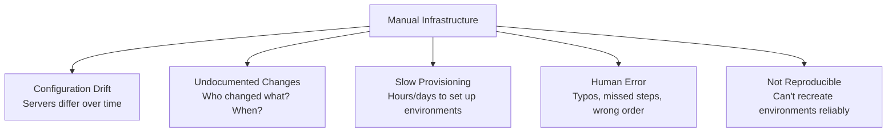
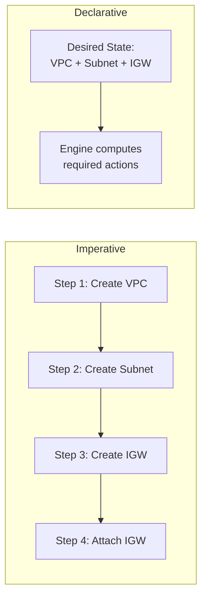
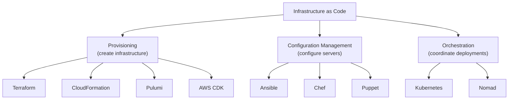
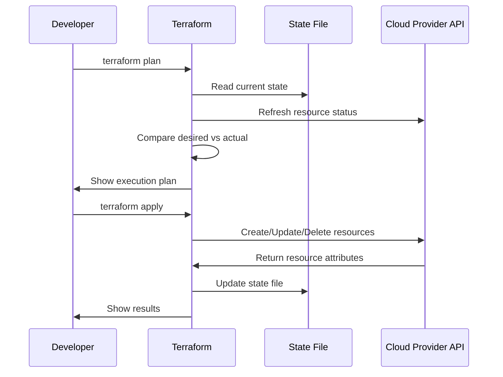

## The Problem IaC Solves

Before IaC, infrastructure was managed through manual processes — clicking through cloud consoles, running ad-hoc scripts, and documenting steps in wikis that quickly became outdated. This created several problems:



IaC eliminates these problems by treating infrastructure the same way we treat application code — written in files, stored in version control, reviewed by peers, and deployed through automation.

---

## Declarative vs Imperative

The two fundamental approaches to defining infrastructure:

### Imperative (How)

You describe the exact steps to reach the desired state:

```bash
#!/bin/bash
# Create VPC
VPC_ID=$(aws ec2 create-vpc --cidr-block 10.0.0.0/16 --query 'Vpc.VpcId' --output text)

# Create subnet
SUBNET_ID=$(aws ec2 create-subnet --vpc-id $VPC_ID --cidr-block 10.0.1.0/24 --output text)

# Create internet gateway
IGW_ID=$(aws ec2 create-internet-gateway --query 'InternetGateway.InternetGatewayId' --output text)

# Attach gateway to VPC
aws ec2 attach-internet-gateway --internet-gateway-id $IGW_ID --vpc-id $VPC_ID
```

Problems: What if the VPC already exists? What if the script fails halfway? What if you want to remove the subnet later? You must handle every edge case yourself.

### Declarative (What)

You describe the desired end state — the tool figures out how to get there:

```hcl
resource "aws_vpc" "main" {
  cidr_block = "10.0.0.0/16"
}

resource "aws_subnet" "public" {
  vpc_id     = aws_vpc.main.id
  cidr_block = "10.0.1.0/24"
}

resource "aws_internet_gateway" "gw" {
  vpc_id = aws_vpc.main.id
}
```

Terraform handles: creation order, already-existing resources, partial failures, and removal of resources you delete from config.



---

## IaC Benefits

| Benefit | How |
|---------|-----|
| **Reproducibility** | Same config → same infrastructure, every time |
| **Version history** | Git tracks who changed what and when |
| **Peer review** | Infrastructure changes go through MRs |
| **Testing** | Validate configs before applying |
| **Documentation** | The code IS the documentation |
| **Disaster recovery** | Recreate entire environments from code |
| **Collaboration** | Teams work on infrastructure like they work on code |

---

## IaC Tool Landscape



### Terraform's Position

Terraform is a **provisioning** tool — it creates and manages infrastructure resources (VPCs, databases, DNS records, etc.). It does NOT configure what runs inside those resources (that's Ansible/Chef/Puppet territory).

| Tool | Scope | Model | State |
|------|-------|-------|-------|
| **Terraform** | Infrastructure provisioning | Declarative (HCL) | Explicit state file |
| **CloudFormation** | AWS provisioning | Declarative (YAML/JSON) | AWS-managed |
| **Pulumi** | Infrastructure provisioning | Imperative (TS/Python/Go) | Pulumi Cloud or self-managed |
| **Ansible** | Server configuration | Imperative (YAML playbooks) | Stateless (idempotent) |
| **CDK** | AWS provisioning | Imperative → CloudFormation | AWS-managed |

---

## Terraform's Execution Model



The plan/apply cycle is Terraform's core workflow:

1. **Plan** — preview what will change (safe, read-only)
2. **Review** — human verifies the plan makes sense
3. **Apply** — execute the changes

This two-step process prevents accidental infrastructure damage.

---

## Idempotency

A key property of declarative IaC: applying the same configuration multiple times produces the same result.

```bash
# First apply: creates 3 resources
$ terraform apply
aws_vpc.main: Creating...
aws_subnet.public: Creating...
aws_internet_gateway.gw: Creating...
Apply complete! Resources: 3 added, 0 changed, 0 destroyed.

# Second apply (nothing changed): no-op
$ terraform apply
No changes. Your infrastructure matches the configuration.
Apply complete! Resources: 0 added, 0 changed, 0 destroyed.
```

This means you can safely re-run Terraform at any time. If infrastructure drifts (someone makes a manual change), Terraform will detect it and offer to fix it.

---

## Immutable vs Mutable Infrastructure

| Approach | Update Strategy | Example |
|----------|----------------|---------|
| **Mutable** | Modify existing servers in place | SSH in, apt upgrade, restart |
| **Immutable** | Replace servers with new versions | Build new AMI, deploy, destroy old |

Terraform naturally supports immutable infrastructure — when a resource must change in a way that requires replacement, Terraform destroys the old one and creates a new one.

```hcl
# Changing the AMI forces replacement (immutable)
resource "aws_instance" "web" {
  ami           = "ami-NEW-VERSION"  # changed
  instance_type = "t3.micro"
}
```

```text
# terraform plan output:
-/+ aws_instance.web (forces replacement)
      ami: "ami-OLD" => "ami-NEW" (forces new resource)
```

---

## Key Takeaways

1. **IaC is not optional** — manual infrastructure doesn't scale and creates unmanageable risk
2. **Declarative wins** — describe what you want, let the tool handle how
3. **Terraform is for provisioning** — creating cloud resources, not configuring servers
4. **Plan before apply** — always review what will change before executing
5. **Idempotency is safety** — re-running Terraform is always safe
6. **Immutable over mutable** — replace rather than patch for predictable infrastructure
7. **Version control everything** — infrastructure changes get the same rigor as code changes
