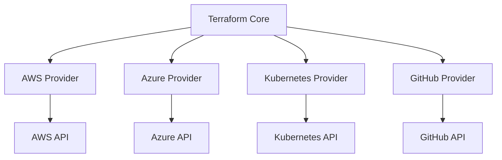
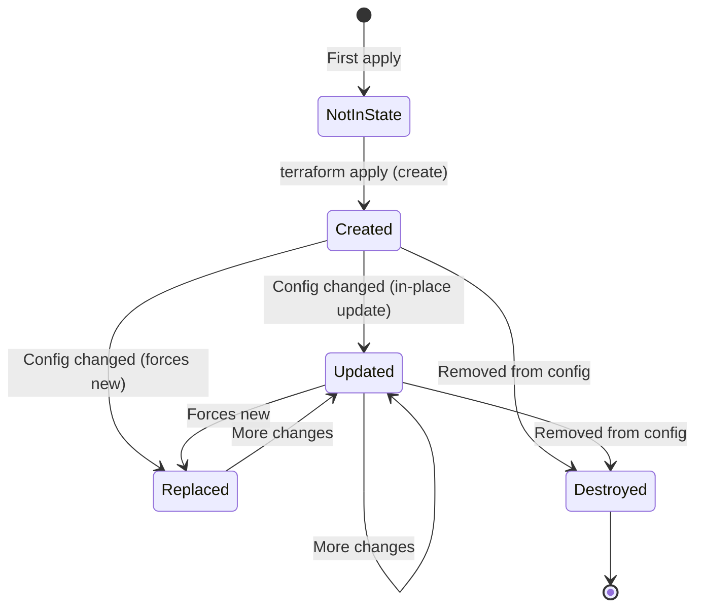

## Providers

Providers are Terraform's plugin system. Each provider is a bridge between Terraform and an external API — AWS, Azure, GCP, Kubernetes, GitHub, Datadog, or any service with an API.



### Provider Configuration

```hcl
terraform {
  required_providers {
    aws = {
      source  = "hashicorp/aws"
      version = "~> 5.0"
    }
    random = {
      source  = "hashicorp/random"
      version = "~> 3.6"
    }
  }
}

provider "aws" {
  region = var.aws_region
  
  default_tags {
    tags = {
      Environment = var.environment
      ManagedBy   = "terraform"
      Team        = var.team
    }
  }
}
```

### Version Constraints

| Constraint | Meaning | Example |
|-----------|---------|---------|
| `= 5.0.0` | Exact version | Only 5.0.0 |
| `>= 5.0` | Minimum version | 5.0 or higher |
| `~> 5.0` | Pessimistic (minor) | ≥ 5.0, < 6.0 |
| `~> 5.0.0` | Pessimistic (patch) | ≥ 5.0.0, < 5.1.0 |
| `>= 5.0, < 6.0` | Range | Between 5.0 and 6.0 |

**Best practice:** Use `~> MAJOR.MINOR` for providers (allows patch updates, blocks breaking changes).

### Multiple Provider Configurations (Aliases)

```hcl
provider "aws" {
  region = "eu-central-1"
}

provider "aws" {
  alias  = "us_east"
  region = "us-east-1"
}

# Use the aliased provider
resource "aws_acm_certificate" "cdn_cert" {
  provider    = aws.us_east  # CloudFront requires certs in us-east-1
  domain_name = "example.com"
}
```

### Authentication

Providers authenticate via environment variables, shared credentials, or instance profiles:

```bash
# AWS — environment variables (most common in CI/CD)
export AWS_ACCESS_KEY_ID="..."
export AWS_SECRET_ACCESS_KEY="..."
export AWS_SESSION_TOKEN="..."  # for assumed roles

# AWS — shared credentials file (~/.aws/credentials)
# AWS — instance profile (EC2/ECS — automatic)
```

Never hardcode credentials in Terraform files.

---

## Resources

Resources are the primary building blocks — each resource block declares one infrastructure object that Terraform manages.

### Anatomy of a Resource

```hcl
resource "aws_instance" "web" {
  #        ↑ type          ↑ local name
  
  # Arguments (configuration)
  ami           = "ami-0c55b159cbfafe1f0"
  instance_type = "t3.micro"
  subnet_id     = aws_subnet.public.id
  
  # Nested block
  root_block_device {
    volume_size = 20
    volume_type = "gp3"
    encrypted   = true
  }
  
  # Meta-arguments (Terraform-level, not provider-level)
  tags = {
    Name = "web-server"
  }
}
```

The resource type (`aws_instance`) determines which provider manages it and what arguments are available. The local name (`web`) is how you reference it elsewhere in your configuration.

### Resource Behavior



### count and for_each

Create multiple instances of a resource:

```hcl
# count — index-based (use when items are interchangeable)
resource "aws_subnet" "public" {
  count             = 3
  vpc_id            = aws_vpc.main.id
  cidr_block        = cidrsubnet(aws_vpc.main.cidr_block, 8, count.index)
  availability_zone = data.aws_availability_zones.available.names[count.index]
}

# for_each — key-based (use when items have identity)
resource "aws_iam_user" "team" {
  for_each = toset(["alice", "bob", "carol"])
  name     = each.value
}

# for_each with map
resource "aws_s3_bucket" "buckets" {
  for_each = {
    logs   = { acl = "log-delivery-write" }
    assets = { acl = "private" }
    backup = { acl = "private" }
  }
  
  bucket = "${var.prefix}-${each.key}"
}
```

**count vs for_each:**

| | `count` | `for_each` |
|---|---------|-----------|
| Identifier | Index (0, 1, 2...) | Key (string) |
| Reordering | Dangerous (shifts indices) | Safe (keys are stable) |
| Removal | Shifts all subsequent | Only removes that key |
| Use when | Items are interchangeable | Items have identity |

### Meta-Arguments

Every resource supports these regardless of provider:

| Meta-Argument | Purpose |
|---------------|---------|
| `depends_on` | Explicit dependency |
| `count` | Create N copies |
| `for_each` | Create copies from map/set |
| `provider` | Select non-default provider |
| `lifecycle` | Control create/update/destroy behavior |

---

## Data Sources

Data sources read information from infrastructure that Terraform doesn't manage (or manages elsewhere):

```hcl
# Look up the latest Amazon Linux AMI
data "aws_ami" "amazon_linux" {
  most_recent = true
  owners      = ["amazon"]
  
  filter {
    name   = "name"
    values = ["amzn2-ami-hvm-*-x86_64-gp2"]
  }
}

# Look up existing VPC by tag
data "aws_vpc" "existing" {
  filter {
    name   = "tag:Name"
    values = ["shared-vpc"]
  }
}

# Look up current AWS account info
data "aws_caller_identity" "current" {}

# Look up available AZs
data "aws_availability_zones" "available" {
  state = "available"
}
```

### Using Data Sources

```hcl
resource "aws_instance" "web" {
  ami               = data.aws_ami.amazon_linux.id
  instance_type     = "t3.micro"
  availability_zone = data.aws_availability_zones.available.names[0]
  
  tags = {
    Account = data.aws_caller_identity.current.account_id
  }
}
```

### Resources vs Data Sources

| | Resource | Data Source |
|---|----------|-------------|
| Keyword | `resource` | `data` |
| Purpose | Create/manage infrastructure | Read existing infrastructure |
| State | Tracked in state file | Refreshed every plan |
| Lifecycle | Create, update, destroy | Read-only |
| Reference | `aws_vpc.main.id` | `data.aws_vpc.existing.id` |

---

## Terraform Remote State (Cross-Configuration Data)

Read outputs from another Terraform configuration:

```hcl
# In the networking project: outputs VPC ID
output "vpc_id" {
  value = aws_vpc.main.id
}

# In the application project: reads networking state
data "terraform_remote_state" "networking" {
  backend = "s3"
  config = {
    bucket = "terraform-state"
    key    = "networking/terraform.tfstate"
    region = "eu-central-1"
  }
}

resource "aws_instance" "web" {
  subnet_id = data.terraform_remote_state.networking.outputs.public_subnet_ids[0]
}
```

---

## Provider Ecosystem

The Terraform Registry hosts thousands of providers:

| Category | Examples |
|----------|----------|
| **Major clouds** | AWS, Azure, GCP |
| **Containers** | Kubernetes, Docker, Helm |
| **Monitoring** | Datadog, New Relic, PagerDuty |
| **DNS** | Cloudflare, Route53, NS1 |
| **VCS** | GitHub, GitLab, Bitbucket |
| **Databases** | MongoDB Atlas, PostgreSQL |
| **Identity** | Okta, Auth0 |
| **Secrets** | Vault, AWS Secrets Manager |

---

## Key Takeaways

1. **Providers are plugins** — they translate HCL into API calls for specific services
2. **Pin provider versions** — `~> 5.0` prevents unexpected breaking changes
3. **Resources create things** — they have full lifecycle management (CRUD)
4. **Data sources read things** — they query existing infrastructure without managing it
5. **Use `for_each` over `count`** — keys are stable; indices shift when items are removed
6. **Never hardcode credentials** — use environment variables, instance profiles, or Vault
7. **Remote state bridges configurations** — share outputs between independent Terraform projects
