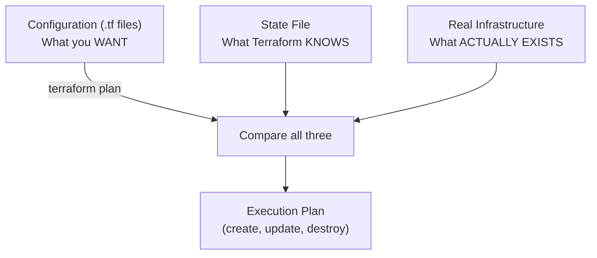
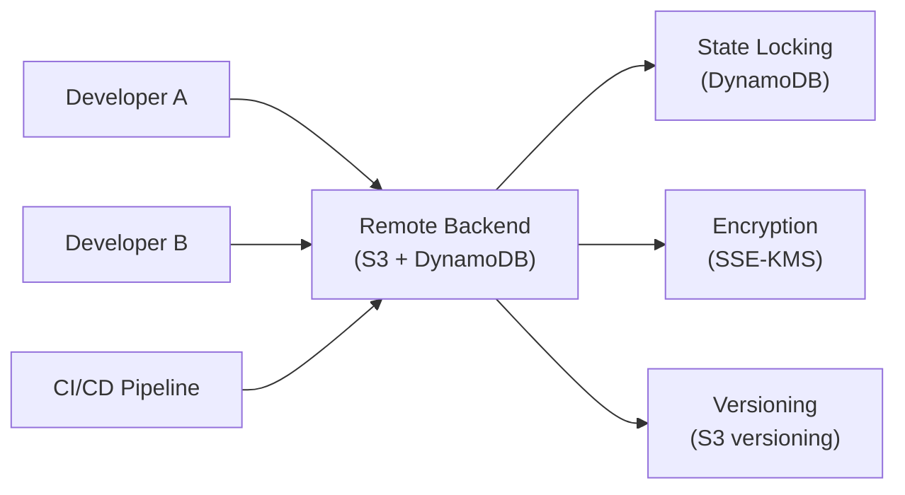
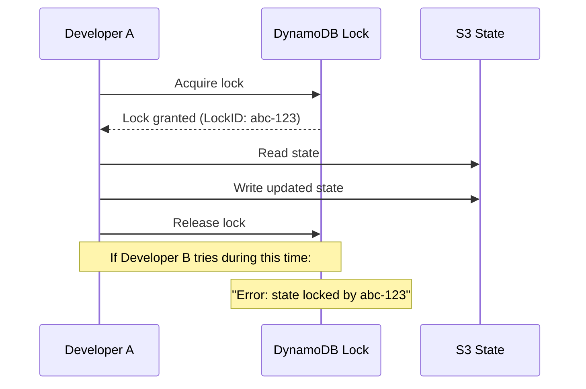
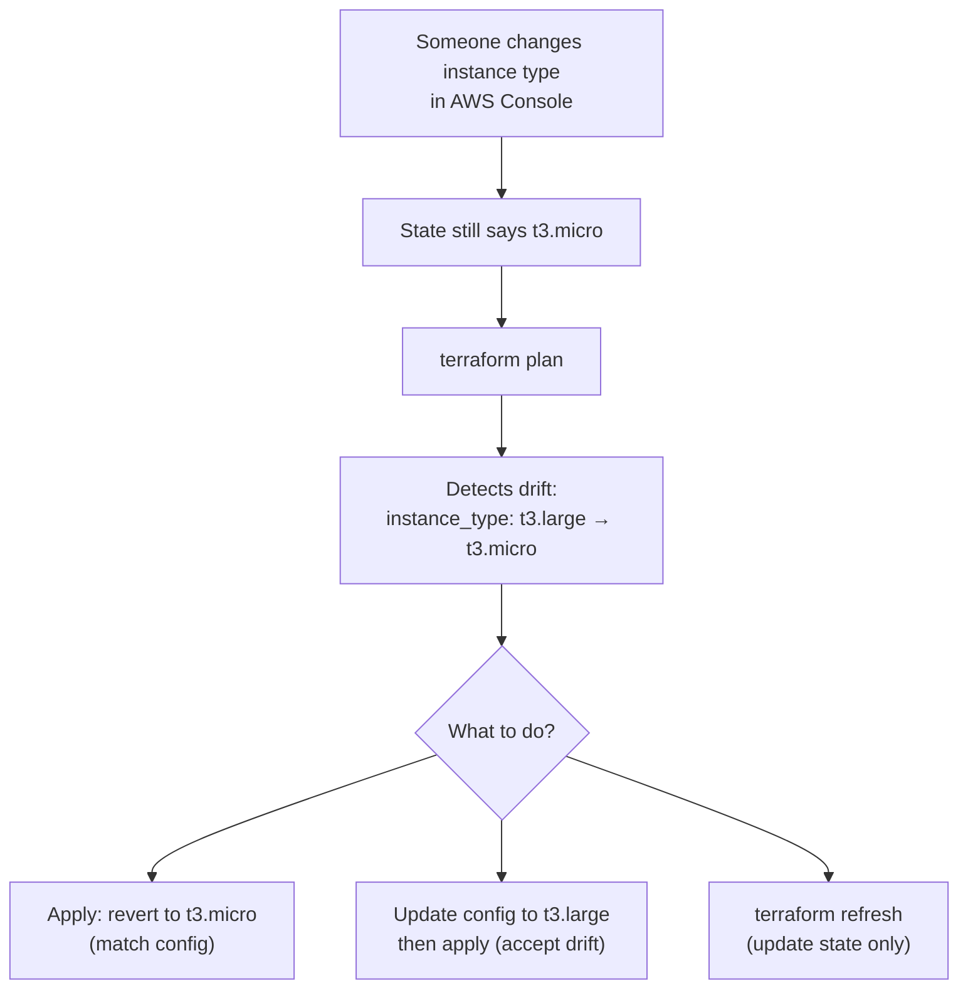

## What is State?

State is Terraform's memory. It's a JSON file that maps your configuration to real-world infrastructure. Without state, Terraform wouldn't know which cloud resources it created, what their current attributes are, or what needs to change.



---

## Why State Exists

Terraform needs state because:

1. **Mapping** — Links `resource "aws_instance" "web"` to actual instance `i-0abc123`
2. **Performance** — Caches resource attributes to avoid querying every API on every plan
3. **Dependency tracking** — Knows the order to create/destroy resources
4. **Drift detection** — Compares state to reality to find manual changes

Without state, Terraform would need to scan your entire cloud account and guess which resources belong to which configuration — impossible at scale.

---

## State File Structure

```json
{
  "version": 4,
  "terraform_version": "1.7.0",
  "serial": 42,
  "lineage": "a1b2c3d4-e5f6-7890-abcd-ef1234567890",
  "outputs": {
    "vpc_id": {
      "value": "vpc-0abc123",
      "type": "string"
    }
  },
  "resources": [
    {
      "mode": "managed",
      "type": "aws_vpc",
      "name": "main",
      "provider": "provider[\"registry.terraform.io/hashicorp/aws\"]",
      "instances": [
        {
          "schema_version": 1,
          "attributes": {
            "id": "vpc-0abc123",
            "cidr_block": "10.0.0.0/16",
            "tags": { "Name": "main-vpc" }
          }
        }
      ]
    }
  ]
}
```

| Field | Purpose |
|-------|---------|
| `version` | State format version |
| `serial` | Increments on every write (conflict detection) |
| `lineage` | Unique ID for this state (prevents mixing states) |
| `outputs` | Values exposed by `output` blocks |
| `resources` | All managed resources and their attributes |

---

## Local vs Remote State

### Local State (Default)

```bash
# Created automatically in working directory
./terraform.tfstate
./terraform.tfstate.backup
```

Problems with local state:

- **No collaboration** — only one person has the file
- **No locking** — concurrent applies corrupt state
- **No encryption** — secrets stored in plaintext on disk
- **No backup** — disk failure = lost state

### Remote State

```hcl
terraform {
  backend "s3" {
    bucket         = "company-terraform-state"
    key            = "projects/my-app/prod/terraform.tfstate"
    region         = "eu-central-1"
    encrypt        = true
    dynamodb_table = "terraform-locks"
  }
}
```



### Common Backends

| Backend | Locking | Encryption | Best For |
|---------|---------|-----------|----------|
| **S3 + DynamoDB** | ✅ DynamoDB | ✅ SSE-KMS | AWS teams |
| **Azure Blob** | ✅ Blob lease | ✅ SSE | Azure teams |
| **GCS** | ✅ Built-in | ✅ Built-in | GCP teams |
| **Terraform Cloud** | ✅ Built-in | ✅ Built-in | Multi-cloud, managed |
| **Consul** | ✅ Built-in | ✅ TLS | HashiCorp stack |

---

## State Locking

Prevents two people from applying simultaneously:



If a lock is stuck (crashed process), force-unlock:

```bash
terraform force-unlock LOCK_ID
# ⚠️ Only use when you're SURE no other process is running
```

---

## Drift Detection

Drift occurs when real infrastructure differs from state:



### Handling Drift

| Strategy | Command | Effect |
|----------|---------|--------|
| Revert drift | `terraform apply` | Forces reality to match config |
| Accept drift | Update `.tf` files, then `apply` | Config matches reality |
| Ignore specific attributes | `lifecycle { ignore_changes = [...] }` | Terraform ignores those changes |
| Refresh state only | `terraform apply -refresh-only` | Updates state without changing infra |

---

## Sensitive Data in State

**State contains secrets.** Database passwords, API keys, and private IPs are all stored in plaintext in the state file.

Protections:

1. **Encrypt at rest** — enable S3 encryption (SSE-KMS)
2. **Encrypt in transit** — backends use HTTPS
3. **Restrict access** — IAM policies on the state bucket
4. **Never commit state** — add `*.tfstate` to `.gitignore`
5. **Mark outputs sensitive** — `sensitive = true` hides from CLI output (still in state)

```hcl
output "db_password" {
  value     = random_password.db.result
  sensitive = true  # hidden in terraform output, but still in state file
}
```

---

## State Operations

### Common Commands

```bash
# List all resources in state
terraform state list

# Show details of a specific resource
terraform state show aws_instance.web

# Move/rename a resource (no destroy/recreate)
terraform state mv aws_instance.web aws_instance.api

# Remove from state (Terraform "forgets" it — doesn't destroy)
terraform state rm aws_instance.legacy

# Pull remote state to local file
terraform state pull > state.json

# Push local state to remote (dangerous)
terraform state push state.json
```

### When to Use State Commands

| Scenario | Command |
|----------|---------|
| Renamed a resource in config | `state mv` or `moved` block |
| Want Terraform to stop managing a resource | `state rm` |
| Need to inspect what's in state | `state list` / `state show` |
| Importing existing infrastructure | `terraform import` |
| Debugging state issues | `state pull` |

---

## State Isolation

Separate state files for separate concerns:

```text
terraform-state-bucket/
├── networking/prod/terraform.tfstate
├── networking/staging/terraform.tfstate
├── app-api/prod/terraform.tfstate
├── app-api/staging/terraform.tfstate
├── monitoring/prod/terraform.tfstate
└── shared/ecr/terraform.tfstate
```

Benefits:

- **Blast radius** — a bad apply only affects one state
- **Speed** — smaller state = faster plan/apply
- **Permissions** — different IAM for different states
- **Team ownership** — each team manages their own state

---

## Key Takeaways

1. **State is the source of truth** — it maps config to real resources
2. **Always use remote state** — S3 + DynamoDB for AWS teams
3. **Always enable locking** — prevents concurrent corruption
4. **Always encrypt** — state contains secrets in plaintext
5. **Never edit state manually** — use `terraform state` commands
6. **Never commit state to git** — add `*.tfstate` to `.gitignore`
7. **Isolate state by concern** — separate environments and components
8. **Run plan regularly** — detects drift before it becomes a problem
