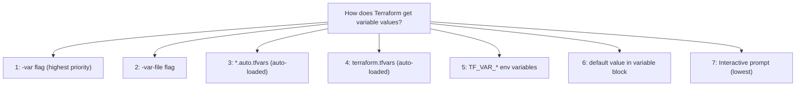

## Input Variables

Variables parameterize your Terraform configuration — the same code works across environments by changing variable values.

### Declaration

```hcl
variable "environment" {
  description = "Deployment environment (dev, staging, prod)"
  type        = string
  default     = "dev"
}

variable "instance_count" {
  description = "Number of EC2 instances to create"
  type        = number
  # No default — Terraform will prompt or require a value
}

variable "enable_monitoring" {
  description = "Whether to enable detailed monitoring"
  type        = bool
  default     = false
}
```

### Type Constraints

```hcl
# Simple types
variable "name" { type = string }
variable "port" { type = number }
variable "enabled" { type = bool }

# Collections
variable "availability_zones" {
  type = list(string)
}

variable "tags" {
  type = map(string)
}

variable "allowed_ports" {
  type = set(number)
}

# Complex objects
variable "database_config" {
  type = object({
    engine         = string
    instance_class = string
    storage_gb     = number
    multi_az       = bool
    backup_window  = optional(string, "03:00-04:00")
  })
}

# List of objects
variable "services" {
  type = list(object({
    name     = string
    port     = number
    cpu      = number
    memory   = number
    replicas = optional(number, 1)
  }))
}
```

### Validation

```hcl
variable "environment" {
  type = string
  
  validation {
    condition     = contains(["dev", "staging", "prod"], var.environment)
    error_message = "Environment must be dev, staging, or prod."
  }
}

variable "cidr_block" {
  type = string
  
  validation {
    condition     = can(cidrhost(var.cidr_block, 0))
    error_message = "Must be a valid CIDR block (e.g., 10.0.0.0/16)."
  }
}

variable "instance_type" {
  type = string
  
  validation {
    condition     = startswith(var.instance_type, "t3.") || startswith(var.instance_type, "t4g.")
    error_message = "Only t3 and t4g instance families are allowed."
  }
}
```

### Sensitive Variables

```hcl
variable "db_password" {
  description = "Database master password"
  type        = string
  sensitive   = true  # hidden in plan/apply output
}
```

---

## Setting Variable Values



### tfvars Files

```hcl
# config/variables/prod.tfvars
environment    = "prod"
instance_count = 3
instance_type  = "t3.large"
enable_monitoring = true

database_config = {
  engine         = "postgres"
  instance_class = "db.r6g.large"
  storage_gb     = 100
  multi_az       = true
}
```

```bash
terraform plan -var-file="config/variables/prod.tfvars"
```

### Environment Variables

```bash
export TF_VAR_environment="prod"
export TF_VAR_db_password="secret123"
terraform plan
```

### Auto-loaded Files

Files matching these patterns are loaded automatically:

- `terraform.tfvars`
- `*.auto.tfvars`

---

## Outputs

Outputs expose values from your configuration — for humans, for other Terraform configurations, or for scripts.

```hcl
output "vpc_id" {
  description = "ID of the created VPC"
  value       = aws_vpc.main.id
}

output "public_subnet_ids" {
  description = "List of public subnet IDs"
  value       = aws_subnet.public[*].id
}

output "load_balancer_dns" {
  description = "DNS name of the load balancer"
  value       = aws_lb.main.dns_name
}

output "db_connection_string" {
  description = "Database connection string"
  value       = "postgresql://${aws_db_instance.main.endpoint}/${aws_db_instance.main.db_name}"
  sensitive   = true
}
```

### Output Uses

| Use Case | How |
|----------|-----|
| Display after apply | `terraform output` |
| Script consumption | `terraform output -json` |
| Cross-config sharing | `data "terraform_remote_state"` |
| Module interface | Parent reads `module.x.output_name` |

### Querying Outputs

```bash
# All outputs
terraform output

# Specific output
terraform output vpc_id

# JSON format (for scripts)
terraform output -json

# Raw value (no quotes)
terraform output -raw load_balancer_dns
```

---

## Locals

Locals are computed values for internal use — they reduce repetition and improve readability.

```hcl
locals {
  # Naming convention
  name_prefix = "${var.project}-${var.environment}"
  
  # Common tags applied everywhere
  common_tags = {
    Project     = var.project
    Environment = var.environment
    ManagedBy   = "terraform"
    Team        = var.team
    Repository  = var.repository_url
  }
  
  # Computed values
  is_production = var.environment == "prod"
  az_count      = local.is_production ? 3 : 2
  
  # Derived from other locals
  subnet_cidrs = [for i in range(local.az_count) : cidrsubnet(var.vpc_cidr, 8, i)]
}
```

### Using Locals

```hcl
resource "aws_vpc" "main" {
  cidr_block = var.vpc_cidr
  tags       = merge(local.common_tags, { Name = "${local.name_prefix}-vpc" })
}

resource "aws_subnet" "public" {
  count      = local.az_count
  vpc_id     = aws_vpc.main.id
  cidr_block = local.subnet_cidrs[count.index]
  tags       = merge(local.common_tags, { Name = "${local.name_prefix}-public-${count.index}" })
}

resource "aws_instance" "web" {
  instance_type = local.is_production ? "t3.large" : "t3.micro"
  monitoring    = local.is_production
  tags          = local.common_tags
}
```

### Variables vs Locals

| | Variables | Locals |
|---|-----------|--------|
| Set by | User (external input) | Computed internally |
| Purpose | Parameterize configuration | Reduce repetition, improve readability |
| Reference | `var.name` | `local.name` |
| Validation | Built-in `validation` block | None (computed at plan time) |
| Sensitive | `sensitive = true` | `sensitive()` function |

---

## Pattern: Environment Configuration

A complete example showing variables, locals, and outputs working together:

```hcl
# variables.tf
variable "environment" {
  type = string
  validation {
    condition     = contains(["dev", "staging", "prod"], var.environment)
    error_message = "Must be dev, staging, or prod."
  }
}

variable "project" {
  type    = string
  default = "myapp"
}

# locals.tf
locals {
  env_config = {
    dev = {
      instance_type  = "t3.micro"
      instance_count = 1
      multi_az       = false
    }
    staging = {
      instance_type  = "t3.small"
      instance_count = 2
      multi_az       = false
    }
    prod = {
      instance_type  = "t3.large"
      instance_count = 3
      multi_az       = true
    }
  }
  
  config      = local.env_config[var.environment]
  name_prefix = "${var.project}-${var.environment}"
}

# main.tf
resource "aws_instance" "web" {
  count         = local.config.instance_count
  instance_type = local.config.instance_type
  tags          = { Name = "${local.name_prefix}-web-${count.index}" }
}

# outputs.tf
output "instance_ids" {
  value = aws_instance.web[*].id
}
```

This pattern keeps tfvars minimal (just `environment = "prod"`) while the locals map handles all environment-specific differences.

---

## Key Takeaways

1. **Variables are inputs** — parameterize your config for reuse across environments
2. **Always add `description`** — future you (and teammates) will thank you
3. **Use `validation`** — catch errors at plan time, not apply time
4. **Outputs are the interface** — expose what other configs or humans need
5. **Locals reduce repetition** — compute once, reference everywhere
6. **Prefer `object` types** — group related variables into structured objects
7. **Use env-config maps in locals** — one variable (`environment`) drives all differences
8. **Mark secrets `sensitive`** — prevents accidental exposure in logs
