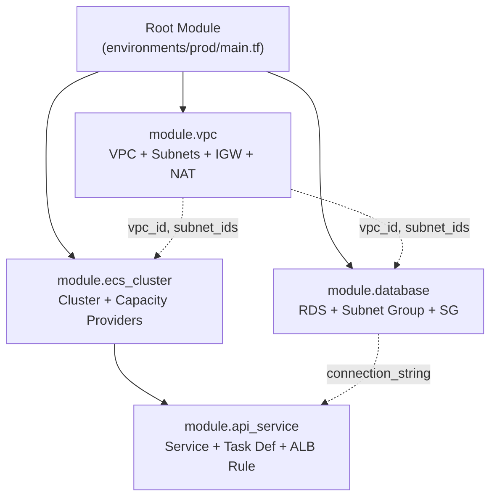

## What is a Module?

A module is a container for multiple resources that are used together. Every Terraform configuration is a module — the root module. When you call another module, it becomes a child module.



Modules provide:

- **Abstraction** — hide complexity behind a simple interface
- **Reuse** — same module across environments and projects
- **Consistency** — enforce standards (tagging, naming, security)
- **Encapsulation** — internal details don't leak to callers

---

## Module Structure

```text
modules/vpc/
├── main.tf          # Resources
├── variables.tf     # Inputs (the module's API)
├── outputs.tf       # Outputs (what callers can access)
├── locals.tf        # Internal computed values
├── data.tf          # Data sources
└── README.md        # Usage documentation
```

### A Minimal Module

```hcl
# modules/vpc/variables.tf
variable "cidr_block" {
  description = "VPC CIDR block"
  type        = string
}

variable "environment" {
  description = "Environment name"
  type        = string
}

variable "az_count" {
  description = "Number of availability zones"
  type        = number
  default     = 2
}

# modules/vpc/main.tf
resource "aws_vpc" "this" {
  cidr_block           = var.cidr_block
  enable_dns_hostnames = true
  
  tags = { Name = "${var.environment}-vpc" }
}

resource "aws_subnet" "public" {
  count             = var.az_count
  vpc_id            = aws_vpc.this.id
  cidr_block        = cidrsubnet(var.cidr_block, 8, count.index)
  availability_zone = data.aws_availability_zones.available.names[count.index]
  
  tags = { Name = "${var.environment}-public-${count.index}" }
}

# modules/vpc/outputs.tf
output "vpc_id" {
  description = "ID of the VPC"
  value       = aws_vpc.this.id
}

output "public_subnet_ids" {
  description = "IDs of public subnets"
  value       = aws_subnet.public[*].id
}
```

### Calling the Module

```hcl
# environments/prod/main.tf
module "vpc" {
  source = "../../modules/vpc"
  
  cidr_block  = "10.0.0.0/16"
  environment = "prod"
  az_count    = 3
}

# Use module outputs
resource "aws_instance" "web" {
  subnet_id = module.vpc.public_subnet_ids[0]
}
```

---

## Module Sources

```hcl
# Local path (relative to calling module)
module "vpc" {
  source = "./modules/vpc"
}

# Git over SSH (pin with ref)
module "vpc" {
  source = "git::ssh://git@github.com/org/terraform-modules.git//modules/vpc?ref=v2.1.0"
}

# Git over HTTPS
module "vpc" {
  source = "git::https://github.com/org/terraform-modules.git//modules/vpc?ref=v2.1.0"
}

# Terraform Registry (public)
module "vpc" {
  source  = "terraform-aws-modules/vpc/aws"
  version = "~> 5.0"
}

# Private registry
module "vpc" {
  source  = "app.terraform.io/my-org/vpc/aws"
  version = "~> 1.0"
}
```

**Always pin versions.** Use `?ref=v1.2.3` for git sources and `version = "~> 1.0"` for registry modules.

---

## Module Design Principles

### 1. Single Responsibility

Each module should do one thing well:

```text
✅ modules/vpc/          — VPC, subnets, route tables, NAT
✅ modules/ecs-service/  — Task def, service, target group, autoscaling
✅ modules/rds/          — RDS instance, subnet group, security group

❌ modules/infrastructure/  — Everything (too broad)
❌ modules/network-and-compute/  — Mixed concerns
```

### 2. Minimal Interface

Expose only what callers need:

```hcl
# Good: focused outputs
output "vpc_id" { value = aws_vpc.this.id }
output "public_subnet_ids" { value = aws_subnet.public[*].id }

# Bad: exposing internal details
output "route_table_associations" { value = aws_route_table_association.public[*].id }
output "nat_eip_allocation_id" { value = aws_eip.nat.allocation_id }
```

### 3. Sensible Defaults

```hcl
variable "instance_type" {
  type    = string
  default = "t3.micro"  # safe default, override for prod
}

variable "enable_deletion_protection" {
  type    = bool
  default = true  # safe by default
}
```

### 4. Composition Over Inheritance

Build complex infrastructure by composing simple modules:

```hcl
module "vpc" {
  source = "./modules/vpc"
  # ...
}

module "ecs_cluster" {
  source = "./modules/ecs-cluster"
  vpc_id = module.vpc.vpc_id
  # ...
}

module "api_service" {
  source     = "./modules/ecs-service"
  cluster_id = module.ecs_cluster.id
  subnet_ids = module.vpc.private_subnet_ids
  # ...
}
```

---

## Module Patterns

### Wrapper Module (Opinionated Defaults)

Wraps a community module with your organization's standards:

```hcl
# modules/company-s3-bucket/main.tf
module "bucket" {
  source  = "terraform-aws-modules/s3-bucket/aws"
  version = "~> 4.0"
  
  bucket = "${var.prefix}-${var.name}"
  
  # Company standards enforced:
  versioning = { enabled = true }
  
  server_side_encryption_configuration = {
    rule = {
      apply_server_side_encryption_by_default = {
        sse_algorithm = "aws:kms"
      }
    }
  }
  
  block_public_access = true
  
  tags = merge(var.tags, {
    ManagedBy = "terraform"
    Module    = "company-s3-bucket"
  })
}
```

### Factory Module (Multiple Similar Resources)

```hcl
# modules/ecs-services/main.tf
variable "services" {
  type = map(object({
    image       = string
    cpu         = number
    memory      = number
    port        = number
    replicas    = optional(number, 1)
    environment = optional(map(string), {})
  }))
}

resource "aws_ecs_service" "this" {
  for_each = var.services
  
  name            = each.key
  cluster         = var.cluster_id
  task_definition = aws_ecs_task_definition.this[each.key].arn
  desired_count   = each.value.replicas
}
```

---

## Module Testing

### Validation (Built-in)

```hcl
variable "environment" {
  type = string
  validation {
    condition     = contains(["dev", "staging", "prod"], var.environment)
    error_message = "Invalid environment."
  }
}
```

### Preconditions and Postconditions

```hcl
resource "aws_instance" "web" {
  instance_type = var.instance_type
  ami           = data.aws_ami.latest.id

  lifecycle {
    precondition {
      condition     = data.aws_ami.latest.architecture == "x86_64"
      error_message = "AMI must be x86_64 architecture."
    }
    
    postcondition {
      condition     = self.public_ip != ""
      error_message = "Instance must have a public IP."
    }
  }
}
```

### Terraform Test (1.6+)

```hcl
# tests/vpc.tftest.hcl
run "creates_vpc" {
  command = plan
  
  variables {
    cidr_block  = "10.0.0.0/16"
    environment = "test"
    az_count    = 2
  }
  
  assert {
    condition     = aws_vpc.this.cidr_block == "10.0.0.0/16"
    error_message = "VPC CIDR block doesn't match."
  }
  
  assert {
    condition     = length(aws_subnet.public) == 2
    error_message = "Expected 2 public subnets."
  }
}
```

---

## Key Takeaways

1. **Every Terraform config is a module** — the root module calls child modules
2. **Modules are the abstraction mechanism** — hide complexity, expose a clean interface
3. **Pin versions always** — `?ref=v1.2.0` for git, `version = "~> 1.0"` for registry
4. **Single responsibility** — one module = one concern (VPC, database, service)
5. **Compose, don't nest deeply** — flat composition of focused modules beats deep hierarchies
6. **Outputs are the API** — only expose what callers actually need
7. **Test with `terraform test`** — validate module behavior without deploying
