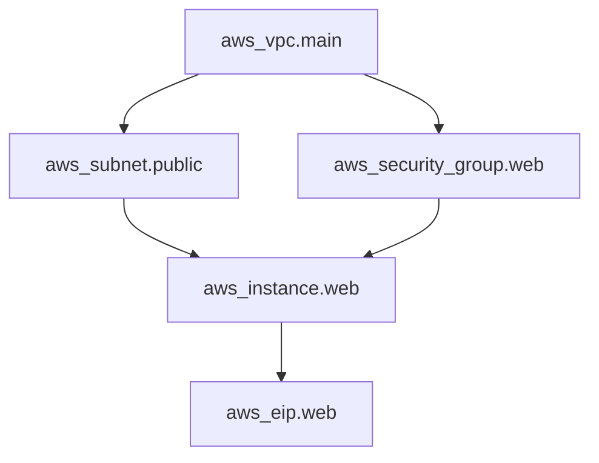
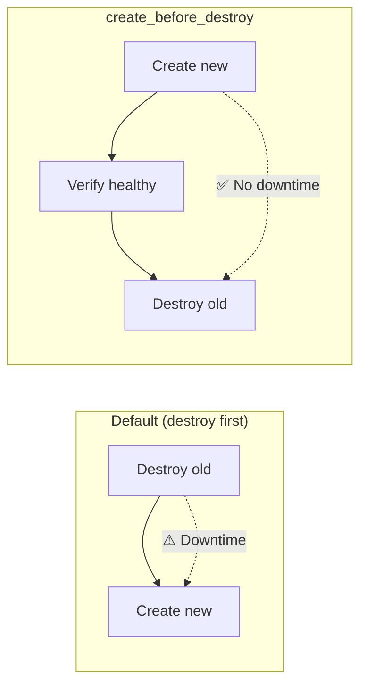

## Dependency Graph

Terraform builds a directed acyclic graph (DAG) of all resources and their dependencies. This graph determines the order of operations.



Terraform creates resources top-down (VPC first, EIP last) and destroys bottom-up (EIP first, VPC last).

---

## Implicit Dependencies

Most dependencies are automatic — Terraform detects them from attribute references:

```hcl
resource "aws_vpc" "main" {
  cidr_block = "10.0.0.0/16"
}

# Implicit dependency: references aws_vpc.main.id
resource "aws_subnet" "public" {
  vpc_id     = aws_vpc.main.id
  cidr_block = "10.0.1.0/24"
}

# Implicit dependency: references aws_subnet.public.id
resource "aws_instance" "web" {
  subnet_id = aws_subnet.public.id
  ami       = data.aws_ami.latest.id
}
```

Terraform automatically knows: VPC → Subnet → Instance.

---

## Explicit Dependencies

Sometimes resources depend on each other without a direct attribute reference:

```hcl
resource "aws_iam_role_policy" "s3_access" {
  role   = aws_iam_role.app.id
  policy = data.aws_iam_policy_document.s3.json
}

resource "aws_instance" "app" {
  ami                  = data.aws_ami.latest.id
  instance_type        = "t3.micro"
  iam_instance_profile = aws_iam_instance_profile.app.name
  
  # The instance needs the policy attached before it starts,
  # but there's no direct attribute reference to the policy
  depends_on = [aws_iam_role_policy.s3_access]
}
```

Use `depends_on` sparingly — it's a sign that the dependency isn't naturally expressed through references. Overuse makes the graph harder to understand.

---

## Lifecycle Rules

Lifecycle rules modify how Terraform handles resource creation, updates, and destruction:

```hcl
resource "aws_instance" "web" {
  ami           = data.aws_ami.latest.id
  instance_type = var.instance_type

  lifecycle {
    create_before_destroy = true
    prevent_destroy       = true
    ignore_changes        = [ami, tags["UpdatedAt"]]
    replace_triggered_by  = [null_resource.redeploy.id]
  }
}
```

### create_before_destroy

Default behavior: destroy old → create new. This causes downtime.

With `create_before_destroy`: create new → destroy old. Zero-downtime replacement.



```hcl
resource "aws_launch_template" "web" {
  image_id      = data.aws_ami.latest.id
  instance_type = var.instance_type

  lifecycle {
    create_before_destroy = true
  }
}
```

### prevent_destroy

Protects critical resources from accidental deletion:

```hcl
resource "aws_db_instance" "production" {
  identifier     = "prod-database"
  engine         = "postgres"
  instance_class = "db.r6g.large"

  lifecycle {
    prevent_destroy = true
  }
}
```

If you try to destroy this resource, Terraform errors:

```text
Error: Instance cannot be destroyed
  Resource aws_db_instance.production has lifecycle.prevent_destroy set,
  but the plan calls for this resource to be destroyed.
```

To actually destroy it: remove `prevent_destroy`, apply, then remove the resource.

### ignore_changes

Tell Terraform to ignore specific attribute changes (useful when external systems modify resources):

```hcl
resource "aws_instance" "web" {
  ami           = data.aws_ami.latest.id
  instance_type = var.instance_type

  lifecycle {
    # Auto-scaling group changes these; don't fight it
    ignore_changes = [
      ami,
      instance_type,
      tags["LastScaledAt"],
    ]
  }
}

# Ignore ALL changes (Terraform manages creation only)
resource "aws_ecs_service" "app" {
  desired_count = 2

  lifecycle {
    ignore_changes = all
  }
}
```

Common use cases:

- Tags modified by external automation
- AMI updates handled by a separate process
- Desired count managed by auto-scaling

### replace_triggered_by

Force replacement when another resource changes:

```hcl
resource "null_resource" "config_version" {
  triggers = {
    config_hash = filemd5("config/app.json")
  }
}

resource "aws_instance" "web" {
  ami           = data.aws_ami.latest.id
  instance_type = "t3.micro"

  lifecycle {
    replace_triggered_by = [null_resource.config_version.id]
  }
}
```

When `config/app.json` changes → `null_resource` is replaced → instance is replaced.

---

## Resource Targeting

Apply only specific resources (escape hatch, not normal workflow):

```bash
# Plan only the VPC
terraform plan -target=aws_vpc.main

# Apply only a specific module
terraform apply -target=module.vpc

# Multiple targets
terraform apply -target=aws_instance.web -target=aws_security_group.web
```

**When to use targeting:**

- Debugging a specific resource
- Recovering from a partially failed apply
- Bootstrapping circular dependencies

**When NOT to use targeting:**

- Regular workflow (apply everything)
- Avoiding slow plans (fix the root cause instead)

---

## Timeouts

Some resources take time to create/update/destroy:

```hcl
resource "aws_db_instance" "main" {
  identifier     = "prod-db"
  engine         = "postgres"
  instance_class = "db.r6g.large"

  timeouts {
    create = "60m"   # RDS can take a while
    update = "60m"
    delete = "30m"
  }
}

resource "aws_eks_cluster" "main" {
  name = "prod-cluster"

  timeouts {
    create = "30m"
    update = "60m"
    delete = "15m"
  }
}
```

---

## Preconditions and Postconditions

Validate assumptions before and after resource operations:

```hcl
data "aws_ami" "app" {
  most_recent = true
  owners      = ["self"]
  
  filter {
    name   = "name"
    values = ["app-*"]
  }
}

resource "aws_instance" "app" {
  ami           = data.aws_ami.app.id
  instance_type = var.instance_type

  lifecycle {
    precondition {
      condition     = data.aws_ami.app.architecture == "x86_64"
      error_message = "AMI must be x86_64."
    }
    
    postcondition {
      condition     = self.private_ip != ""
      error_message = "Instance must have a private IP assigned."
    }
  }
}
```

---

## Dependency Visualization

```bash
# Generate dependency graph (DOT format)
terraform graph | dot -Tpng > graph.png

# Filter to specific resource type
terraform graph -type=plan
```

---

## Key Takeaways

1. **Let Terraform infer dependencies** — references create implicit ordering automatically
2. **Use `depends_on` sparingly** — only when there's a hidden dependency with no reference
3. **`create_before_destroy` for zero downtime** — new resource is ready before old is removed
4. **`prevent_destroy` for critical resources** — databases, state buckets, production data
5. **`ignore_changes` for external modifications** — when other systems legitimately change attributes
6. **Never use `-target` in normal workflow** — it's a debugging tool, not a deployment strategy
7. **Add timeouts for slow resources** — RDS, EKS, and CloudFront can take 30+ minutes
